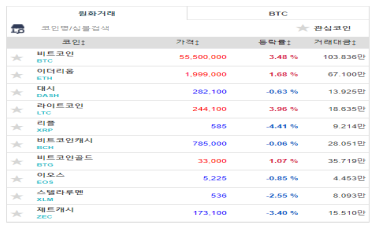
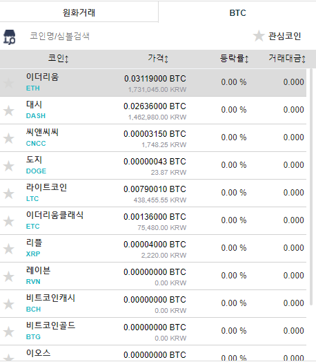

# 거래소

# 거래소
* toc
{:toc}

## 개요
+ 이 프로젝트는 비트 코인 거래소 웹 애플리케이션 개발을 목표로 합니다. 사용자는 웹 애플리케이션을 통해 비트 코인을 구매하고 판매할 수 있습니다. 거래소는 비트 코인 거래를 중개하는 역할을 합니다.
+ 기간: 2018.03 ~ 2019.08
+ 인원: 3명
+ 내용: 거래소 View, client 및 Controller 개발

## 기술 스택
+ Spring Framework3.1.1
+ Spring Security
+ JAVA 1.8
+ JavaScript
+ jQuery
+ Angular JS
+ MySQL
+ MyBatis
+ SVN
+ FSDC
+ Ubuntu
+ CentOS
+ NGINX

## 기술적인 부분
+ Spring Security ( 회원가입 및 로그인 )
+ 아이디 및 비밀번호 찾기, 내정보 수정(My Page)
+ 원화(KRW) 입·출금 개발
+ 주문 및 주문 취소 서비스 개발
+ 이용한 이메일 인증 개발
+ 관리자 ERP 개발
+ 데이터 통합 고도화
+ NGINX를 사용한 로드밸런싱 및 리버스 프록시 구성

## 기능 요약
+ HOME
+ 회원가입 및 로그인 기능
+ 비트 코인 구매 및 판매 기능
+ 거래 내역 조회 기능
+ 잔고 조회 기능
+ 출금 신청 기능
+ 출금 승인 및 거부 기능
+ 관리자 페이지

## 상세 설명

### HOME
+ 
+ 거래소 접속 시 메인 페이지, 거래소 초기 화면
+ 
  + 메인 페이지 접근 시 유의사항 안내 정보 표출

### 회원가입 및 로그인 기능
+ 사용자는 회원가입을 통해 계정을 생성할 수 있습니다. 회원가입 시 사용자는 이메일 주소와 비밀번호를 입력해야 하며, 이메일 주소는 중복되어서는 안 됩니다. 이메일 주소와 비밀번호는 암호화되어 저장됩니다. 
로그인 시 사용자는 이메일 주소와 비밀번호를 입력해야 합니다. 로그인 후 사용자는 거래소의 기능을 이용할 수 있습니다
+ Spring Security를 사용하여 구현
+ 
  + 이메일 중복체크 비밀번호 정규식 체크 및 암호화
  + 휴대폰 번호 인증 ( KCP API ) 연동
  + 회원가입 시 이메일 인증 메일 발송 기능 
  + 번호인증 
    + 
+ 
  + Spring Security를 통한 로그인
  + 로그인 5회 실패 시 임시 비밀번호 이메일 전송
  + 아이디 기억하기 
+ 
  + 아이디 찾기 – 휴대폰 번호 인증 ( KCP API 및 DB 조회 )
+ 
  + 비밀번호 찾기 – 이메일 인증 메일 발송 및 DB 업데이트 ( SMTP )
  + 가입할 때 사용한 명의를 이용하여 본인인증을 마치게 되면 가입할 때 사용한 아이디로 임시비밀번호가 전송된다. 해당 비밀번호를 입력하여 거래소에 로그인

### 거래소 
+ 
+ 현재 선택된 마켓의 마켓명/현재가/저가/고가/거래량/그래프를 조회
+ 마켓들의 현재가/등락률/거래량 조회
+ 로그인시 현재 회원의 보유 잔액을 표시. 각 코인들의 잔량이 나타내고
  총 코인의 KRW 합산 금액(현재가기준) 조회
  + 
+ 현재 마켓의 매수,매도 등록 화면으로 가격과 [수량/합계]를 설정하여 매수, 매도 등록
  + 
+ 현재 마켓의 호가 조회
+ 주문 내역 선택 시 현재 사용자의 현재 매수 매도 주문내역 조회 
+ 체결 내역 선택 시 현재 마켓의 거래내역 조회

### 차트

+ 코인 시세 조회 기능
  + 사용자는 비트 코인 및 알트코인의 시세를 조회할 수 있습니다. 시세 정보는 API를 통해 가져올 수 있으며, Spring RestTemplate 등을 사용하여 API를 호출할 수 있습니다.
  + 마켓의 이름과 현재 마켓의 현재가 / 전일대비 퍼센트 / 전일대비 금액이 나타나고 x분 단위로 데이터를 갱신
+ 그래프는 Candle stick과 column그래프로 구성되어 있으며 일자를 기준으로 정렬
+ 그래프의 오른쪽 화살표를 클릭하면 해당 일자의 상세내역[ 고가 / 저가 / 거래량(24H) / 거래금(24H)] 표시
+ 구분일자를 클릭 하게 되면 한번에 보여주는 데이터를 구분 기준으로 표시

### 마켓
+ 
+ 
+ 마켓에는 각 코인들의 마켓들이 나타나고, 각 마켓 별로 현재가[+KRW환산가], 등락률, 거래량 조회
+ 코인을 누르게 되면 해당 코인의 마켓으로 이동

### 지갑 
+ 
+ 회원이 보유하고 있는 코인의 잔액 조회
+ 코인을 누르게 되면 지갑으로 이동

### 공지사항
+ 
+ 공지사항 조회

### 매수 
+ 
+ 
+ 
+ 상단의 시가에는 현재 호가의 가격이 나타나고 클릭하게 되면 가격이 해당 가격에 맞춰지게 된다
+ 잔액에는 회원의 해당코인의 보유 잔액이 나타나고 클릭하게 되면 수량이 현재 설정된 가격과 잔액에 맞춰진다
+ 매수가격은 매수하고자 하는 가격을 넣는다. 변경되면 합계가 자동으로 계산된다
+ 매수수량은 매수하고자 하는 수량을 넣는다. 변경되면 합계가 자동으로 계산된다
+ 합계에 금액을 입력하면 수량이 현재 설정한 가격에 맞춰서 자동으로 계산된다
+ 호가의 원하는 가격을 클릭하게 되면 가격과 수량이 클릭한 가격에 맞춰진다
+ 매수버튼을 누르게 되면 오른쪽 사진과 같이 확인 창이 나타나고, 취소를 누르게 되면 진행중인 매수를 취소한다. 매수를 누르게 되면 매수를 진행한다
+ 호가에 매수금액에 맞는 매물이 있으면 매수가 채결되며 없으면 호가에 올라가게 된다. 채결되다 남은 미 채결된 매물들은 호가에 올라간다

### 매도 
+ 
+ 
+ 
+ 상단의 시가에는 현재 호가 가격이 나타나고 클릭하게 되면 가격이 해당 가격에 맞춰지게 된다.
+ 잔액에는 회원의 해당코인의 보유 잔액이 나타나고 클릭하게 되면 수량이 잔액에 맞춰진다
+ 매도가격은 매도하고자 하는 가격을 넣는다. 변경되면 합계가 자동으로 계산된다
+ 매도수량은 매도하고자 하는 수량을 넣는다. 변경되면 합계가 자동으로 계산된다
+ 합계에 금액을 입력하면 수량이 현재 설정한 가격에 맞춰서 자동으로 계산된다.
+ 호가의 원하는 가격을 클릭하게 되면 가격과 수량이 클릭한 가격에 맞춰진다.
+ 매도버튼을 누르게 되면 오른쪽 사진과 같이 확인 창이 나타나고, 취소를 누르게 되면 진행중인 매도를 취소한다. 매도를 누르게 되면 매도를 진행한다.
+ 호가에 매도금액에 맞는 매물이 있으면 매도가 채결되며 없으면 호가에 올라가게 된다. 채결되다 남은 미채결된 매물들은 호가에 올라간다.

### 거래 내역 
+ 
+ 거래 내역 조회

### 주문내역 
+ 
+ 현재 사용자가 주문한 내역 조회 (미 체결, 체결)

### 지갑
+ 
+ 상단에 있는 텝에는 모든 코인의 잔액이 나오고, 입 출금이 가능하면 입 출금 버튼 활성화
+ 잔액에는 현재 보유중인 코인의 잔액이 나오고, 거래중인 금액에는 현재 거래가 미체결된(주문이 올라가있는) 코인의 잔액 표시. 합계에는 그 두개의 합

### 입,출금 내역
+ 
+ 코인별/분류별/상태별/기간별로 필터링을 하여 내역을 확인
+ 출금의 경우 출금인증이 안되어 있으면 상태 오른쪽의 [X]버튼을 통해 출금을 취소 진행

### 코인 입금
+ 
+ 상단에는 코인 지갑 주소의 QR코드 표시
+ 하단에는 코인 지갑 주소가 표시
+ COIN 주소복사 버튼을 누르게 되면 해당 코인의 지갑 주소가 복사
+ 거래소에 해당 코인을 입금 하려면 타 지갑(개인지갑/거래소 등)에서 해당 지갑주소로 입금 진행

### 코인 출금 
+ 
+ 상단에는 일회에 보낼 수 있는 코인의 한도, 하루에 보낼 수 있는 코인의 한도, 월간 보낼 수 있는 코인의 한도가 표시
+ 이체금액에 이체하고자 하는 코인 개수를 넣어준다.(최소 이체금액 ~ 보유BTC – 이체 수수료)
+ COIN 이체 신청버튼을 누르게 되면 가입할 때 사용한 이메일로 인증메일이 보내지게 되고, 해당 메일을 확인하여 이체를 눌러 이체를 진행할지 취소를 눌러 취소할지 선택
+ 처리하지 않은 상태라면 지갑화면 하단에서 취소를 진행 가능
+ 이체를 누르게 되면 자동으로 이체가 처리

### KRW(원화) 입금
+ 
+ 입금을 할 때 본인 명의의 계좌에서 입금을 진행해야 하며, 입금자명 뒤에 가입할 때 사용한 핸드폰 뒤의 4자리를 붙여주면 빠른 처리가 가능

###  KRW(원화) 출금
+ 
+ 상단에는 일회에 보낼 수 있는 KRW의 한도, 하루에 보낼 수 있는 KRW의 한도, 월간 보낼 수 있는 KRW의 한도가 표시
+ 출금금액에 출금하고자 하는 KRW 금액을 넣어준다.(최소 출금금액 ~ 보유 KRW – 출금 수수료)
+ 최근출금계좌버튼을 누르면 최근에 이체 완료된 계좌들이 나타나며 누르게 되면 자동으로 입금은행과 계좌번호를 입력
+ KRW 출금 신청버튼을 누르게 되면 가입할 때 사용한 이메일로 인증메일이 보내지게 되고, 해당 메일을 확인하여 출금을 눌러 출금을 진행할지 취소를 눌러 취소할지 선택
+ 출금을 누르게 되면 자동으로 이체가 처리
+ 해당계좌로 첫 출금시 3일후에 출금처리가 완료

### 출금 상세 정보
+ 
+ TXID에는 해당 코인을 전송할 때 사용된 TXID(TransactionID)가 나타나며 클릭하게 되면 해당 코인의 탐색기의 해당 TXID에 대한 정보가 표시

### 거래 내역
+ 상단의 투자내역을 누르게 되면 표시되는 화면
+ 회원의 체결된 거래내역을 확인
+ 리스트를 마켓별/분류별로 정렬하여 표시

### 관리자 페이지
+ 
+ 
+ 관리자 로그인 개발
+ 고객 정보 조회 서비스 개발
+ 관리자 계정 회원가입 서비스 개발
+ 실시간 고객 입·출금 현황 서비스 개발
+ 실시간 고객 주문 및 거래 현황 서비스 개발
+ 실시간 수수료 조회 및 기간별 수수료 조회 서비스 개발

## 환경 구성 

### FSDC
+ "KT FSDC"는 "KT Financial Security Data Center"의 약어로, 대한민국의 통신사 KT가 운영하는 금융 정보 보안 센터입니다.
+ KT FSDC는 금융권 고객의 개인정보와 금융 거래 정보를 안전하게 보호하고 관리하기 위해 설립되었습니다. 이를 위해 KT는 높은 보안성과 안정성을 갖춘 데이터 센터를 구축하고,
최신 보안 기술과 시스템을 도입하여 금융 정보 유출 및 해킹 등의 사고를 예방하고 대응합니다.
+ KT FSDC는 금융기관과 보험사 등의 금융권 업체들과 함께 협력하여 보안 이슈에 대한 정보를 교류하고, 금융 데이터 분석을 통해 금융 시장의 안정성을 제고하는 역할도 수행합니다.
이를 통해 국내 금융 시장의 안정성과 신뢰도를 높이는 데 기여하고 있습니다.
+ 
+ 

### Nutanix
+ Nutanix는 기업용 서버, 스토리지 및 가상화 솔루션을 하나의 통합 플랫폼으로 제공합니다.
이를 통해 기업 고객들은 더 이상 서버, 스토리지, 가상화 등의 인프라 관리를 별도로 수행하지 않아도 되며,
IT 인프라를 더욱 효율적으로 운영할 수 있습니다. 또한, Nutanix는 하이브리드 클라우드 컴퓨팅 솔루션도 제공하여,
기업 고객들이 퍼블릭 클라우드와 프라이빗 클라우드를 함께 이용하면서 IT 인프라를 보다 유연하고 효율적으로 관리할 수 있도록 지원합니다.

  
## 성과
+ 프로젝트를 수행함으로써 웹 개발에 대한 지식과 경험을 쌓았습니다.
+ 프로젝트에서 발생한 버그를 해결하면서 디버깅 및 테스트 능력을 향상시켰습니다.
+ 사용자들의 피드백을 바탕으로 개선사항을 도출하고 반영하여, 사용자 경험을 높였습니다.
+ 프로젝트 진행 과정에서 프로젝트 일정을 관리하고, 작업 우선순위를 정하고, 업무 분담을 계획하는 등의 프로젝트 관리 능력을 향상시켰습니다.
+ 프로젝트를 마치고, 다른 프로젝트에서도 함께 일하고 싶은 개발자가 되었습니다.
+ 새로운 기술이나 도구를 습득하면서 자기 주도적인 학습 능력을 향상시켰습니다.
+ Spring Framework를 이용한 웹 서비스 개발 능력 향상시켰습니다.

## 개선사항
+ 코인 가격 변동성 대응을 위한 기능 추가
+ Redis를 이용한 캐시 구현
+ Kafka를 이용한 비동기적인 주문처리 구현
+ WebSocket을 이용한 실시간 거래 가격 알림 구현
+ AWS EC2, AWS RDS를 이용한 클라우드 환경 구성
+ JWT를 이용한 토큰 기반 인증
+ Git을 사용하여 협업
+ Jenkins 를 이용한 CI/CD 구성
