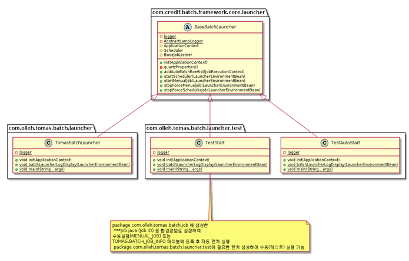
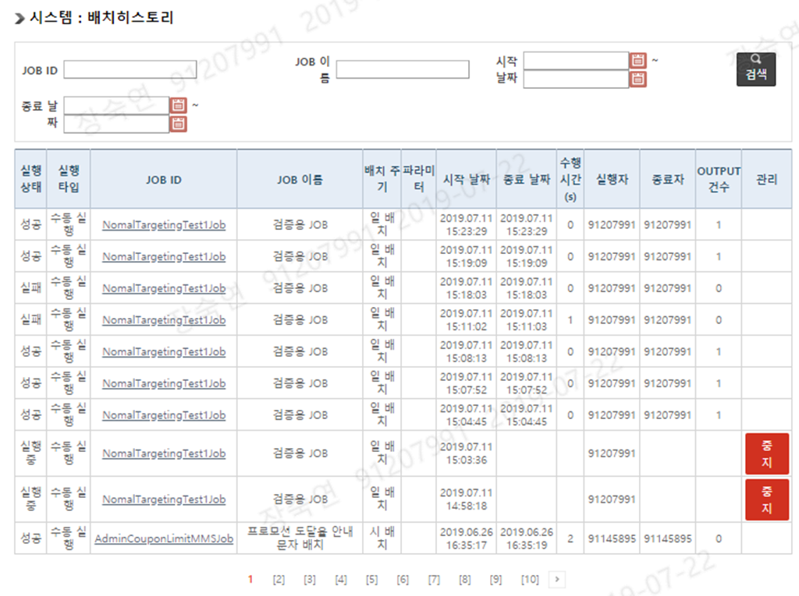

# Batch

# Batch
* toc
{:toc}

  
## 개요
+ 이 프로젝트는 쿠폰 서비스 프로젝트의  통계, 문자 발송, 이력, 정보, 집계, 내역 등 배치 작업 역할을 합니다     
+ 기간: 2019.08 ~ 2021.04
+ 인원: 2명

## 기술 스택
+ Spring4.1.4
+ JAVA 1.7
+ Quartz
+ PostgreSQL-PPAS
+ MyBatis
+ Jenkins
+ RUNDESK
+ NEXUS
+ SVN

## 기술적인 부분
+ 배치용(Job용)과 수동용(Manual용) 스크립트로 구분하여 실행합니다.
+ 수동 배치는 배치 ID를 입력하여 BATCH LAUNCHER를 통해 수행하거나, 관리자에서 실행일자를 파라미터로 입력하여 수동으로 배치 실행합니다.
+ Quartz 스케줄러를 사용하여 배치 작업을 일정한 주기로 실행합니다.
  + 스케줄링 라이브러리로, 배치 작업을 일정한 주기로 실행하기 위해 사용된다. Quartz에서 제공하는 Job 인터페이스를 구현하여 작업을 정의하고, Trigger를 설정하여 작업을 주기적으로 실행한다.
+ 빌드 및 배포 : Jenkins를 사용하여 CI/CD 환경을 구축합니다. 코드의 빌드와 배포를 자동화하여 개발자들의 효율성을 높이고, 안정적인 서비스 운영을 위해 노력합니다.
+ 데이터베이스: PostgreSQL-PPAS를 사용하여 관리자 페이지의 데이터베이스를 관리합니다.
+ ORM: MyBatis를 사용하여 데이터베이스와 상호작용하고 SQL문을 처리합니다.
+ 저장소: Nexus를 사용하여 관리자 페이지의 의존성 관리 및 배포를 관리합니다.
+ UI/UX: JSP와 JavaScript, jQuery를 사용하여 사용자 경험을 최적화합니다.
+ 서버 관리: Rundeck를 사용하여 서버를 관리하고 작업을 자동화합니다.

## 기능 요약
+ 주기적 알림
+ 통계
+ 외부 연동 file to file to DB
+ 파일 생성 file to file
 

## 상세 설명
+ 광고 이용 수신 동의 통계: 광고 이용 수신 동의에 대한 통계를 집계합니다.
+ 프로모션 도달율 안내 문자 발송: 프로모션 도달율 안내 문자를 발송합니다. 
+ 문자 발송 집계: 문자 발송 내역에 대한 집계를 합니다.
+ 전일, 전월 한도 변경 이력 파일 생성: 전일과 전월에 한도가 변경된 이력을 파일로 생성합니다.
+ 파트너 CP사 정보 파일 생성: 파트너 CP사 정보를 파일로 생성합니다.
+ 파트너 PG사 정보 파일 생성: 파트너 PG사 정보를 파일로 생성합니다.
+ PG 결제내역 파일 생성: PG 결제내역을 파일로 생성합니다.
+ 월별 고객 등급 정보 연동
  1. 월별 고객 등급 정보 DB Delete
  2. 월별 고객 등급 정보 원격 파일 SFTP Download
  3. 월별 고객 등급 정보 파일 정보 읽기
  4. 월별 고객 등급 정보 파일 정보 DB Insert
  
+ 일별/주간/월간 쿠폰 발급 통계: 일별, 주간, 월간 단위로 발급된 쿠폰의 수를 집계합니다. 이를 통해 쿠폰 발급 추이를 파악할 수 있습니다.
+ 일별/주간/월간 쿠폰 사용 통계: 일별, 주간, 월간 단위로 사용된 쿠폰의 수를 집계합니다. 이를 통해 쿠폰 사용 추이를 파악할 수 있습니다.
+ 쿠폰 발급/사용 별 연령/성별 통계 집계: 쿠폰 발급 및 사용자의 연령대와 성별에 대한 통계를 집계합니다. 이를 통해 쿠폰을 사용하는 고객의 성향을 파악할 수 있습니다.
+ 쿠폰 사용 서비스별 통계 집계: 쿠폰을 사용하는 서비스별로 통계를 집계합니다. 이를 통해 어떤 서비스에서 쿠폰이 가장 많이 사용되는지를 파악할 수 있습니다.
+ 쿠폰 발급/사용 집계: 쿠폰 발급 건수와 쿠폰 사용 건수를 집계합니다. 이를 통해 쿠폰 발급과 사용의 비율을 파악할 수 있습니다.
+ 쿠폰 결제 내역 file to DB
+ 결제 취소 내역 file to DB
+ 누적 이용 동의/해지 이력 Data 파일 생성
+ 전체 이용 동의 정보 Data 파일 생성
+ 결제 이력 정보 Data 파일 생성
+ 보관기간 설정정보에 따른 보관기간 만기 데이터 파티션명이 존재하는 경우 파티션명, 테이블명 기준으로 해당파티션 삭제 배치

## BATCH 클래스 다이어그램
+ 
+ 

## 관리자 페이지
+ 
  + 배치 관리 페이지 
    + 개별적으로 사전에 만든 배치JOB 을 등록하고 JOB 실행 스케줄을 설정하여 배치 실행내용을 관리합니다
+ 
  + 배치 관리 상세 정보 페이지 (등록, 수정) 
+ 
  + 배치 히스토리 페이지 
    + 개별적으로 사전에 만든 배치JOB 실행된 내역을 조회합니다
    + 현재 실행상태가 “실행중”인 경우 “중지” 버튼 표시하여 중지할 수 있도록 하였습니다
+ 
  + 배치 히스토리 상세 페이지 
    + 에러가 있을시 에러 내용 표시할 수 있도록 구현 하였습니다
+ 위의 관리자 페이지를 개발함으로써, 서비스의 안정성과 신뢰성을 높일 수 있었습니다. 배치 작업을 자동화하고, 실행 내역을 모니터링하면서 발생하는 문제점을 빠르게 파악하고 대처할 수 있게 되었습니다.
+ 배치 관리 페이지에서 배치JOB을 등록하고, 실행 스케줄을 설정할 수 있게 되면서, 매일 반복되는 업무를 자동화하고, 인력낭비를 최소화할 수 있었습니다. 또한, 배치 실행 상태를 모니터링하면서 문제가 발생하면 즉시 대응할 수 있게 되어 서비스의 안정성을 높일 수 있었습니다.
+ 배치 히스토리 페이지에서는 지난 배치 실행 내역을 조회할 수 있어, 문제 발생 시 빠르게 대처할 수 있게 되었습니다. 또한, 실행 중인 배치를 중지할 수 있는 기능을 제공하여, 사용자들의 편의성을 높일 수 있었습니다.
+ 배치 히스토리 상세 페이지에서는 발생한 에러 내용을 확인할 수 있어, 더욱 빠르고 정확한 대처가 가능해졌습니다. 에러 내용을 확인하여, 원인을 파악하고, 이에 대한 조치를 취할 수 있게 되어 서비스의 신뢰성을 높일 수 있었습니다.

## 성과
+ 배치 작업을 위해 Quartz 라이브러리를 사용하였습니다. Quartz는 배치 작업 스케줄링을 지원하며, 작업을 정의하는 Job 인터페이스를 제공합니다. 이를 이용하여 배치 작업을 정의하고, 트리거를 설정하여 주기적으로 실행되도록 하였습니다.
+ 일별, 주간, 월간 단위로 발급 및 사용된 쿠폰의 수를 집계하였습니다. 또한, 쿠폰 발급 및 사용자의 연령대와 성별에 대한 통계, 쿠폰을 사용하는 서비스별 통계 등 다양한 쿠폰 관련 통계 정보를 집계하여 쿠폰의 사용 추이 및 고객 성향을 파악할 수 있도록 하였습니다.
+ 파트너 CP사 정보와 PG사 정보, PG 결제내역을 파일로 생성하여 외부 연동을 가능하게 하였습니다.
+ 월별 고객 등급 정보를 DB에서 삭제하고, 원격 파일 SFTP를 통해 다운로드한 뒤 파일 정보를 읽어 DB에 Insert하는 방식으로 월별 고객 등급 정보를 연동하였습니다.
+ 결제 취소 내역을 파일로 생성하여 DB에 Insert하였습니다.
+ 이용 동의/해지 이력과 전체 이용 동의 정보를 파일로 생성하였습니다. 이를 이용하여 이용 동의/해지 이력에 대한 통계를 집계하였습니다.
+ 모든 배치 작업에 대해 수동배치와 자동배치를 선택할 수 있도록 하였습니다. 특정 배치JOB ID를 입력하여 BATCH LAUNCHER (자바) 에서 실행하거나, 관리자에서 실행일자를 파라미터로 입력하여 수동으로 배치를 실행할 수 있습니다.
+ 배치 작업 실행 로그를 수집하고 분석하여 문제가 발생한 경우 즉시 대응할 수 있도록 하였습니다.
+ 배치 작업에 대한 모니터링 대시보드를 구축하여 배치 작업의 실행 상태와 이력을 시각화하여 관리할 수 있도록 하였습니다.

> 이 프로젝트를 통해 다양한 쿠폰 관련 통계 정보를 집계하여 쿠폰 사용 추이 및 고객 성향을 파
> 악할 수 있었습니다. 또한, 파트너 CP사와 PG사 정보, PG 결제내역을 외부 연동하여 운영 효율
> 을 높일 수 있었습니다. 수동배치와 자동배치를 선택할 수 있도록 하여 운영의 편의성을 높이
> 고, Quartz 스케줄링을 이용하여 주기적인 배치 작업을 자동으로 수행할 수 있도록 하였습니다.

## 개선사항
+ Spring Batch 도입: Spring Batch를 도입하여 배치 작업을 보다 쉽고 유연하게 구현할 수 있도록 개선할 수 있습니다. Spring Batch는 일괄 처리 작업을 위한 프레임워크로서, 큰 규모의 배치 작업을 처리하기에 용이한 구조를 가지고 있습니다.
+ Jenkins 스케쥴 도입: 배치 작업을 자동화하기 위해 Jenkins를 도입 할수 있습니다. Jenkins는 빌드, 테스트, 배포 등의 자동화된 작업을 실행하고 스케줄링을 관리할 수 있는 툴입니다. Jenkins를 사용하여 배치 작업을 보다 효율적으로 관리할 수 있도록 개선할 수 있습니다.
+ 예외 처리: 배치 작업 수행 중 예상치 못한 오류가 발생할 수 있으므로, 이에 대한 예외 처리를 강화해야 합니다. 예외 상황에 대한 대처 방안을 미리 준비하고, 이를 처리할 수 있는 코드를 작성하여 배치 작업의 안정성을 높이도록 합니다.
+ 성능 향상: 대용량 데이터 처리를 위한 효율적인 알고리즘을 구현하고, 병렬 처리 기능을 활용하여 배치 작업의 성능을 향상시키는 것이 중요합니다. 예를 들어, 데이터를 처리할 때 DB의 인덱스를 활용하거나, 메모리 캐시를 활용하여 I/O 비용을 줄일 수 있습니다.
+ 보안 강화: 배치 작업에서 처리하는 데이터는 중요한 정보일 수 있으므로, 보안에 대한 강화가 필요합니다. 보안을 강화하기 위해서는 데이터 암호화, 접근 제어 등의 보안 기능을 적용하여 데이터 유출을 방지해야 합니다
