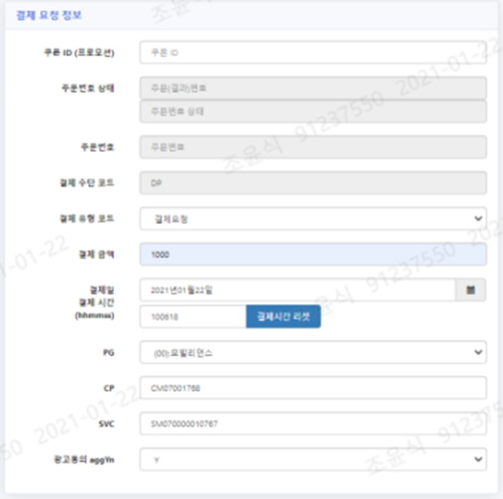

# 휴대폰 소액 결제 요청 가상 시뮬레이터

# 휴대폰 소액 결제 요청 가상 시뮬레이터
* toc
{:toc}

  
## 개요
+ 휴대폰 소액 결제 가상 결제 시뮬레이터는 결제 시스템에서 쿠폰 발급, 사용, 취소 및 복원을 테스트하기 위한 프로그램 입니다. 이를 통해 쿠폰 발급, 사용, 취소, 복원 과정을 테스트할 수 있어 개발 및 테스트의 효율성이 높아집니다. 또한, 결제 취소 과정에서 쿠폰 상태가 복원되는 것을 비롯하여 취소된 결제 금액에 대한 정보를 표시하는 등의 기능을 포함하고 있습니다.
이러한 프로그램를 사용함으로써 다양한 시나리오를 미리 파악하고 테스트함으로써 안정성과 신뢰성을 높일 수 있습니다. 또한, 개발 및 테스트의 효율성을 더욱 높일 수 있을 것입니다. 이러한 프로그램은 결제 시스템 개발자에게 큰 도움이 될 것입니다.     
+ 기간: 2021.01 ~ 2021.04
+ 인원: 1명

## 기술 스택
+ SpringBoot 2.2
+ JAVA 1.8
+ PostgreSQL-PPAS
+ JPA
+ Querydsl
+ REACT JS 16.14.0
+ Jenkins
+ RUNDESK
+ NEXUS

## 기술적인 부분
+ 휴대폰 소액 결제 가상 결제 포트폴리오
+ 쿠폰 발급, 사용, 취소, 복원 테스트
+ 결제 취소 시 쿠폰 상태 복원 및 취소된 결제 금액 정보 표시
+ 휴대폰 소액 결제 요청 가상 시뮬레이터 및 시나리오 테스트 프로그램에서 발생한 에러 내역 저장 기능

## 기능 요약
+ 쿠폰 발급 기능
+ 쿠폰 사용 기능
+ 결제 요청 처리
+ 결제 취소 기능
+ 결제 취소 시 쿠폰 상태 복원 및 취소된 결제 금액 정보 표시 기능
+ 에러 내역 저장 기능

## 상세 설명
+ 
  + 휴대폰 소액 결제 요청 가상 시뮬레이터 전체 화면
+ 
  + 결제 요청 정보
    + 결제 요청 정보를 입력할 수 있는 창을 구성합니다
    + 결제 요청 정보로는 쿠폰 ID(프로모션), 주문번호 상태, 주문번호, 결제 수단 코드, 결제 유형 코드, 결제 금액, 결제일, 결제시간, PG, CP, SVC, 광고동의 등이 있습니다.
+ 
  + 결제자 정보
    + 결제자 정보를 입력할 수 있는 창을 구성합니다
    + 결제자 정보로는 핸드폰번호(CTN), 고객계약번호(NCN), 생년월일, 성별 등이 있습니다
    + NCN 조회 버튼 클릭 시 고객정보 API를 호출하여 고객 정보를 조회합니다
+ 
  + 추가 정보
    + 추가 정보로는 한도금액, 위험등급, 리즈등급, M-PAY 회원가입 여부, 폰사용료 납부수단 등이 있습니다
+ 
  + 결제, 결제 취소, 쿠폰 조회, NCN 조회, 결제 내역을 API 요청하여 조회 시 받은 결과를 표시합니다
+ 
  + 자동 시나리오 테스트 프로그램이나 휴대폰 소액 결제 요청 가상 시뮬레이터에서 발생한 ERROR 내역을 저장 및 표시합니다 (주로 자동 시나리오 테스트 프로그램 스케줄 작업 시 에러내용 확인 용도)
+ 
  + 쿠폰 조회 시 쿠폰 정보를 출력합니다
  + 쿠폰 이름, 일렬 번호, 쿠폰 금액, 쿠폰 상태로 구성됩니다
  + 쿠폰 조회 결과를 표시합니다
  + 쿠폰 삭제 기능을 구현합니다
+ 
  + 결제 요청 시 결제 요청 내용으로 자동으로 결제 내역을 조회하도록 구성됩니다
+ 결제 요청
  + 가상의 휴대폰 소액 결제 요청 정보 등록으로 결제 조건에 맞는 쿠폰으로 타겟팅이 되는지, 발급쿠폰이 있는 경우 쿠폰을 적용하여 결제되는지, 결제 취소가 되는지(쿠폰 결제인 경우 쿠폰 취소 포함) 테스트하는 결제 시뮬레이터로 활용합니다
  + "결제 요청" 단계에서 쿠폰이 적용된 경우, 쿠폰이 적용된 결제 금액과 쿠폰의 금액이 결제 내역에 표시됩니다
  + 결제 요청 흐름
    1. 결제 요청 처리를 위한 정보를 입력합니다
    2. 유효한 쿠폰 정보 조회를 위해 쿠폰 조회 요청을 클릭합니다
    3. 사전에 사용 가능한 쿠폰이 있는 경우 "쿠폰조회 OK" 메시지가 표시됩니다 (쿠폰조회 API 연동)
    4. 쿠폰 조회 결과 발급/사용 가능한 쿠폰이 있는 경우 쿠폰 이름, 일렬 번호, 쿠폰 금액, 쿠폰 상태 정보들이 설정됩니다 (쿠폰 삭제 기능 가능)
    5. 쿠폰 조회 후 “결제(취소)요청“ 을 클릭하여 결제 요청 처리합니다 (쿠폰 정보가 설정된 경우 쿠폰 금액만큼 차감된 실제 결제 금액, 쿠폰 금액으로 결제 처리)
    6. 결제 요청 처리 결과 메시지가 표시됩니다
    7. 쿠폰과 함께 결제되는 경우 쿠폰 검증(TCP 통신) 결과가 메시지에 함께 표시됩니다
    8. 결제 내역에 해당 결제 내역이 표시됩니다
+ 결제 취소
  + "결제 취소" 를 선택하여 결제 처리 되었던 주문번호를 입력하고 "결제(취소)요청" 을 클릭하여 결제 취소를 요청합니다
  + 결제 취소 시에 해당 결제에 사용된 쿠폰은 복원되어 "미사용" 쿠폰으로 업데이트됩니다
  + "결제 취소" 단계에서 결제 취소 후 쿠폰 상태가 "미사용"으로 변경되는 것 외에도, 취소된 결제 금액에 대한 정보가 표시됩니다

## 성과
+ 쿠폰 발급, 사용, 취소, 복원 테스트를 간편하게 할 수 있어 개발 및 테스트의 효율성이 높아집니다
+ 결제 시스템에서 발생할 수 있는 다양한 시나리오들을 미리 파악하고 테스트할 수 있어 결제 시스템의 안정성과 신뢰성을 높일 수 있습니다
+ 사용자가 쉽게 결제 취소를 요청할 수 있어 고객 만족도가 향상됩니다

## 개선사항
+ 시나리오 테스트 중에 발생한 ERROR 내역을 저장하는 기능이 있지만, 이러한 에러 내용을 자동으로 분석하고 해결하는 기능을 추가할 경우, 개발자의 작업 효율성을 높일 수 있을 것입니다
