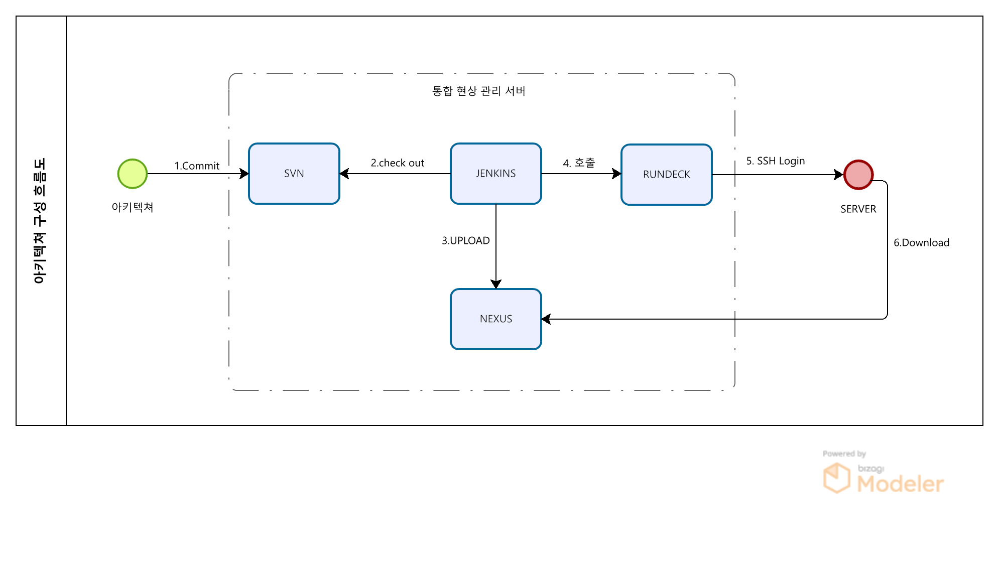
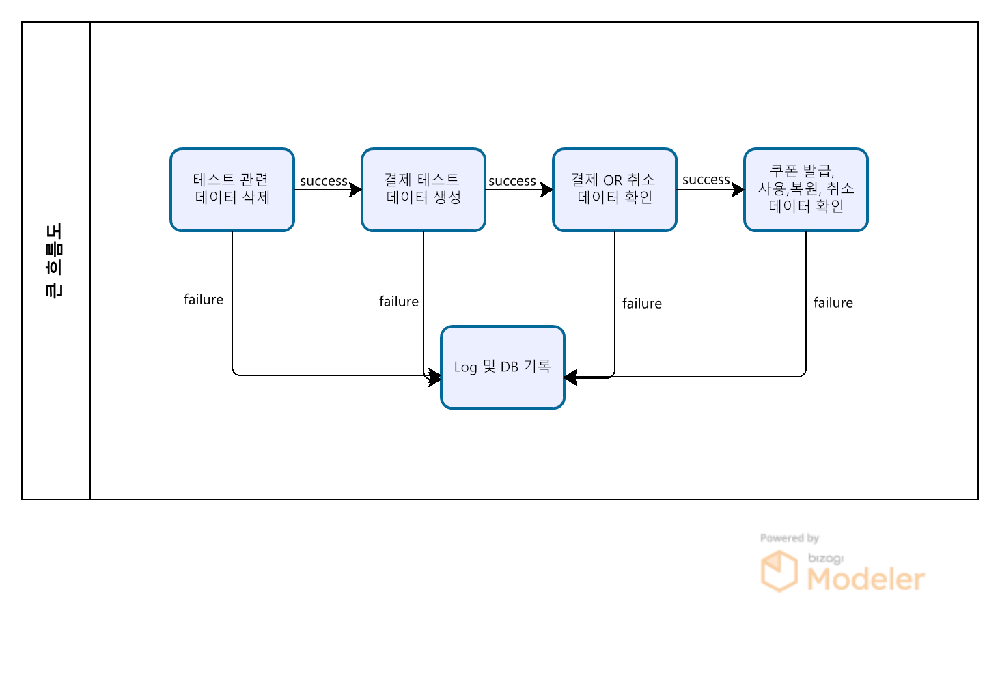
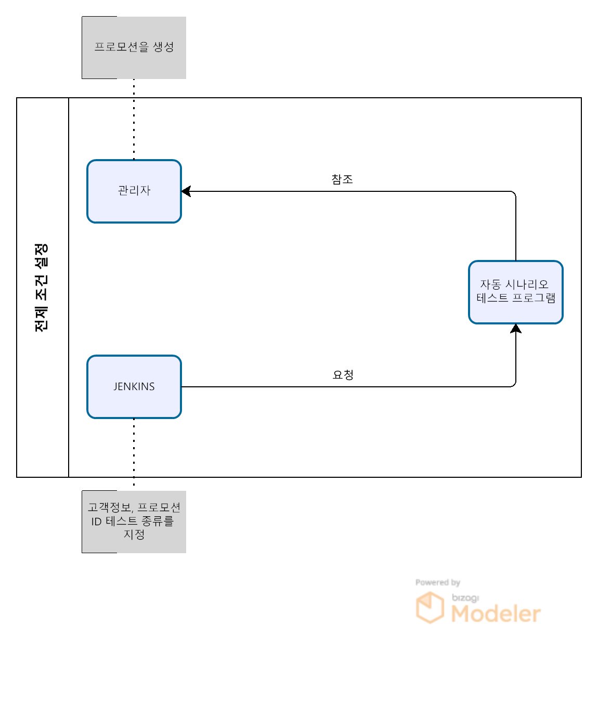
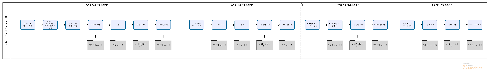
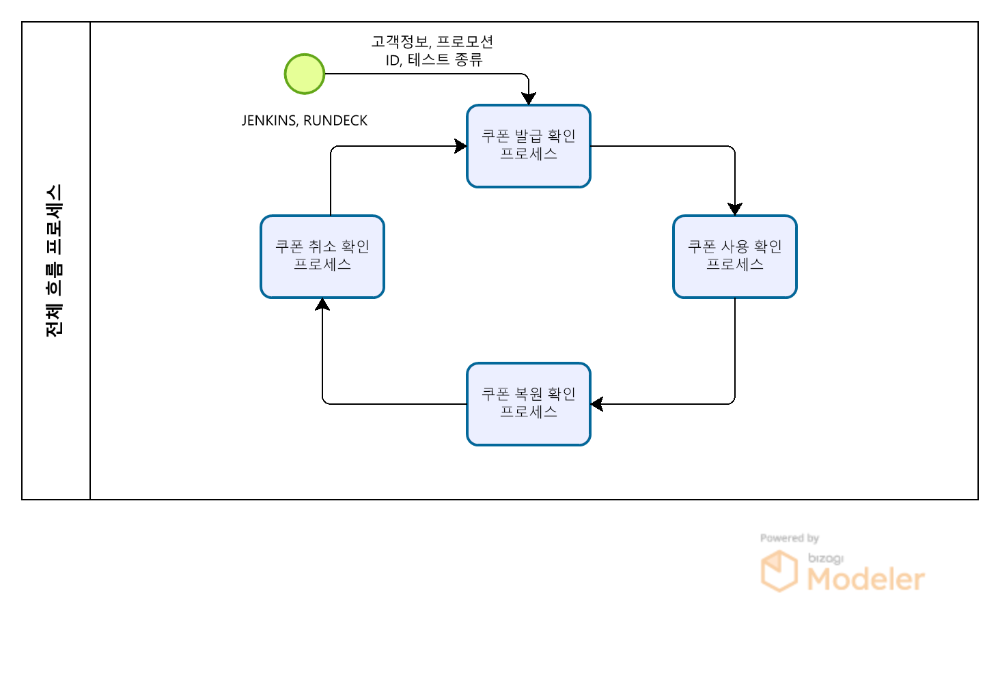

# 자동 시나리오 테스트 프로그램

# 자동 시나리오 테스트 프로그램
* toc
{:toc}

  
## 개요
+ 기존에는 수동으로 진행하던 시나리오 테스트를 자동화하기 위한 프로그램을 개발하였습니다. 이번 프로그램은 프로모션ID 및 테스트 종류를 전달받아 전체 테스트를 자동으로 진행할 수 있도록 설계하였습니다. 이를 통해 이전에는 수동으로 진행하던 시나리오 테스트를 자동으로 편리하게 진행할 수 있게 되어 개발자들의 업무 효율성을 높일 수 있게 되었습니다     
+ 기간: 2021.01 ~ 2021.04
+ 인원: 1명

## 기술 스택
+ SpringBoot 2.2
+ JAVA 1.8
+ PostgreSQL-PPAS
+ JPA
+ Querydsl
+ Jenkins
+ RUNDESK
+ NEXUS
+ SVN

## 기술적인 부분
+ JENKIN로 Scheduling 구현 해서 테스트
+ 프로모션 설정 값에 의존해서 테스트를 진행한다 만약 일반, 연관, 다중 테스트를 진행 하고 싶을 경우 3개의 프로모션을 등록하고 진행
+ 시나리오 전체 테스트를 원할 경우 테스트 종류를 ALL로 설정 하면 된다, 테스트 종류를 ALL로 설정할 경우 설정된 프로모션 데이터에 관해서 테스트를 진행
+ 테스트 시 오류가 발생 하면 ERROR 테이블에 ERROR 내용을 기록하고 LOG도 남긴다
+ 자동적으로 쿠폰(발급, 사용, 복원, 취소) 테스트 기능 구현
+ 사용자 클릭 N번으로 테스트
+ 지정 시간 마다 테스트(Scheduling)
+ 프로모션 유형 마다 테스트(테스트 시나리오 내용)

## 기능 요약
+ 구현 방안
+ 전제 조건
+ 전체 흐름
+ 아키텍쳐 구성
+ 큰 흐름
+ 전제 조건 설정
+ 자동 시나리오 테스트 프로세스

## 상세 설명
+ 구현 방안
  + 테스트 프로모션 지정
  + 프로모션 설정 값으로 결제 데이터 생성
  + 테스트 시나리오에 있는 시나리오 테스트 전체를 테스트 하는 기능 있어야 된다
  + 테스트 문제 발생시 DB 저장
  + 테스트 시작 전 테스트한 데이터 삭제
  + LOG로 모니터링 가능
  + JENKINS 사용 하여 Scheduling 구현
+ 전제 조건
  + 일반,연관,다중 프로모션 지정 해당 프로모션에 맞는 결제 데이터 생성
  + 등록한 프로모션 테스트 진행 (결제 -> 쿠폰 발급 확인 -> 쿠폰 결제 -> 쿠폰 취소 -> 쿠폰 복원 확인 -> 결제 취소 -> 쿠폰 삭제 확인) 후 다음 테스트 진행 전 결제 테스트 데이터 삭제
  + 테스트용 특정 사용자 정보 지정
+ 전체 흐름
  + 결제 (취소) 내역 확인 , 현행화 확인 타겟팅 (취소) 확인, 쿠폰 발급 (취소) 요청 확인 , 쿠폰 확인 (취소,발급)
  + 에러 발생시 log 기록 및 DB 삭제 하지 않고 다음 결제 테스트 케이스 진행
  + 성공 시 다음 결제 테스트 진행 전 기존 결제 데이터 삭제
+ 아키텍쳐 구성
  + 
    1. LOCAL에서 아카이브 생성 후 SVN 에 Commit
    2. JENKINS 에서 SVN에 있는 아카이브 check out
    3. NEXUS에 아카이브 UPLOAD
    4. JENKINS 가 RUNDECK 호출
    5. RUNDECK이 SERVER SSH Login 하여 접급
    6. 서버가 RUNDECK 스크립트 실행 하여 NEXUS에 있는 아카이브 Download 및 실행

+ 큰 흐름
  + 
    1. 테스트 관련 데이터를 삭제해서 이후 테스트에 영향도가 없게 작업한다 
    2. 테스트를 진행할 결제 테스트 데이터를 생성한다 
    3. 결제 또는 취소 를 진행하여 결제 또는 취소가 정상적으로 이루어 졌는지 확인한다
    4. 쿠폰 발급, 사용, 복원, 취소를 진행하여 정상적으로 테스트가 진행되었는지 확인한다
    5. 각각의 작업이 실패할 경우 LOG와 DB에 기록한다

+ 전제 조건 설정
  + 
    1. 테스트에 사용할 프로모션을 등록한다 (일반,연관,다중)
    2. 테스트에 사용할 고객정보(핸드폰 번호, 고객 등록번호), 프로모션 ID(관리자에서 등록한 TEST 프로모션 ID), 테스트 종류(관리자에서 등록한 프로모션에 관련된 내용으로만 TEST할 건지 , 테스트 시나리오에 있는 케이스 전부 TEST할 건지 지정) 를 자동 시나리오 테스트 프로그램에 요청

### 자동 시나리오 테스트 프로세스
+ 

+ 1.쿠폰 발급 확인 프로세스
  1. 현재 테스트에 영향 없게 테스트 관련 데이터를 삭제한다 
  2. 현재 테스트에 영향 없게 테스트로 설정된 프로모션 외의 다른 프로모션들은 OFF 처리한다 
  3. 테스트 하려는 프로모션을 참조하여 쿠폰 생성할 수 있는 결제 데이터를 생성한다
  4. 결제 전에 쿠폰 조회가 되면 쿠폰 발급 전이므로 조회가 되면 ERROR로 기록한다
  5. 프로모션 내용에 맞게 생성된 결제 데이터를 이용하여 결제를 진행한다 
  6. 결제 내용이 APP를 거쳐 현행화 테이블(3개)에 저장이 되었는지 확인한다
  7. 쿠폰이 정상적으로 발급 되었는지 확인하고 쿠폰 미 발급 시 ERROR로 기록한다, 발급이 확인 되면 쿠폰 사용 프로세스를 실행한다

+ 2.쿠폰 사용 확인 프로세스
  1. 테스트 하려는 프로모션을 참조하여 쿠폰 사용할 수 있는 결제 데이터를 생성한다
  2. 쿠폰 발급후 이므로 미발급시 ERROR로 기록 한다
  3. 생성한 결제 데이터를 이용하여 결제 진행한다
  4. 결제 내용이 APP를 거쳐 현행화 테이블(3개)에 쿠폰을 사용해서 저장 되었는지 확인한다
  5. 쿠폰이 정상적으로 사용 되었는지 확인한다 쿠폰 미 사용 시 ERROR 기록, 사용 확인 시 쿠폰 복원 로직 실행한다

+ 3.쿠폰 복원 확인 프로세스
  1. 결제한 데이터를 참조하여 결제 취소 데이터 생성한다
  2. 생성한 결제 취소 데이터를 이용하여 결제 취소 진행한다 (쿠폰이 사용이 된 결제 번호)
  3. 결제 내용이 APP를 거쳐 현행화 테이블(3개)에 저장이 되었는지 확인한다
  4. 쿠폰이 정상적으로 복원 되었는지 확인한다 쿠폰 복원이 안될 시 ERROR 기록한다 , 복원 확인 시 쿠폰 취소 로직 실행한다

+ 4.쿠폰 취소 확인 프로세스
  1. 결제한 데이터를 참조하여 결제 취소 데이터 생성한다
  2. 생성한 결제 취소 데이터를 이용하여 결제 취소 진행한다 (쿠폰이 사용이 안된 결제 번호)
  3. 결제 내용이 APP를 거쳐 현행화 테이블(3개)에 저장이 되었는지 확인한다
  4. 쿠폰이 정상적으로 취소 되었는지 확인한다 쿠폰 취소가 안될 시 ERROR 기록한다 , 취소 확인 시 다음 프로모션이 있으면 쿠폰 발급 로직 으로 돌아간다
  
+ 전체 흐름
  + 
  + 전달 받은 프로모션ID가 더 존재 하거나 전달받는 테스트 종류가 ALL(시나리오 전체 테스트)일 경우 시나리오 테스트 정보 끝나기 전까지 테스트를 진행한다

## 성과
+ 프로그램 구현을 통해 자동화된 시나리오 테스트를 수행할 수 있게 되었다
+ 시나리오 테스트의 자동화를 통해 인력 및 시간 절약이 가능해졌다
+ 자동화된 테스트를 통해 발생하는 버그 및 이슈를 더 빠르게 탐지할 수 있게 되었다
+ 테스트 수행 중 발생하는 인간의 오류를 최소화할 수 있어서 신뢰성 높은 테스트 결과를 얻을 수 있었다

## 개선사항
+ 테스트 케이스 추가: 새로운 테스트 케이스 추가 시 해당 케이스에 대한 문서화와 이를 자동화하는 방안을 검토해야 한다. 이를 통해 시나리오 추가에 대한 업무 부담을 줄일 수 있다
+ 로깅 시스템 개선: 현재 프로그램의 로깅 시스템은 간단하게 구현되어 있다. 더 많은 정보를 수집하고 분석하기 위해서는 로깅 시스템의 개선이 필요하다
+ 성능 향상: 대규모 데이터 처리나 더 많은 테스트 수행 시간 단축을 위한 성능 향상을 고려할 필요가 있다
