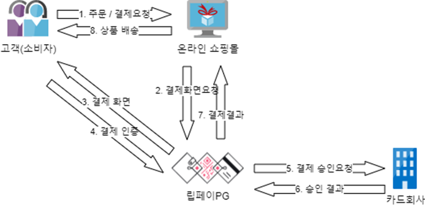
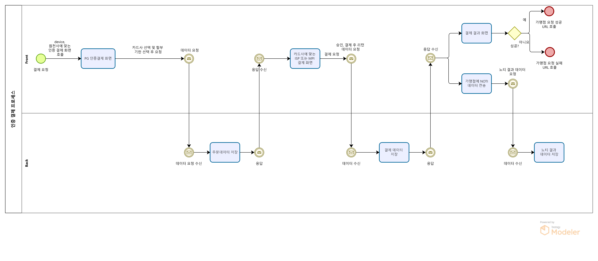

# 인증 결제

# 인증 결제
* toc
{:toc}

## 개요
+ 인증 결제 서비스는 웹에서 HTTP Form Post 요청으로 신용카드 인증결제를 이용하는 서비스 입니다
+ 이 서비스는 gRPC 프로토콜을 사용하여 클라이언트와 서버 간의 통신을 합니다
+ 기간: 2021.04 ~ 진행중
+ 인원: 4명

## 기술 스택
+ JAVA 11
+ Spring Boot 2.7.7
+ Springframework 5.3.24
+ Grpc
+ Thymeleaf
+ MariaDB
+ MyBatis
+ Git
+ Jenkins

## 기술적인 부분
+ Git을 사용하여 소스 코드를 관리하고 버전을 관리합니다
+ Jenkins를 사용하여 빌드 및 배포 자동화를 구현합니다
+ MyBatis를 사용하여 SQL 쿼리를 작성하고 실행합니다 
+ 프론트엔드와 백엔드 간에 gRPC 프로토콜을 사용하여 통신합니다
+ Thymeleaf를 사용하여 서버 사이드 렌더링을 구현합니다
+ MariaDB를 사용하여 데이터베이스를 구성합니다
+ Spring Boot 2.7.7과 Springframework 5.3.24를 사용하여 웹 어플리케이션을 구현합니다
+ 총 3개의 원천사와 연동합니다.

## 기능 요약
+ 가맹점으로부터 결제 요청을 받아 결제 처리를 진행합니다.
+ 결제 정보를 DB에 저장하고, 결제 후 DB 처리를 위한 URL을 호출합니다.
+ 호출된 URL의 응답 메시지를 분석하여 결제 처리 결과를 판단하고, 결제 완료 페이지로 이동합니다.

## 상세 설명
+ 
+ 
+ 인증 결제 서비스는 PG 서비스에 가맹점으로 등록이 되어 있어야 합니다.
+ 가맹점에서는 결제 요청을 위한 화면과 결제 후 이동할 페이지 및 DB 처리를 위한 URL을 만들어야 합니다.
+ 결제 요청은 HTTP Form Post 요청으로 이루어집니다.
+ DB 처리를 위한 URL의 응답메시지에 SUCCESS 문자열이 포함될 경우 다시 호출되지 않습니다. 
  + 응답 메시지에 SUCCESS 포함시 성공
  + 그 외 실패
  + DB 처리를 위한 URL 호출은 결제 후 5분 간격으로 최대 10회 호출됩니다.
+ 총 3개의 원천사와 연동합니다. 

## 성과
+ 인증 결제 서비스를 구현하여 가맹점에서 제공하는 결제 기능을 원활하게 처리할 수 있게 되었습니다.
+ 결제 처리 시스템의 안정성과 확장성을 향상시켰습니다.
+ 결제 처리 시간을 단축하여 고객 만족도를 높일 수 있었습니다.
+ 인증 결제 서비스에서는 프론트엔드와 백엔드 간의 통신에 gRPC를 사용하고 있습니다. 프론트엔드는 gRPC 스텁을 사용하여 서버의 gRPC 서비스 메서드를 호출하고, 백엔드는 gRPC 서비스 정의를 기반으로 서비스 메서드를 구현합니다. gRPC를 사용함으로써 HTTP/2의 다중 요청 및 응답 기능을 활용하여 클라이언트와 서버 간의 빠른 통신이 가능하며, Protocol Buffers를 사용하여 더 효율적인 데이터 전송이 가능해졌습니다.
+ 인증 결제 서비스에서는 프론트엔드와 백엔드 간의 통신에 gRPC를 사용하고 있습니다.
  + 프론트엔드는 gRPC 스텁을 사용하여 서버의 gRPC 서비스 메서드를 호출합니다.
  + 백엔드는 gRPC 서비스 정의를 기반으로 서비스 메서드를 구현합니다.
  + gRPC를 사용함으로써 HTTP/2의 다중 요청 및 응답 기능을 활용하여 클라이언트와 서버 간의 빠른 통신이 가능하며, Protocol Buffers를 사용하여 더 효율적인 데이터 전송이 가능해졌습니다.
  
## 개선사항
+ 테스트 코드 추가 및 커버리지 향상
  + 코드 변경에 따른 영향도 파악과 버그 발견을 위한 테스트 코드 추가
+ 모니터링 및 로그 분석 도구 도입
  + 서버 상태 모니터링, 로그 분석을 통한 이상 징후 탐지와 대응
+ 서비스 기능 확장
  + 페이앱, 카카오페이 등의 PG사와의 연동 기능 추가
  + 모바일 결제 기능 추가
+ 코드 리팩토링
  + 코드 가독성 향상 및 유지보수성 개선을 위한 리팩토링 필요
  + SOLID 원칙, 디자인 패턴 등의 적용을 통한 코드 구조 개선
