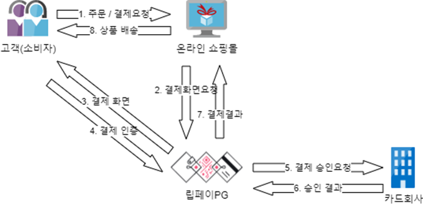

# 인증 결제

# 인증 결제
* toc
{:toc}

## 개요
+ 인증 결제 서비스는 웹에서 HTTP Form Post 요청으로 신용카드 인증결제를 이용하는 서비스 입니다
+ 기간: 2021.04 ~ 진행중
+ 인원: 4명

## 기술 스택
+ JAVA 11
+ Spring Boot 2.7.7
+ Springframework 5.3.24
+ Grpc
+ Thymeleaf
+ MariaDB
+ MyBatis
+ Git
+ Jenkins

## 기술적인 부분
+ Git을 사용하여 소스 코드를 관리하고 버전을 관리합니다
+ Jenkins를 사용하여 빌드 및 배포 자동화를 구현합니다
+ MyBatis를 사용하여 SQL 쿼리를 작성하고 실행합니다 

## 기능 요약
+ Scheduling
+ 원천사 요청 수신
+ 원천사 파일 요청

## 상세 설명
+ 인증 결제 서비스는 PG 서비스에 가맹점으로 등록이 되어 있어야 합니다.
+ 가맹점에서는 결제 요청을 위한 화면과 결제 후 이동할 페이지 및 DB 처리를 위한 페이즐 만들어야 합니다.
+ 
+ DB 처리를 위한 URL의 응답메시지에 SUCCESS 문자열이 포함될 경우 다시 호출되지 않는다 
  + 응답 메시지에 SUCCESS 포함시 성공
  + 그 외 실패
  + DB처리를 위한 URL 호출은 결제 후 5분 간걱으로 최대 10회 호출
