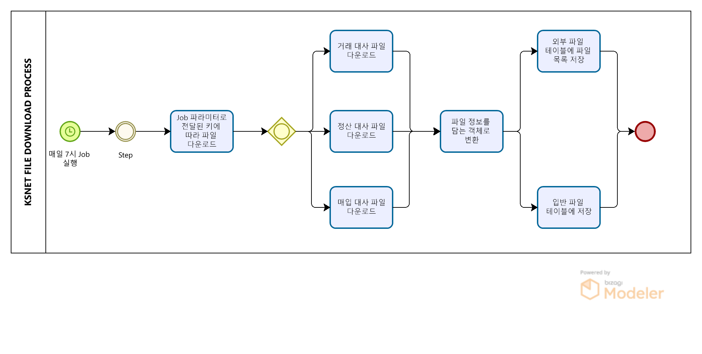

# KSNET PG 대사 파일 다운로드 배치

# KSNET PG 대사 파일 다운로드 배치
* toc
{:toc}

## 개요
+ KSNET PG 대사 파일 다운로드 배치는 매일 7시에 실행되는 배치 프로그램입니다. 이 프로그램은 KSNET PG와의 통신을 통해 다운로드한 대사 파일정보를 DB에 저장합니다.
+ 기간: 2021.04 ~ 진행중
+ 인원: 2명

## 기술 스택
+ JAVA 11
+ Spring Boot 2.7.7
+ Springframework 5.3.24
+ Spring Batch
+ MariaDB
+ JDBC
+ Git
+ Jenkins

## 기술적인 부분
+ Spring Batch: Spring Batch는 대용량의 데이터를 처리하는 일괄 처리 작업에 적합한 프레임워크입니다. 이 프로젝트에서는 Spring Batch를 사용하여 PG와의 통신, 파일 다운로드, DB 저장 등의 작업을 수행합니다.
+ 파일 이름을 고유하게 변경하여 저장


## 기능 요약
+ 매일 7시에 웰컴 PG 파일 다운로드 BATCH 실행
+ KSNET PG 통신 ID 정보 목록 조회
+ Job 파라미터 값에 따라 여러 건의 파일 다운로드 요청 (여러 건인 경우 ```,```로 구분하여 요청) 
+ 다운로드 한 파일 목록 데이터 외부 파일 테이블에 저장
+ 다운로드 한 파일 목록 데이터 입반 파일 테이블에 저장

## 상세 설명
+ 

1. 배치 프로그램은 매일 7시에 실행됩니다.
2. Job 파라미터로 전달받은 값(거래 대사, 정산 대사, 매입 대사)에 따라 파일을 다운로드합니다. 여러 건인 경우 ```,```로 구분하여 요청합니다 
3. 파일 정보를 객체로 변환합니다
4. 다운로드한 파일 목록 데이터는 외부 파일 테이블에 저장됩니다.
5. 다운로드한 파일 목록 데이터는 입반 파일 테이블에 저장됩니다.

## 성과
+ 본 프로젝트는 매일 자동화된 파일 다운로드와 데이터 저장을 수행하여, 인력의 작업 시간을 절약하고 정확성을 높였습니다. 이를 통해 업무 효율성을 높일 수 있었습니다.

## 개선사항
+ 현재는 매일 7시에 배치가 실행되도록 설정되어 있지만, 이외의 시간에도 수동으로 실행할 수 있는 기능이 추가되면 더욱 편리할 것입니다


