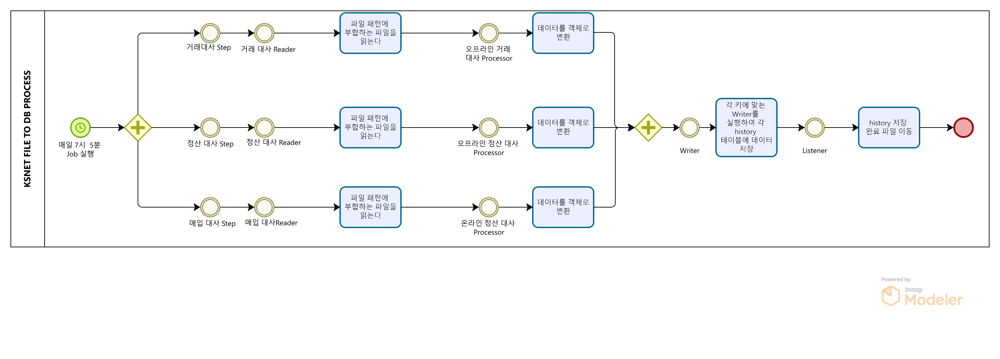

# KSNET PG 대사 파일 TO DB 저장 배치

# KSNET PG 대사 파일 TO DB 저장 배치
* toc
{:toc}

## 개요
+ KSNET PG 대사 파일 TO DB 저장 배치는 매일 7시 5분에 실행되는 배치 프로그램입니다. 이 프로그램은 KSNET PG와의 통신을 통해 다운로드한 대사 파일 내용을 DB에 저장합니다.
+ 기간: 2021.04 ~ 진행중
+ 인원: 2명

## 기술 스택
+ JAVA 11
+ Spring Boot 2.7.7
+ Springframework 5.3.24
+ Spring Batch
+ MariaDB
+ JDBC
+ Git
+ Jenkins

## 기술적인 부분
+ Spring Batch: Spring Batch는 대용량의 데이터를 처리하는 일괄 처리 작업에 적합한 프레임워크입니다. 이 프로젝트에서는 Spring Batch를 사용하여 파일 읽기, DB 저장 등의 작업을 수행합니다.
+ Step 병렬 처리: 각 파일 패턴에 해당하는 파일을 병렬적으로 읽어 데이터를 처리합니다.
+ 처리 완료 파일을 이동: 데이터 처리가 완료된 파일은 다른 경로로 이동하여 관리합니다.

## 기능 요약
+ 매일 7시 5분에 KSNET PG 대사 파일 TO DB 저장 배치 실행

## 상세 설명
+ 

1. 배치 프로그램은 매일 7시 5분에 실행됩니다
2. 각각의 파일 패턴(거래 대사, 매입 대사, 정산 대사)에 해당하는 파일을 찾아 병렬적으로 읽습니다.
3. 읽은 데이터를 객체로 변환하여 처리합니다
4. 변환한 데이터를 각 키에 맞는 history 테이블에 저장합니다 
5. 저장이 완료된 파일은 다른 경로로 이동됩니다

## 성과
+ 본 프로젝트를 통해 KSNET PG 대사 파일을 자동으로 DB에 저장함으로써, 수동 작업에 비해 시간과 정확성을 향상시켰습니다. 이를 통해 업무 효율성을 향상시킬 수 있었습니다.
 
## 개선사항
+ 현재는 매일 7시 5분에 배치가 실행되도록 설정되어 있지만, 이외의 시간에도 수동으로 실행할 수 있는 기능이 추가되면 더욱 편리할 것입니다

