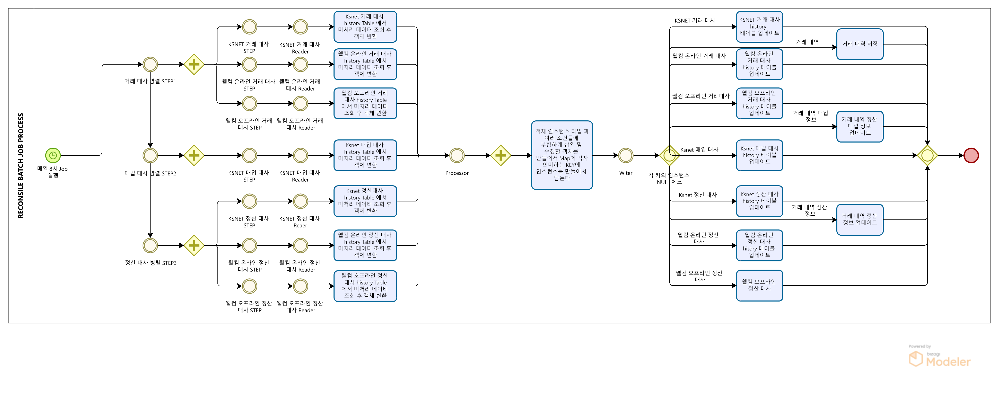

# 대사 처리 배치

# 대사 처리 배치
* toc
{:toc}

## 개요
+ 대사 처리 배치는 매일 8시에 실행되는 배치 프로그램입니다. 이 프로그램은 각각의 대사 테이블에서 미처리된 데이터를 확인하여 대사 처리를 합니다. 
+ 대사 처리 배치는 PG사의 결제 정보를 관리하기 위한 시스템으로, 주로 결제 수단과 결제 건수, 금액 등을 확인하고 대사를 처리합니다.
+ 기간: 2021.04 ~ 진행중
+ 인원: 2명

## 기술 스택
+ JAVA 11
+ Spring Boot 2.7.7
+ Springframework 5.3.24
+ Spring Batch
+ MariaDB
+ JDBC
+ Git
+ Jenkins

## 기술적인 부분
+ Spring Batch: Spring Batch는 대용량의 데이터를 처리하는 일괄 처리 작업에 적합한 프레임워크입니다. 이 프로젝트에서는 Spring Batch를 사용하여 대사 처리를 수행합니다.
+ Step 병렬 처리: 각 대사 처리 Step을 병렬적으로 처리하여 대량의 데이터를 빠르게 처리합니다.

## 기능 요약
+ 매일 8시분에 대사 처리 배치 실행
+ 거래 대사 처리: KSNET 거래 대사, 웰컴 온라인 거래 대사, 웰컴 온라인 거래 대사 처리
+ 매입 대사 처리: KSNET 매입 대사 처리
+ 정산 대사 처리: KSNET 정산 대사, 웰컴 온라인 정산 대사, 웰컴 온라인 정산 대사 처리

## 상세 설명
+ 

1. 배치 프로그램은 매일 8시에 실행됩니다
2. 거래 대사 처리 Step의 KSNET 거래 대사 Step, 웰컴 온라인 거래 대사 Step, 웰컴 오프라인 거래 대사 Step을 병렬 적으로 실행합니다. 
3. 매입 대사 처리 Step의 KSNET 매입 대사 Step을 처리 실행합니다.
4. 정산 대사 처리 Step의 KSNET 정산 대사 Step, 웰컴 온라인 정산 대사 Step, 웰컴 오프라인 정산 대사 Step을 병렬 적으로 실행합니다.
5. 각각의 STEP Reader에서 해당하는 history 테이블에 미처리 데이터건을 조회하여 객체로 변환합니다.
6. Processor에서 객체 인스턴스를 확인하고 조건에 부합하게 삽입 및 수정할 객체를 만들어서 Map에 각자 의미하는 Key에 인스턴스를 만들어서 담습니다.
7. Writer는 Map의 키들의 인스턴스를 확인하여 NULL이 아닌 각 키에 해당하는 Writer을 실행하여 업데이트 및 저장을 수행합니다. 구체적으로는 다음과 같은 작업을 수행합니다.
   + 미처리 거래건 저장: 각 거래건에 대해 대사 처리 결과를 저장합니다.
   + 미처리 매입 정보 업데이트: 매입 대사 결과를 처리하여 매입 정보를 업데이트합니다.
   + 미처리 정산 정보 업데이트: 정산 대사 결과를 처리하여 정산 정보를 업데이트합니다
   + 각각의 히스토리 테이블에 대사처리 결과 업데이트: 대사 처리 결과를 해당 거래에 대한 히스토리 테이블에 업데이트합니다.

## 성과
+ 대사 처리 배치의 안정적인 운영으로 결제 정보 관리에서 발생하는 문제점을 미연에 방지할 수 있었습니다.
+ 정기적인 대사 처리로 인해 잘못된 거래나 매입, 정산 정보를 빠르게 파악할 수 있어 문제가 발생하기 전에 대처할 수 있습니다.
+ 대사 처리 속도를 향상시켜, 대량의 결제 데이터도 빠르게 처리할 수 있도록 개선했습니다.
+ 거래 대사 처리, 매입 대사 처리, 정산 대사 처리를 자동화하여 인력과 시간을 절약할 수 있었습니다.

 
## 개선사항
+ 현재는 매일 8시에 배치가 실행되도록 설정되어 있지만, 이외의 시간에도 수동으로 실행할 수 있는 기능이 추가되면 더욱 편리할 것입니다
+ 대사 처리 배치 실행 후, 결과 보고서를 자동으로 생성하여 관리자에게 제공하는 기능을 추가할 수 있습니다.

