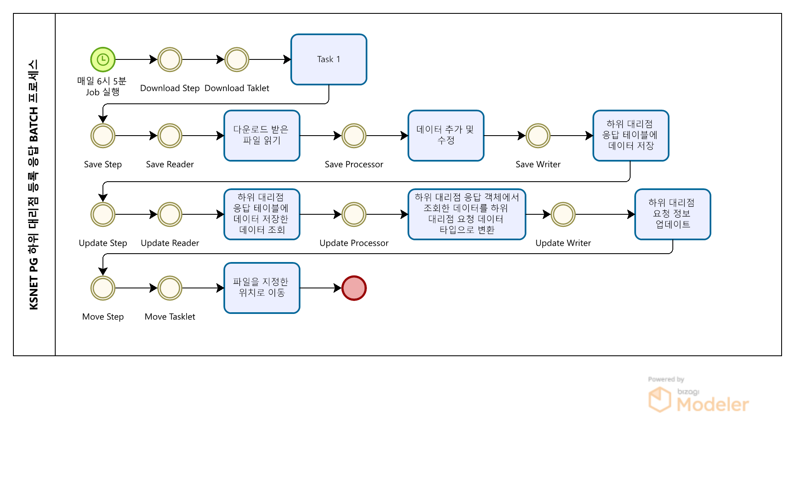
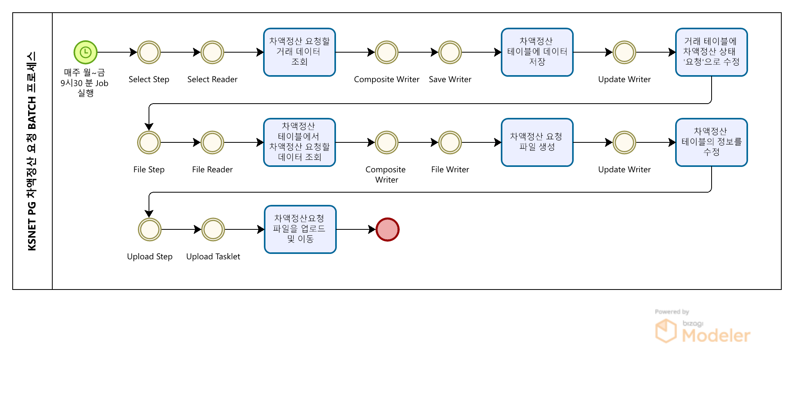
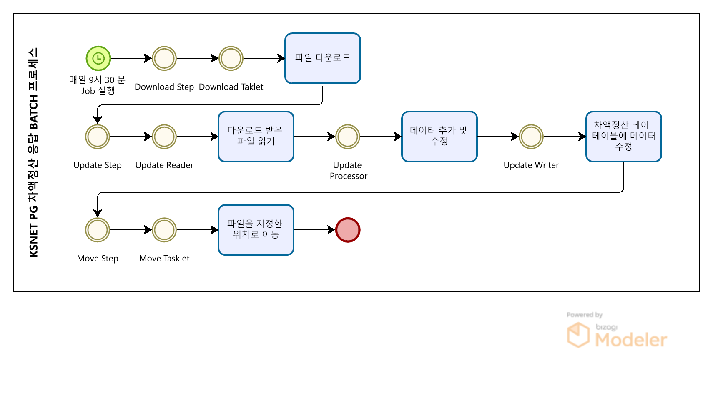

# Ksnet PG에 차액 정산 연동 배치

# Ksnet PG에 차액 정산 연동 배치
* toc
{:toc}

## 개요
+ Ksnet PG 차액정산 배치는 하위 대리점 등록 요청과 응답, 그리고 차액 정산 요청과 응답을 처리하는 배치 프로그램으로 구성되어 있습니다.
+ 주요 기능은 주기적으로 실행되는 배치 프로세스를 통해 파일 생성, 업로드, 다운로드, 백업 등의 작업을 처리하고, 상태를 업데이트하는 것입니다.
+ 이를 통해 결제 서비스의 효율성을 향상시키고, 인력과 시간을 절약할 수 있습니다.
+ 기간: 2021.04 ~ 2023.07
+ 인원: 2명

## 기술 스택
+ JAVA 11
+ Spring Boot 2.7.7
+ Springframework 5.3.24
+ Spring Batch
+ MariaDB
+ JDBC
+ Git
+ Jenkins

## 기술적인 부분
+ Spring Batch: Spring Batch는 대용량의 데이터를 처리하는 일괄 처리 작업에 적합한 프레임워크입니다. 이 프로젝트에서는 Spring Batch를 사용하여 차액정산 처리를 수행합니다.
+ 배치 프로그램을 사용하여 정기적으로 작업을 실행합니다.
+ ExecutionContext를 활용하여 데이터를 저장하고 전달합니다.
+ Socket 을 통해 원천사와 파일 업로드 및 다운로드를 수행합니다.
+ 파일 생성과 헤더 작성, 데이터 처리, 상태 변경 등의 작업을 Step 단위로 구성합니다.

## 기능 요약
+ 하위 대리점 등록 요청 배치
+ 하위 대리점 등록 응답 배치
+ 차액 정산 요청 배치
+ 차액 정산 응답 배치

## 상세 설명

### 하위 대림점 등록 요청 배치
+ 

1. 배치 프로그램은 매주 월 ~ 금 6시 5분에 실행됩니다.
2. "하위 대리점 등록 요청 저장"을 담당하는 Step을 실행하여 하위 대리점 등록할 사업자를 하위 대리점 요청 테이블에 저장합니다.
3. "파일 생성"을 담당하는 Step을 실행하여 하위 대리점 등록할 사업자를 파일에 작성하고, 추가된 하위 사업자 등록 대상의 상태를 변경합니다. 
4. "원천사에 파일 업로드"를 담당하는 Step을 호출하여 파일을 원천사에 업로드합니다.
5. 업로드가 완료된 후 파일을 다른 경로에 백업합니다.

### 하위 대리점 등록 응답 배치
+ 

1. 배치 프로그램은 매일 6시 5분에 실행됩니다.
2. "다운로드"를 담당하는 Step이 원천사에 요청하여 응답 파일들을 다운로드합니다. 
3. "저장"을 담당하는 Step이 다운로드한 파일을 읽어 하위 대리점 응답 테이블에 저장합니다.
4. "업데이트"를 담당하는 Step이 하위 대리점 응답 테이블에 저장된 데이터를 조회하여 해당 정보를 바탕으로 하위 대리점 요청 정보를 업데이트합니다.
5. 처리가 완료된 파일을 이동하여 백업합니다.

### 차액 정산 요청 배치
+ 

1. 배치 프로그램은 매주 월 ~ 금 9시 30분에 실행됩니다.
2. "조회"를 담당하는 Step이 차액 정산 요청할 거래 데이터를 조회한 후, 차액 정산 테이블에 데이터를 저장하고 거래 테이블의 차액 정산 상태를 '요청'으로 수정합니다.
3. "파일 생성"을 담당하는 Step이 차액 정산 테이블에서 차액 정산 요청할 데이터를 조회하여 차액 정산 요청 파일을 생성하고, 차액 정산 테이블의 정보를 '요청'으로 수정합니다.
4. 업로드를 담당하는 Step이 차액 정산 파일을 업로드하고, 파일을 이동하여 백업합니다.

### 차액 정산 응답 배치
+ 

1. 배치 프로그램은 매일 9시 30분에 실행됩니다.
2. "다운로드"를 담당하는 Step이 원천사에 요청하여 차액 정산 응답 파일들을 다운로드합니다.
3. "업데이트"를 담당하는 Step이 파일을 읽어 차액 정산 테이블에 차액 정산 결과를 반영합니다.
4. 처리가 완료된 파일을 이동하여 백업합니다.

## 성과
+ 하위 대리점 등록 요청 배치에서는 매주 월~금 오전 6시에 요청 파일을 생성하고 업로드하여 원천사와의 원활한 소통을 도모합니다.
+ 하위 대리점 등록 응답 배치에서는 매일 오전 6시에 응답 파일을 다운로드하여 처리하고, 테이블 상태를 업데이트하여 처리 현황을 관리합니다.
+ 차액 정산 요청 배치에서는 매주 월~금 오전 6시 30분에 차액정산 요청 파일을 생성하고 업로드하여 정산 작업을 원활하게 수행합니다.
+ 차액 정산 응답 배치에서는 매일 오전 6시 30분에 응답 파일을 다운로드하여 처리하고, 테이블 상태를 업데이트하여 처리 현황을 관리합니다.
+ 배치 프로그램을 활용하여 매주 월~금과 매일 6시, 6시 30분에 자동 실행되므로 인력 및 시간을 절약할 수 있습니다.
+ 파일 생성, 업로드, 다운로드, 백업과 같은 파일 관리 작업이 원활하게 이루어져 데이터의 정확성과 안전성이 향상되었습니다.
+ 하위 대리점 등록 요청과 차액 정산 요청의 처리 과정을 추적하고 상태를 업데이트하여 효율적인 관리가 가능합니다.

## 개선사항
+ 배치 실행 시간을 조정하여 업무 요구에 더욱 적합하게 실행할 수 있도록 개선합니다.
+ 예외 상황에 대한 처리와 오류 복구 기능을 강화하여 안정성을 향상시킵니다.
+ 성능 최적화를 통해 처리 속도를 향상시키고, 대용량 데이터 처리에 대비합니다.
+ 성능 최적화를 위해 대량 파일 처리 시 병렬 처리 및 분산 처리를 고려하여 처리 속도를 향상시킬 수 있습니다.

