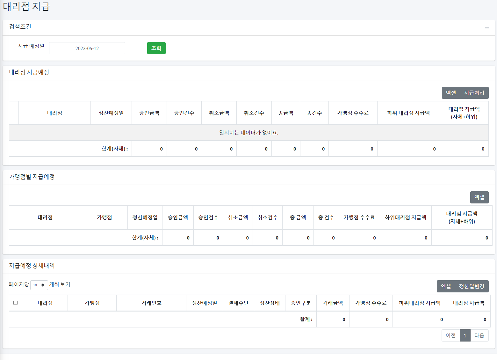

# 결제 시스템 (PG) 관리자

# 결제 시스템 (PG) 관리자
* toc
{:toc}

## 개요
+ 결제 서비스(PG)의 관리자는 계좌 이체 거래 내역 조회, 입금 정산, 지급 정산, 위험 관리 등의 기능을 제공하는 웹 기반 시스템입니다. 결제 서비스(PG)의 관리자는 원천사 입금 및 지급에 대한 효율적인 관리를 지원하며, 가맹점 및 대리점의 지급 내역을 확인하고 관리할 수 있습니다. 또한, 결제 한도 관리를 통해 가맹점의 결제 리스크를 모니터링하고 조절할 수 있습니다.
+ 기간: 2021.04 ~ 진행중
+ 인원: 4명

## 기술 스택
+ JAVA 11
+ Spring Boot 2.7.7
+ Springframework 5.3.24
+ Grpc
+ Thymeleaf
+ MariaDB
+ MyBatis
+ Git
+ Jenkins

## 기술적인 부분
+ Git을 사용하여 소스 코드를 관리하고 버전을 관리합니다
+ Jenkins를 사용하여 빌드 및 배포 자동화를 구현합니다
+ MyBatis를 사용하여 SQL 쿼리를 작성하고 실행합니다 
+ 프론트엔드와 백엔드 간에 gRPC 프로토콜을 사용하여 통신합니다
+ Thymeleaf를 사용하여 서버 사이드 렌더링을 구현합니다
+ MariaDB를 사용하여 데이터베이스를 구성합니다
+ Spring Boot 2.7.7과 Springframework 5.3.24를 사용하여 웹 어플리케이션을 구현합니다
+ 웹 기반 애플리케이션: 웹 기반으로 개발되어 사용자가 브라우저를 통해 접근하고 이용할 수 있습니다.
+ 조회 및 처리 기능:다양한 조회 기능과 거래 처리 기능을 제공하여 사용자가 원하는 정보를 효율적으로 확인하고 필요한 작업을 수행할 수 있습니다.
+ 엑셀 저장 기능: 입금 정산, 지급 정산 등에서 발생한 데이터를 엑셀 형식으로 저장할 수 있는 기능을 제공하여 사용자가 데이터를 손쉽게 내보내고 활용할 수 있습니다.

## 기능 요약
+ 로그인
+ Dashboard
+ 시스템 관리
+ 가맹점 관리
+ 조회 서비스
+ 입금 정산
+ 지급 정산
+ 위험 관리

## 상세 설명

### 로그인 
+ 
+ 1차 JWT 인증 및 2차 구글 OTP 인증을 수행합니다.

### Dashboard 
+ 
+ 금일 결제 금액, 거래 건수, 정산 금액, 신규 가맹점 수를 표시합니다.
+ 월간 거래 그래프로 당월, 전월, 전년도 동월의 거래 금액을 비교하여 표시합니다.
+ 거래 금액 TOP 10을 그래프로 표시합니다.
+ 담보 현황과 한도 현황을 테이블로 표시합니다.

### 시스템 관리 
+ 메뉴 관리
  + 메뉴 등록, 조회, 수정, 삭제를 구현합니다.
  + 등록 및 수정은 팝업창으로 기능을 구현합니다.
  + 하위 메뉴가 있는 메뉴는 TreeGrid를 이용하여 접고 펼칠 수 있습니다.
  + 아이콘을 Select box 목록으로 조회하여 등록할 수 있습니다.
+ 권한 관리
  + 사용자 그룹의 메뉴 및 API 요청 권한을 관리합니다.
+ 코드 관리
  + 코드 등록, 조회, 수정, 삭제를 구현합니다.
  + 등록 및 수정은 팝업 창으로 기능을 구현합니다.
+ 영업일 관리
  +  
  + 휴일을 등록, 삭제를 구현합니다.
  + 등록은 팝업 창으로 기능을 구현합니다.
  + 휴일로 등록된 날짜는 정산일에서 제외됩니다.
+ 카드빈 관리 
  + 업로드 대상 원천사를 선택하여 파일을 업로드하고 데이터를 저장하는 기능을 구현합니다.
  + 
  + 등록 및 수정 기능을 구현합니다.
  + 등록, 수정은 팝업 창으로 기능을 구현합니다.
  + 
+ 사용자 관리
  + 사용자 등록, 조회, 수정, 삭제를 구현합니다.
  + 등록 및 수정은 팝업 창으로 기능을 구현합니다.
  + 

### 가맹점 관리
+ 
+ 지금 ID 관리
  + 가맹점은 립페이의 전자지급결제대행서비스를 이용하는 업체로써, 립페이를 이용한 전자지급결제대행을 수행합니다.
  + 가맹점은 결제금액에 대한 수수료를 제외한 금액을 립페이로부터 정산 받습니다.
  + 가맹점 등록, 조회, 수정, 삭제 기능을 구현합니다.
  + 등록 및 수정은 팝업 창을 통해 기능을 수행합니다.
  + 
  + 가맹점 관리 페이지 기능에는 지급 ID, 연락처, 상태, 한도 정보, 사업자 정보, 대리점 정보, UID 정보, 담보 정보, 결제 제한 등록 및 수정이 가능합니다.
    + UID는 결제 수단을 관리하고 수수료를 등록하는 정보입니다 사용자에 결제 관리자로 UID를 설정하면 결제 전용 계정을 등록할 수 있습니다 
+ UID 정보 관리
  + UID는 결제 수단을 관리하고 수수료를 등록하는 정보입니다.
  + 사용자에 결제 관리자로 UID를 설정하면 결제 전용 계정을 등록할 수 있습니다.
  + 인증결제, 비인증결제 (수기), 오프PG 등의 결제 수단을 등록할 수 있습니다.
    + 인증결제: 온라인상점에서 상품과 서비스 판매시 고객이 신용카드 및 다양한 결제 수단을 이용하여 결제하는 서비스
    + 비인증결제 (수기): 비대면 결제로 상점에서 고객의 카드번호를 입력 혹은 스캔하여 결제하는 서비스
    + 오프PG: 카드홀더(고객)이 자주쓰는 카드를 저장하여 결제하는 방식 (카드번호는 카드사에 저장이 되고 PG사는 카드사에서 제공하는 시리얼 값을 저장함)
  + UID 정보 등록, 조회, 수정, 삭제 기능을 구현합니다.
  + 등록 및 수정은 팝업 창을 통해 기능을 수행합니다.
  + 
+ 결제 상품 관리
  + 결제 상품은 TID의 그룹 개념으로 구성됩니다.
  + 요청된 카드사 별로 TID를 지정할 수 있습니다. 
  + 결제 상품 등록, 조회, 수정, 삭제 기능을 구현합니다.
  + 등록 및 수정은 팝업 창을 통해 기능을 수행합니다.
  + 
+ 결제사 TID 관리
  + TID 정보를 관리하는 페이지입니다. 
  + 카드사 가맹점 관리의 그룹 개념으로 구성됩니다.
  + TID 등록, 조회, 수정, 삭제 기능을 구현합니다.
  + 등록 및 수정은 팝업창을 통해 기능을 수행합니다.
  + 
+ 카드사별 가맹점 관리 
  + 원천사와의 계약 정보를 관리하는 페이지입니다.
  + 원천사와 통신하는 ID 정보를 가지고 있습니다.
  + 등록, 조회, 수정, 삭제 기능을 구현합니다.
+ 사업자 관리
  + 사업자 정보를 관리하는 페이지입니다.
  + 사업자 등록, 조회, 수정, 삭제 기능을 구현합니다.
  + 등록 및 수정은 팝업 창을 통해 기능을 수행합니다.
  + 
+ 대리점 정보 관리
  + 대리점은 립페이의 전자지급대행 사업에 대한 권리를 이용하여 영업을 대리하는 업체입니다.
  + 대리점은 립페이로부터 수수료를 공급가로 받아 가맹점을 모집하고, 공급가와 가맹점의 결제 수수료와의 차익(마진)을 수수료로 수취합니다.
  + 대리점은 립페이의 영업대행으로 가맹점 모집시 반드시 립페이의 가맹점으로 모집해야 합니다.
  + 대리점 정보를 관리하는 페이지입니다.
  + 대리점 등록, 조회, 수정, 삭제 기능을 구현합니다.
  + 등록, 수정은 팝업창으로 기능을 구현합니다.
  + 
+ 담보 조회 
  + 담보 정보를 보여주는 페이지입니다.
  + 담보의 남은 일수를 확인할 수 있습니다. 
+ 서비스 신청 심사 관리
  + 가맹점 서비스 심사를 관리하는 페이지입니다. 
  + 가맹점 서비스 심사를 등록, 조회, 수정 기능을 구현합니다.
  + 등록, 수정은 팝업 창으로 기능을 구현합니다.
  + 
  + 회원 구분 선택된 값에 따라 표시 할 항목들이 변화합니다. 
  + 사업장 숙소 검색 기능을 구현합니다.
  + 구비 서류 사진 파일 업로드 기능을 구현합니다.
  + 심사 완료로 저장시에는 가맹점 등록, 사용자 등록, 사업자 등록, 선택한 UID 들을 자동으로 등록해줍니다.
  
### 조회 서비스
+ 카드 거래 내역
  + 카드 거래 내역을 조회할 수 있습니다.
  + 각 행에 지급 ID, 거래번호, UID 정보에 링크가 있어서 링크 호출시 해당 정보를 볼 수 있습니다. 
  + 엑셀 저장 기능과 거래 취소 기능을 제공합니다.
  + 전화 취소 기능과 부분 취소 기능을 제공합니다.
+ 현금 영수증 거래 내역
  + 현금 영수증 거래 내역을 조회할 수 있습니다.
  + 각 행에 지급 ID, 거래번호, UID 정보에 링크가 있어서 링크 호출시 해당 정보를 볼 수 있습니다.
  + 엑셀 저장 기능과 거래 취소 기능을 제공합니다.
+ 계좌 이체 거래 내역
  + 계좌 이체 거래 내역을 조회할 수 있습니다.
  + 각 행에는 지급 ID, 거래번호, UID 정보에 링크가 있어 해당 정보를 볼 수 있습니다.
  + 엑셀 저장 기능과 거래 취소 기능을 제공합니다.

### 입금 정산 
+ 입금 정산
  + 
  + 원천사 입금 정산 조회 및 처리 페이지입니다.
  + 입급 처리 기능을 제공합니다. 
  + 상세 내역 조회 기능을 제공합니다.
  + 원천사 발급 ID (통신 ID)별 입금 예정 목록 조회 기능을 제공합니다.
  + 엑셀 저장 기능을 제공합니다.
  + 정산일 변경 기능을 제공합니다.
  + 정산 상태 변경 기능을 제공합니다.
  + 전체 합계 표시 기능을 제공합니다.
+ 입금 정산 내역
  + 
  + 원천사 입금 정산 내역 조회 및 처리 페이지입니다.
  + 원천사 발급 ID (통신 ID)별 입금 목록 조회 기능을 제공합니다.
  + 입금 취소 기능을 제공합니다.
  + 상세 내역 조회 기능을 제공합니다.
  + 엑셀 저장 기능을 제공합니다.
  + 전체 합계를 하단에 표시합니다.
+ 입금 업로드
  +  
  + 원천사 입금 업로드 처리 페이지입니다.
  + 업로드 양식 다운로드 기능을 제공합니다. 
  + 업로드 양식을 업로드하면 업로드 결과 목록을 출력합니다.
  + 저장하면 입금 정산에 저장됩니다.

### 지급 정산
+ 가맹점 지급
  + 
  + 가맹점 지급 예정 조회 및 처리 페이지입니다.
  + 가맹점 지급 예정 행은 서비스 구분 값에 따라 TreeGrid로 접고 펼칠 수 있습니다.
    + 
  + 상세 내역 조회 기능을 제공합니다.
  + 엑셀 저장 기능을 제공합니다.
  + 지급 처리 기능을 제공합니다.
  + 전체 지급 처리 기능을 제공합니다.
  + 지급 예정일 변경 기능을 제공합니다.
  + 지급 상태 변경 기능을 제공합니다.
  + 전체 합계를 하단에 표시합니다.
+ 가맹점 지급 내역
  + 
  + 가맹점 지급 조회 및 처리 페이지입니다.
  + 가맹점 지급 내역 행은 서비스 구분 값에 따라 TreeGrid로 접고 펼칠 수 있습니다.
  + 상세 내역 조회 기능을 제공합니다.
  + 엑셀 저장 기능을 제공합니다.
  + 전체 합계 표시 기능을 제공합니다. 
+ 대리점 지급
  + 
  + 대리점 지급 예정 조회 및 처리 페이지입니다. 
  + 대리점 지급 예정 내역 조회 기능을 제공합니다.
  + 가맹점 별 지급 예정 내역 조회 기능을 제공합니다.
  + 상세 내역 조회 기능을 제공합니다.
  + 지급 처리 기능을 제공합니다.
  + 엑셀 저장 기능을 제공합니다.
  + 정산일 변경 기능을 제공
+ 대리점 지급 내역
  + 대리점 지급 조회 및 처리 페이지입니다. 
  + 대리점 지급 내역을 조회합니다.
  + 가맹점 별 지급 내역을 조회합니다.
  + 상세 내역을 조회합니다.
  + 지급 취소 처리 기능을 제공합니다.
  + 엑셀 저장 기능을 제공합니다.

### 위험 관리 
+ 결제 한도 관리 
  + 
  + 가맹점 결제 한도 페이지입니다.
  + 가맹점 연 한도, 월 한도, 일 한도를 게이지 표시합니다.
    + 70% 이상 – 노란색
    + 80% 이상 – 빨간색
  + 한도 추가 기능을 제공합니다.
    + 

## 성과
+ 관리자에서는 프론트엔드와 백엔드 간의 통신에 gRPC를 사용하고 있습니다.
  + 프론트엔드는 gRPC 스텁을 사용하여 서버의 gRPC 서비스 메서드를 호출합니다.
  + 백엔드는 gRPC 서비스 정의를 기반으로 서비스 메서드를 구현합니다.
  + gRPC를 사용함으로써 HTTP/2의 다중 요청 및 응답 기능을 활용하여 클라이언트와 서버 간의 빠른 통신이 가능하며, Protocol Buffers를 사용하여 더 효율적인 데이터 전송이 가능해졌습니다.
+ 효율적인 거래 관리: 계좌 이체 거래 내역 조회, 입금 정산, 지급 정산 등의 기능을 통해 사용자는 실시간으로 거래 내역을 확인하고 필요한 작업을 수행할 수 있습니다. 이로써 거래 관리의 효율성과 정확성을 높였습니다.
+ 정산 처리 간소화: 입금 정산과 지급 정산 기능을 통해 가맹점과 대리점의 정산 과정을 간소화하고 자동화할 수 있습니다. 입금 내역의 조회와 처리, 지급 예정 조회와 처리 등을 통해 정산 프로세스를 효과적으로 조회하고 처리할 수 있게 되었습니다.
+ 결제 한도 관리를 통해 가맹점의 결제 한도를 관리하고 위험 상황을 예방할 수 있게 되었습니다.
  
## 개선사항
+ 사용자 경험 개선: 사용자가더 쉽게 이용할 수 있도록 UI/UX 개선을 진행합니다. 직관적이고 사용하기 편리한 인터페이스를 구축하여 사용자들이 원하는 기능을 빠르게 찾고 사용할 수 있도록 합니다.
+ 실시간 알림 기능 추가: 거래 상태 변화나 중요한 업데이트가 발생할 경우 사용자에게 실시간으로 알림을 제공합니다. 이를 통해 사용자는 중요한 정보를 즉시 확인하고 대응할 수 있습니다.
+ 분석 및 보고 기능 강화: 데이터를 분석하여 가맹점 및 대리점의 거래 동향과 성과를 시각화하고 보고서 형태로 제공합니다. 이를 통해 사용자는 보다 정확한 정보를 바탕으로 전략적인 의사결정을 할 수 있습니다.
+ 보안 강화: 결제 서비스는 민감한 금융 정보를 다루기 때문에 보안이 매우 중요합니다. 더욱 강화된 보안 방식을 도입하여 사용자의 정보와 거래 내역을 안전하게 보호합니다.
+ 모바일 앱 개발: 웹 기반에 추가로 모바일 앱을 개발하여 사용자가 언제 어디서나 편리하게 서비스에 접근하고 이용할 수 있도록 합니다.
