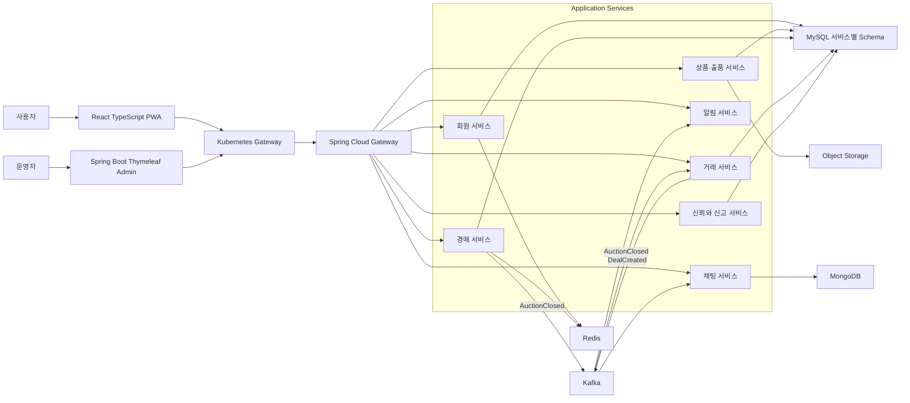
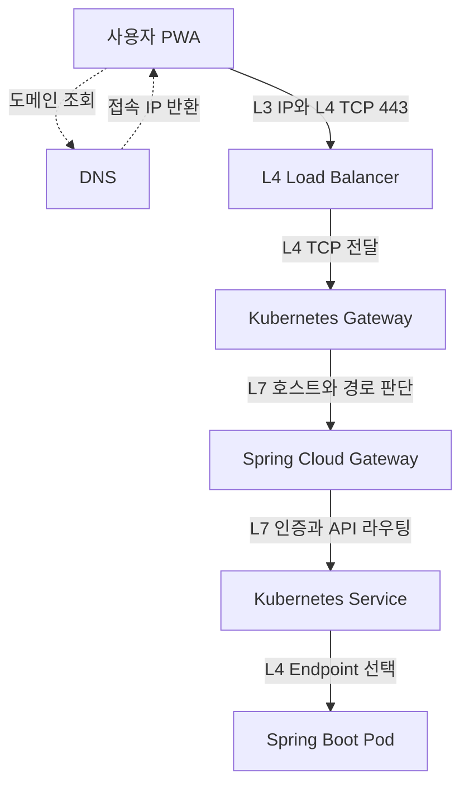
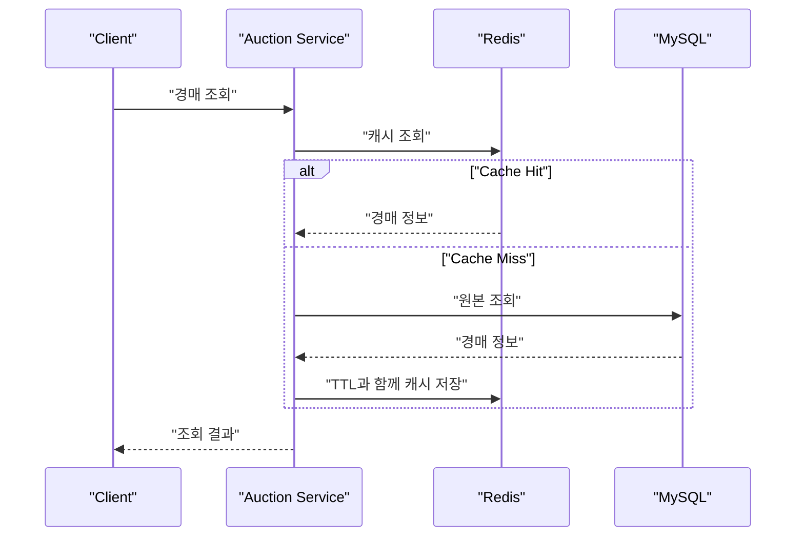
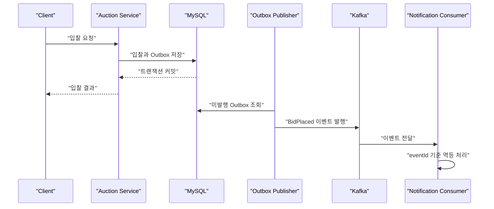
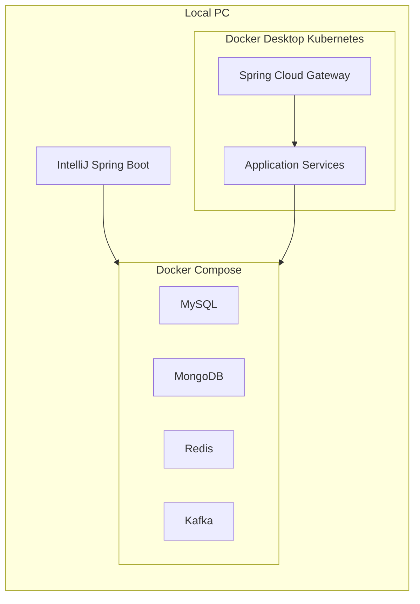

# 가격 매경 프로젝트를 시작하며

# 가격 매경 프로젝트를 시작하며
* toc
{:toc}

---

## 프로젝트를 시작한 이유

중고 거래 서비스에는 당근, 번개장터처럼 널리 알려진 플랫폼이 있지만 경매를 중심으로 떠오르는 서비스는 상대적으로 많지 않다고 생각했다.

이 판단이 시장에 실제 기회가 있다는 의미는 아니다. 경매는 판매자와 구매자가 동시에 모여야 거래가 성립하는 양면 시장이고, 초기 사용자를 확보하지 못하면 상품과 입찰 데이터가 모두 부족해진다. 따라서 가격 매경은 처음부터 대규모 사용자를 전제로 하기보다 다음 두 가지 목표를 가진 개인 프로젝트로 시작한다.

- 실제로 사용할 수 있는 경매 서비스를 만든다.
- 회사 업무에서 경험하기 어려웠던 분산 시스템과 인프라 운영을 직접 학습한다.

기술을 많이 사용하는 것 자체가 목표가 되면 각 기술이 왜 필요한지 설명하기 어렵다. 이 프로젝트에서는 기능을 먼저 구현하고, 동시성·이벤트 중복·캐시 장애·데이터 복구처럼 실제 문제가 생기는 지점에 기술을 단계적으로 적용한다.

## 가격 매경이라는 이름

프로젝트 이름은 `경매`를 거꾸로 읽은 `매경`에서 가져왔다.

단순히 높은 가격을 제시하는 일반 경매만 제공하지 않고 구매자가 조건을 제시하거나, 시간이 흐르면서 가격이 낮아지거나, 여러 사람이 네고에 참여하는 것처럼 가격이 결정되는 방향을 다양하게 다룬다는 의미도 담았다.

## 제공하려는 경매 방식

초기에는 네 가지 거래 방식을 검토한다.

| 방식 | 등록 주체 | 가격 변화 | 종료 기준 |
|---|---|---|---|
| 일반 경매 | 판매자 | 구매자가 입찰가를 올린다. | 종료 시점의 유효한 최고가 |
| 구매자 역경매 | 구매자 | 판매자가 판매 조건과 가격을 제시한다. | 구매자가 제안을 선택한다. |
| 가격 하락 경매 | 판매자 | 정해진 시간이나 규칙에 따라 가격이 내려간다. | 구매자가 현재 가격을 수락한다. |
| 네고 경매 | 판매자 | 여러 구매자가 인하 가격과 조건을 제안한다. | 판매자가 제안을 선택한다. |

경매 방식은 이름만 다르게 만들지 않는다. 시작 가격, 최소 가격, 가격 변경 규칙, 종료 시점, 동률 처리, 취소 가능 시점과 낙찰 조건을 각각 명확하게 정의해야 한다.

## 플랫폼에서 결제하지 않는 이유

초기 버전에서는 플랫폼 결제를 제공하지 않는다.

낙찰이 확정되면 판매자와 구매자 사이의 채팅방을 활성화하고, 실제 거래 방식은 당사자가 결정하도록 한다. 결제를 제외하면 PG 계약, 정산, 환불, 수수료, 전자금융 관련 운영 부담을 초기 범위에서 줄일 수 있다.

다만 결제를 하지 않는다고 해서 플랫폼의 책임이 없어지는 것은 아니다. 허위 상품, 거래 불이행, 외부 결제 유도, 욕설과 사기 신고를 다룰 수 있어야 한다.

초기 신뢰 기능은 다음 범위로 제한한다.

- 거래 완료 후 상호 평가
- 사용자 신뢰 점수
- 신고 접수와 처리 상태
- 거래 취소와 노쇼 이력
- 채팅 차단
- 운영자 제재 이력

신뢰 점수는 신고 한 건만으로 자동 하락시키지 않는다. 신고자와 피신고자 중 누구의 주장이 사실인지 즉시 판단하기 어렵기 때문에 거래 상태, 반복 신고, 운영자 검토 결과처럼 확인 가능한 기록을 함께 사용해야 한다.

## MVP 범위

첫 번째 개발 목표는 모든 기능을 한 번에 만드는 것이 아니다. 경매의 핵심 흐름이 끝까지 동작하도록 만드는 것이 우선이다.

```text
회원 가입과 로그인
→ 상품 등록
→ 경매 시작
→ 여러 사용자의 동시 입찰
→ 경매 종료
→ 낙찰자 한 명 결정
→ 채팅방 생성
→ 거래 완료 후 평가
```

MVP에서는 다음 항목을 제외한다.

- 플랫폼 결제와 정산
- 유료 광고
- 복잡한 추천 모델
- 다국가 통화와 해외 배송
- 완전 자동화된 사기 판정

## 프로젝트의 학습 목표

가격 매경은 기능 개발과 함께 다음 기술을 단계적으로 학습한다.

| 영역 | 학습 대상 |
|---|---|
| 애플리케이션 | Spring Boot, Spring Cloud Gateway, gRPC, WebSocket |
| 프론트엔드 | React, TypeScript, PWA |
| 데이터 | MySQL, MongoDB, Redis, Object Storage |
| 이벤트 | Kafka, Outbox Pattern, 멱등 Consumer |
| 배포 | Docker, Kubernetes, Helm |
| 관측성 | Prometheus, Grafana, 로그 수집 |
| 자동화 | Terraform, CI/CD, 백업과 복구 |

모든 기술을 첫날부터 함께 사용하지 않는다. 단일 MySQL로 동작하는 기능을 먼저 만들고, Redis와 Kafka를 적용한 뒤 Kubernetes 운영 범위를 넓힌다.

## 초기 애플리케이션 구조

사용자 화면은 `React + TypeScript + PWA`로 구성한다. PWA는 하나의 웹 코드베이스로 모바일과 데스크톱을 지원하고, 설치 가능한 웹 경험과 푸시 알림을 단계적으로 검토하기 위한 선택이다.

관리자 화면은 Spring Boot와 Thymeleaf를 사용한다. 관리자가 각 서비스 데이터베이스를 직접 수정하지 않고 서비스가 제공하는 관리자 API를 호출하도록 한다. DB를 직접 수정하면 캐시 무효화, 이벤트 발행, 감사 이력과 비즈니스 검증이 누락될 수 있기 때문이다.



각 서비스의 책임은 다음과 같이 구분한다.

| 서비스 | 주요 책임 |
|---|---|
| 회원 | 가입, 인증, 프로필, 이용 정지 |
| 상품·출품 | 제목, 설명, 카테고리, 상품 상태, 이미지, 공개 상태 |
| 경매 | 일반·역경매·가격 하락·네고 규칙, 입찰, 종료, 낙찰자 결정 |
| 거래 | 낙찰 당사자 연결, 거래 진행·완료·취소, 채팅 활성화, 후기 작성 자격 |
| 채팅 | 거래 당사자 메시지와 읽음 상태 |
| 알림 | 입찰, 낙찰, 채팅과 거래 상태 알림 |
| 신뢰와 신고 | 후기, 신뢰도, 신고, 제재 이력 |

플랫폼이 결제를 처리하지 않으므로 결제 서비스와 정산 서비스는 초기 범위에 포함하지 않는다. 다만 낙찰 이후를 기록하지 않으면 거래 완료 여부, 노쇼, 후기 작성 자격을 판단할 수 없으므로 거래 서비스는 필요하다.

위 표는 논리적인 도메인 경계이며 처음부터 모두 별도 애플리케이션으로 배포한다는 의미는 아니다. MVP에서는 `상품·출품`, `경매`, `거래`를 하나의 `marketplace-service` 안에서 모듈로 분리하고, 회원·채팅·알림처럼 데이터 특성과 실행 방식이 다른 영역부터 별도 서비스로 운영한다. 기능과 변경 주기, 확장 기준, 장애 격리 필요성이 확인되면 모듈을 독립 서비스로 분리한다.

카테고리와 이미지 업로드 API는 상품·출품 영역에 포함하고 이미지 파일은 Object Storage에 저장한다. 경매 종료 스케줄러는 경매 영역의 별도 Worker로 실행한다. 검색과 추천은 초기에는 MySQL 조회로 제공하고, 검색 조건과 데이터가 늘어나 독립적인 색인과 확장이 필요해질 때 검색 서비스로 분리한다.

## API Gateway의 역할

외부 요청은 Spring Cloud Gateway를 통해 각 서비스로 전달한다.

Gateway는 다음 공통 기능을 담당한다.

- API 경로 라우팅
- JWT 기본 검증
- CORS
- 요청 ID와 Trace ID 생성
- 공통 접근 로그
- Rate Limit
- Gateway 메트릭

경매 종료, 낙찰자 결정, 입찰 유효성 검증 같은 비즈니스 로직은 Gateway에 넣지 않는다. Gateway에서 JWT를 확인하더라도 각 서비스는 사용자의 권한과 리소스 소유권을 다시 검증한다.

외부 클라이언트는 REST와 WebSocket을 사용하고, 서비스 간 동기 통신에는 gRPC를 검토한다. 비동기 처리는 Kafka 이벤트를 사용한다.

## 요청 흐름으로 이해하는 L3, L4, L7

사용자가 `GET /api/auctions/123`을 호출하면 요청이 곧바로 Spring Boot 애플리케이션에 도착하는 것은 아니다. DNS로 접속할 IP를 찾고, 네트워크와 포트를 거쳐 HTTP 경로에 맞는 서비스와 Pod까지 이동한다.

`L`은 OSI 7계층에서 계층을 의미하는 `Layer`의 약자다. 네트워크 통신을 역할에 따라 일곱 계층으로 나누며, L 뒤의 숫자는 몇 번째 계층인지를 나타낸다.

| 계층 | 이름 | 다루는 대상 | 예시 |
|---|---|---|---|
| L1 | 물리 계층 | 전기·무선 신호와 비트 | 랜선, 광케이블, Wi-Fi 전파 |
| L2 | 데이터 링크 계층 | 같은 네트워크 안의 프레임과 MAC 주소 | Ethernet, Switch |
| L3 | 네트워크 계층 | 서로 다른 네트워크 사이의 IP 패킷 | IP, Router |
| L4 | 전송 계층 | 프로세스 간 연결과 포트 | TCP, UDP |
| L5 | 세션 계층 | 통신 세션의 생성과 유지 | 세션 관리 |
| L6 | 표현 계층 | 데이터 형식, 인코딩과 암호화 | 직렬화, 암호화 |
| L7 | 응용 계층 | 사용자가 이용하는 애플리케이션 프로토콜 | HTTP, gRPC, WebSocket |

실제 인터넷과 Kubernetes의 구현이 OSI 모델에 정확히 일대일로 대응하는 것은 아니다. 다만 인프라를 설계할 때는 요청을 전달하는 장비나 소프트웨어가 어디까지 이해하는지를 설명하기 위해 L3, L4, L7이라는 표현을 자주 사용한다.

### L3 - IP를 보고 이동 경로를 결정하는 계층

L3는 출발지 IP와 목적지 IP를 보고 패킷을 어느 네트워크로 보낼지 결정한다. 라우터는 라우팅 테이블을 확인해 다음 이동 경로를 선택한다.

예를 들어 목적지 IP가 `10.0.1.20`이라는 사실은 알 수 있지만, 해당 요청이 `80` 포트인지 `443` 포트인지 또는 `/api/auctions` 요청인지는 알지 못한다. 가격 매경에서는 Node와 Pod의 IP, 서브넷, 라우팅과 NetworkPolicy가 L3와 관련된다.

### L4 - IP와 포트를 보고 연결을 전달하는 계층

L4는 L3의 IP에 TCP 또는 UDP 포트 정보를 더해 어떤 프로세스와 통신할지 구분한다. 같은 서버 IP를 사용하더라도 `443`은 HTTPS, `3306`은 MySQL처럼 포트에 따라 목적지가 달라질 수 있다.

L4 Load Balancer는 `목적지 IP + 포트`를 기준으로 연결을 여러 서버에 분산한다. TCP 연결 상태는 관리할 수 있지만 HTTP의 URL, Header, JWT 내용은 해석하지 않는다. 가격 매경에서는 외부 Load Balancer와 Kubernetes Service가 주로 L4 역할을 담당한다.

### L7 - HTTP 내용을 이해하고 요청을 처리하는 계층

L7은 HTTP Method, Host, Path, Header와 Cookie처럼 애플리케이션 프로토콜의 내용을 이해한다. 따라서 `/api/auctions/**`는 경매 서비스로 보내고 `/api/chats/**`는 채팅 서비스로 보내는 경로 기반 라우팅이 가능하다.

JWT 검증, CORS, Rate Limit, 요청·응답 변환도 L7에서 처리할 수 있다. 가격 매경에서는 Kubernetes Gateway와 Spring Cloud Gateway가 L7 역할을 담당한다. 다만 Gateway API는 설정한 Route 종류에 따라 L4 트래픽도 처리할 수 있으며, 이 프로젝트에서는 HTTPS와 HTTPRoute를 사용하는 L7 구성을 기준으로 설명한다.

L3, L4, L7의 차이를 간단히 정리하면 다음과 같다.

| 계층 | 주요 정보 | 프로젝트에서의 역할 |
|---|---|---|
| L3 | 출발지·목적지 IP, 서브넷, 라우팅 | Node와 Pod 네트워크, 라우팅, NetworkPolicy |
| L4 | TCP·UDP, 출발지·목적지 포트 | Load Balancer, Kubernetes Service |
| L7 | HTTP, HTTPS, gRPC, WebSocket | Kubernetes Gateway, Spring Cloud Gateway |



요청은 다음 순서로 전달된다.

1. PWA가 DNS에 도메인을 조회해 접속할 IP 주소를 얻는다.
2. 라우터는 목적지 IP를 보고 패킷이 이동할 경로를 결정한다. 이 구간이 L3에 해당한다.
3. Load Balancer는 TCP 443 포트의 연결을 받아 Kubernetes Gateway로 전달한다. URL 경로가 아니라 IP와 포트를 기준으로 처리하므로 L4 역할이다.
4. Kubernetes Gateway는 HTTP의 Host와 Path를 읽고 요청을 Spring Cloud Gateway로 보낸다. HTTP 내용을 해석하므로 L7 역할이다.
5. Spring Cloud Gateway는 JWT, CORS, Rate Limit 같은 공통 정책을 적용하고 `/api/auctions/**` 경로를 경매 서비스로 라우팅한다.
6. Kubernetes Service는 현재 실행 중인 Pod Endpoint 중 하나를 선택해 요청을 전달한다.

DNS는 접속 전에 도메인을 IP로 변환하는 이름 조회 시스템이며 L3, L4, L7 Load Balancer 중 하나는 아니다. 또한 L4와 L7은 숫자가 높을수록 무조건 우수하다는 의미가 아니다. L4는 HTTP를 해석하지 않는 대신 단순하고 빠르게 연결을 분산하고, L7은 경로·헤더·인증 정보에 따라 세밀하게 요청을 제어한다.

Kubernetes Gateway와 Spring Cloud Gateway는 이름은 비슷하지만 역할이 다르다.

- Kubernetes Gateway는 클러스터 입구에서 TLS와 외부 라우팅을 처리한다.
- Spring Cloud Gateway는 애플리케이션 계층에서 인증과 API 정책을 처리한다.
- Kubernetes Service는 변경되는 Pod 앞에 안정적인 주소를 제공하고 TCP 연결을 분산한다.

Redis, Kafka, MongoDB와 MySQL 포트는 인터넷에 직접 공개하지 않는다. 애플리케이션 Pod만 클러스터 내부 Service를 통해 접근하도록 구성한다.

## MySQL과 입찰 정합성

초기 데이터베이스는 단일 MySQL로 시작한다.

경매 시스템에서 먼저 해결해야 하는 문제는 샤딩보다 동시성이다. 여러 사용자가 같은 순간에 입찰했을 때 유효한 입찰 순서를 결정하고, 경매 종료 후 낙찰자를 한 명만 선택해야 한다.

먼저 다음 항목을 단일 MySQL에서 검증한다.

- 동일 경매에 대한 동시 입찰
- 종료 시각 전후의 입찰 처리
- 중복 요청의 멱등 처리
- 최고 입찰가와 낙찰 상태의 원자적 변경
- 이벤트 발행 실패 시 재처리

스키마 변경은 Flyway로 관리하고 서비스 간 데이터베이스 직접 접근을 금지한다. PK는 애플리케이션에서 생성하며 `auction_id`를 경매 Aggregate를 식별하는 기준으로 사용한다.

## Redis의 역할

Redis는 원본 데이터베이스가 아니라 다시 만들 수 있는 보조 저장소로 사용한다.

초기 적용 후보는 다음과 같다.

- 상품과 경매 조회 캐시
- 사용자 접속 상태
- Gateway Rate Limit
- 짧은 수명의 중복 요청 방지 키



입찰 정합성은 Redis 분산 락만으로 보장하지 않는다. DB 트랜잭션, 조건부 갱신과 유일성 제약을 기본으로 사용하고 Redis는 필요한 구간에서 보조 수단으로 검토한다.

로컬에서는 단일 Redis로 시작한다. 고가용성 구성과 장애 전환은 핵심 기능이 안정된 뒤 별도 단계에서 검증한다.

## Kafka와 Outbox의 역할

Kafka는 입찰 원본을 저장하는 데이터베이스가 아니다. 입찰과 낙찰 이후 다른 서비스가 수행해야 할 작업을 분리하는 이벤트 통로로 사용한다.

예를 들어 낙찰이 확정되면 다음 작업이 이어질 수 있다.

- 판매자와 구매자에게 알림 발송
- 일대일 채팅방 생성
- 검색과 통계 데이터 갱신
- 사용자 활동 이력 기록

DB 저장과 Kafka 발행은 하나의 로컬 트랜잭션으로 묶이지 않는다. 따라서 경매 상태와 Outbox 이벤트를 같은 MySQL 트랜잭션으로 저장한 뒤 별도 Publisher가 Kafka로 전달한다.



Kafka Message Key는 `auction_id`를 우선 검토한다. 같은 경매의 이벤트를 같은 Partition으로 보내면 해당 Partition 안에서 순서를 유지하기 쉽다. Consumer는 이벤트가 중복 전달될 수 있다는 전제로 `eventId`를 저장하고 멱등하게 처리한다.

로컬에서는 단일 노드 KRaft 구성으로 기능을 개발한다. 복제 계수, Controller quorum과 장애 복구는 핵심 기능이 안정된 뒤 별도로 검증한다.

## MongoDB의 역할

MongoDB는 채팅 메시지처럼 구조가 비교적 유연하고 시간 순서로 계속 추가되는 데이터를 저장하는 용도로 검토한다.

MongoDB에 모든 데이터를 넣지 않고 다음과 같이 소유권을 구분한다.

| 데이터 | 저장소 |
|---|---|
| 회원, 상품·출품, 경매, 거래, 후기·신고, Outbox | MySQL |
| 채팅방과 채팅 메시지 | MongoDB |
| 상품 이미지 | Object Storage |
| 캐시와 접속 상태 | Redis |
| 서비스 간 이벤트 | Kafka |

채팅방 생성 이벤트가 중복되더라도 동일한 경매와 거래에 대해 채팅방이 하나만 생성되도록 멱등 키와 유일성 조건을 둔다.

## 로컬 개발환경

로컬에서는 Docker Desktop의 Kubernetes를 사용한다. 빠른 디버깅이 필요할 때는 Spring Boot 애플리케이션을 IntelliJ에서 실행하고, 전체 배포를 검증할 때 Kubernetes에 배포한다.



일상적인 기능 개발에서는 필요한 인프라만 Docker Compose로 실행한다. Kubernetes에서는 Deployment, Service, ConfigMap, Secret, Probe, 자원 제한과 롤링 업데이트를 검증한다.

## 개발 순서

프로젝트는 다음 순서로 진행한다.

1. 서비스 정책과 MVP 범위 확정
2. 회원과 상품·출품 기능 개발
3. 단일 MySQL 기반 경매 핵심 흐름 개발
4. 동시 입찰과 낙찰 정합성 테스트
5. 낙찰 이후 거래 상태와 후기 자격 구현
6. Redis 캐시와 장애 우회 적용
7. Outbox와 Kafka 이벤트 처리
8. MongoDB 기반 채팅 구현
9. Docker Desktop Kubernetes 배포
10. 모니터링과 로그 수집

각 단계에서는 성공한 구성만 기록하지 않는다. 장애를 만들고 복구하며 다음 항목을 확인한다.

- 동시에 여러 입찰이 들어와도 낙찰자가 한 명인지
- Kafka 이벤트가 중복되어도 결과가 중복 생성되지 않는지
- Redis가 중단되어도 원본 데이터가 유지되는지
- DB 백업으로 실제 복구할 수 있는지
- Pod와 Node 장애가 사용자 요청에 어떤 영향을 주는지

## 정리

가격 매경은 네 가지 방식의 경매와 거래 후 채팅을 제공하는 개인 프로젝트다. 플랫폼 결제는 초기 범위에서 제외하고 사용자 평가와 신고 이력을 통해 신뢰를 보완한다.

초기에는 단일 MySQL로 경매의 핵심 정합성을 먼저 검증한다. Redis는 재생성 가능한 캐시와 접속 상태에 사용하고, Kafka는 Outbox에 기록된 이벤트를 다른 서비스로 전달하며, MongoDB는 채팅 데이터를 담당한다.

Kubernetes도 기능보다 먼저 붙이는 장식으로 사용하지 않는다. 단일 환경에서 발생한 문제를 확인하고 배포·확장·복구가 필요해지는 단계에 적용한다. 이 과정에서 내린 결정과 실패, 장애 복구 결과를 프로젝트의 주요 산출물로 남긴다.
