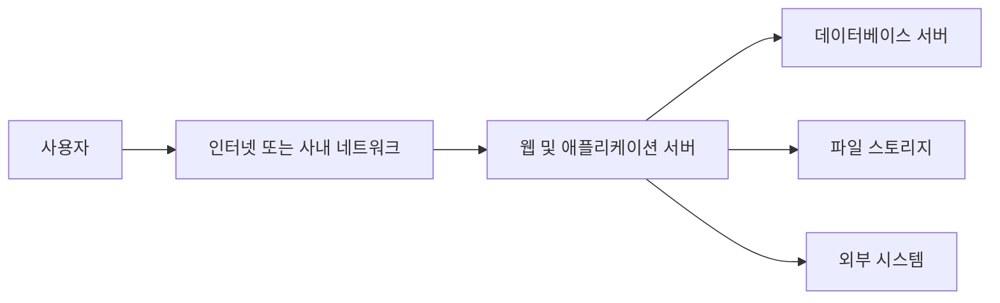
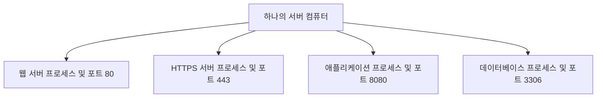
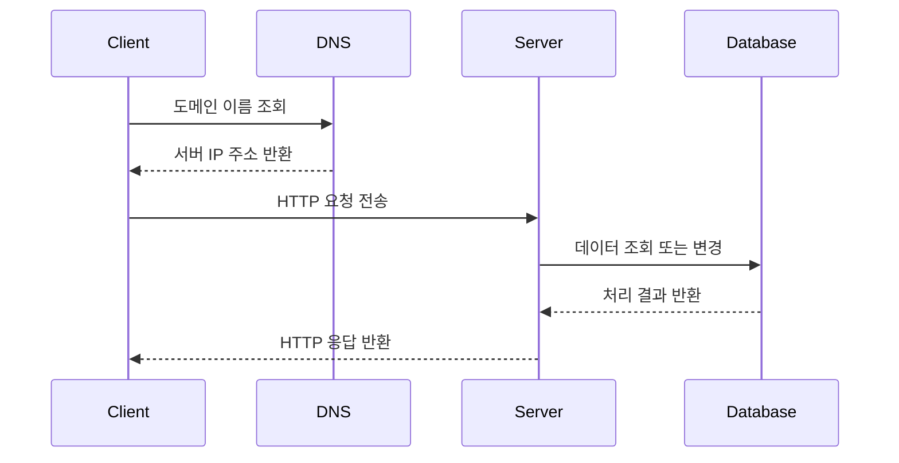
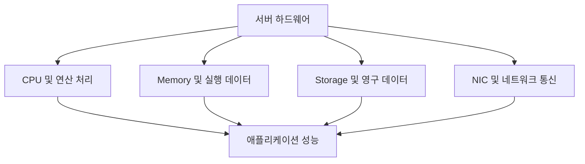
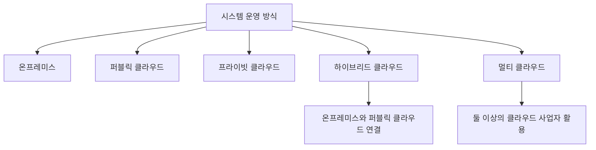
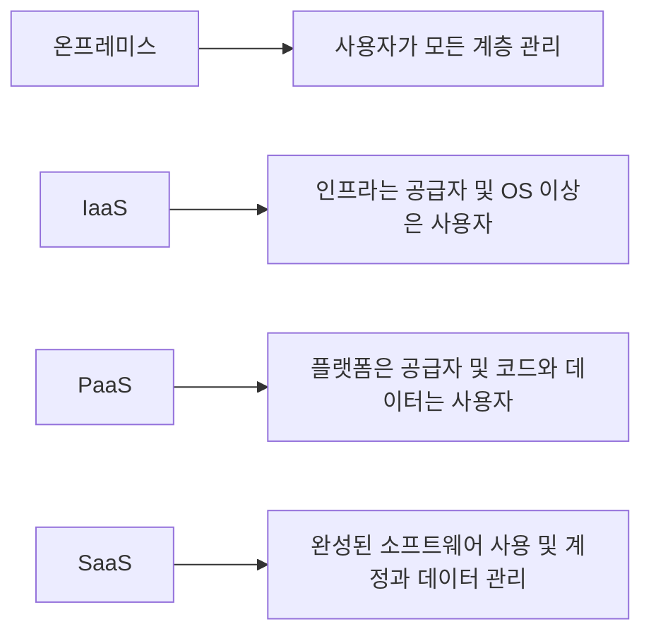
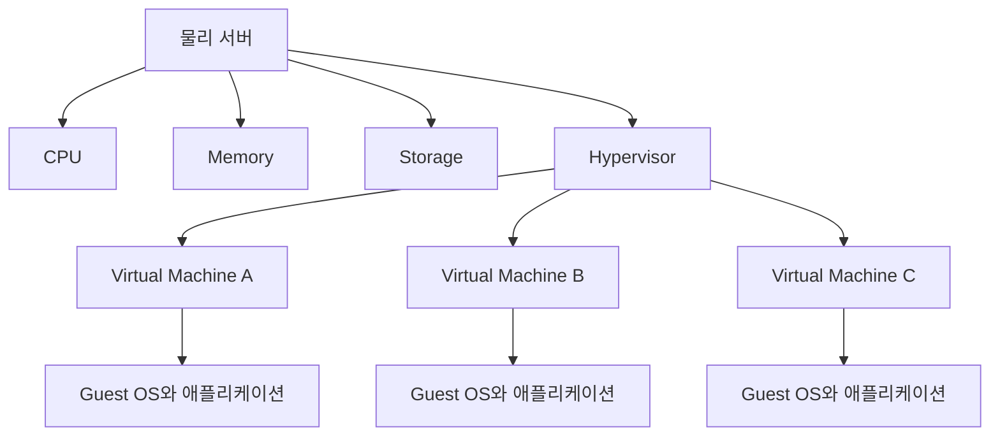
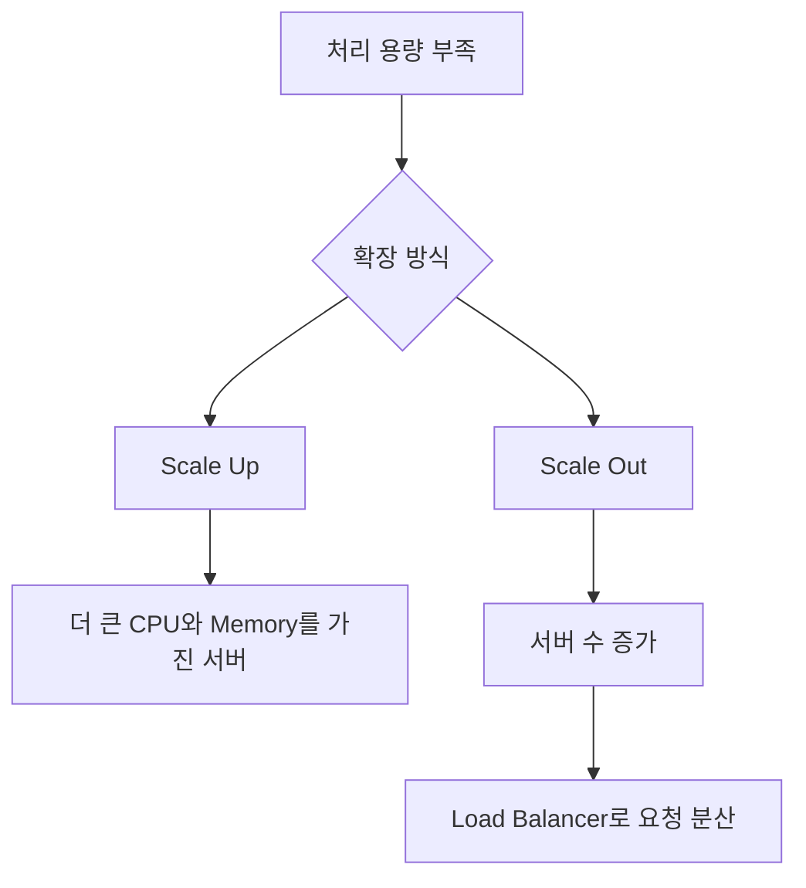
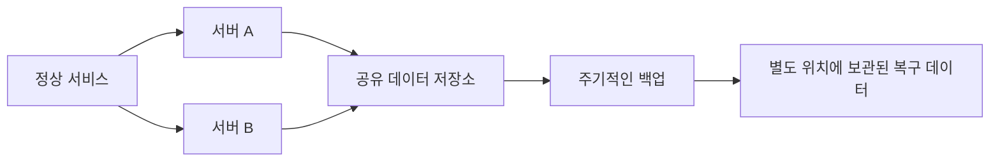

# 2장. AWS를 이해하기 위한 클라우드 환경의 구조

# 2장. AWS를 이해하기 위한 클라우드 환경의 구조
* toc
{:toc}

---

## AWS를 이해하기 위한 클라우드 환경의 구조

AWS의 개별 서비스를 이해하려면 먼저 그 서비스가 대신하고 있는 시스템 구성 요소를 알아야 한다. EC2는 컴퓨팅 자원을, VPC는 네트워크 공간을, RDS는 데이터베이스 운영 환경을 제공한다. 서버와 네트워크가 어떤 방식으로 동작하는지 모르면 각 서비스를 생성하는 방법은 배울 수 있어도 왜 그런 설정이 필요한지는 판단하기 어렵다.

클라우드는 기존 시스템과 전혀 다른 원리로 동작하는 별도의 세계가 아니다. 물리 서버, 네트워크, 스토리지 같은 실제 자원을 가상화하고, API를 통해 빠르게 할당할 수 있도록 만든 운영 모델에 가깝다. 따라서 AWS를 제대로 이해하려면 시스템의 기초 구조에서 출발해 가상화와 분산 처리까지 연결해서 살펴볼 필요가 있다.

### 시스템은 어떻게 구성되는가

일반적인 업무 시스템은 사용자 요청을 받는 애플리케이션, 데이터를 저장하는 데이터베이스, 이들을 연결하는 네트워크로 구성된다. 규모가 커지면 로드 밸런서, 캐시, 메시지 큐, 파일 스토리지, 모니터링 시스템 등이 추가되지만 기본적인 흐름은 크게 달라지지 않는다.

사용자가 웹 페이지를 열거나 API를 호출하면 요청은 네트워크를 거쳐 서버에 도착한다. 서버는 요청을 해석하고 필요한 비즈니스 로직을 수행한 뒤 데이터베이스나 다른 시스템에 접근한다. 처리 결과는 다시 네트워크를 통해 사용자에게 반환된다.

#### 시스템을 구성하는 주요 요소

| 구성 요소 | 역할 | AWS에서 대응하는 대표 서비스 |
|---|---|---|
| 컴퓨팅 | 애플리케이션과 작업 실행 | EC2, ECS, EKS, Lambda |
| 네트워크 | 자원 연결과 통신 경로 제어 | VPC, Subnet, Route Table |
| 트래픽 분산 | 여러 서버로 요청 분배 | Elastic Load Balancing |
| 스토리지 | 파일과 블록 데이터 저장 | S3, EBS, EFS |
| 데이터베이스 | 구조화된 데이터 저장과 조회 | RDS, Aurora, DynamoDB |
| 캐시 | 반복 조회 결과를 빠르게 제공 | ElastiCache |
| 메시징 | 시스템 사이의 비동기 작업 전달 | SQS, SNS, EventBridge |
| 모니터링 | 지표와 로그 수집 | CloudWatch |

AWS는 이러한 구성 요소를 서비스 형태로 제공한다. 하지만 서비스를 생성하는 것만으로 안정적인 시스템이 완성되는 것은 아니다. 각 요소의 역할, 연결 관계, 장애가 전파되는 범위를 함께 설계해야 한다.

### 네트워크의 기본 개념

네트워크는 여러 장치가 데이터를 주고받을 수 있도록 연결된 구조다. 서버, 개인 컴퓨터, 스마트폰 같은 장치는 네트워크 인터페이스를 통해 통신하며, IP 주소와 포트 번호를 이용해 목적지를 구분한다.

#### IP 주소와 포트 번호

IP 주소는 네트워크에서 장치를 식별하는 주소다. 하나의 장치에서는 여러 애플리케이션이 동시에 통신할 수 있으므로 포트 번호를 사용해 어떤 프로세스가 요청을 받을지 구분한다.

예를 들어 웹 서버가 `443` 포트에서 HTTPS 요청을 기다리고 있다면 클라이언트는 서버의 IP 주소와 `443` 포트를 목적지로 사용한다. 운영체제는 도착한 패킷의 포트 번호를 확인해 해당 웹 서버 프로세스로 전달한다.

IP 주소가 건물의 주소라면 포트 번호는 건물 안에서 요청을 받을 창구에 비유할 수 있다. 다만 실제 네트워크에서는 방화벽, NAT, 프록시, 로드 밸런서 같은 중간 장치가 주소와 통신 경로에 영향을 줄 수 있다.

#### 인터넷에 연결된다는 의미

장치가 인터넷에 연결되려면 단순히 케이블이나 무선 네트워크에 접속하는 것만으로는 충분하지 않다. 다음 정보와 구성 요소가 필요하다.

- 장치를 식별할 IP 주소
- 같은 네트워크 범위를 판단할 Subnet Mask 또는 CIDR
- 다른 네트워크로 패킷을 전달할 Default Gateway
- 도메인 이름을 IP 주소로 변환할 DNS 서버
- 목적지까지 패킷을 전달할 Router
- 허용된 통신만 통과시키는 Firewall 정책

AWS VPC에서도 같은 원리가 적용된다. VPC와 Subnet에 CIDR을 지정하고, Route Table로 패킷의 이동 경로를 설정한다. 외부 인터넷과 통신하려면 Internet Gateway 또는 NAT Gateway 같은 구성 요소가 추가로 필요하다.

#### DNS와 암호화 통신

사용자는 보통 IP 주소 대신 도메인 이름을 사용한다. DNS는 도메인 이름을 IP 주소로 변환한다. 이후 클라이언트는 해당 IP 주소로 연결하고, HTTPS를 사용한다면 TLS 협상을 거쳐 서버의 신원을 확인하고 통신 내용을 암호화한다.

DNS가 정상이라고 해서 실제 애플리케이션 연결까지 보장되는 것은 아니다. Route Table, Security Group, Network ACL, 서버 프로세스의 포트 상태 중 하나라도 잘못 설정되면 요청은 실패한다. 네트워크 장애를 분석할 때는 이름 해석, 경로, 접근 제어, 프로세스 상태를 단계별로 확인해야 한다.

### 서버의 기본 개념

서버는 클라이언트의 요청을 받아 기능이나 데이터를 제공하는 주체다. 문맥에 따라 서버용 컴퓨터를 의미하기도 하고, 그 컴퓨터에서 실행되는 서버 프로그램을 의미하기도 한다.

- **서버 하드웨어**는 CPU, Memory, Storage, NIC로 구성된 물리 장비다.
- **서버 운영체제**는 하드웨어 자원을 관리하고 프로그램 실행 환경을 제공한다.
- **서버 프로그램**은 HTTP, 데이터베이스, 파일 전송 같은 특정 요청을 처리한다.

따라서 "서버 한 대"라는 표현은 상황에 따라 물리 장비 한 대, Virtual Machine 한 대, Container 한 개, 서버 프로세스 하나를 가리킬 수 있다. 설계와 장애 분석에서는 어느 계층을 의미하는지 명확하게 구분해야 한다.

#### 한 컴퓨터에서 여러 서버를 실행할 수 있다

하나의 컴퓨터에는 여러 서버 프로그램이 동시에 실행될 수 있다. 각 프로그램이 서로 다른 포트를 사용하면 하나의 IP 주소에서도 여러 종류의 요청을 처리할 수 있다.

기술적으로 여러 서버 프로그램을 한 장비에 함께 실행할 수 있지만 운영 환경에서는 장애 범위와 보안 경계를 고려해야 한다. 웹 서버와 데이터베이스를 한 장비에 함께 배치하면 비용은 줄일 수 있지만, 장비 장애가 발생했을 때 두 기능이 동시에 중단된다. 자원 경합과 접근 권한 문제도 커진다.

#### 클라이언트와 서버의 동작 과정

클라이언트와 서버의 통신은 일반적으로 요청과 응답으로 이루어진다.

요청과 응답 사이에는 다양한 실패 지점이 존재한다. DNS 조회 실패, 연결 시간 초과, TLS 인증서 오류, 서버 내부 오류, 데이터베이스 연결 실패가 모두 사용자에게는 "서비스가 동작하지 않는다"는 현상으로 보일 수 있다. 어느 구간에서 실패했는지 확인할 수 있도록 로그, 지표, 추적 정보를 준비해야 한다.

#### 서버용 운영체제

서버용 운영체제는 여러 사용자의 요청을 안정적으로 처리하고 장기간 실행되는 서비스를 관리하는 데 초점을 둔다. Linux 계열 운영체제와 Windows Server가 대표적이다.

서버 환경에서는 GUI 없이 명령줄을 중심으로 운영하는 경우가 많다. 불필요한 프로그램을 줄이면 자원 사용량과 공격 표면을 줄일 수 있기 때문이다. 다만 운영체제를 설치했다고 해서 보안이 끝나는 것은 아니다. 보안 패치, 사용자 권한, 방화벽, 시간 동기화, 로그 보관 정책을 지속적으로 관리해야 한다.

EC2는 가상 서버를 제공하지만 Guest OS 내부 관리는 기본적으로 사용자 책임이다. 반면 Lambda나 관리형 데이터베이스는 운영체제와 런타임 관리의 상당 부분을 AWS가 담당한다. 서비스 형태에 따라 운영 책임이 달라진다는 점을 기억해야 한다.

### 서버 하드웨어의 구성

물리 서버와 Virtual Machine 모두 실제 하드웨어 자원을 사용한다. Virtual Machine에서 보이는 vCPU와 Memory도 결국 데이터센터에 설치된 물리 장비의 CPU와 Memory를 나누어 제공한 것이다.

#### CPU

CPU는 프로그램 명령을 실행한다. 코어 수가 많으면 여러 작업을 병렬로 처리하는 데 유리하지만, 모든 작업이 코어 수에 비례해 빨라지는 것은 아니다. 단일 스레드 작업, Lock 경합, I/O 대기 같은 요소가 성능을 제한할 수 있다.

클라우드의 vCPU는 일반적으로 물리 CPU의 실행 자원을 가상화한 단위다. vCPU 개수를 애플리케이션이 항상 독점하는 물리 코어 개수와 동일하게 해석해서는 안 된다.

#### Memory

Memory는 실행 중인 프로그램과 데이터를 임시로 저장한다. Memory가 부족하면 운영체제가 디스크를 보조 공간으로 사용하거나 프로세스를 종료할 수 있다. Java 애플리케이션에서는 JVM Heap뿐 아니라 Metaspace, Thread Stack, Native Memory까지 포함한 전체 프로세스 사용량을 고려해야 한다.

#### Storage

Storage는 운영체제, 애플리케이션과 데이터를 지속적으로 저장한다. 장치 유형과 연결 방식에 따라 처리량, IOPS, 지연 시간, 내구성이 달라진다.

EC2의 Instance Store는 인스턴스 수명과 연결된 임시 저장소이므로 영구 데이터 보관에 적합하지 않다. EBS는 EC2와 별도 수명 주기를 가질 수 있는 블록 스토리지이고, S3는 HTTP API를 통해 객체를 저장하는 서비스다. 모두 저장 공간이지만 사용 방식은 서로 다르다.

#### NIC와 네트워크 대역폭

NIC는 서버를 네트워크에 연결하는 장치다. 컴퓨팅 성능이 충분해도 네트워크 대역폭이 부족하면 요청 처리나 데이터 전송 속도가 제한된다. 인스턴스 유형을 선택할 때 CPU와 Memory뿐 아니라 네트워크 성능과 EBS 대역폭도 확인해야 한다.

성능 문제를 해결할 때 CPU 사용률 하나만 확인해서는 안 된다. Memory 부족, Disk I/O, Network 대역폭, 외부 API 응답 시간, 데이터베이스 Lock 등 여러 지표를 함께 살펴봐야 한다.

### 클라우드와 온프레미스

클라우드는 네트워크를 통해 컴퓨팅 자원을 필요할 때 제공받는 방식이다. 사용자는 물리 장비의 위치와 세부 운영을 직접 관리하지 않고 서비스 인터페이스를 통해 자원을 생성하고 변경한다.

온프레미스는 조직이 자체 시설이나 계약한 데이터센터에 장비를 설치하고 직접 운영하는 방식이다. 클라우드와 온프레미스는 어느 한쪽이 항상 우월한 관계가 아니다. 보안 요구, 규제, 지연 시간, 기존 시스템, 비용 구조, 운영 역량에 따라 선택이 달라진다.

| 구분 | 온프레미스 | 퍼블릭 클라우드 |
|---|---|---|
| 장비 소유 | 조직이 구매하거나 장기 임대 | 클라우드 사업자가 소유 |
| 도입 속도 | 구매와 설치 시간이 필요 | API를 통해 빠르게 생성 |
| 용량 계획 | 최대 사용량을 미리 예측 | 사용량에 따라 확장 가능 |
| 초기 비용 | 장비와 시설 비용이 큼 | 적은 규모로 시작 가능 |
| 운영 범위 | 하드웨어부터 직접 관리 | 서비스에 따라 책임 분담 |
| 통제 수준 | 높은 물리적 통제 가능 | 제공되는 서비스 범위 안에서 제어 |
| 비용 특성 | 고정비와 감가상각 중심 | 사용량에 따른 변동비 중심 |

#### 클라우드라고 해서 비용이 항상 저렴한 것은 아니다

짧은 기간에 사용량이 크게 변하거나 빠른 확장이 필요한 서비스는 클라우드의 장점을 얻기 쉽다. 반대로 사용량이 매우 안정적이고 장기간 높은 가동률을 유지하는 대규모 시스템은 직접 운영하거나 약정 요금을 사용하는 편이 경제적일 수 있다.

비용을 비교할 때는 서버 가격만 보지 말고 시설, 전력, 네트워크, 장비 교체, 백업, 보안, 운영 인력과 장애 대응 비용을 함께 계산해야 한다. 클라우드에서도 유휴 자원, 데이터 전송, NAT Gateway, 로그, 스냅샷 같은 비용을 관리하지 않으면 지출이 커질 수 있다.

#### 퍼블릭 클라우드

퍼블릭 클라우드는 AWS와 같은 사업자가 보유한 인프라를 여러 고객에게 서비스 형태로 제공하는 방식이다. 여러 고객이 기반 시설을 공유하지만 계정, 네트워크와 가상화 기술을 통해 논리적으로 격리된다.

인프라를 공유한다는 사실이 모든 고객의 데이터와 네트워크가 섞인다는 뜻은 아니다. 다만 사용자는 IAM, 네트워크 정책, 암호화 설정을 올바르게 구성해야 한다.

#### 프라이빗 클라우드

프라이빗 클라우드는 특정 조직만을 위해 구성한 클라우드 환경이다. 조직 내부 데이터센터에 구축하거나 외부 사업자의 전용 환경을 사용할 수 있다. 높은 통제력과 내부 정책 적용이 장점이지만 구축과 운영 부담도 조직이 감당해야 한다.

#### 하이브리드 클라우드와 멀티 클라우드

하이브리드 클라우드는 온프레미스와 퍼블릭 클라우드를 연결해 함께 사용하는 구조다. 기존 핵심 시스템은 온프레미스에 유지하고 확장이 필요한 서비스나 분석 환경을 클라우드에 배치할 수 있다.

멀티 클라우드는 둘 이상의 퍼블릭 클라우드 사업자를 함께 사용하는 전략이다. 특정 사업자에 대한 의존을 줄이거나 각 사업자의 강점을 활용할 수 있지만, 네트워크와 권한 관리, 모니터링, 인력 교육이 복잡해진다.

복잡한 구성을 선택할 때는 분명한 이유가 있어야 한다. 사업자 장애 가능성을 줄이기 위해 멀티 클라우드를 선택했지만 애플리케이션과 데이터베이스가 한 사업자에만 의존한다면 기대한 복원력을 얻지 못할 수 있다.

### SaaS, PaaS, IaaS의 차이

클라우드 서비스는 공급자와 사용자가 어느 계층까지 관리하는지에 따라 IaaS, PaaS, SaaS로 구분할 수 있다.

#### IaaS

Infrastructure as a Service는 Virtual Machine, Storage, Network 같은 인프라 자원을 제공한다. 사용자는 운영체제 위에 필요한 미들웨어와 애플리케이션을 설치한다.

EC2가 대표적인 예다. AWS가 물리 서버와 가상화 계층을 관리하지만 Guest OS의 보안 패치, 웹 서버 설정, 애플리케이션 배포는 사용자가 담당한다. 자유도가 높은 대신 운영 범위도 넓다.

#### PaaS

Platform as a Service는 애플리케이션 실행에 필요한 운영체제, 런타임, 미들웨어의 상당 부분을 플랫폼이 관리한다. 사용자는 애플리케이션 코드와 데이터에 집중할 수 있다.

관리형 데이터베이스나 애플리케이션 배포 플랫폼도 넓은 의미에서 PaaS 성격을 가진다. 운영 부담은 줄어들지만 지원되는 버전과 설정 범위 안에서 사용해야 하므로 IaaS보다 자유도가 낮을 수 있다.

#### SaaS

Software as a Service는 완성된 소프트웨어를 인터넷을 통해 제공한다. 사용자는 계정과 데이터를 관리하고 기능을 이용한다. 메일, 협업 도구, 고객 관리 시스템처럼 애플리케이션 자체를 구독하는 형태가 대표적이다.

#### 관리 책임 비교

| 관리 영역 | 온프레미스 | IaaS | PaaS | SaaS |
|---|---|---|---|---|
| 애플리케이션 데이터 | 사용자 | 사용자 | 사용자 | 사용자 중심 |
| 애플리케이션 코드 | 사용자 | 사용자 | 사용자 | 공급자 |
| 런타임과 미들웨어 | 사용자 | 사용자 | 공급자 | 공급자 |
| 운영체제 | 사용자 | 사용자 | 공급자 | 공급자 |
| 가상화 계층 | 사용자 | 공급자 | 공급자 | 공급자 |
| 서버와 스토리지 | 사용자 | 공급자 | 공급자 | 공급자 |
| 데이터센터와 물리 네트워크 | 사용자 | 공급자 | 공급자 | 공급자 |

서비스 수준이 높아질수록 사용자가 직접 관리할 영역은 줄어든다. 대신 세부 설정의 자유도와 이식성이 제한될 수 있다. 어떤 방식이 더 좋다고 단정하기보다 조직의 운영 인력과 서비스 요구에 맞춰 선택해야 한다.

### 가상화의 동작 원리

가상화는 하나의 물리 자원을 여러 개의 논리적 자원처럼 사용할 수 있도록 추상화하는 기술이다. 클라우드 사업자는 대규모 물리 서버를 가상화해 사용자에게 Virtual Machine 형태로 제공한다.

Hypervisor는 물리 하드웨어 자원을 Virtual Machine에 할당하고 서로 격리한다. 각 Virtual Machine은 독립된 Guest OS를 실행하므로 사용자는 별도의 컴퓨터처럼 사용할 수 있다.

#### 가상화의 장점

- 하나의 물리 서버를 여러 워크로드가 효율적으로 나눠 사용할 수 있다.
- 서로 다른 운영체제와 실행 환경을 격리할 수 있다.
- Virtual Machine 생성과 삭제를 자동화할 수 있다.
- 물리 장비보다 자원 용량을 빠르게 변경할 수 있다.
- 장애가 발생한 Virtual Machine을 다른 물리 장비에서 다시 생성할 수 있다.

#### 가상화가 물리 자원을 없애는 것은 아니다

가상 서버도 실제 CPU, Memory, Storage와 Network를 사용한다. 물리 장비의 장애나 자원 부족은 가상 환경에도 영향을 줄 수 있다. 클라우드 사업자가 물리 계층을 관리하더라도 사용자는 인스턴스 장애를 전제로 애플리케이션을 설계해야 한다.

EC2 한 대를 장기간 유지하면서 그 인스턴스가 절대 중단되지 않을 것이라고 가정하면 클라우드의 장점을 충분히 활용하기 어렵다. 필요한 상태는 외부 Storage나 Database에 저장하고, 동일한 서버를 다시 생성할 수 있도록 이미지와 배포 설정을 관리하는 편이 좋다.

#### Virtual Machine과 Container

Virtual Machine은 각각 Guest OS를 포함한다. Container는 호스트 운영체제의 Kernel을 공유하면서 프로세스를 격리한다. 따라서 Container는 일반적으로 시작이 빠르고 자원 사용량이 적지만, Virtual Machine과 동일한 격리 경계를 제공한다고 단정해서는 안 된다.

| 구분 | Virtual Machine | Container |
|---|---|---|
| 운영체제 | 각 VM이 Guest OS 포함 | Host Kernel 공유 |
| 시작 속도 | 상대적으로 느림 | 상대적으로 빠름 |
| 이미지 크기 | 운영체제를 포함해 큼 | 애플리케이션 실행 파일 중심 |
| 격리 단위 | 가상 하드웨어와 Guest OS | 운영체제 프로세스 |
| 대표 AWS 서비스 | EC2 | ECS, EKS, Fargate |

### 분산 처리와 확장

분산 처리는 하나의 작업을 여러 컴퓨터나 프로세스가 나누어 처리하는 방식이다. 트래픽과 데이터가 증가하면 단일 서버의 성능만 높이는 데 한계가 생기므로 여러 서버를 함께 사용하는 구조가 필요해진다.

#### Scale Up과 Scale Out

- **Scale Up**은 서버의 CPU와 Memory 사양을 높이는 방식이다.
- **Scale Down**은 서버의 사양을 낮추는 방식이다.
- **Scale Out**은 같은 역할의 서버 수를 늘리는 방식이다.
- **Scale In**은 서버 수를 줄이는 방식이다.

Scale Up은 구조가 단순하지만 장비가 제공할 수 있는 최대 사양에 한계가 있다. 높은 사양의 장비는 가격이 급격히 증가할 수 있으며 서버 한 대에 대한 의존도도 커진다.

Scale Out은 수평 확장에 유리하지만 애플리케이션이 여러 서버에서 동작할 수 있도록 설계되어야 한다. 특정 서버의 Memory나 로컬 Disk에 사용자 Session과 파일을 저장하면 요청이 다른 서버로 전달될 때 문제가 발생한다.

#### Scale Out을 위한 애플리케이션 설계

여러 서버가 같은 역할을 수행하려면 서버를 가능한 한 Stateless하게 구성하는 것이 좋다.

- Session은 Redis나 Database 같은 공용 저장소에 둔다.
- 사용자 업로드 파일은 S3와 같은 외부 Storage에 저장한다.
- 서버별 설정 차이를 없애고 동일한 이미지로 배포한다.
- 중복 요청이 발생해도 문제가 없도록 중요한 작업을 멱등하게 설계한다.
- 여러 서버가 동시에 데이터를 변경할 때 발생하는 동시성 문제를 처리한다.

Load Balancer는 요청을 여러 서버에 분산하지만 애플리케이션 내부의 상태 문제까지 해결하지는 않는다. 분산 환경에서는 네트워크 지연, 부분 실패, 중복 처리와 데이터 일관성을 함께 고려해야 한다.

### 이중화와 백업의 차이

이중화와 백업은 모두 장애에 대비하기 위한 수단이지만 목적이 다르다.

- **이중화**는 일부 구성 요소에 장애가 발생해도 서비스를 계속 제공하기 위한 구조다.
- **백업**은 데이터가 손상되거나 삭제되었을 때 과거 시점의 상태로 복구하기 위한 복사본이다.

서버를 두 대 운영하더라도 잘못된 데이터가 양쪽에 복제되면 과거 상태로 돌아갈 수 없다. 반대로 백업 파일이 있어도 복원하는 동안 서비스가 중단될 수 있다. 따라서 고가용성이 필요한 시스템은 이중화와 백업을 함께 준비해야 한다.

#### 이중화 설계에서 확인할 사항

- 서버를 서로 다른 Availability Zone에 배치했는가?
- Load Balancer가 비정상 서버를 감지하고 제외할 수 있는가?
- 데이터베이스 장애 시 전환할 Standby가 있는가?
- 특정 Region 전체에 장애가 발생했을 때도 복구해야 하는가?
- 장애 전환이 자동인지 수동인지 명확한가?
- 전환 과정에서 데이터 손실 가능성이 있는가?

#### 백업 설계에서 확인할 사항

- 무엇을 얼마나 자주 백업할 것인가?
- 백업 보존 기간은 얼마인가?
- 운영 데이터와 다른 계정이나 위치에 보관하는가?
- 암호화 Key를 잃어도 복구할 수 있는가?
- 실제 복원 테스트를 수행했는가?
- 목표 복구 시간인 RTO와 허용 가능한 데이터 손실 범위인 RPO가 정의되어 있는가?

백업 작업이 성공했다는 로그만으로 복구 가능성이 증명되지는 않는다. 정기적으로 별도 환경에 복원하고 애플리케이션이 정상적으로 데이터를 사용할 수 있는지 확인해야 한다.

## 정리

AWS는 기존 서버와 네트워크의 원리를 없애는 기술이 아니다. 물리 인프라를 가상화하고 API를 통해 빠르게 사용할 수 있도록 제공하는 클라우드 플랫폼이다. 따라서 AWS 서비스를 올바르게 선택하고 연결하려면 시스템을 구성하는 기본 요소와 각 계층의 책임을 이해해야 한다.

이번 장에서 살펴본 핵심 내용을 정리하면 다음과 같다.

- 시스템은 컴퓨팅, 네트워크, Storage, Database와 같은 구성 요소의 조합으로 이루어진다.
- IP 주소는 통신할 장치를, 포트 번호는 장치 안에서 요청을 받을 프로세스를 구분한다.
- 서버는 물리 장비뿐 아니라 요청을 처리하는 프로그램을 의미할 수도 있다.
- Virtual Machine의 CPU, Memory와 Storage도 실제 물리 자원을 기반으로 한다.
- 온프레미스와 클라우드는 비용, 통제 범위, 확장 속도와 운영 책임에서 차이가 있다.
- IaaS, PaaS, SaaS는 공급자가 관리하는 계층의 범위에 따라 구분된다.
- 가상화는 물리 자원을 여러 논리적 자원으로 나누지만 물리 장비 자체를 없애지는 않는다.
- Scale Out을 적용하려면 애플리케이션의 상태를 외부로 분리하고 분산 환경의 실패를 고려해야 한다.
- 이중화는 서비스 연속성을 위한 구조이고, 백업은 손실된 데이터를 복구하기 위한 수단이다.

이 구조를 이해하면 이후 VPC, EC2, Elastic Load Balancing, Auto Scaling 같은 AWS 서비스를 배울 때 각각이 시스템의 어느 부분을 담당하며 어떤 문제를 해결하는지 자연스럽게 연결할 수 있다.
