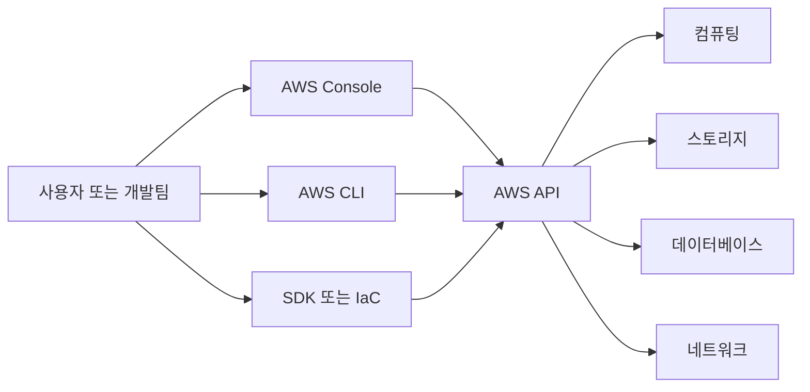
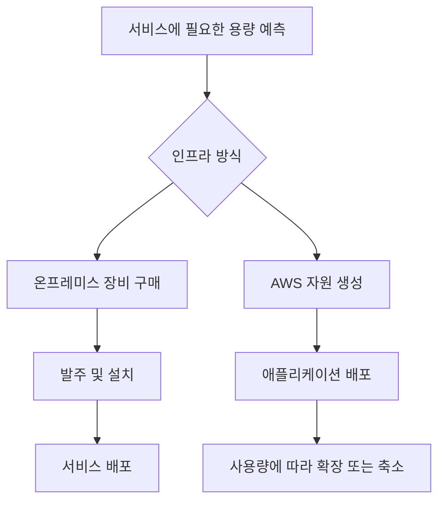
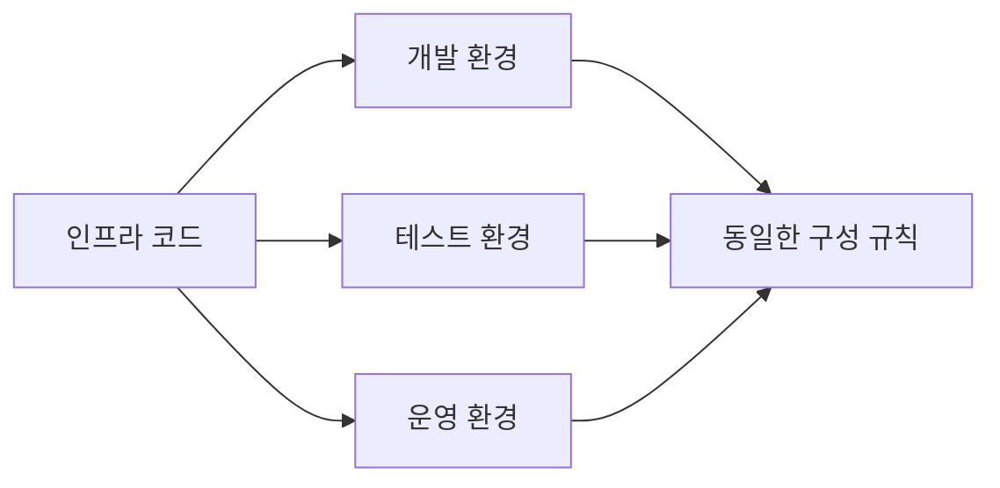
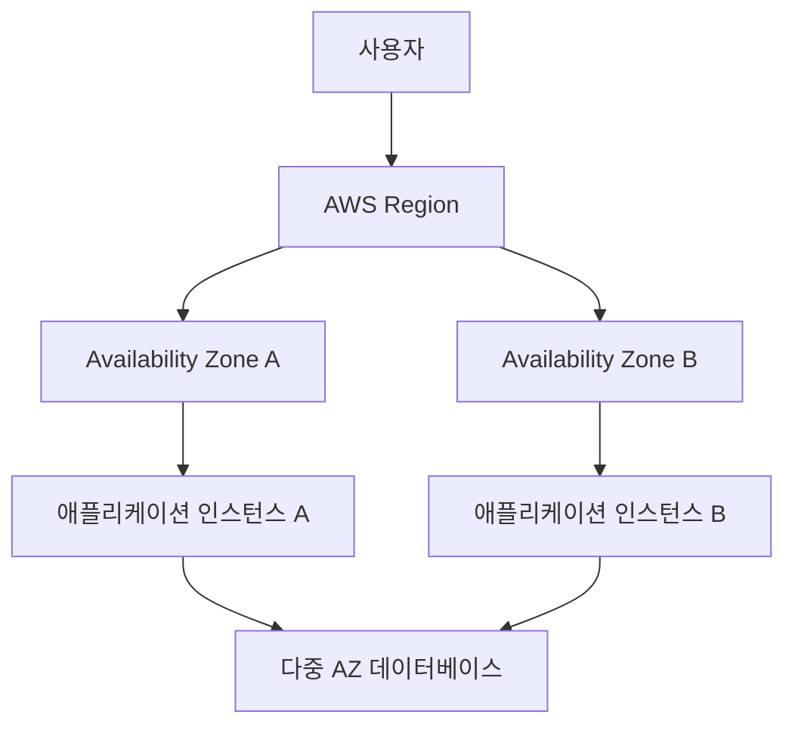
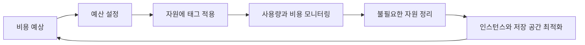
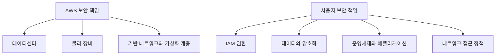
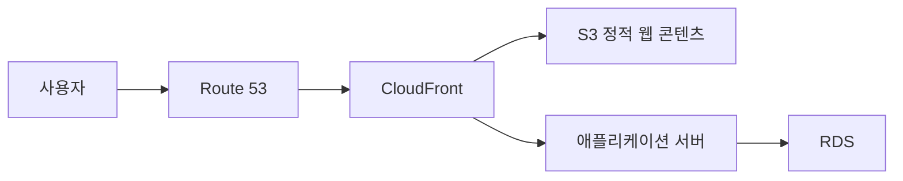
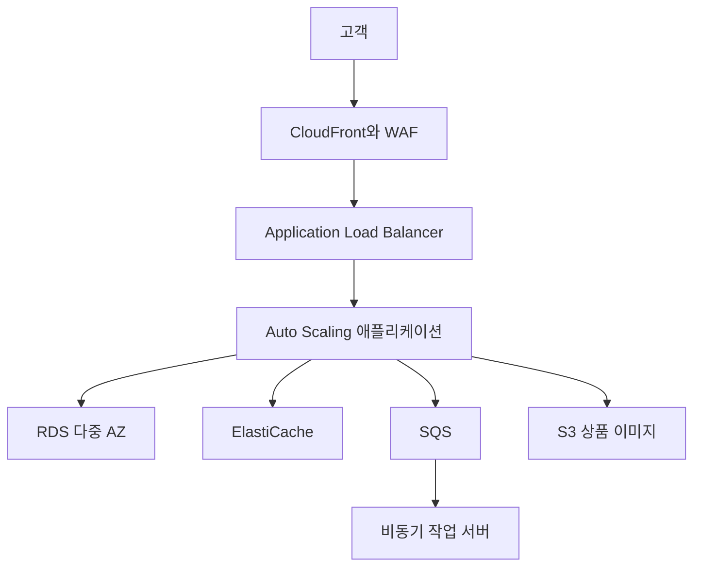
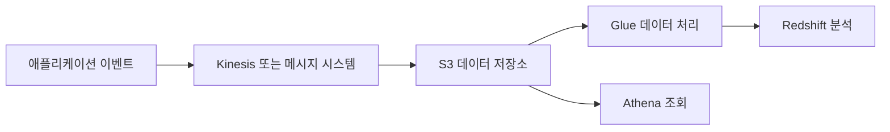

# 1장. 아마존 웹 서비스 기초 지식

# 1장. 아마존 웹 서비스 기초 지식
* toc
{:toc}

---

## AWS를 이해하기 위한 기초 지식

AWS를 처음 접하면 EC2, S3, RDS와 같은 개별 서비스부터 살펴보는 경우가 많다. 하지만 서비스 이름을 외우는 것보다 먼저 이해해야 할 것은 AWS가 인프라를 준비하고 운영하는 방식을 어떻게 바꾸는가이다.

기존에는 서버, 네트워크 장비, 스토리지를 직접 구매하고 데이터센터에 설치해야 했다. AWS에서는 이러한 자원을 인터넷을 통해 필요한 시점에 생성하고 사용량에 따라 비용을 지불한다. 서버 한 대를 빌리는 수준을 넘어 데이터베이스, 메시지 큐, 모니터링, 보안, 인공지능 같은 기능까지 서비스 형태로 사용할 수 있다.

### AWS란 무엇인가

AWS는 Amazon이 제공하는 클라우드 컴퓨팅 플랫폼이다. 사용자는 물리적인 장비를 직접 구매하지 않고도 컴퓨팅, 스토리지, 데이터베이스, 네트워크 등의 자원을 생성할 수 있다.

AWS Management Console은 웹 화면을 통한 관리 도구이고, AWS CLI와 SDK는 명령어나 프로그램을 통해 AWS를 제어하는 수단이다. Terraform이나 AWS CloudFormation 같은 Infrastructure as Code 도구를 사용하면 인프라 구성을 코드로 관리할 수도 있다.

#### 온프레미스와 클라우드의 차이

온프레미스는 조직이 서버와 네트워크 장비를 직접 소유하고 운영하는 방식이다. 클라우드는 사업자가 보유한 인프라를 필요한 만큼 빌려 사용하는 방식이다.

| 구분 | 온프레미스 | AWS |
|---|---|---|
| 자원 확보 | 장비 구매와 설치 필요 | API를 통해 빠르게 생성 |
| 초기 비용 | 장비 구매 비용이 큼 | 비교적 적은 비용으로 시작 가능 |
| 용량 변경 | 장비 증설 필요 | 인스턴스 변경 또는 확장 가능 |
| 운영 책임 | 하드웨어부터 애플리케이션까지 직접 관리 | 서비스에 따라 AWS와 책임을 분담 |
| 비용 구조 | 자본 지출 중심 | 사용량 기반 운영비 중심 |
| 글로벌 확장 | 별도 데이터센터와 회선 필요 | 다른 Region에 자원 생성 가능 |
| 자원 반납 | 구매한 장비 처분 필요 | 사용하지 않는 자원 삭제 가능 |

클라우드의 핵심은 단순히 외부 서버를 빌리는 것이 아니다. 인프라가 API로 제어 가능한 자원이 된다는 데 더 큰 의미가 있다. 필요한 서버와 네트워크를 코드로 정의하고 반복해서 생성할 수 있기 때문이다.

### AWS를 사용하는 이유

#### 빠른 자원 준비

물리적인 서버를 구매하려면 견적, 발주, 배송, 설치, 네트워크 연결 등의 과정이 필요하다. 필요한 용량을 잘못 예상하면 서버가 부족하거나 사용하지 않는 장비가 남을 수도 있다.

AWS에서는 몇 분 안에 새로운 컴퓨팅 자원을 생성할 수 있다. 트래픽이 증가하면 자원을 확장하고, 사용량이 줄면 다시 축소할 수 있다.

다만 AWS를 사용한다고 해서 모든 자원이 자동으로 확장되는 것은 아니다. Auto Scaling, 로드 밸런서, 모니터링 지표와 같은 구성을 별도로 설계해야 한다.

#### 다양한 서비스의 조합

AWS에서는 가상 서버뿐 아니라 다양한 관리형 서비스를 제공한다. 애플리케이션의 성격에 맞게 필요한 서비스를 선택하고 조합할 수 있다는 점이 큰 장점이다.

예를 들어 파일을 저장해야 한다고 해서 반드시 EC2에 파일 서버를 구축할 필요는 없다. Amazon S3와 같은 객체 스토리지를 사용할 수 있다. 관계형 데이터베이스가 필요하면 Amazon RDS를 사용하고, 이벤트 기반 작업에는 AWS Lambda와 Amazon SQS를 조합할 수 있다.

선택지가 많다는 것은 장점이지만, 동시에 학습해야 할 개념과 설계 결정도 많다는 뜻이다. 비슷해 보이는 서비스라도 비용 구조, 확장 방식, 데이터 일관성, 장애 복구 특성이 다르므로 서비스 이름만 보고 선택해서는 안 된다.

#### 다양한 서비스 제공 방식

클라우드 서비스는 사용자가 어디까지 관리하느냐에 따라 구분할 수 있다.

| 모델 | 사용자가 관리하는 영역 | 대표적인 사용 형태 | 특징 |
|---|---|---|---|
| IaaS | OS, 미들웨어, 애플리케이션 | Amazon EC2 | 자유도가 높지만 운영 범위가 넓음 |
| PaaS | 애플리케이션과 일부 설정 | AWS Elastic Beanstalk, 관리형 데이터베이스 | 인프라 관리 부담을 줄일 수 있음 |
| 컨테이너 | 이미지, 배포 설정, 애플리케이션 | Amazon ECS, Amazon EKS | 실행 환경을 표준화하기 좋음 |
| Serverless | 함수 또는 애플리케이션 코드 | AWS Lambda | 서버 프로비저닝 없이 이벤트 기반 실행 |
| SaaS | 서비스 사용과 데이터 관리 | 외부 완성형 소프트웨어 | 인프라와 애플리케이션 운영을 공급자가 담당 |

관리형 서비스와 Serverless를 사용하면 운영 부담을 줄일 수 있지만 운영 책임이 완전히 사라지는 것은 아니다. 데이터 모델, 접근 권한, 백업 정책, 장애 대응, 비용 관리, 애플리케이션 오류는 여전히 사용자가 관리해야 한다.

#### 반복 가능한 인프라 구성

AWS 자원은 Console뿐 아니라 API와 코드로 생성할 수 있다. 개발 환경, 테스트 환경, 운영 환경에 동일한 구성을 반복해서 적용하는 데 유리하다.

수동으로 자원을 생성하면 담당자마다 설정이 달라질 수 있다. Infrastructure as Code를 사용하면 변경 내용을 코드 리뷰와 버전 관리 대상으로 만들 수 있어 실수를 줄이고 복구 절차를 표준화할 수 있다.

#### 글로벌 인프라와 고가용성

AWS 인프라를 이해할 때는 Region과 Availability Zone을 구분해야 한다.

- **Region**은 AWS 데이터센터가 운영되는 지리적인 영역이다.
- **Availability Zone**은 하나의 Region 안에서 물리적으로 분리된 데이터센터 그룹이다.
- **Edge Location**은 CloudFront와 같은 서비스가 사용자 가까이에서 콘텐츠를 전달하는 데 사용된다.

여러 Availability Zone에 애플리케이션을 분산하면 하나의 데이터센터에 장애가 발생했을 때 서비스 전체가 중단될 가능성을 줄일 수 있다.

하지만 AWS에 자원을 생성했다고 해서 자동으로 고가용성이 확보되는 것은 아니다. 단일 Availability Zone에 EC2와 데이터베이스를 모두 배치하면 해당 영역의 장애에 취약하다. 로드 밸런서, 다중 AZ 배포, 백업, 복구 절차까지 함께 설계해야 한다.

### AWS의 주요 서비스

AWS에는 수많은 서비스가 있으므로 처음부터 모든 서비스를 공부할 필요는 없다. 먼저 역할별로 분류하고, 애플리케이션에 필요한 영역부터 접근하는 편이 좋다.

| 분류 | 대표 서비스 | 주요 역할 |
|---|---|---|
| 컴퓨팅 | EC2, Lambda | 애플리케이션과 작업 실행 |
| 컨테이너 | ECS, EKS, ECR | 컨테이너 실행과 이미지 보관 |
| 스토리지 | S3, EBS, EFS | 객체, 블록, 공유 파일 저장 |
| 데이터베이스 | RDS, DynamoDB, ElastiCache | 관계형 데이터, NoSQL, 캐시 관리 |
| 네트워크 | VPC, Elastic Load Balancing, Route 53 | 네트워크 격리, 트래픽 분산, DNS |
| 콘텐츠 전송 | CloudFront | 정적 콘텐츠와 미디어를 사용자 가까이에서 전달 |
| 메시징 | SQS, SNS, EventBridge | 비동기 메시지와 이벤트 전달 |
| 모니터링 | CloudWatch, CloudTrail | 지표, 로그, 감사 기록 관리 |
| 보안 | IAM, KMS, WAF, Secrets Manager | 권한, 암호화, 웹 보호, 비밀 정보 관리 |
| 분석 | Athena, Glue, Redshift, Kinesis | 데이터 수집, 변환, 조회와 분석 |
| 인공지능 | Bedrock, SageMaker | 생성형 AI와 머신러닝 모델 활용 |

#### 컴퓨팅 서비스 선택 기준

동일한 애플리케이션이라도 실행 방식에 따라 서비스 선택이 달라진다.

- OS와 실행 환경을 세밀하게 제어해야 한다면 EC2가 적합하다.
- 컨테이너 기반으로 배포하려면 ECS 또는 EKS를 고려할 수 있다.
- 짧은 이벤트 처리나 간헐적인 작업이라면 Lambda가 적합할 수 있다.
- 단순한 웹 애플리케이션이라면 더 높은 수준의 관리형 플랫폼이 운영에 유리할 수 있다.

중요한 것은 익숙한 서비스를 무조건 선택하지 않는 것이다. 실행 시간, 요청량, 운영 인력, 장애 대응 방식, 비용 예측 가능성을 함께 비교해야 한다.

#### 스토리지 서비스 선택 기준

AWS의 스토리지는 저장 방식에 따라 성격이 다르다.

- **Amazon S3**는 이미지, 동영상, 백업 파일과 같은 객체 저장에 적합하다.
- **Amazon EBS**는 EC2에 연결해서 사용하는 블록 스토리지다.
- **Amazon EFS**는 여러 컴퓨팅 자원에서 공유할 수 있는 파일 시스템이다.

S3는 일반적인 서버 파일 시스템과 동일하지 않다. 디렉터리처럼 보이는 키 구조를 사용하지만 본질적으로 객체 스토리지이므로 파일 잠금이나 임의 위치 수정 같은 동작을 동일하게 기대해서는 안 된다.

### AWS 비용의 특징

AWS의 대표적인 비용 구조는 사용한 만큼 비용을 지불하는 종량제 방식이다. 초기 장비 구매 비용 없이 시작할 수 있고, 필요 없어진 자원을 반납할 수 있다는 장점이 있다.

그러나 종량제라고 해서 항상 온프레미스보다 저렴한 것은 아니다. 불필요한 자원을 계속 실행하거나 데이터 전송 구조를 잘못 설계하면 예상보다 많은 비용이 발생할 수 있다.

#### 비용을 만드는 주요 요소

AWS 비용은 단순히 서버 실행 시간만으로 결정되지 않는다.

- EC2와 같은 컴퓨팅 자원의 실행 시간
- 데이터베이스 인스턴스의 사양과 저장 공간
- EBS, S3, 스냅샷에 저장된 데이터 용량
- 인터넷 및 Region 간 데이터 전송량
- NAT Gateway를 통과하는 데이터 처리량
- 로드 밸런서와 공인 IPv4 주소 사용량
- CloudWatch 로그 저장량과 조회량
- 백업 보관 기간
- API 요청 횟수
- 유료 기술 지원 등급

삭제한 EC2에 연결되어 있던 EBS 볼륨이나 오래된 스냅샷이 남아 비용이 계속 청구되는 경우도 있다. 로그를 무기한 보관하도록 설정하면 시간이 지날수록 저장 비용이 증가한다.

#### 종량제의 장점과 주의사항

| 관점 | 장점 | 주의사항 |
|---|---|---|
| 초기 비용 | 장비 구매 없이 시작 가능 | 비용 관리 체계 없이 시작하기 쉬움 |
| 확장 | 필요한 시점에 자원 추가 가능 | 확장 후 축소하지 않으면 비용 증가 |
| 실험 | 단기간 테스트 환경 구성 가능 | 종료하지 않은 실습 자원이 계속 과금될 수 있음 |
| 운영 | 관리형 서비스로 인력 부담 감소 | 관리형 서비스 단가가 더 높을 수 있음 |
| 글로벌 배포 | 다른 Region으로 확장하기 쉬움 | Region 간 데이터 전송과 복제 비용 발생 |

#### 비용 관리 흐름

비용은 월말에 청구서를 확인하는 것만으로 관리하기 어렵다. 설계 단계부터 예산과 알림, 태그 정책을 준비해야 한다.

AWS Cost Explorer는 비용 추이를 분석하는 데 사용할 수 있고, AWS Budgets는 예산 임계값에 대한 알림을 설정하는 데 활용할 수 있다. 프로젝트, 환경, 팀, 서비스 단위로 태그를 적용하면 어떤 자원이 비용을 발생시키는지 구분하기 쉬워진다.

무료 이용 한도는 학습에 유용하지만 무제한 무료를 의미하지 않는다. 대상 서비스, 기간, 계정 조건, 제공량은 달라질 수 있으며 한도를 초과하면 비용이 발생할 수 있다. 실습을 마친 뒤에는 EC2뿐 아니라 RDS, 로드 밸런서, NAT Gateway, EBS, 스냅샷과 공인 IP까지 확인해야 한다.

### AWS를 제어하는 방법

AWS는 동일한 작업을 여러 방식으로 수행할 수 있다.

#### AWS Management Console

웹 브라우저에서 AWS 자원을 생성하고 상태를 확인하는 관리 화면이다. 서비스의 구조를 처음 익힐 때 편리하지만, 반복 작업을 수동으로 수행하면 설정 누락과 환경 간 차이가 발생하기 쉽다.

#### AWS CLI

터미널 명령어로 AWS 자원을 제어한다. 반복 작업을 스크립트로 만들거나 운영 자동화에 연결하기 좋다. 다만 자격 증명을 코드나 셸 기록에 남기지 않도록 주의해야 한다.

#### AWS SDK

Java, JavaScript, Python 등의 애플리케이션 코드에서 AWS API를 호출할 수 있다. S3 파일 업로드, SQS 메시지 발행, Secrets Manager 조회 같은 기능을 애플리케이션에 통합할 때 사용한다.

#### Infrastructure as Code

AWS CloudFormation, AWS CDK, Terraform 같은 도구로 인프라를 코드화할 수 있다. 운영 환경에서는 Console을 통한 수동 변경보다 코드 기반 변경을 중심으로 관리하는 것이 재현성과 감사 측면에서 유리하다.

### AWS 보안과 책임 범위

AWS의 보안은 AWS가 모든 것을 대신 보호한다는 의미가 아니다. AWS와 사용자가 서로 다른 영역을 담당하는 공유 책임 모델로 이해해야 한다.

관리 범위는 사용하는 서비스에 따라 달라진다. EC2를 사용하면 사용자가 운영체제 업데이트와 애플리케이션 보안을 관리해야 한다. Lambda나 RDS 같은 관리형 서비스를 사용하면 하위 인프라 관리 범위는 줄어들지만 접근 권한, 데이터 보호, 네트워크 설정은 여전히 사용자의 책임이다.

#### 기본 보안 수칙

- 루트 사용자는 일상적인 관리 작업에 사용하지 않는다.
- 루트 사용자와 주요 IAM 사용자에 다중 인증을 적용한다.
- IAM 권한은 필요한 작업만 허용하는 최소 권한 원칙으로 구성한다.
- 애플리케이션에 Access Key를 직접 저장하지 않는다.
- EC2, ECS, EKS, Lambda에는 IAM Role을 사용한다.
- 데이터베이스와 내부 서비스는 가능한 한 Private Subnet에 배치한다.
- Security Group에서 불필요한 포트를 외부에 공개하지 않는다.
- 중요한 데이터는 저장 및 전송 과정에서 암호화한다.
- CloudTrail을 통해 관리 API 호출 기록을 남긴다.
- 백업이 존재하는 것뿐 아니라 실제 복원 가능 여부도 확인한다.

AWS가 높은 수준의 물리 보안과 기반 시설을 제공하더라도 사용자가 데이터베이스를 외부에 공개하거나 과도한 IAM 권한을 부여하면 사고가 발생할 수 있다.

### 규모별 AWS 구성 사례

#### 소규모 블로그

소규모 블로그는 복잡한 분산 시스템보다 운영이 단순한 구성이 적합하다.

정적 사이트라면 S3와 CloudFront만으로도 구성할 수 있다. 서버 측 처리가 필요하면 EC2나 컨테이너 서비스를 추가하고, 관계형 데이터는 RDS에 저장할 수 있다.

작은 서비스에 EKS와 다수의 마이크로서비스를 적용하면 시스템 규모에 비해 운영 복잡성과 비용이 지나치게 커질 수 있다. 초기에는 단순하게 시작하고 실제 확장 요구가 생길 때 구조를 발전시키는 편이 낫다.

#### 중규모 전자상거래 서비스

전자상거래 서비스는 트래픽 변동, 결제 처리, 주문 데이터의 정합성과 장애 복구를 함께 고려해야 한다.

로드 밸런서와 Auto Scaling을 사용하면 요청량에 따라 애플리케이션 인스턴스를 조절할 수 있다. 캐시는 반복 조회를 줄이고, 메시지 큐는 주문 후속 처리와 알림 같은 작업을 비동기로 분리하는 데 활용할 수 있다.

다만 결제나 주문 처리를 단순히 큐에 넣는 것만으로 안전성이 확보되지는 않는다. 중복 메시지, 재시도, 순서 보장, 멱등성, 실패 메시지 보관 전략이 함께 필요하다.

#### 사내 업무 시스템

사내 시스템은 인터넷 공개보다 기존 사내망과 AWS를 안전하게 연결하는 것이 중요하다.

업무 시스템은 Private Subnet에 배치하고, VPN이나 전용 회선을 통해 사내 네트워크와 연결할 수 있다. 이때 사내 IP 대역과 VPC CIDR의 충돌 여부를 도입 초기에 확인해야 한다. 네트워크 주소가 겹치면 연결 이후에 구조를 수정하기 어렵다.

#### 데이터 수집 및 집계 시스템

대량의 로그나 이벤트를 수집하는 시스템은 저장과 분석 작업을 분리하는 것이 좋다.

원본 데이터는 S3에 저장하고 필요할 때 변환하거나 조회할 수 있다. 데이터가 많아질수록 파일 형식, 파티션 구조, 압축 방식이 조회 성능과 비용에 큰 영향을 준다.

#### 온프레미스와 AWS를 함께 사용하는 하이브리드 구성

모든 시스템을 한 번에 AWS로 이전하기 어려운 경우 기존 데이터센터와 AWS를 함께 사용할 수 있다.

트래픽 변화가 큰 서버는 AWS에서 확장하고 기존 핵심 데이터나 레거시 시스템은 온프레미스에 유지하는 방식이다.

하이브리드 환경에서는 네트워크 지연, 회선 장애, 데이터 동기화, 양쪽 환경의 모니터링과 보안 정책을 함께 고려해야 한다. 두 환경을 연결했다고 해서 하나의 시스템처럼 안정적으로 동작하는 것은 아니다.

### AWS 도입 전에 필요한 판단

AWS는 자원을 쉽게 만들 수 있지만, 쉽게 만들 수 있다는 것과 자유롭게 만들어도 된다는 것은 다르다. 클릭 몇 번으로 외부에 공개된 서버를 생성할 수 있고, 짧은 시간에 많은 비용을 발생시키는 자원을 만들 수도 있다.

조직에서 AWS를 사용한다면 다음과 같은 기준이 필요하다.

#### 계정과 권한 관리

개인 계정 하나로 모든 환경을 운영하기보다 개발, 검증, 운영 환경의 계정과 권한을 분리하는 것이 좋다. 운영 자원에 접근할 수 있는 사람과 작업 범위를 명확하게 제한해야 한다.

#### 네트워크 설계

VPC와 Subnet의 주소 범위는 나중에 변경하기 까다롭다. 사내 네트워크, 다른 VPC, 향후 연결할 시스템의 IP 대역까지 고려해야 한다.

#### 비용 통제

자원을 생성할 수 있는 권한과 비용을 발생시킬 수 있는 권한은 사실상 연결되어 있다. 예산 알림, 태그 규칙, 자원 종료 정책을 준비하고 비용을 정기적으로 검토해야 한다.

#### 장애와 복구

관리형 서비스도 장애가 발생할 수 있다. 다중 AZ 구성, 백업, 복제, 복구 시간 목표와 복구 시점 목표를 서비스 중요도에 맞게 정의해야 한다.

#### 자동화와 변경 관리

실습에서는 Console이 편리하지만 운영 환경에서는 변경 이력을 남길 수 있는 방식이 필요하다. 가능한 범위부터 인프라를 코드로 관리하고 검토와 승인 절차를 연결하는 것이 좋다.

### AWS 도입 전 확인할 세 가지 질문

1. 이 시스템에서 반드시 보호해야 하는 데이터와 기능은 무엇인가?
2. 장애가 발생했을 때 허용할 수 있는 중단 시간과 데이터 손실 범위는 어느 정도인가?
3. 구축 비용뿐 아니라 운영 인력, 모니터링, 백업, 네트워크 전송을 포함한 전체 비용은 얼마인가?

이 세 가지가 정리되지 않은 상태에서 서비스를 먼저 선택하면 필요 이상으로 복잡한 구조를 만들거나, 반대로 중요한 시스템을 지나치게 단순하게 구성할 수 있다.

## 정리

AWS는 서버를 빌려주는 서비스에 머무르지 않는다. 컴퓨팅, 스토리지, 데이터베이스, 네트워크, 보안, 분석과 인공지능 기능을 필요할 때 조합할 수 있는 클라우드 플랫폼이다.

클라우드에서는 인프라를 빠르게 생성하고 확장할 수 있으며, 관리형 서비스를 통해 운영 부담을 줄일 수 있다. 하지만 고가용성, 보안, 백업, 비용 최적화가 자동으로 해결되는 것은 아니다. 서비스 선택과 구성에 대한 책임은 여전히 사용자에게 남는다.

AWS를 도입할 때는 개별 서비스의 기능보다 다음 원칙을 먼저 이해하는 것이 중요하다.

- 자원은 소유하는 것이 아니라 필요할 때 사용하고 반납한다.
- 인프라는 Console뿐 아니라 API와 코드로 관리할 수 있다.
- 관리형 서비스는 운영 범위를 줄여 주지만 책임을 없애지는 않는다.
- 종량제는 비용을 유연하게 만들지만 항상 저렴함을 보장하지 않는다.
- 고가용성과 보안은 AWS를 사용한다는 이유만으로 자동 적용되지 않는다.
- 시스템 규모와 운영 역량에 맞는 단순한 구조에서 시작해야 한다.

이러한 기본 원칙을 이해하면 이후 EC2, VPC, S3, RDS와 같은 개별 서비스를 배울 때 각 서비스가 전체 시스템에서 어떤 역할을 담당하는지 훨씬 명확하게 판단할 수 있다.
