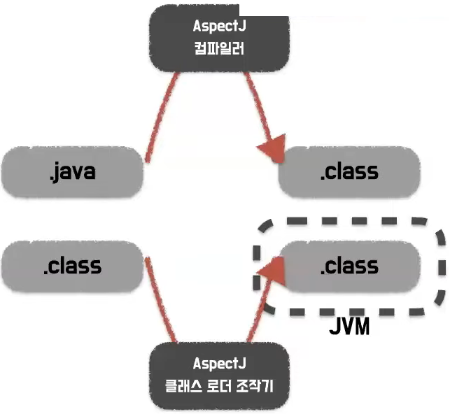

# 봄의 AOP와 SPRING AOP
[https://youtu.be/hjDSKhyYK14](https://youtu.be/hjDSKhyYK14)

# 봄의 AOP와 SPRING AOP
* toc
{:toc}

## AOP가 무엇일까?
+ AOP (Aspect Oriented Programming)
  + 관점 지향 프로그래밍
  + 횡단 관심사(Cross-Cutting Concern)의 분리를 허용함으로써 모듈성을 증가시키는 것이 목적인 프로그래밍 패러다임.
  + 여러 객체에 공통으로 적용할 수 있는 기능을 분리해서 개발자는 반복 작업을 줄이고 핵심 기능 개발에만 집중할 수 있다.
+ 프록시 
  + 자신이 클라이언트가 사룡하려고 하는 실제 대상인 것처럼 위장해서 클라이언트의 요청을 받아주는 것 (대리인, 대리자)
  + 사용 목적에 따라
    + 클라이언트가 타깃에 접근하는 방법을 제어하기 위해서 -> 프록시 패턴
    + 타깃에 부가적인 기능을 부여해주기 위해서 -> 데코레이터 패턴 
  + 프록시를 사용하여 구현하니..
    +  
    + 기존 코드를 변경하지 않고 실행 시간을 출력할 수 있다.
    + 실행 시간을 구하는 코드 중복 제거
+ 핵심 기능과 부가 기능의 관점으 분리하여 부가 기능에서 바라보는 공통된 부분을 추출하는 것이 AOP의 개념이다
+ 핵심 기능에 공통 기능을 삽입하는 것 
+ 해심 기능의 코드를 수정하지 않으면서 공통 기능의 구현을 추가하는 것 

## AOP에서 사용되는 용어 
+ AOP 용어 정리 
  + TARGET
    + 부가 기능을 부여할 대상
  + Aspect
    + AOP의 기본 모듈. 
    + 그 자체로 애플리케이션의 핵심 기능을 담고있진 않지만, 애플리케이션을 구성하는 중요한 한 가지 요소.
    + 부가될 기능을 정의한 Advice와 Advice를 어디에 적용할지 결정하는 Pointcut을 함께 가진다.
  + Advice
    + 타깃에게 제공할 부가 기능을 담은 모듈. 
    + 타깃이 필요 없는 순수한 부가 기능.
    + Aspect가 무엇인지 언제 할지를 정의하고 있다.
  + Join point
    + 프로그램의 실행 내부에서 Advice가 적용될 수 있는 위치
  + Pointcut
    + Advice에 적용할 JoinPoint를 선별하는 작업 또는 그 기능을 정의한 모듈 
+ 
+ AOP 용어 정리 - 스프링
  + TARGET
      + 스프링 AOP는 런타임 프록시로 구현되므로 타깃은 항상 프록시이다.
  + Aspect
      + 트랜잭션 관리가 가장 좋은 예시이다. @Aspect를 사용해서 구현
  + Advice
      + Around, Before, After, Throwing 등 다양한 어드바이스가 존재한다.
  + Join point
      + 스프링 AOP는 프록시 방식을 사용하므로 조인포인트는 항상 메서드 실행 지점이다.
  + Pointcut
      + 스프링 AOP의 조인포인트는 메서드 실행이므로. 스프링의 포인트컷은 메서드를 선정하는 기능을 한다.  

## 핵심 기능에 공통 기능을 삽입하는 방법엔 무엇이 있을까?
+ AOP를 구현하는 방법
  + 컴파일 시점에 코드에 공토 기능 삽입
  + 클래시 로딩 시점에 바이트 코드에 공통 기능 삽입
  + 런타임 시점에 프록시 객체를 생성하여 공통 기능 삽입 
+ 컴파일 시점과 클래스 로딩 시점에는 AOP 프레임워크인 AspectJ가 제공하는 컴파일러나 클래스 로더 조작기 같은 새로운 것을 사용해야한다. 좀 더 유연한 AOP를 적용할 수 있지만 부가적인 의존성을 추가 해야 한다. 
  + 
+ 런타임 시점에는 자바 언어에서 제공하는 기능인 프록시를 생성하여 공통기능을 삽입해준다. 
+ 스프링에서는 런타임 시점에 프록시 객체를 생성하여 공통 기능 삽입해준다. 
  + 컴파일러나 클래스 로더 조작기를 설정하지 않아도 된다.
  + 프록시는 메서드 오버라이딩 개념으로 동작하기 때문에. 스프링 AOP는 메서드 실행 시점에만 AOP를 적용할 수 있다.
  + 스프링 AOP는 스프링 컨테이너가 관리할 수 있는 빈에만 AOP를 적용할 수 있다.
  + Aspect J를 직접 사용하는 것이 아니라. Aspect J의 문접을 차용하고 프록시 방식의 AOP를 적용  
  + 스프링에서는 IoC/DI 컨테이너, Dynamic Proxy, 데코레이터 패턴/프록시 패턴, 자동 프로시 생성 기법, 빈 오브젝트 후처리 조작 기법 등 다양한 기술을 조합하여 스프링 AOP를 지원한다. 

## 그럼 어떻게 Spring AOP를 사용하나요? 적용해 보고 싶어요~
1 빈으로 등록 
+ 

2 Aspect 정의
+ 
  + 클래스 상단에 @Aspect 어노테이션 적용
  + 포인트 컷을 정의해 준다. 
  + 어드바이스를 정의 해준다. 
  + Around Advice(@Around)
    + 메서드 실행 전, 후 또는 익셉션 발생 시점
  + Before Advice(@Before)
    + 메서드 호출 전
  + After Returning Advice(@AfterReturning)
    + 메서드가 익셉션 없이 실행된 이후 
  + After Throwing Advice
    + 메서드를 실행하는 도중 익셉션이 발생한 경우
  + After Advice
    + 익셉션 발생 여부 상관 없이 메서드 실행 후

