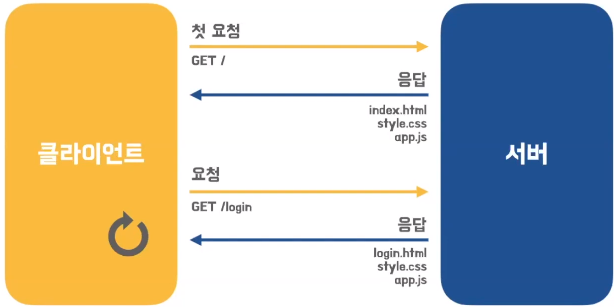
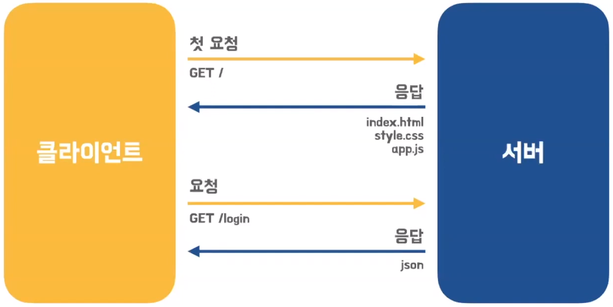
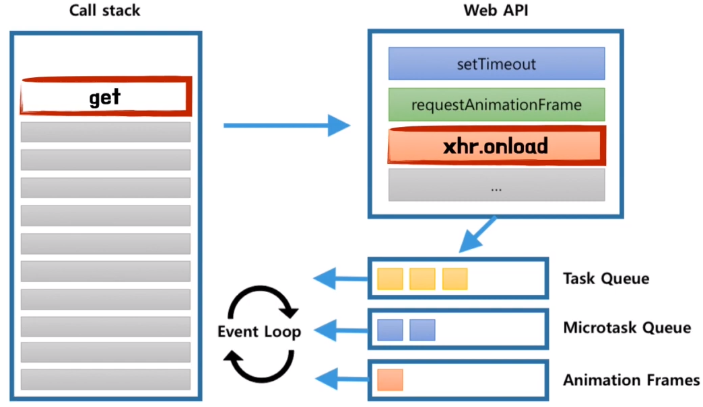

# 티거의 Ajax
[https://youtu.be/avfIUwDG2d8](https://youtu.be/avfIUwDG2d8)

# 티거의 Ajax
* toc
{:toc}

## Ajax (Asynchronous JavaScript and XML)
+ 비동기 JavaScript 와 XML 을 말한다.
+ 자바 스크립트와 XMLHttpRequest 객체를 사용해서 클라이언트와 서버가 비동기 방식으로 통신 하는 것 
+ Ajax 이전
  + 
  + html 태그로 시작해서 html 태그로 끝나는 완전한 HTML을 서버로부터 전송 받는다.
  + 단점
    + 불필요한 데이터 통신
      + 이전 웹페이지와 차이가 없어서 변경할 필요가 없는 부분까지 포함된 HTML을 매번 전송받는다.
    + 화면이 순간적으로 깜빡이는 현상
      + 화면을 전환할 때마다 웹페이지 전체를 다시 렌더링한다.
    + 클라이언트 블로킹
      + 클라이언트와 서버와의 통신이 동기 방식으로 동작한다. 
+ Ajax 방식
  + 
  + 웹페이지의 변경에 필용한 데이터만 서버로부터 비동기 방식으로 전송받는다.
    + 불필요한 데이터 통신 X
      + 변경할 부분을 갱신하는 데에 필요한 데이터만 서버로부터 전송받는다.
    + 화면이 순간적으로 깜빡이는 현상 X
      + 변경할 필요가 있는 부분만 다시 렌더링한다.
    + 클라이언트 블로킹 X
      + 클라이언트와 서버와의 통신이 비동기 방식으로 동작한다.

## XMLHttpRequest
+ 브라우저에서 제공하는 Web API 객체 
+ HTTP 요청 전송과 응답 수신을 위한 메서드와 프로퍼티 제공
+ 1999년 마이크로소프트 개발
+ 2005년 자바스크립트의 가능성을 확인하는 계기 마련 

## Ajax 동작 방식
+ 자바스크립트는 싱글쓰레드로 동작하는데 어떻게 Ajax가 비동기적으로 동작할 수 있었을까?
+ 
+ 
  1. get 함수가 호출되면 get 실행 컨텍스트가 생성되고 Call stack에 쌓인다.
  2. 쌓이게 되면 순차적으로 실행하다가 이벤트 핸들러 바인딩 하는 작업을 만나게 되면 이 작업을 Web API를 통해서 브라우저에게 위임한다.
  3. 그리고 get 함수는 종료했으니깐 콜 스틱을 빠져나간다.
  4. 자바스크립트는 콜스텍에 있는 작업들을 순차적으로 처리를 하고 브라우저는 이와 별개로 xhr.onload 이벤트가 발생하면 Task Queue에 발생한 로드 이벤트에 핸들러를 넣는다.
  5. 해당 이벤트가 발생했다고 해서 바로 해당 이벤트를 호출하는 것은 아니다.
  6. Call stack이 빌 때까지 그리고 다른 Queue에 아무런 작업이 없을 때까지 기다렸다가 Event Loop는 Task Queue를 Call stack에 넣는다.
  7. 이렇게 함으로써 로드 이벤트의 핸들러가 실행이 된다.

## 정리하기 
+ Ajax는 기술도 프레임워크도 라이브러리도 아니다.
+ 자바 스크립트와 XMLHttpRequest 객체를 사용해서 클라이언트와 서버가 비동기 방식으로 통신 하는 것

## Fetch
+ HTTP 요청 전송 기능을 제공하는 클라이너트 사이드 Web API + Promise 지원 

## Axios
+ Node.js와 브라우저를 위한 Promise 기반 HTTP 클라이언트 
+ 서버에서는 네이티브 Node.js의 http 모듈 사용
+ 클라이언트에서는 XMLHttpRequest 사용 

    
