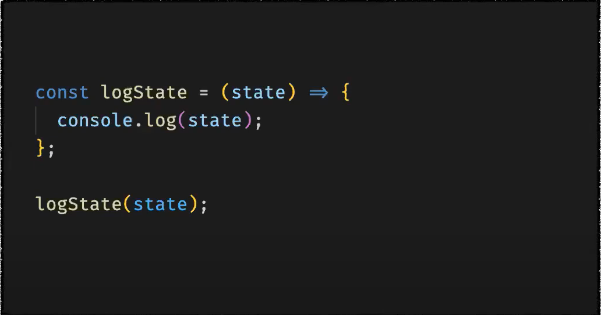
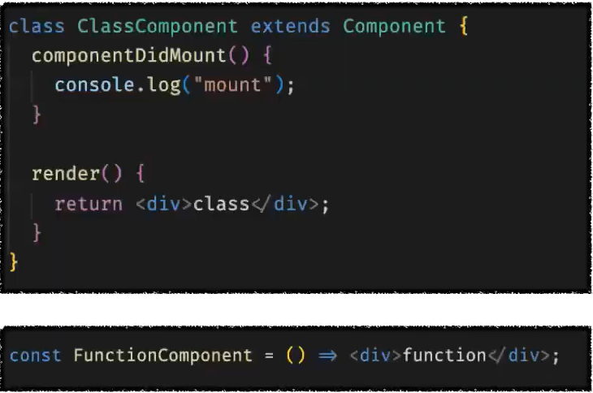
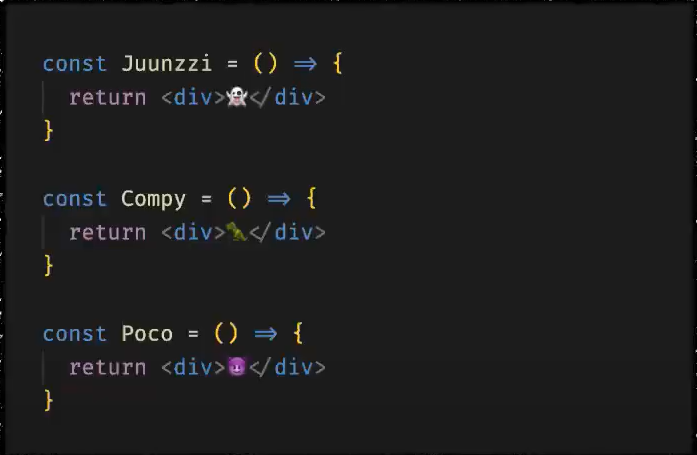
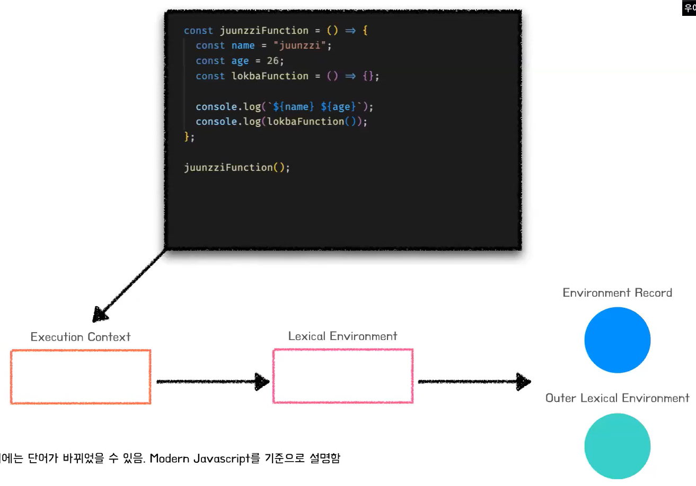
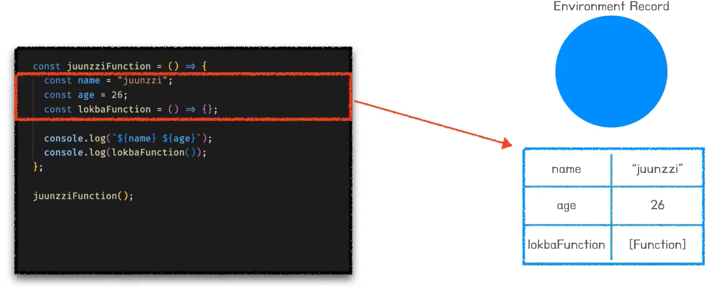
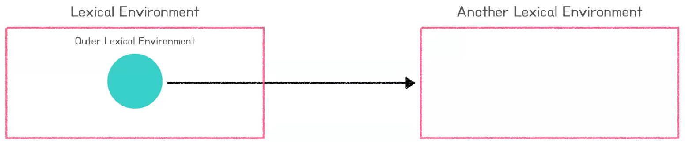

# 준찌의 Function Component & Execution Context 
[https://youtu.be/AqO4IfafQ3c](https://youtu.be/AqO4IfafQ3c)

# 준찌의 Function Component & Execution Context
* toc
{:toc}

## 동기
+ 함수 컴포넌트 내부의 함수는 구식의 state와 props를 참조하게 될 수 있다는 것
  + 버튼을 클릭 할 때의 상태를 참조하게 된다는 "상황에 대한 설명"
  + 이를 해결할 수 있는 리액트 관점에서의 방법
  + 함수 컴포넌트가 갖는 고유의 특징이구나 라고 생각할 수 있지만 자바스크립트 함수의 특징으로 발생하는 현상이다.

## 배경지식 

### 함수 컴포넌트 
+ 함수란?
  + 
    + 정의: 기능을 수행하는 코드 단위 
    + 특징
      + 함수는 객체
      + 호출하는 것을 통해 코드 동작을 실행
      + __함수는 자신이 생성된 곳에서의 렉시컬 환경을 기억한다.__
+ 컴포넌트란?
  + 
    + 컴퓨팅 세계에서의 컴포넌트: 재사용 가능한 독립적인 단위의 모듈
    + 리액트 컴포넌트: UI를 표현하는 재사용 가능한 독립적인 단위의 모듈 
    + 특징
      + class와 __함수를 생성하는 방법으로 선언이 가능하다.__
      + 재사용이 "가능"하다. (재사용 해야하는 것이 아니다.)
+ 함수 컴포넌트란?
  + 
    + 정의: 함수로 선언된 컴포넌트
    + 특징
      + __리액트 엘리먼트를 반환하는 자바스크립트 함수이다.__
      + Hook API로 이어지는 유구한 역사가 있다. 
+ 정리하자면 
  + 함수 컴포넌트는 자바스크립트 함수이다. 
  + 자바스크립트 함수와 동일하게 처리된다.
    + 동일하게 호출하면 실행 컨텍스트를 생성하고, 동일하게 함수 내부 코드가 평가 과정을 거쳐 실행된다.  

### 실행 컨텍스트
+ 실행 컨텍스트란 코드를 실행하는데 필요한 정보를 기록해둔 가상의 객체이다.
+ 
+ 내부 정보는 "렉시컬 환경의 환경 레코드"에 기록된다.
  + 
    + 자신의 내부 정보를 "코드 평가", "코드 실행" 과정을 거쳐 환경 레코드에 "등록"한다.
+ 외부 렉시컬 환경에 대한 촘조 값은 "함수가 기억하는 값"으로 바인딩된다.
  + 
  + 하나의 렉시컬 환경은 외부 렉시컬 환경에 대한 참조 프로퍼티를 갖는다. 
  + 또 이 참조 프로퍼티는 또 다른 렉시컬 환경을 참조하고 있다. 
  + 또다른 렉스컬 환경은 함수 객체가 만들어질 때의 렉스컬 환경이다.  
  + 결국 함수가 호출되며 생성되는 렉시컬 환경에는 "나라는 함수가 태어난던 곳에서의 렉시컬 환경"에 대한 참조 값이 바인딩 된다. 
+ 정리하자면
  + 환경 레코드에는 코드 내부 식별자 정보가 등록된다.
    + 이 후 코드 실행 단계의 식별자 검색 과정에서 이를 활용한다. 
  + 외부 렉시컬 환경에 대한 참조는 함수 선언처에서의 렉시컬 환경을 참조한다.
    + 이 후 코드 실행 단계의 실별자 검색 과정에서 이를 활용한다.

### 브라우저 디버거
+ 웹 어플리케이션을 디버깅할 수 있는 브라우저에서 제공하는 툴이다. 

## 함수 컴포넌트와 실행 컨텍스트
+ 함수 컴포넌트는 함수이다.
+ 함수는 자신이 생성되던 곳에서의 렉시컬 환경을 기억하고, 실행시에 이를 사용한다. 
+ 자바스크립트의 특지으로 인해 생기는 현상이다. 
