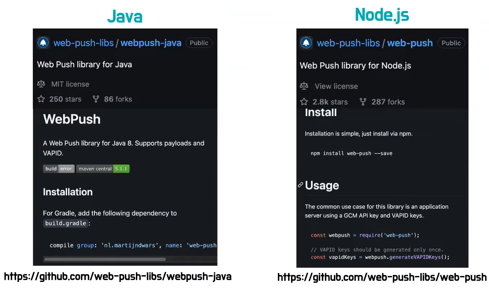

# 마르코의 Progressive Web App
[https://youtu.be/x10CJNyKSLk](https://youtu.be/x10CJNyKSLk)

# 마르코의 Progressive Web App
* toc
{:toc}

## PWA 개요
+ PWD 정의
  + 프로그레시브 웹 앱(PWA)은 새롭게 떠오르는 웹 브라우저 API를 전통적인 점진적 향상(progressive enhancement) 기법과 함게 사용해서 네이티브 앱에 필적하는 사용자 경험을 제공하는 크로스 플랫폼 웹 애플리케이션을 말한다. -MDN-
    + 정리: 네이티브 앱에서만 구현할 수 있던 기능을 점진적으로 웹 기술로 구현
+ progressive enhancement
  + 클로스 브라우징 지원
  + progressive enhancement란 모든 코드를 실행할 수 있는 최신 브라우저 사용자에게 가능한 최고의 경험을 제공하면서 이전 브라우저를 포함한 가능한 많은 사용자들에게도 필수 기능과 콘텐츠를 제공하려는 디자인 철학
    + 그래서 오래된 브라우저에서 PWA 관려 기능이 지원 되지 않아서 에러가 발생해서 전체 사이트 로드가 실패하면 안된다 이를 위해서 기능탐지나 폴리필 같은 것들을 적용해야 된다. 
  + 기능 탐지 및 폴리필 
    + 
  + 크로스 브라우징 확인
    + CanlUse
      + 브라우저 호환성 표 확인
      + [https://caniuse.com/](https://caniuse.com/)
    + BrowserStack
      + 기기별, 블라우저별 크로스 브라우징 원격 시물레이팅하는 테스트 도구(1분씩 무료, 로컬 가능)
      + [https://www.browserstack.com/](https://www.browserstack.com/)
+ PWD가 되기 요건
  + 웹앱을 PWA로 전환하는 것을 어렵지 않다. 웹앱에 HTTPS 그리고 manifest, serviceWorker 이 세 가지를 추가하면 된다. 
    + 우선 HTTPS여야 하는 이유는 강력하면서 민감한 새기능을 안전하게 사용하기 위해서 이다. 따라서 PWA 관련 일부 API는 HTTPS 환경이나 로컬호스트에서만 작동하도록 제한되어 있다. 
+ 활용 사례 (Twitter Lite)
  + mobile.twitter.com
  + 구글플레이스토어 앱 설치
  + 빠른 속도
  + 데이터를 덜 사용
  + 저장공간도 덜 차지
  + 푸시 알림
  + 오프라인 실행 지원
  + 세션당 페이지 수 65% 증가
  + 보낸 트위 75% 증가
  + 이탈률 20% 감소 
  + 이외에도 인스타그램, 텔레그램, 유뷰브, 스타벅스, 틴더등의 웹사이트는 이미 PWA 로서 네이트브 앱의 기능이 대부분 가능하다.

## 설치 가능하게 만들기 
+ Manifest 설정
  + Web App Manifest는 브라우저에게 데스크톱이나 모바일 기기에 설치할 때 어떻게 작동해야 하는지 알려주는 JSON 형식의 파일 
  + manifest.json 파일을 최상위 디렉터리에 만든다.
  + index.html의 head태그 내에 다음과 같은 링크 태그를 추가한다.

~~~xml

<link rel="manifest" href="manifest.json" />

~~~

+ manifast.json의 구성요소
  + 
    + 이름을 통해서 그 기능을 유추할 수 있다. 
    + MDA, Google Developers 사이트에서 자세히 설명되어 있다.
      + [MDN](https://developer.mozilla.org/ko/docs/Mozilla/Add-ons/WebExtensions/manifest.json)
      + [Google Developers](https://web.dev/add-manifest/)
+ 바로가기 추가 - Manifest(shortcuts)
  +  
  + shortcuts 이라는 기능을 통해서 앱을 꾹 누르거나 또는 아이콘을 우클릭 했을 때 나오는 바로가기 기능을 추가할 수 있다.
+ 공유 대상 되기 - Manifest(share_target)
  +  
  + 설치된 PWA가 시스템의 share dialog에서 share target이 되도록 설정 
+ 커스텀 설치 버튼 말들기 
  + Manifest 파일을 작성하고 Link 태그로 연결 했다면 이제 웹사이트가 설치 가능한 앱이 되었을거다. 
  + 기본 설치 버튼은 브라우저 인터페이스마다 다 다르다는 문제가 있다 사용자에게 일괄된 사용자 경험을 제공하기 위해서는 앱내에다가 설치 버튼을 만드는 것이 좋다 
  + 
+ 예외 - iOS에서 설치
  + iOS에서는 설치 prompt가 아직 지원되지 않는다.
  + 홈 화면에 추가라는 방식을 통해서 어느정도 설치는 할 수 있다. 

## 서비스 워커
+ 
  + 서비스워커는 별도의 워커 스레드에서 작동한다는 특징이 있다 따라서 페이지가 닫혔더라도 또는 오프라인이더라도 서비스 워커는 계속 동작할 수 있어서 푸시알림 이라던지 또는 오프라인에서 캐시라던지 이런 기능이 가능하다.
+ 서비스 워커 등록 
  + 
    + navigator.serviceWorker.register()
      + 서비스워커의 scriptURL을 전달하여 서비스 워커 등록
    + 서비스워커를 이제 우리의 웹사이트에 등록을 하려면 seviceWorker.js 란 파일을 만들고 해당 파일을 serviceWorker.register() 메서드를 통하여 등록하면 된다. 
+ 생명주기
  + 
    + Installing
      + 서비스 워커의 업데이트가 발견되는 경우 설치
        + 업데이트 여부는 기존 서비스 워커 파일과의 바이트 단위 비교 결과에 따른다. 
    + Installed/waiting
      + installed 되도 기존 서비스워커가 제어하는 웹페이지가 켜져있으면 waiting 상태가 유지된다.
      + 대기중인 서비스워커 활성화하는 방법
        1. 기존 서비스워커가 제어하는 웹페이지 닫기
        2. 개발자도구에서 skipWaiting 직접 누르기
        3. install 이벤트 내 self.skipWaiting() 호출
           + 
    + Activating
      + 기존 웹페이지가 모두 닫혀서 Activating 단계가 되더라도, 페이지를 새로고침하기 전까지 클라이언트를 제어할 수가 없다. 
      + 클라이언트 제어권 부여 방법
        1. 사용자가 페이지를 새로고침
        2. activate 이벤트 내 self.clients.claim() 호출
           + 
    + Activated
      + Activated가 되어 클라이언트를 제어하게 되면 fetch, sync, push 등의 기능 이벤트 제어 가능 
    + Redundant
      + 새로운 서비스 워커롤 대체되었을 때 곧 소멸될 서비스 워커 상태 
+ 서비스 워커를 통해 처리할 수 있는 이벤트
  + 서비스 워커 설치 관련 이벤트
    + install
    + activate
  + 네트워크 요청 관련 이벤트
    + fetch
  + 푸시 알림 관련 이벤트
    + push
    + pushsubscriptionchange
    + notificationclick
    + notificationclose
  + 백그라운드 공기화 관련 이벤트
    + sync
  + 클라어언트와 통신 관련 이벤트
    + message

## Web Push Notification
+ 백그라운드에서도 알림 수신
  + 사용자의 재참여를 유도하는데 유용한 푸시 알림
  + 이제는 네이티브앱 뿐만 아니라 built-in 자바스크립트만으로도 구현 가능
  + 모바일이나 데스크톱에서 백그라운드 푸시 알람을 받을 수가 있다. 
+ Web Push의 브라우저 호환성 - 2022
  + 
    + IOS에서 웹 푸시가 아직 지원되지 않는다.
    + 애플 공지에 따르면 2023년 IOS 16 safari에서 Web Push Notification 지원 예정이라고 한다. 
+ Web Push Protocal 개요 
  + 
  + 웹 푸시 구성요소는 서버, 푸시 서비스, 클라이언트 크게 세 가지로 볼 수 있다.
  + 클라이언트는 푸시 메세지를 받고 서버는 푸시 메세지를 푸시 서비스롤 보내 트리거를 한다.
+ 푸시 서비스 - FCM
  + 푸시 메세지를 클라이언트(브라우저)로 전달하는 기능을 담당
  + Firebase 클라우드 메시징(FCM)
    + 메시지를 안정적으로 무료 전송할 수 잇는 크로스 플랫폼 메시징 솔루션
+ 알림 구독 과정 
  +  
  + 웹 푸시 관련해서 초기 설정시 공개키 암호화 방식을 사용해서 공개키와 비공개키를 푸시 서비스와 서버 각각에 등록해야한다.
  + 첫 번째 클라이언트는 서버로 부터 공개키를 전달 받는다. 
  + 그 다음 클라이언트는 푸시 서버스에게 공개키를 담은 웹 pushManager.subscribe() 메서드로 구독 요청을 보내게 된다. 
  + 푸시 서비스는 이에 대한 응답으로 PushSubscription 객체 구독 정보를 응답하게 된다. 
  + 그리고 클라이언트는 서버에게 이 구독정보를 전달해서 서버가 이를 DB에 저장하도록 하게 한다. 
+ PushManager.subscribe() - "알람 구독하기"
  + 
  + 클라이언트는 서비스 워커 등록 객체에다가 pushManager의 subscribe() 메서드를 호출하였고 옵션 안에 보면 퍼블릭 키가 들어간 것을 볼 수 있다. 
  + 그다음 subscription 객체를 응답하는 걸 볼 수 있다. 
+ PushSubscription 객체 (구독정보)
  + 
  + endpoint : 푸시서비스에 구독된 특정 서비스워커 인스턴스에 푸시메세지를 전송하기 위해 사용되는 푸시서비스의 URL
+ 푸시 메시지 전송 과정 
  + 
  + 서버가 저정한 구독 정보로 특정 브라우저를 향한 푸시 메세지를 비공개키롤 암호화한 후에 푸시 서비스로 전송하게된다. 
  + 푸시 서비스는 전달 받은 푸시메시지를 안전하게 공개키로 검증한 후에 클라이언트로 메시지를 전송하게 된다.
+ Push Event / showNotification() - "똑똑똑 알림 왔어요"
  + 
    + notificationClick 이벤트
      + 푸시 알림이 클릭되었을 때
    + clients.openWindow()
      + 전달된 url의 새 윈도우 열기 
+ 백엔드용 라이브러리 소개 
  + 
  + 서버에서 푸시 서비스로 메시지를 보낼 때는 백엔드용 라이브러리를 활용하면 편리하다 
  + 백엔드에서 트리거된 푸시 메세지는 Web Push 프로토콜과 웹 푸시용 메세지 암호화 사양을 맞춰야하기 때문에 이런 부분들이 구현 되어있는 라이브러리를 활용하면 좋다

## 오프라인 실행 지원
+ Cache Storage API
  + 코드 기반 접근 방식으로서 개발자가 캐시 내용을 완벽하게 제어 가능
  + 서비스워커를 통해 제어할 수 있어 오프라인에서도 해당 캐시 사용 가능 
  + 웹페이지 구성을 위한 기본적이며 정적인 구성 요소인 App Shell 캐싱 하는데 주로 사용 (html, css, js)
+ 리소스 캐싱하기
  + 
  + App Shell 캐시 추가는 인스톨 이벤트 시점에 하는게 좋다 
  + caches.open()
    + 첫 번째 인자로 문자열로 된 캐시 이름을 전달하여 해당되는 캐시를 열거나 존재하지 않는 경우 새로운 캐시를 생성 
    + Cache 객체를 resolve하는 프로미스를 반환
  + Cache.addAll()
    + 리소스 요청 문자열 값으로 구성된 배열을 인자도 받아 모든 리소스를 캐시 스토리지에 캐싱 
+ 캐시에서 응답하기 
  + 
  + 캐시 응답 코드는 네트워크 요청을 수항할 때 발생하는 fetch 이벤트에서 활용해야한다.
  + caches.match() 메서드를 통해서 캐시에서 리소스를 찾고 찾은 리소스를 event.respondWith() 메서드를 통해서 네트워크에 대신해서 응답하면 된다. 
  + Cache First 전략
    + 먼저 캐시에서 응답하고 없으면 네트워크 요청하여 응답
  + event.respondWith()
    + 브라우저의 기본 요청을 막고 서비스 워커에서 리소스를 대신 응답하는 메소드
  + caches.match()
    + 인자로 전달된 URL 문자열이난 Request가 캐시된 Response의 key와 일치하는지 확인
    + 캐시에서 리소스를 찾으면 Response에 대한 프로미스를 반환 
+ 불필요한 캐시 삭제하기 
  + 
  + 새로 배포하면 이전의 낡은 App Shell이 저장된 불필요한 캐시를 삭제해야하는데 이렇게 캐시 삭제는 새로운 워커가 활성화되는 액티베이트 이벤트 시점에 하면된다.
  + 새로운 캐시 이름과 캐시 스토리지에 저장된 캐시 이름이 같은지 확인해서 같이 않은 캐시들은 모두 삭제하는 로직을 구현하면 불필요한 캐시를 삭제할 수 있다. 

## PWA 감사(audit)
+ Lighthouse / PWABuilder
  + 
         
      