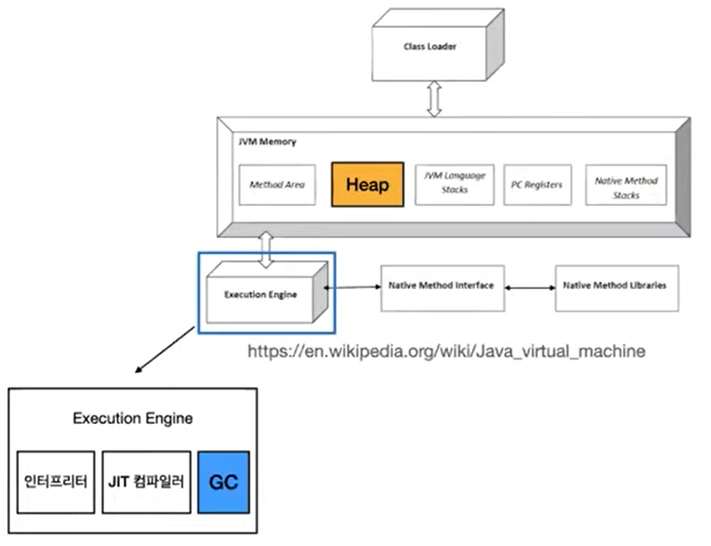
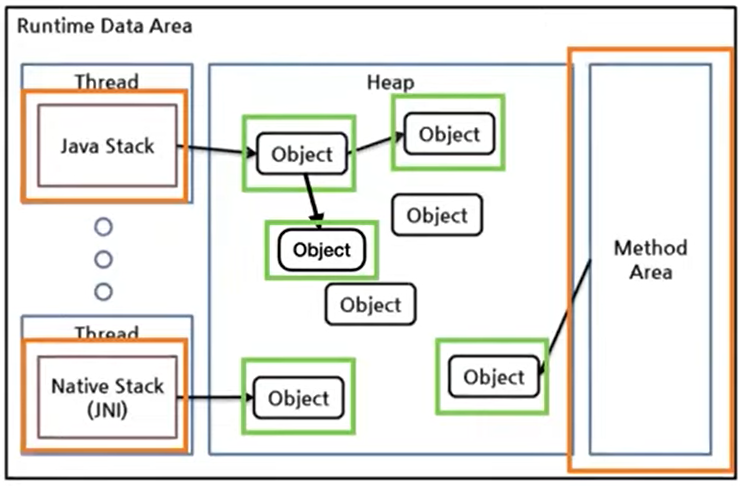
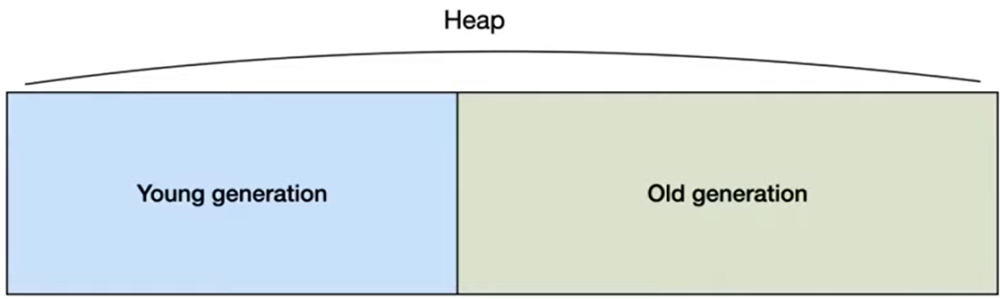
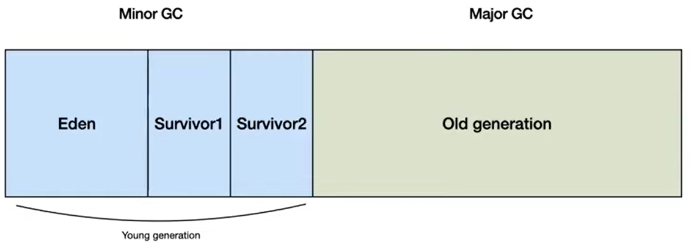

# 슬로의 GC 
[https://youtu.be/8JrciOSL3Gk](https://youtu.be/8JrciOSL3Gk)

# 슬로의 GC
* toc
{:toc}

## 메모리 해제 방법
+ c언어
  + 객체를 할당 하고 해제하기 위해서는 free라는 메서드를 직접 호출해서 해제하는 과정이 필요 
+ 자바
  + free 메소드라는 게 존재하지 않는다. 
  + 메모리를 해제하는 과정을 Garbage Collector가 대신 수행해준다. 

## Garbage Collector 란?
+ Garbage Collector 역할
  + 
  + Heap 영역에 동적으로 할당된 객체 중 불필요한 객체(garbage)를 찾는다.
  + 찾아낸 garbage를 처리해서 메모리를 해제한다.
    + 번거로운 메모리 해제 작업을 대신 처리해준다. 

## 어떤 객체를 Garbage라고 할까?
+ GC는 객체를 Reachable, Unreachable 상태 구분
  + 유효한 참조가 존재하는 객체라면 Reachable 상태
  + 그렇지 않다면 Unreachable 상태 => Garbage 즉, GC의 수거 대상
  + Root set과의 관계로 Reachable, Unreachable을 구분한다.
  + Root set과의 참조 관계가 있다면 Reachable, 어떤한 관계도 없다면 Unreachable
  + Root set
    + Stack 영역의 지역 변수, 파라미터 
    + Method 영역의 정적 변수
    + JNI에 의해 생성된 객체 

## GC 어떻게 동작할까?
+ 
1. Root set에서 참조하는 객체를 찾는다.
2. Reachable 객체에 의해 참조되는 객체를 찾는다. 
3. Root set과 어떠한 관계도 없다면 Unreachable, Heap 영역에서 제거한다.

## GC 동작 방법
+ Mark and Sweep
1. Root set으로부터 Heap 영역의 모든 객체를 스캔하여 Reachable한 객체를 찾는다. - __Mark__
2. Unreachable한 객체를 Heap 영역에서 제거한다. - __Sweep__

## JVM Heap 메모리 영역
+ 
+ Heap 영역은 Young Generation과 Old Generation 영역으로 나뉜다. 

## 왜 Heap 메모리 구조를 나누어 관리할까?
+ 하나의 메모리 영역을 때 발생할 수 있는 문제점
  + 모든 객체를 하나하나 추적하는 것을 많은 시간이 소요될 수 있고, 이는 부하를 발생할 수 있다.
+ Weak generational hypothesis
  + 대부분의 할당된 객체는 오랫동안 참조되지 않으며 즉, 금방 Garbage 대상이 된다.
  + 오래된 객체에서 젊은 객체로의 참조는 거의 없다.
+ 효율적인 처리
  + 
  + 영역을 나누어 일부의 메모리 영역만 스캔한다.
    + 효율적으로 처리할 수 있다.
    + 결과적으로 GC 비용을 줄 일 수 있다. 

## GC 언제 발생할까?
+ 
+ Eden: 새로운 객체가 저장되는 영역
+ Survivor: 에덴 영역에서 살아남은 객체가 저장되는 영역
1. 새로운 객체는 Eden 영역에 할당된다.
2. Eden 영역이 가득차면, Minor GC가 발생한다.  
> Mark and Sweep 과정일 일어나고   Unreachable한 객체를 해제한다.
3. 살아남은 객체는 비어 있는 Survivor 영역으로 옮겨 진다. (Stop and copy) 옮겨진 객체의 age는 1 증가 한다.  
> 단편화 문제를 해결하기 위해서 비어있는 Survivor 영역으로 옮긴다.
4. age가 특정갑 이상이 되면, Old generation으로 이동한다. (Promotion)
5. Old generation 영역이 가득차면, Major GC가 발생한다. 

## 정리
+ 가비지 컬렉터: 가지를 찾아서 메모리에 해제해준다.
+ 가비지 구분 방법: Root set과의 연관 관계로 reachable, unreachable 구분
+ GC 동작 방법: Reachable 객체를 찾고, Unreachable 객체를 삭제 (mark and sweep)
+ GC 발생 과정
  + young generation이 가득차면 minor GC 발생
  + old generation이 가득차면 major GC 발생
      