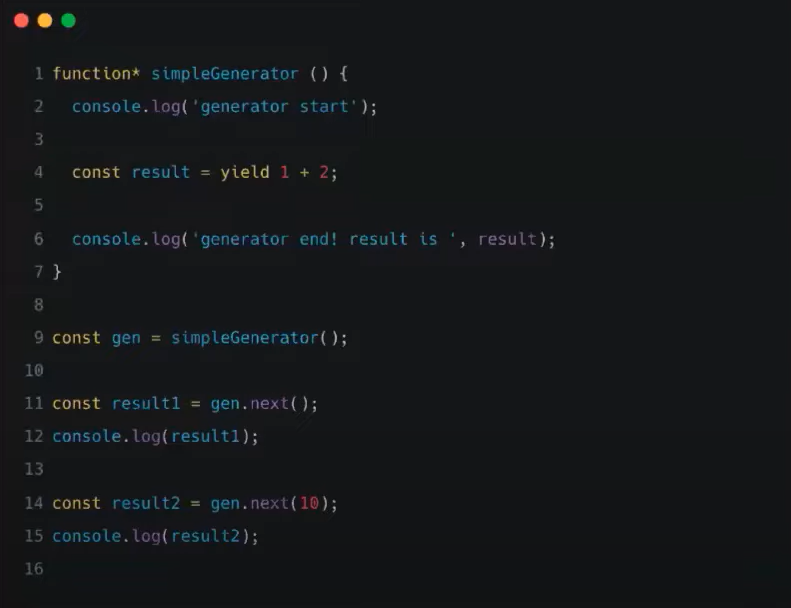

# 빅터의 Generator와 Async/Await 
[https://youtu.be/ZrdHtL1gcEI](https://youtu.be/ZrdHtL1gcEI)

# 빅터의 Generator와 Async/Await
* toc
{:toc}

## Generator
+ 제너레이터(Generator)는 코드 블록의 실행을 일시 중지햇다가 필요한 시점에 재개할 수 있는 특수한 함수이다.

## 일반 함수와 Generator 함수의 실행 차이점
+ 
+ 일반 함수는 실행을 하면 함수의 구현부가 실행이 되고 반환 값이 반환된다. 
+ Generator 함수는 실행을 해도 실행이 안된다 대신 Generator 객체라는 게 반환이 된다.  

## Generator 객체란?
+ Generator 객체는 iterator과 iterable 인터페이스를 준수한다.  

## iterator 프로토콜
+ iterator란?
  + next 메서드를 가진다.
  + next 메서드는 iteratorResult 객체를 반환한다.
+ iteratorResult 객체란?
  + iteratorResult 객체는 value와 done 프로퍼티를 갖는 객체이다.
    + value: iterator가 반환하는 값
    + done: iterator가 끝남 여부를 알려주는 값

## iterable 프로토콜
+ iterable란?
  + iterable은 내부적으로 Symbol.iterator 메서드를 가진다.
  + 해당 메서드는 Iterator를 반환한다.
+ iterable 특징
  + for ... of 문
  + spread 연산
  + 구조 분해 할당 

## next() 와 yield 키워드 
+ 
+ Generator는 next와 yield 키워드를 통해서 함수의 내부와 외부에서 데이터를 주고받으면서 실행이 된다. 
+ next 메서드를 실행하면 데이터가 함수 내부로 전달된다. 
+ 그리고 중단되어 있는 yield 키워드에 전달이 되는데 계속 실행이 되다가 다음 yield문의 표현식까지 실행이된다. 
+ 그리고 이 표현식의 결과값이 바로 iteratorResult 객체에 반환이 된다.
+ 계속 반복되다가 next를 실행 했을때 리턴 문을 만나게 되면 더 이상 실행할 수 없게 된다.
+ 

## Generator는 중단점을 어떻게 기억할까?
+ Generator 객체는 내부적으로 GeneratorState와 GeneratorContext slot을 가지고 있다.
+ GeneratorState는 Generator의 진행 상태와 관련된 값이 저장된다.
+ GeneratorContext에는 Generator 함수의 실행 컨텍스트가 저장된다.
+ GeneratorState는 총 4가지가 있다.
  + Suspended Start
    + Generator 함수를 실행했을 때의 상태
  + Executing
    + Generator 객체의 next 메서드를 실행한 시점의 상태
  + Suspended Yield
    + Generator 함수의 실행 도중 yield 키워드를 만난 시점의 상태
  + Completed
    + Generator 함수의 실행 도중 return 키워드를 만나거나 함수의 끝에 도달했을 때의 상태 
+ 

## Generator와 Async/Await 사이에 어떤 관계가 있을까?

### Generator 비동기 처리 
+ Generator는 비동기 처리를 하기 위해서 사용되기도 했다 근데 Generator 혼자 사용된 게 아니고 Promise와 함께 사용됐다. 
+ Generator + Promise
  + 비동기 처리 코드를 동기식 코드처럼 작성하는 패턴 
+ 
  + fetch가 Promise를 반환하는 WebAPI 인데 그래서 Promise가 사용된 코드가 마치 Generator와 함께 사용되면서 동기적인 코드처럼 작성할 수 있게 되는거다.
  + 하지만 해당 패턴을 사요하기 위해서는 Generator를 연속적으로 실행하는 유틸 함수가 필요했다. 

### Async/Await의 등장
+ 
+ Promise를 처리하는 부분이 매우 유사하다
+ Async/Await을 사용함으로써 Generator가 사용이 안 되기 때문에 조금 더 간결하게 비동기적인 코드를 동기적인 코드처럼 작성할 수 있게 됐다 
+ Async/Await은 Generator를 사용한 비동기 처리 패턴보다 더 편리하게 비동기 처리를 하기 위해 등장했다. 

### 부록) 구형 브라우저에서 Async/Await
+ 
+ Async/Await이 ES8에서 표준화됐기 때문에 구형 브라우저에서는 사용이 안된다. 그래서 바벨을 통해서 트랜스 파일링을 하게 되는데 Async/Await 코드를 바벨을 이용해서 트래스파일링 하면 Promise와 Generator를 사용한 부분을 볼 수 있다. 

## 요약
1. Generator는 중간에 실행을 중단하고 원하는 시점에 재개할 수 있는 특별한 함수이다.
2. Generator 객체는 자체 실행 컨텍스트를 가지고 있다.
3. Generator와 Promise를 통해 동기적인 코드처럼 비동기 처리할 수 있다.
4. 위 방법은 Async-Await 패턴으로 표준화 됐다. 