# 바니의 웹 보안 
[https://youtu.be/laQAQeuuJF4](https://youtu.be/laQAQeuuJF4)

# 바니의 웹 보안
* toc
{:toc}

## OWASP Top 10
+ OWASP
  + Open Web Application Security Project 라는 비영리 보안 프로젝트 재단 
  + 웹 애플리케이션에 발생할 수 있는 취약점을 분석하고 연구해 공격 가능성과 기술적 영향을 기준으로 10개의 취약점 OWASP Top 10을 공개
+ OWASP Top 10(Ver. 2021)
  + 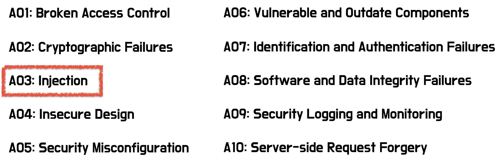

### OWASP - A03: Injection
+ Injection
  + 신뢰할 수 없는 데이터가 명렬어나 쿼리문의 일부분으로 전달될 때 발생
  + 공격자가 악의적인 데이터로 인해 예기치 않은 명령이 실행되거나 올바른 권한 없이 데이터에 접근할 수 있다.

### (실습 환경) bWAPP - Bee Box
+ OWASP Top 10 기반 취약점을 포함하여 모의해킹 테스트가 가능한 무료 오픈 소스인 취약한 웹 어플리케이션 Buggy Web Application

## SQL Injection
+ SQL 삽입, SQL 주입이라고 하며 코드 인젝션 기법 중 하나 클라이언트의 입력값 조작을 통해 서버의 Database를 공격하는 방식 
+ 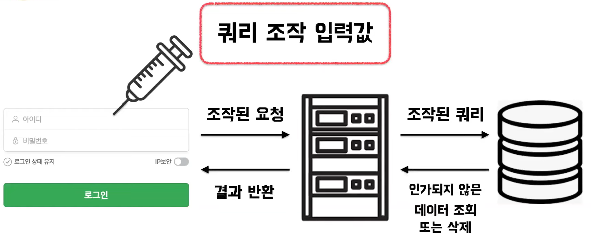
+ SQL Injection 종류 
  + 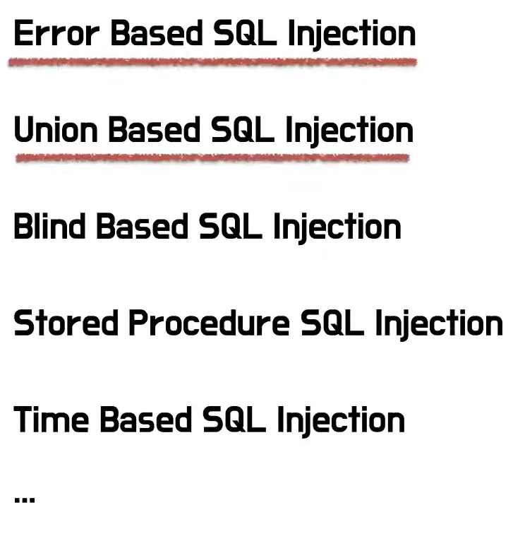
    
### Error Based SQL Injection
+ Database에 고의적으로 오류를 발생 시켜 에러 출력을 통해 Database 구조를 파악하고 필요한 정보 습득
+ 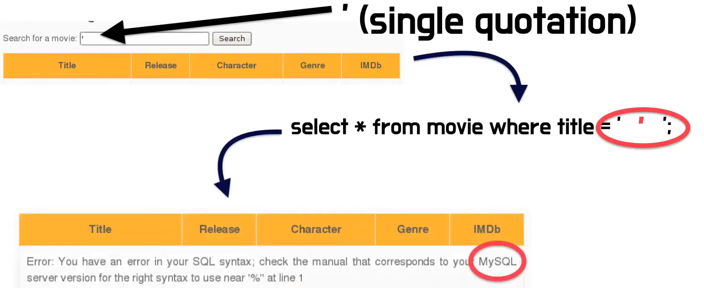

### Union Based SQL Injection
+ Database의 UNION 연산자를 사용하여 쿼리 결과값의 조합을 통해 정보를 파악
  + 전제 조건: 컬럼의 개수와 데이터 형식이 같아야한다.  
+ 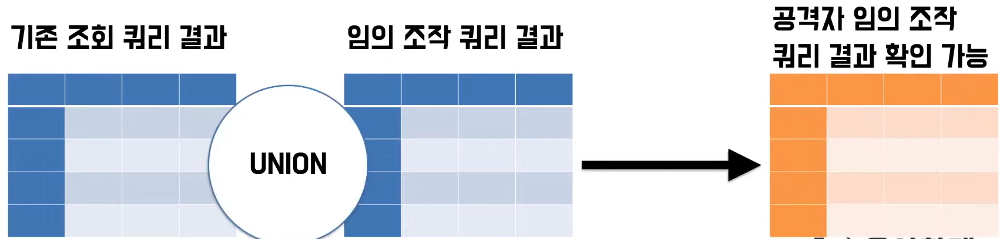
+ 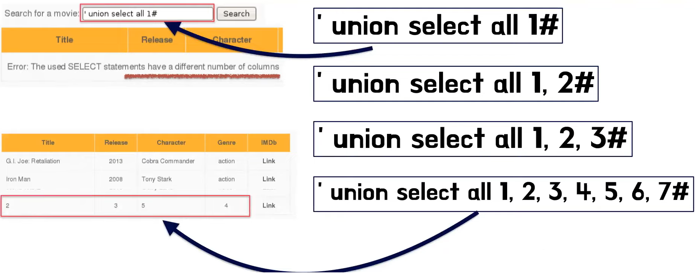
+ 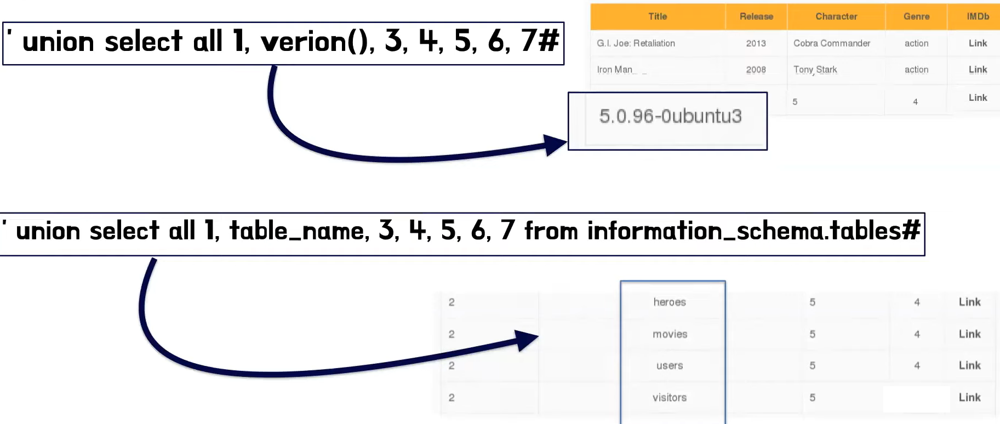

### 대응방안 
+ 에러 메세지 노출 차단 
+ 입력값 검증
  + 사용가능한 특수문자 제한
  + 특수문자 필터링 
+ Prepared Statements 
  + 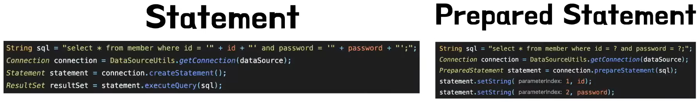
  + Statement는 SQL 쿼리문에 사용하는 데이터를 넣어서 쿼리문을 만들고 그 쿼리문을 통해 데이터베이스를 조회하는 방식을 사용한다.
  + Prepared Statement는 SQL문을 먼저 데이터 베이스에 준비한 뒤에 파라미터를 반인딩하는 방식으로 사용된다. 
    + 바인딩된 파라미터는 쿼리로서 동작할 수 없기 때문에 SQL Injection에 대한 대응 방법이라고 볼 수 있다. 
    + 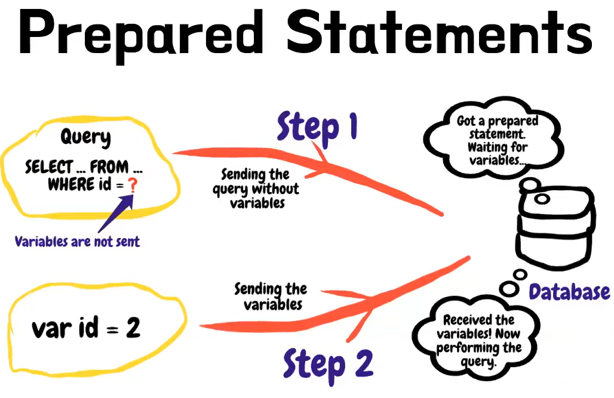

### 그럼 왜 우리가 작성한 코드에서는 발생하지 않았을까?
+ JdbcTemplate 
  + Prepared Statement를 사용하는 방식으로 동작하고 있다. 
+ JPA 
  + 파라미터 바인딩으로 동작한다. 

## XSS (Cross Site Scripting)
+ 악성 스크립트를 웹사이트에 주입하는 코드 인젝션 기법 중 하나
+ 공격자가 웹 어플리케이션에 보낸 악성 코드가 다른 사용자에게 전달될 때 발생한다. 
+ 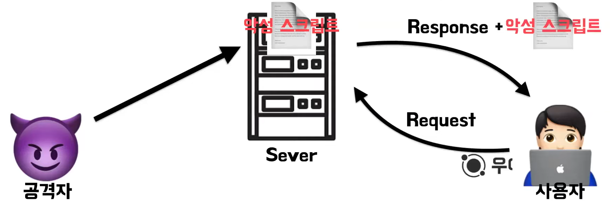
+ XSS 종류
  + 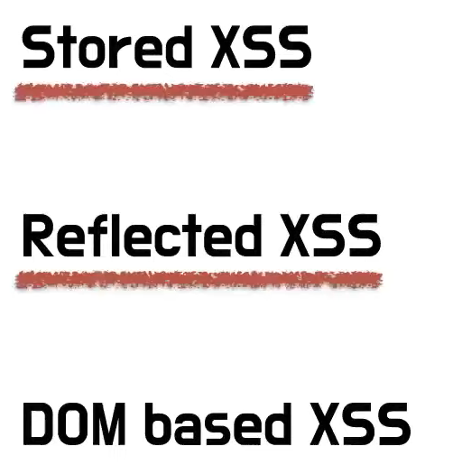

### Stored XSS
+ 공격자가 취약점이 있는 Web Application에 악성 스크립트를 영구적으로 저장하여 다른 사용자에게 전달하는 방식 
+ 
+ 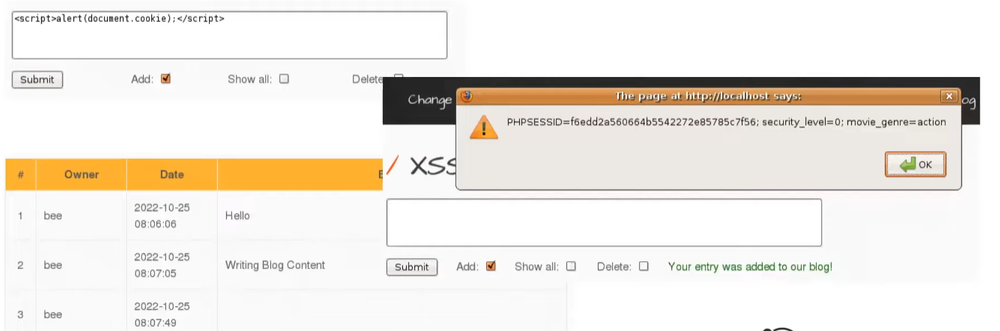

### Reflected XSS
+ 공격자가 사용자에게 악성 스크립트를 메일이나 웹사이트를 통해 전달하고 사용자가 실행하도록 하는 공격 기법 
+ 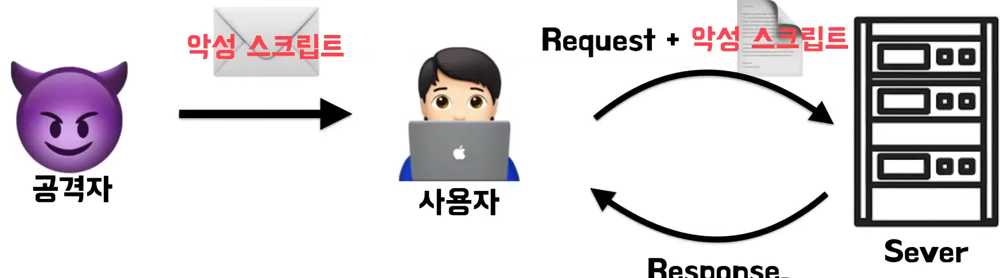
+ 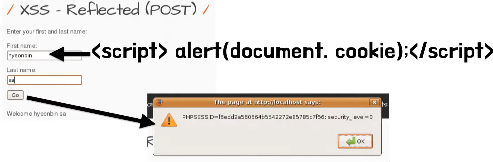
+ 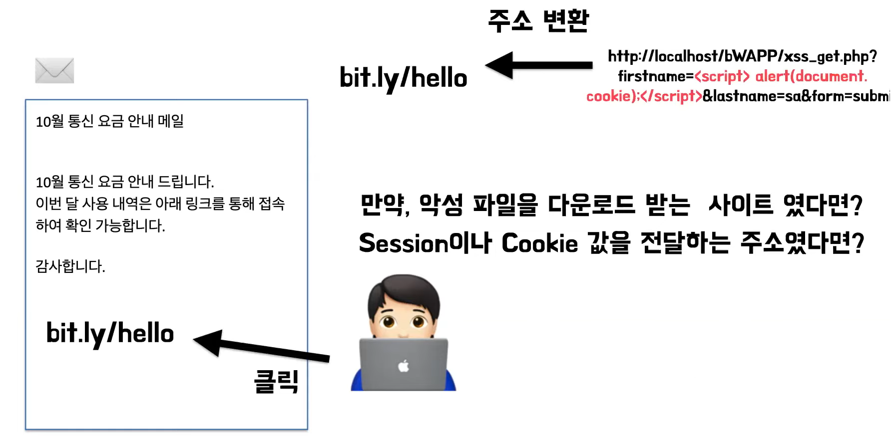

### 대응 방안 
+ 위험문자를 인코딩하는 방식, 특수한 문자를 인코딩해서 사용할 수 없도락 만드는 방식 
+ 라이브러리나 외부 솔루션 사용 

### 그럼 왜 우리가 작성한 코드에서는 발생하지 않았을까?
+ React
  + React는 모든 값을 렌더링하기 전에 이스케이프 치환한다. 
  + 특수문자를 자동으로 변환해서 사용을 한다.  