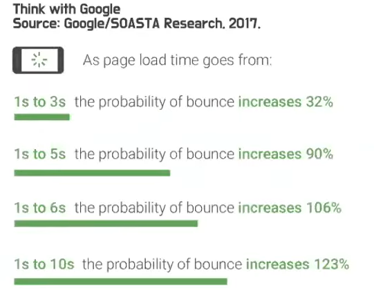
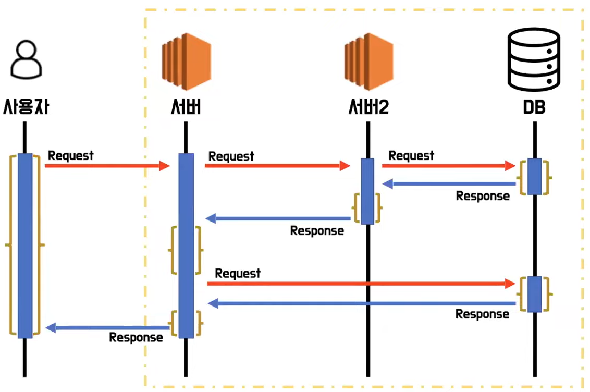
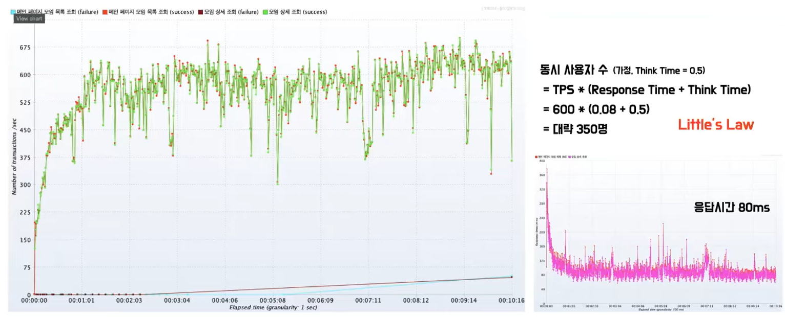
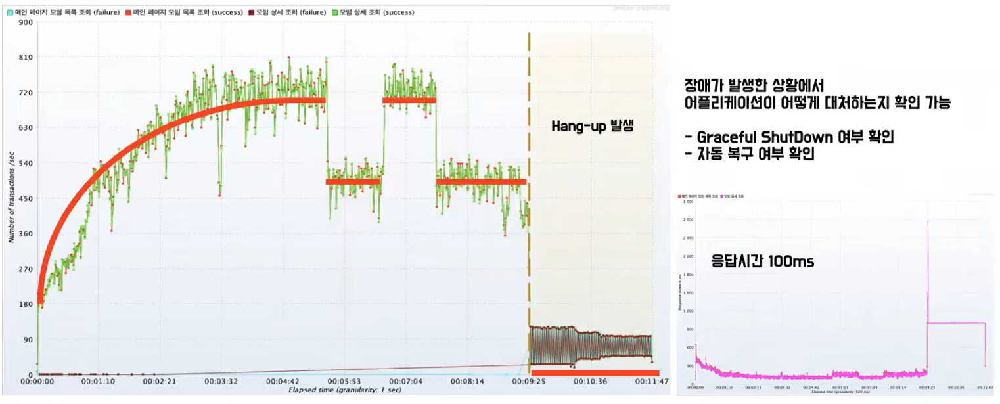

# 이프의 성능 테스트
[https://youtu.be/IcSdPhxCn9Y](https://youtu.be/IcSdPhxCn9Y)

# 이프의 성능 테스트
* toc
{:toc}

## 구글 발표 자료
+ 플랫폼이 느려서 사용자가 이탈하는 상황은 구글이 발표한 자료에도 나타나 있다.
+ 
+ 2017년 구글이 발한 자료 내용
  + 모바일 환경에서 페이지 로드 타임이 1초에서 3초 가까이 되면 서비스 사용자 이탈률이 32%까지 증가
  + 5초 이상 이탈률이 90% 증가
  + 6초이상 이탈률이 106% 증가
  + 10초 이상 이탈률이 120% 증가  

## 응답 대기 시간을 줄이기
+ 
+ 처리 시간을 줄이면 결로적으로 전체 합산인 응답 시간을 줄임으로써 응답 대기 시간을 줄일수 있다. 
+ 처리 시간으 줄일라면 각각의 구성요소에다가 모니터링 시스템을 다 도입을 해야 되는데 그 이유는 일단 리퀘스트와 리스폰스가 오고 가는 그 시점을 확인해서 얼마나 대기를하고 얼마나 처리하는지 시간도 확인 해야 되고 또 메모리 관점에서 아니면 CPU 자원 관점에서
어느정도 트래픽 이런 거를 처리하는지 성능을 제대로 확인하기 위해서는 각각의 구성 요소에다가 모니터링을 둬 가지고 내부적으로 확인할 수 밖에 없다. 
+ DB 같은 경우에는 이제 조회 쪽에서 성능이 너무 안 좋게 나온다고 하면은 조회 쿼리를 개선하거나 인덱스를 걸어서 이제 조회에 대한 처리시간을 극단적으로 줄일수도 있다  
+ 서버 같은 경우에는 너무 과도한 객체가 생성된다, 불필요한 생성이 된다 이로 인해서 GC에 의한 좀 불필요한 지연이 발생한다 하면은 이제 코드 리팩토링을 통해서 그런 문제를 해결할 수 있다. 
+ 이렇게 각각에 대한 처리 시간을 줄인다면 결론적으로 사용자에 대해서 응답 대기 시간을 줄일 수가 있다. 

## 부하 테스트 | 스트레스 테스트 
+ 부하 테스트
  + 병목 현상을 확인하고 목표치까지 개선하는 것이 목적
  + 
    + 일직선으로 유지되는 구간이 보이는데 여기서 포인트가 임계점인데 임계점 이후로 라인이 유지 된걸 확인할 수 있다. 
    + 임계점 부분이 병목현상이 발생한거다.
    + 병목 현상
      + 요청량이 아무리 많이 들어와도 결국 서버에서는 처리할 수 있는 자원량이 정해져 있기 때문에 아웃풋은 한정되어 있다
      + 인풋이 아무리 많아도 아웃풋은 정해져 있다. 
      + 결국은 사용자가 많이 들어와도 이 수치만큼 밖에 성능을 낼 수 없다는 것이다. 
    + 현재 이 그래프 같은 경우에는 톰캣에 대한 쓰레드 개수랑 커넥션 개수 이런 걸 조절해 가지고 임계점 수치를 맞춰놓은 상태이다. 
    + Y축이 TPS, Transaction Per Second 라고 단위 시간당 처리할 수 있는 양이라고 하는데  저러한 수치를 Little's Law라는 계산식이 있는데 TPS나 Response Time 그 소요시간을 곱한 걸 동시 사용자수를 한번 추정을 해서 목표로 하는 그 수치랑 밀접한지
    확인하는 것이다. 
    + 만약에 수치가 이하라면 수치를 개선하기 위해서 성능 설정 값들을 고치고 그 이상이라고 하면은 좋을 수 있지만 오히려 과도한 자원 낭비일수도 있다, 비용을 절감해야하는 부분이다. 
    + 적정한 수치를 맞추는게 좋다.
+ 스트레스 테스트 
  + 과부하 상태에서 어떻게 동작하는지 확인하고 개선하는 것이 목적
  + 
  + 갑자기 끊어지는 부분이 생기고 복구가 되었다가 다시 끊어지고 그다음 완전히 리스폰스가 오지 않는다. 
  + Buckle Zone은 병목현상이 중첩된 상황을 의미한다. 
  + 임계점이 병목현상 때문에 발생한다고 했는데 이 Buckle Zone은 현재 톰켓에 의한 병목현상이 발생을 했을 때 HikariCP에 대한 커넥션 풀 사이즈를 조절 하는 과정에서 병목현상이 한번 더 발생을 했고 그로 인해서 수치가 떨어진 상황이다.
  + Buckle Zone은 병목현상이 중첩이 되가지고 기존의 맥심멈 한계 수치보다 현저히 떨어지는 수치를 유지하는 그래프를 의미한다. 
  + 이거는 스트레스 테스트에서만 발생하는 것이 아니라 부하 테스트에서도 마찬가지로 발생을 하고 그렇게 때문에 부하 테스트를 할 때는 좀 길게 5분에서 10분 가까이만 한 게 아니라 한 30분, 1시간 가까이도 해 보면서 
  이 Buckle Zone이 존재하는지 좀 길게 탐지해볼 필요가 있다. 
  + Hang-up 서버가 멈추는 현상에 대해서 스트레스 테스트는 이렇게 장애가 발생했을 때 발생하는 시점을 관심 있어하는게 아니라 장애가 발생을 했고 그 이후에 몇분 후에 시스템이 마련 되어있다면 자동 복구가 되었는지 확인하고
  자원 관점에서는 이 어플리케이션이 결국엔 강제 셧다운이 된건데 그 셧다운 과정에서 JVM이나 이런 메모리들이 그냥 낭비가 된 건지 아니면은 안저하게 해제가 되고서 셧다운이 된건지 그런 Graceful ShutDown 여부 이런 방식들을 확인한다. 
  + 결국에는 장애가 발생했을때 어떻게 대처하는지 확인한다. 
