# 앤지의 DB Replication
[https://youtu.be/NPVJQz_YF2A](https://youtu.be/NPVJQz_YF2A)

# 앤지의 DB Replication
* toc
{:toc}

## DB Replication이란?
+ Replication: 복제 라는 뜻
+ DB Replication: 데이터베이스를 복제 

## 왜 여러 개의 데이터베이스를 두는 걸까?
+ Case 1 
  + 사용자가 요청을 보냈는데 데이터베이스가 응답하지 않는다. 설상가상 다시 재가동도 되지 않는다.
+ Case 2
  + 요청 트래픽 증가 
  + 트랙픽의 부하 분산이 필요한 상황 
  + 스케일 업에도 한계가 있다. 
+ 위의 상황을 해결하기 위해 데이터베이스 레플리케이션이 등장

## DB Replication의 등장 
+ Source-Replica 구조
  + 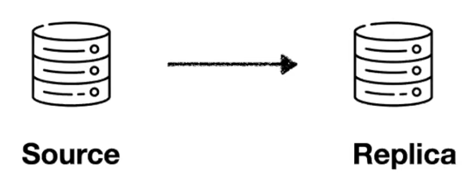
  + 원본 데이터를 가진 데이터베이스 서버가 소스서버
  + 복제된 데이터를 가진 데이터베이스 서버가 레플리카 서버  
  + 소스서버에서 데이터 변경되면 변경된 내용이 레플리카 서버에도 동일하게 반영이 된다.
+ Case 1 해결책 DB 백업 
    + 사용자가 요청을 보냈는데 데이터베이스가 응답하지 않는다. 설상가상 다시 재가동도 되지 않는다. 
     > + 레플리카 서버를 소스서버로 승격시켜 사용할 수 있다.
+ Case 2 해결책 write-read db 분리
  + 요청 트래픽 증가
  + 트랙픽의 부하 분산이 필요한 상황
  + 스케일 업에도 한계가 있다. 
   > + 소스 서버를 Write DB로 레플리카 서버를 읽기 전용인 Read DB로 사용해 부하를 해결할 수 있다.

## 복제는 어떻게 일어나나?
+ 바이너리 로그 기반 복제
+ 바이너리 로그란?
  + 모든 변경사항(이벤트) 이 로그 파일에 순서대로 기록되는 것 
  + 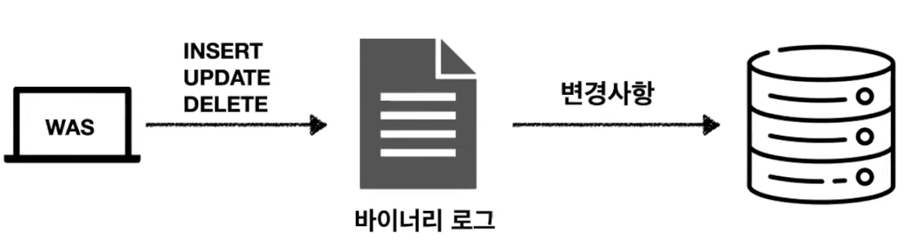
  + 즉 소스서버에 변경이 일어나서 바이너리 로그 이벤트가 기록이 되면 이 이벤트는 레플리카 서버가 자신의 로컬 디스크에 저장을 한 뒤 이 이벤트를 읽어 자신의 데이터 파일에 반영한다.
+ 바이너리 로그 기반 복제
  + 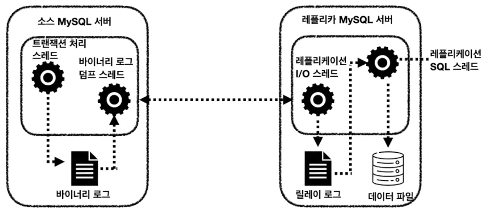
  + 이 복제에 쓰레드는 총 세 가지 쓰레드가 사용되고 있다. 
  + 먼저 소스서버 바이너리 로그의 이벤트가 변경이 일어나면 바이너리 로그 덤프 쓰레드가 이 이벤트를 읽어 레플리카 서버로 전송한다. 
  + 그럼 레플리카 서버의 I/O 쓰레드는 이 변경 이벤트를 자신의 로컬파일인 릴레이 로그에 저장한다. 아직까지 데이터 변경이 레플리카 서버에는 방영되지 않았다. 이를 반영하기 위해 SQL 쓰레드가 변경 내용을 데이터 파일에 저장한다.

## 복제의 타입
+ 소스 서버의 바이너리 로그에 기록된 변경 내역들을 식별하는 방식에 따라 구분 
  + 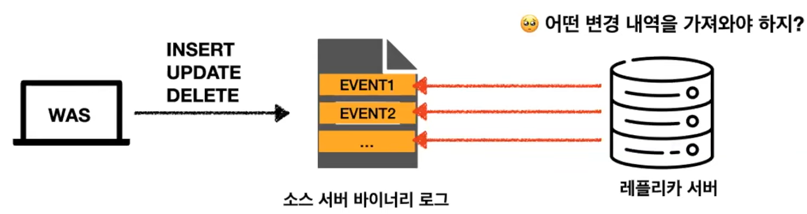
+ 바이너리 로그 파일 위치 기반 복제 
  + 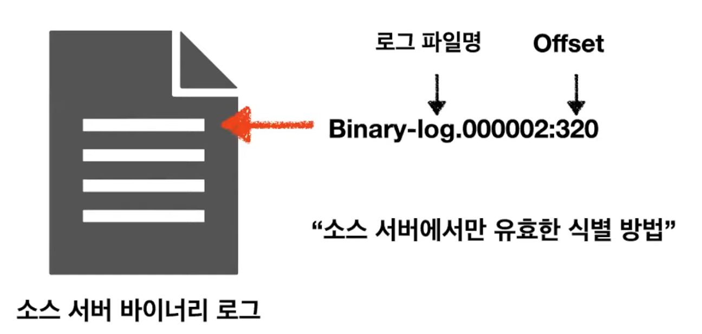
  + 이 방식의 경우 소스서버 바이너리 로그의 로그 파일명과 오프셋을 이용해 식별한다. 
  + 하지만 이런 식별 방식은 소스 서버에서만 유용한 식별 방법이라는 단점이 있다. 
  + 즉 소스서버에 문제가 생겨 다른 레플리카 서버가 소스서버로 승격된 경우 이 복제에 참여하는 다른 데이터베이스 서버들은 이 위치를 다시 찾아야 하기 때문에 복구에 시간이 걸린다.
  + 동일한 이벤트가 레플리카 서버에서도 동일한 파일명의 동일한 위치에 저장된다는 보장이 없다.
  + 그래서 MySQL 5.6 버전부터는 그런 글로벌 트랜젝션 아이디 기반 복제를 기본 복제 방식으로 사용하고 있다.
+ 글로벌 트랜젝션 아이디(GTID) 기반 복제
  + 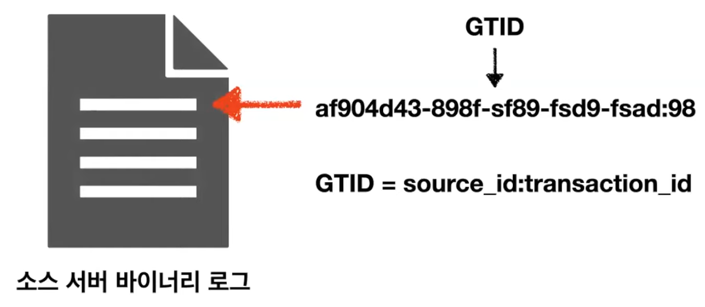
  + 복제에 참여한 모든 데이터베이스들이 고유한 식별값을 가지고 있다. 
  + 이 값들은 모두 동일하기 때문에 동일한 이벤트에 대해서 동일한 글로벌 트랜젝션만 읽어오면 반영할 수 있다.

## 복제 데이터 포맷 (바이너리 로그 포맷)
+ 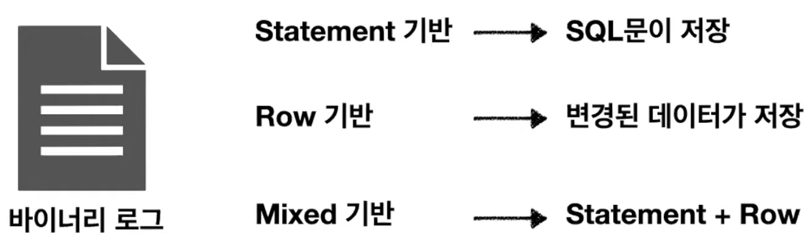
+ Statement 기반 
  + 실행된 SQL 문이 바이너리 로그에 그대로 저장
  + 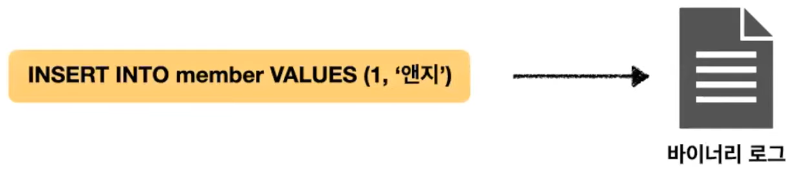
  + 여러개의 데이터를 수정하는 쿼리여도 바이너리 로그에 SQL문 하나만 기록된다.
  + 장점
    + 저장 공간에 대한 부담 감소
    + 빠른 처리 가능 
  + 단점
    + 비확정적 처리 쿼리의 경우 데이터 동기화 문제 발생 (실행할 때마다 결과값이 달라지는 쿼리의 경우 데이터 동기화 문제가 발생할 수 있다.)
      + EX) DELETE, UPDATE 쿼리에서의 ORDER BY절 없이 LIMIT 사용 
    + 하나의 트랙잭션 내에서도 각 쿼리가 실행되는 시점마다 데이터 스냅샷이 달라질 수 있다. 
    + 트랜젝션 격리 수준이 REPEATABLE-READ 이상만 가능
    + 일괄되지 않은 데이터가 저장될 위험이 있다. 
    + 그래서 MySQL 5.7.7 버전부터는 Row기반 바이너르 로그 포맷을 기본으로 사용하고 있다. 
+ Row 기반 
  + 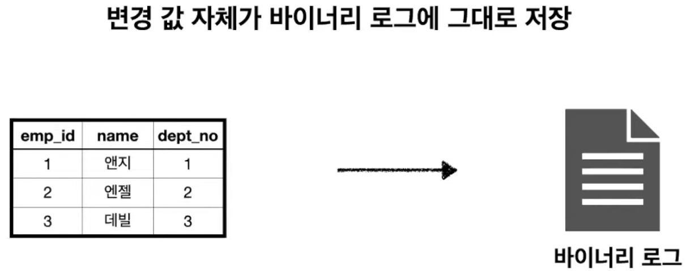
  + 장점
    + 모든 트랜젝션 격리 수준에서 사용 가능
  + 단점
    + 데이터를 많이 변경하는 SQL문이 실행될 경우 바이너리 로그 파일 크기가 커질수 있다.
      + 용량 최적화 방식 지원
      + 바이너리 로그 Row 이미지
      + 바이너리 로그 트랜젝션 압축
    + 어떤 쿼리들이 넘어왔는지 육안으로 확인 불가능 
  + 데이터를 일관되게 저장 하는 가장 안전한 방식 
+ Mixed 형식
  + 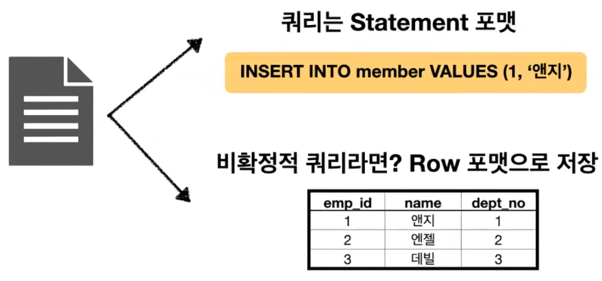

## 복제 동기화 방식
복제가 "잘" 일어났는지 어떻게 확인하나요?
+ 비동기 복제
  + 소스 서버가 레플리카 서버에서 변경 이벤트가 정상적으로 전달 됐는지 확인하지 않는다.
  + 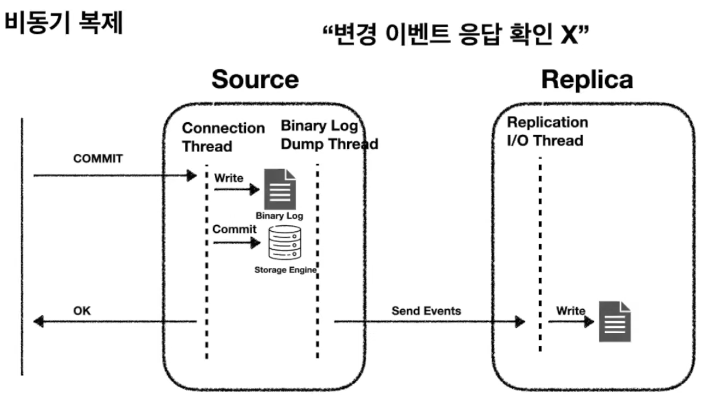
  + 데이터 변경 요청이 들어왓을 때 바이너리 로그의 이벤트를 먼저 작성한 후 바로 소스 서버에 스트로지 엔진에 커밋을 하게 된다. 그 이후에 변경 이벤트를 레플리카 서버로 전송한다. 
  + 이러한 방식의 경우 변경 이벤트를 레플리카 서버로부터 소스서버로 확인 이벤트를 보재니 않는다. 
  + 성능은 빠지만 동기화는 보장하지 않는다. 
  + MySQL 5.5 버전부터는 반동기 복제 방식을 사용한다. 
+ 반동기 복제
  + 소스 서버는 레플리카 서버가 소스 서버로부터 전달 받은 변경 이벤트를 릴레이 로그에 기록 후 응답을 보내면 그때 트랜젝션을 완전히 커밋한다. 
  + 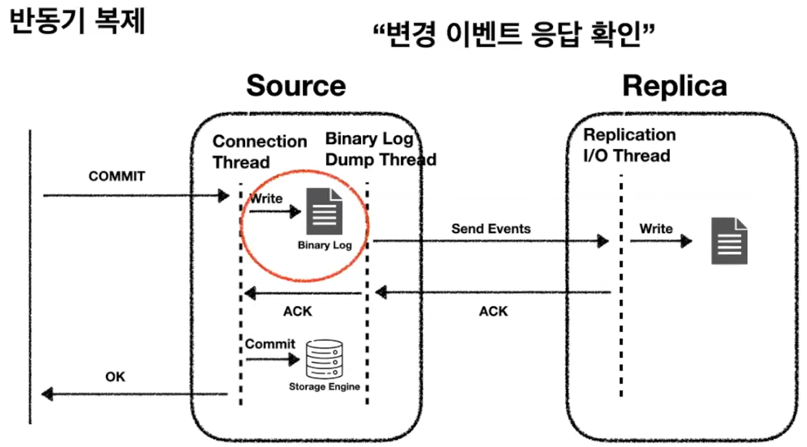
  + 데이터 변경 요청이 소스 서버로 들어오면 바로 이벤트를 바이너리 로그에 기록한 후 이 변경 이벤트를 레플리카 서버로 전송한다. 
  레플리카 서버는 이 변경 이벤트를 잘 받았다는 응답을 보내게 되고 이 응답이 오고 난 이후에 소스 서버는 변경 내역을 스토리지 엔진의 커밋한다.
  + 이런한 방식에서 레플리카 서버가 보내는 응답은 변경 이벤트를 잘 받았다는 응답이지 이벤트가 레플리카 서버에 적용되었다는 응답을 보내는 것은 아니다. 

## 복제 구성 형태 (복제 토폴로지)
+ 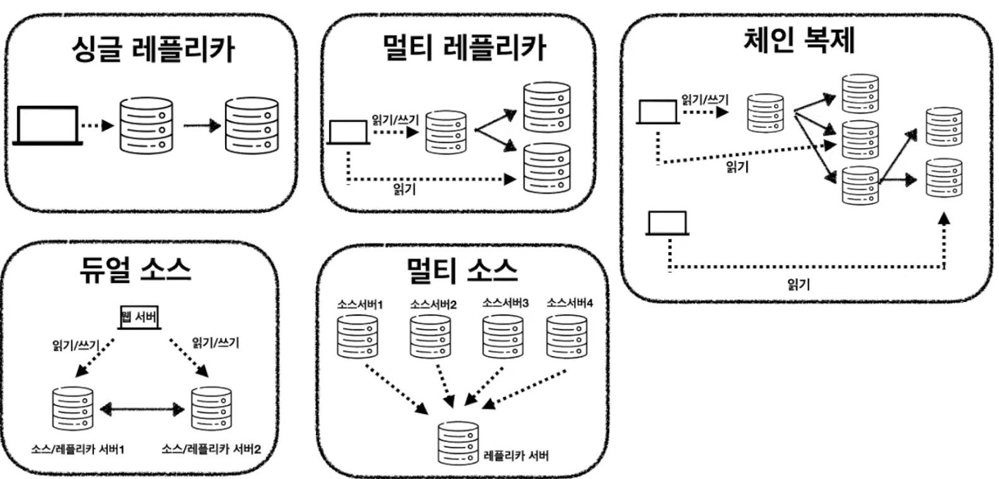
+ 싱글 레플리카 
  + 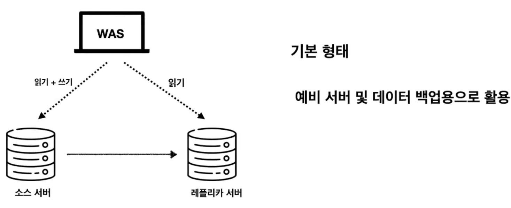
  + 소스서버 한대와 레플리카 서버를 한대 두는 싱글 레플리카 방식
  + 레플리카 서버는 예비 서버 및 데이터 백업 용으로 활용
+ 멀티 레플리카
  + 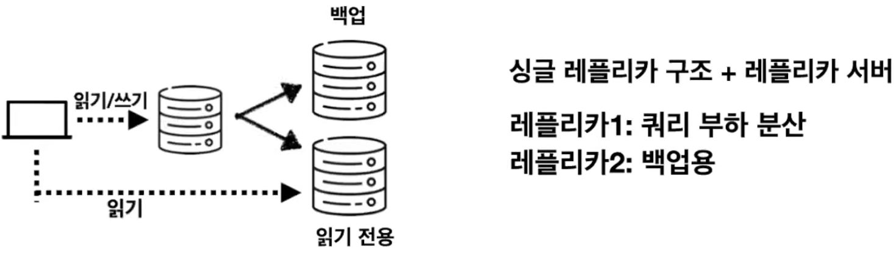
  + 싱글 레플리카 구조에 레플리카 서버를 한대 더 준 멀티 레플리카 방식
  + 여기서 레플리카 두 대를 사용하는데 레플리카 첫번째는 쿼리 부하 분산용으로 두번째는 서버 백업 용으로 사용할 수 있다. 
+ 체인 복제 
  + 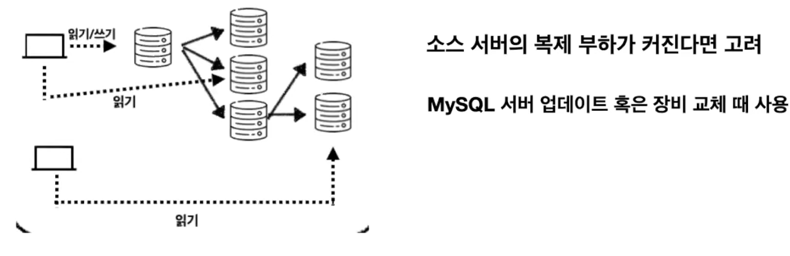
  + 소스서버에 연결된 레플리카 서버가 많다면 소스 서버에 복제부하가 커지게 된다. 이런 경우 다른 레플리카 서버를 소스 서버로 활용해 복제 부하를 분산시키는데 사용할 수 있다. 
  + 또한 서버 업데이트 혹은 장비 교체 때도 체인 복제 구성을 사용할 수 있다. 
+ 듀얼 소스 복제 
  + 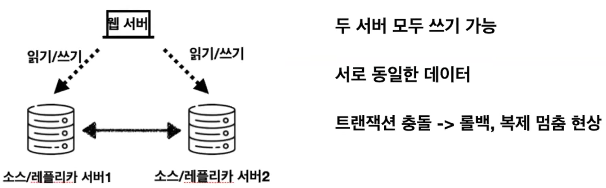
  + 두 서버 모두 쓰기가 가능한 형태
  + 두 서버 모두 서로 동일한 형태의 데이터를 가지고 있다. 
  + 트랜젝션 충돌이 일어날 경우 롤백, 복제 멈춤 현상이 일어나기 때문에 잘 사용되지 않는 토폴리지 이다.
+ 멀티 소스 복제 
  + 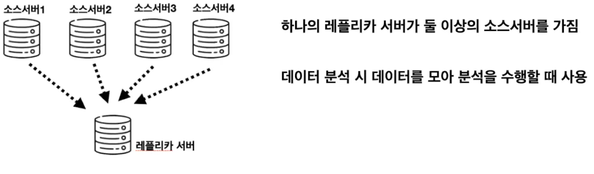
  + 레플리카 서버 한대에 소스 서버가 여러대 연결된 형태
  + 소스서버에 흩어져 있는 데이터들을 한데 모아 데이터를 분석할 때 사용할 수 있다. 

## 복제를 하다가 레플리카 서버에 문제가 생겼다! 

### 크레시 세이프 복제
레플리카 서버에 문제가 생긴다면?
+ MySQL은 크레시 세이프 복제라는 방식을 제공하고 있다.
+ 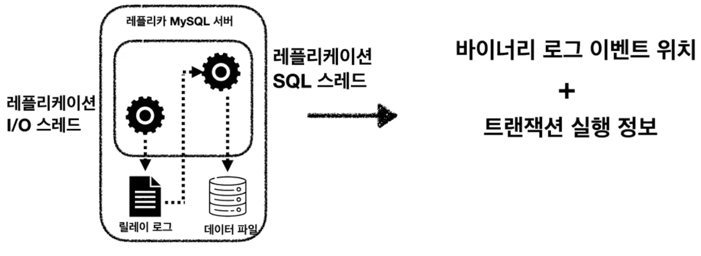
+ 레플리카 서버는 I/O 쓰레드와 SQL 쓰레드를 이용하여 소스 서버에 바이너리 로그 이벤트 위치를 읽을 때와 트랜잭션 실행정보를 읽을 때 어디까지 읽었는지에 대한 포지션 정보를 로컬에 저장해 두게 된다.
레플리카 서버에 문제가 생겨 다시 재가동했을 때 그 정보를 기반으로 다시 소스서버에 동기화를 이뤄낸다. 

## 복제 고급 설정
+ 지연된 복제
+ 멀티 스레드 복제
+ 크레시 세이프 복제
+ 필터링된 복제 

