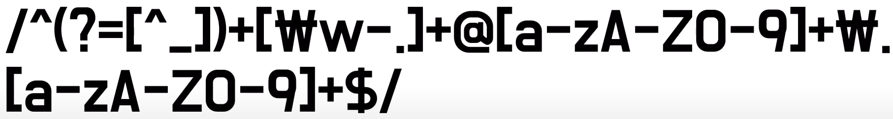
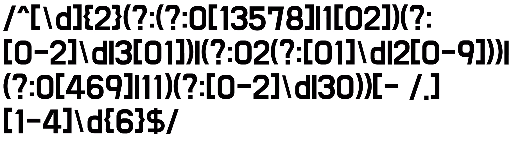

# 동키콩의 RegExp의 효율적 활용
[https://youtu.be/_eEZqTx5N7s](https://youtu.be/_eEZqTx5N7s)

# 동키콩의 RegExp의 효율적 활용
* toc
{:toc}

## 정규표현식 기본 문법(메타 문자)
+ 정규표현식은 스트블 클레이니가 정규 집합이라는 수학적 개념을 이용해서 정규 언어를 기술한 1956년이 기원 
+ /ABC/
  + 단순한 문자 ABC 찾기 
+ /\d/
  + digit 약자
  + 숫자 Selecting
  + 대문자 D -> 숫자가 아닌 문자 Selecting ([^/d])
+ /\w/
  + word의 약자
  + 대문자, 소문자, _(언더스코어) 포함
  + 대문자 W는 word가 아닌 것들 
+ /\s/
  + \s는 tab, space 등 공백을 나타낸다
  + \b도 이와 유사
  + \b는 boundary, ^(문장의 시작), $(문장의 끝) 처럼 위치를 나타낸다.

## 정규표현식 기본 문법(수량자)
+ /a{n,m}/
  + /a{n,m}/은 a가 n번 이상 m번 이하 반복됨을 뜻한다. 
+ /a?/
  + a가 0또는 1개 임을 뜻한다. (/a{0,1}/과 동일) 
+ /a+/ 
  + a가 1번 이상 반복됨을 뜻한다. (/a{1,}/과 동일)
+ /a*/
  + a가 0번 이상 반복됨을 뜻한다. (/a{0,}/과 동일)

## 정규표현식 기본 문법(Group)
+ ()
  + 기본 Grouping
  + 전체 문장이 Group0이므로 Group1 부터
+ (?:)
  + 캡처링 하고 싶지 않을 때 사용
  + 캡처링에서 생략되고 다은 인덱스 부터 이어서
+ (?<groupName>)
  + 캡처링한 Group에 Naming 지정 가능
  + match, exec의 group프로퍼티에서 해당 name으로 접근 가능 
+ (?=)
  + 전방탐색
  + 일치 영역을 발견해도 그 값을 반환하지 않는다. 

## 정규식표현식 활용 예시

### Mobile Phone Number
+ 요구사항 작성하기
  + 첫 세글자는 01x(x는 숫자)의 형태이다.
  + 구분자는 -. 공백, /을 허용한다.
  + 두번째 구역은 3글자 이상 4글자 이하, 마지막 구역은 4글자의 숫자로 이루어진다. 
  + 
+ 테스트하기
  + [https://regexr.com/](https://regexr.com/)

### 이메일
+ 

### 주민등록번호
+ 

## JavaScript에서의 정규표현식 활용
+ 
  + g: global의 약자, 전 구역을 복수로 검사
  + i: ignore의 약자, 대소문자 구분하지 않는다.
  + m: multiline의 약자, 다중행 검사 
+ JS에서 정규 표현식을 활용하는 메소드
  + String.prototype.match()
    + 정규식과 겹치는 전체 문자열을 첫 번째 요소로 포함하는 Array를 반환한 다음 괄호 한에 캡처된 결과를 리턴
  + RegExp.prototype.test() 
    + 주어진 문자열이 정규표현식을 만족하는지를 Boolean으로 반환
  + String.prototype.replace() 
    + 패턴이 일치하는 문자열의 일부 또는 모든 부분을 교체한 문자열을 반환한다. 
    + 두번째 인자에 함수를 넣을 수 있다.
      + match: 매치된 문자열
      + p1,p2,... 그룹화된 문자열 순서대로
      + offset: 매치된 물자열의 index
      + string: 조사된 전체 문자열 
+ 정규표현 엔진은 백트래킹 사용
  + 최악의 경우 O(2^N)
  + 따라서 일반 내장 메소드난 for문 보다 크진 않지만 성능상 떨어질 수 있다. 
+ 기본적으로 정규표현시은 가독성이 좋지 않다 
+ 간단한 로직은 내장 메소드, 함수 분리, 복잡하고 복합적인 로직은 정규표현식

