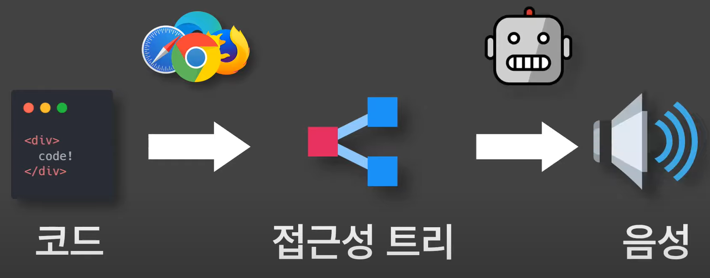

# 블링의 웹 접근성
[https://youtu.be/yLZZi5E7NTU](https://youtu.be/yLZZi5E7NTU)

# 블링의 웹 접근성
* toc
{:toc}

## 왜 웹 접근성을 고려해야 할까요?
+ 모든 사람들이 동등하게 서비스를 이용 

## 웹 접근성을 준수하는 방법 
+ 스크린 리더가 코드를 어떻게 인식하는지
  +  
  + 브라우저는 코드를 전달 받고 화면에 렌더링하기도 하지만 동시에 스크린 리더가 읽을 수 있는 형식으로된 접근성 트리를 만든다.
  + 스크린 리더는 이 접근성 트리를 토대로 요소를 탐색하게 된다. 
+ Accessible Name
  + 접근성 트리에 표시되는 요소 이름 = 스트린 리더가 읽는 요소의 이름 
  + 버튼의 겨우
    + 부모 요소의 이름이 설정되지 않았을 때 자식 요소의 이름을 모아서 하나로 읽음
    + 끝에 "버튼"이라는 명칭 추가 
+ 버튼의 자식 요소로 텍스트가 아닌 이미자 일때 
  + 브라우저는 접근성 트리를 만들며 해당 요소의 이름을 찾으려고 한다. 
  + alt 속성에 빈 값이 들어가 있는 경우 그 이름은 빈 문자열이 된다. 
  + 그렇게 만들어지는 접근성 트리의 일부이다. 
  + 스트린 리더는 이 요소를 버튼이라고 읽을 수밖에 없게 된다.
+ alt 속성의 값을 의미에 적절하게 추가
  + 브라우저가 해석해서 버튼의 이름에 실제 버튼의 역할이 들어간다. 
+ 메시지 div 일 경우 스크린리더가 읽을수 있게 할려면 해당 요소에 role="alert"를 추가하면 된다. 
  + 브라우저는 이를 접근성 트리를 만들 때 반영할 것이고 
  + 접근성 트리에 alert 요소가 나타나면 이제는 스크린 리더가 사용자에게 전달할 요소가 발생했음을 인지하고 메시지를 읽어 줄 것이다. 

## 유용한 도구 소개 
+ WAVE - web accessibility evaluation tool
  + 접근성을 준수하는지 평가해주는 확장프로그램 
+ Chrome Developer Tools - Accessibility
  + DOM 요소를 확인할 수 있는 탭에서 실험적인 기능을 활성화하면 접근성 트리를 바로 확인할 수 있다. 
  + 크롬 개발자 도구에 내장되어 있는 Lighthouse 기능을 이용하면 페이지의 성능과 Best Practice 확인, 계산된 접근성 점수도 확인할 수 있다. 
+ NVDA - Non Visual Desktop Access
  + 무료 스트린리더 

  

