# 앨버의 리액트 렌더링 최적화
[https://youtu.be/1YAWshEGU6g](https://youtu.be/1YAWshEGU6g)

# 앨버의 리액트 렌더링 최적화
* toc
{:toc}

## 브라우저 렌더링
+ 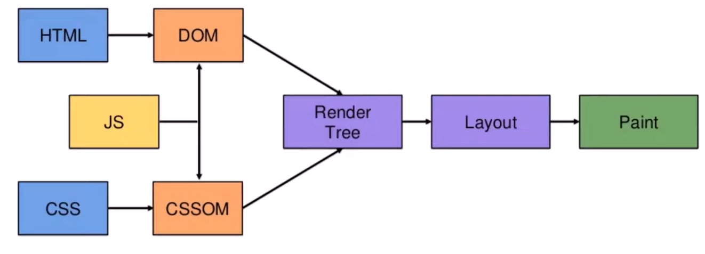
+ HTML 파싱을 해서 DOM을 만들고 CSS를 파싱해서 CSSOM을 만든다
+ DOM과 CSSOM을 활용을 해서 렌더트리를 만들어준다.  
+ layout과 repaint 과정을 거쳐 화면에 웹사이트가 렌더링 된다. 

## 리액트에서의 렌더링 
+ 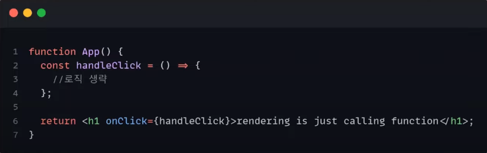
+ 리액트에서읠 렌더링 === 함수를 호출하는 것 
+ 불필요한 리렌더링 발생
  + 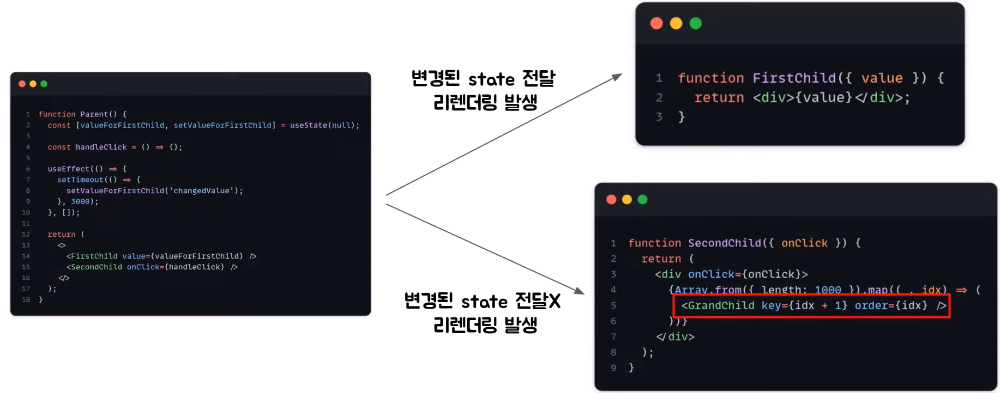
+ profiler devtools
  + React Developer Tools -> Profiler
  + 웹사이트의 컴포넌트들이 어떻게 렌더링 되고 있는지를 보여주는 도구이다.
  + profiler를 이용해서 렌더링에 대한 정보를 수집할 수 있다는데, 어디 부분에서 렌더링이 오래 걸리고 불필요한 렌더링이 걸리는지를 확인해야 한다면 이 profiler가 용이하게 사용될 수 있다. 
+ 불필요하게 일어나고 있는 리렌더링을 막아줄 수는 없을까?
+ 리렌더링이 되는 조건
  + state가 바뀌었을 때 
  + props가 바뀌었을 때
  + 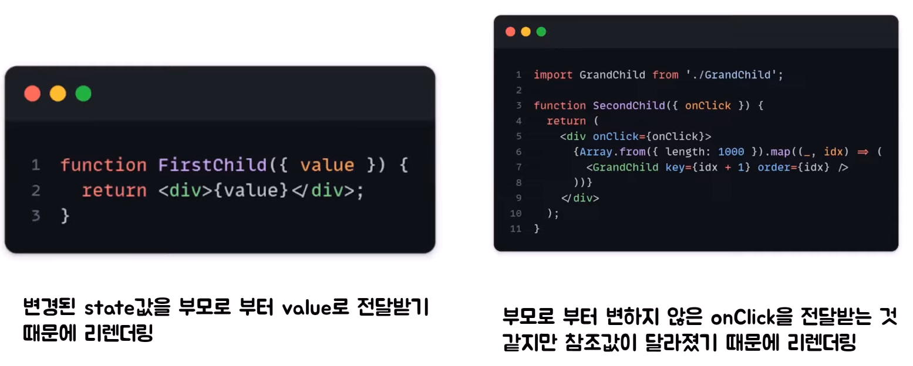
    + Parent 컴포넌트의 state가 변경이 되면 FirstChild 컴포넌트에게 전달되는 props값이 달라졌기 때문에 FirstChild 컴포넌트가 리렌더링이 된다. 
    + 하지만, secondChild 컴포넌트는 Parent 컴포넌트의 변경된 state가 아닌 함수만을 props로 받고 있기 때문에 state와 props중 변한 것이 없는 것처럼 보인다. 
      + 코드 상으로는 리렌더링 되지 않는 것처럼 보인다. 
      + 로그 상으로는 리렌더링 되는 것으로 확인된다. 
        + 이유는 매번 Parent 컴포넌트가 리렌더링 될 때마다 handleClick이라는 함수가 재생성이 되고 이전의 handleClick과 현재 handleClick 함수는 서로 다른 참조 값을 가지게 되고 이 둘은 서로 다른 함수이다
        + 이는 함수가 참조 타입의 데이터이기 때문이다. 
        + handleClick 함수가 매번 재 생성되기 때문에 props가 달라지면 컴포넌트가 리렌더링 된다 라는 조건이 충족되면서 secondChild 컴포넌트가 리렌더링 되는 것이다. 
  + 함수의 참조 값을 유지할 수 있을까? -> react에서 제공하는 userCallback hook

## useCallback
+ 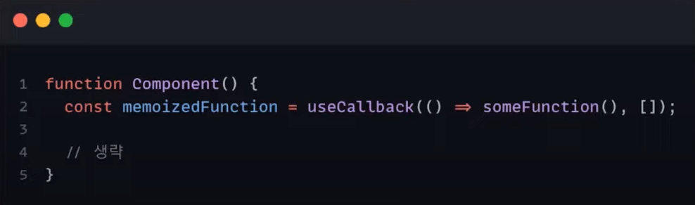
+ 함수를 메모이제이션 해주는 hook 
  + 여기서 메모이제이션이란 기존에 수행한 연산의 결과값을 어딘가에 저장해 두고 필요할 때 재 사용하는 기법이다. 
+ useCallback으로 함수를 감싸주게 된다면, 의존성 배열이 변하지 않는 이상 컴포넌트가 리렌더링 될 때마다 변수에 같은 함수가 할당이 된다. 
+ useCallback 적용
  + 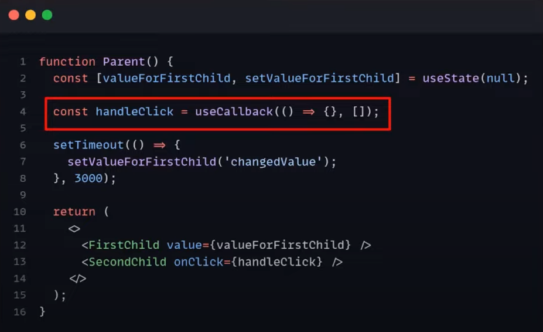
  + 확인 결과 예상한 것과는 달리 secondChild 컴포넌트가 리렌더링 된다. 
    + Parent 컴포넌트를 Babel로 컴파일 하면 Parent 컴포넌트의 return문 안에는 firstchild 컴포넌트와 secondchild컴포넌트에 해당하는 React.createElement가 존재한다.
      + React.createElement 란?
        + 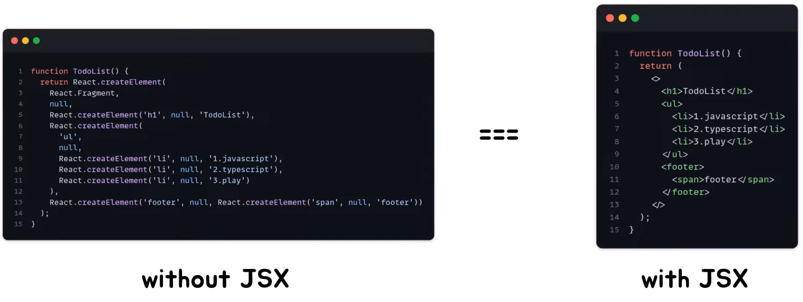 
        + react.createElement는 새로운 리액트 앨리먼트를 생성해서 반한해 준다.
    + Parent 컴포넌트가 리렌더링이 되면 내부의 로직들이 다 실행이 되면서 secondChild 컴포넌트에 해당하는 createElement도 당연하게 실행된다. 
      + 그래서 아무리 useCallback을 사용해서 secondChild 컴포넌트에 전달되는 props를 이전과 동일하게 해주었더라도 이에 상관없이 리렌더링이 된다. 
+ 현재 useCallback을 사용했을 때 렌더링 최적화에 아무런 효과가 없는 걸까? 
  + 효과가 있다
    + 리액트에서의 렌더링 추가 설명
      + Render Phase
        + 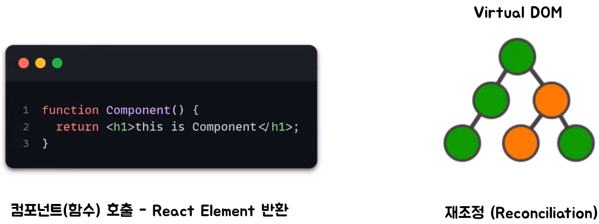
        + Render Phase에서는 컴포넌트를 호출하여 리액트 앨리먼트를 반환하고 새로운 virtual DOM을 생성해 준다. 
        + 만약 이번이 첫 번째 렌더링이 아니라면 재조정 과정을 거친 후 Real DOM에 변경이 필요한 목록들을 체크한다.
        + 재조정이란 간단히 말해서 이전 virtual DOM과 현재 virtual DOM을 비교하는 과정이다.
      + Commit Phase
        + 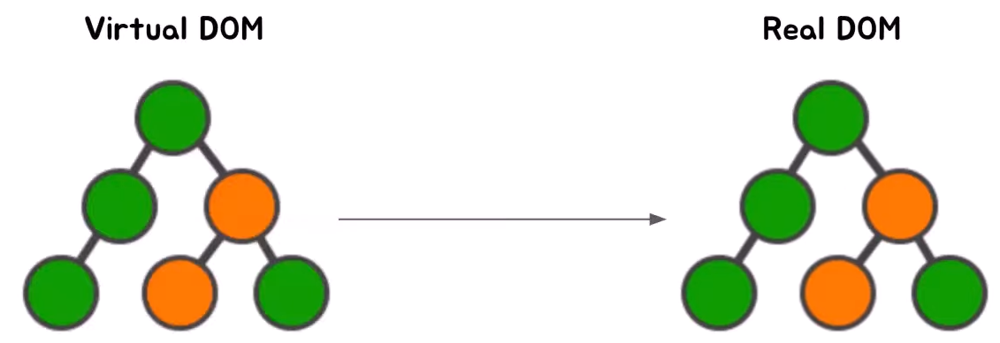
        + Render Phase 이후에는 Commit Phase가 존재
        + Render Phase에서 체크해놓았던 변경이 필요한 부분들을 Real DOM에 반영해 주는 단계이다. 
        + 만약 변경이 필요한 부분들이 없다면 Commit Phase는 skip이 된다.  
      + 정리하를 해보면 리액트에서 렌더링이 일어날 때마다 재조정 과정이 포함된 Render Phase와 Commit Phase로 구성된 렌더링 프로세스를 거치게 되는 것이다.
  + Render Phase는 실행되지만 useCallback을 활용해서 props 값을 이전과 같게 유지해주었기 때문에 Commit Phase는 실행되지 않는다.
  + Render Phase 조차 막아줄 수는 없을까? -> react에서 제공하는 React.memo

## React.memo
+ 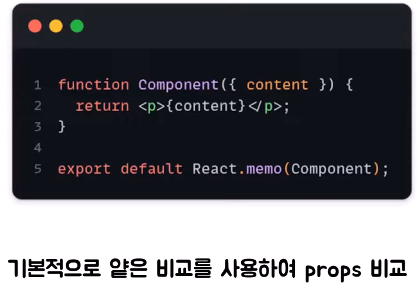
+ React.memo는 전달받은 props가 이전 props와 비교했을 때 같으면 컴포넌트의 리렌더링을 막아주고 마지막으로 렌더링 된 결과를 재사용하는 고차 컴포넌트이다.
+ React.memo가 props를 비교할 때는 기본적으로 얕은 비교를 통해서 진행한다.
  + 얕은비교란
    + 원시 타입의 데이터인 경우는 값이 다른지 비교
    + 참조 타입의 데이터는 참조 값이 같은지를 비교 
    + 두 번째 인자로 비교 함수를 넣어주게 되면 해당 함수를 활용해서 비교를 해주도록 해줄 수도 있다.
+ React.memo 적용
  + 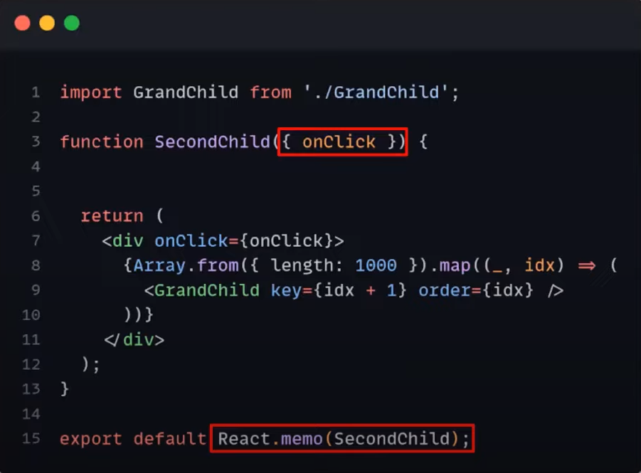

## 객체를 props로 넘겨주게 된다면?
+ 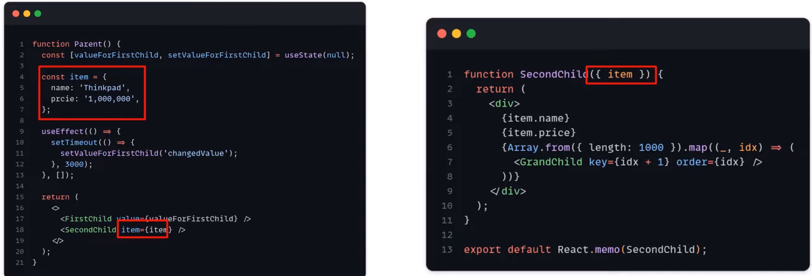
+ 만약 secondChild 컴포넌트에 변하지 않는 item에 대한 정보가 필요하다는 새로운 기획이 추가되었다고 가정 
+ 이제는 handleClick은 필요하지 않고 item에 대한 정보만 필요해서 item이란 객체를 Parent 컴포넌트에서 생성하여 secondChild 컴포넌트로 전달하는 상황에서 Parent 컴포넌트가 리렌더링이 되면 secondChild 컴포넌트도 리랜더링이된다. 
  + React.memo가 secondChild 컴포넌트에 적용돼어있지만 리랜더링이된다
  + 이유
    + 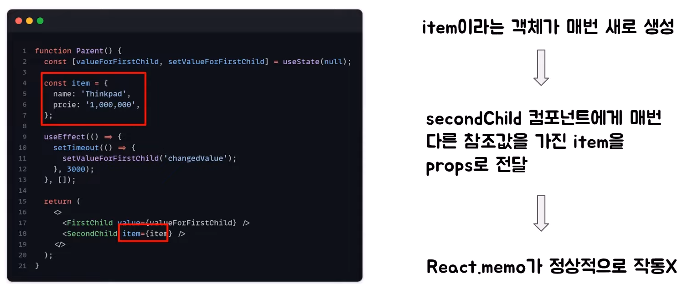
    + secondChild 컴포넌트 입장에서는 parent 컴포넌트로부터 매번 다른 item을 전달 받기 때문이다.
    + Parent 컴포넌트가 리렌더링 될 때마다 item 객체가 새로 생성이되고 객체도 참조 타입의 데이터이기 때문에 매번 다른 참조 값을 가지게 된다. 
    + 그래서 이전의 props와 현재의 props를 비교해서 같으면 컴포넌트의 렌더링을 방지해주는 React.memo가 정상적으로 작동이 되지 않는다. 
    + 이때는 react에서 제공하는 useMemo hook을 사용

## useMemo
+ 
+ useCallback은 함수에 대한 메모이제이션을 제고하는 hook이었다면 useMemo는 값에 대한 메모이제이션을 제공하는 hook이다.
+ 의존성 배열에 들어있는 값이 변경되지 않는 이상 매번 리렌더링 될 때마다 같은 값을 반환해주게 된다.
+ useMemo 적용
  + 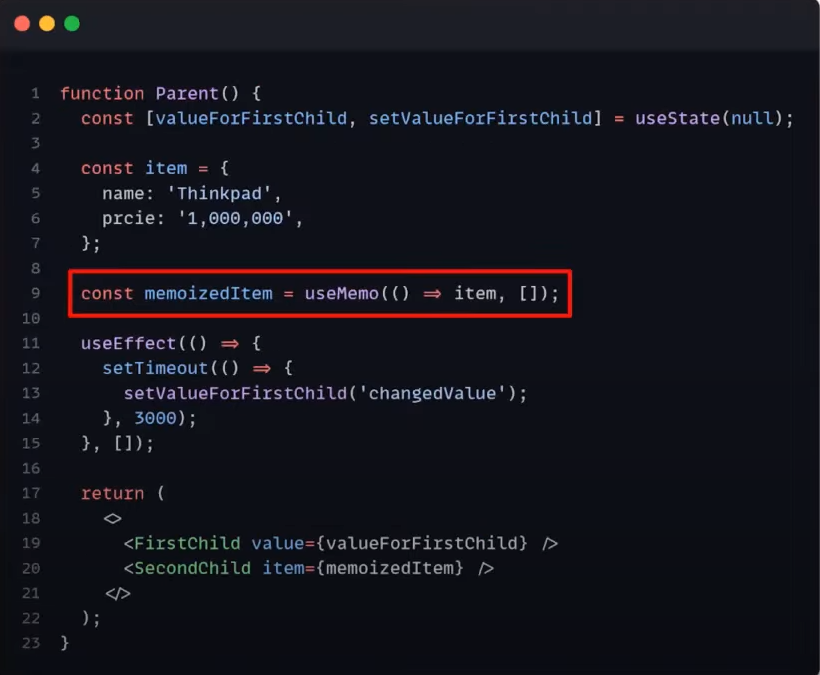

## 포인트

### 무작정 사용해주는 것이 맞을까?
+ useCallback, useMemo, React.memo를 모든 곳에서 사용해주면 좋을까?
  + 하나하나 모두 비용이라고 생각하면된다. 
  + 예를 들어, 리렌더링이 자주 되는 컴포넌트라고 해서 컴포넌트 내부의 함수를 무작성 useCallback으로 감싸주는 경우도 있을 것이고 부모로 부터 전달반은 props가 매번 바뀔 수 밖에 없는 상황에서 자식 컴포넌트에 Reack.momo를 적용해주는 경우도 있을 것이다.
  이러한 상황들에서는 최적화를 시도하기 전보다 웹 사이트 성능이 더 안좋아질 수도 있다. 

### 근본적이 코드를 먼저 개선하자
+ 최적화 도구들을 사용하기 전에 근본적인 코드를 개선
  + 불필요한 렌더링이 발생하지 않도록 처음부터 코드를 작성

