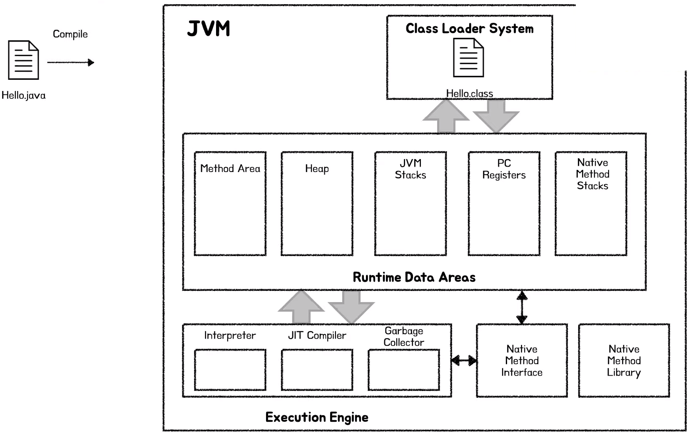
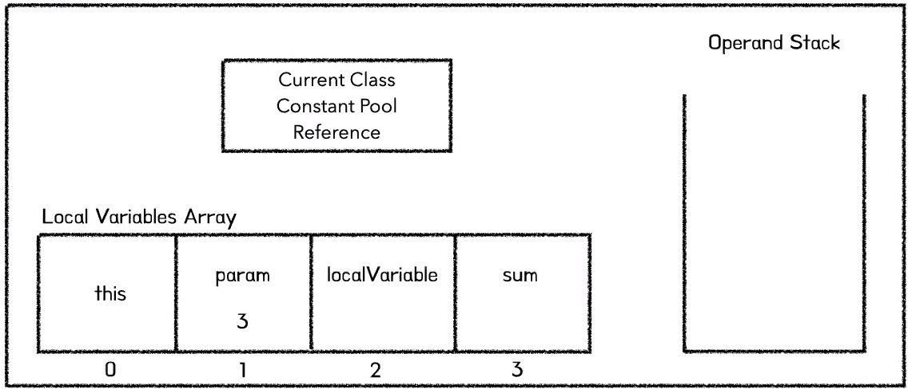
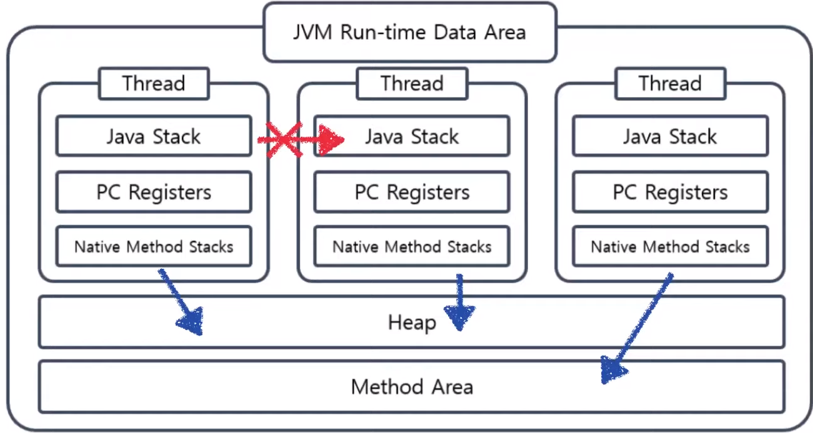

# 어썸오의 JVM Memory Layout 
[https://youtu.be/GU254H0N93Y](https://youtu.be/GU254H0N93Y)

# 어썸오의 JVM Memory Layout
* toc
{:toc}

## JVM 내부
+ 
+ Java 소스 코드를 작성하고 Java 컴파일러(Compiler)를 통해 컴파일을 하면 Java class 파일(.class)이 생성이된다. 
+ Java 명령(java Hello)으로 해당 클래스 파일을 실행하면 JVM은 클래스 로더(Class Loader)를 통해 클래스 파일를 읽어들인다. 
+ 클래스 파일 안에는 클래스 안에 어떤 필드(field)가 몇 개 선언돼 있는지 메서드(method)는 몇 개고, 이름이 뭔지, 바이트코드(bytecode)까지 포함해서 클래스에 대한 모든 정보가 들어있다.
+ 클래스 로더 시스템은 이 클래스 파일 정보를 메모리에 올리고 검증하고 static(정적, 컴파일 이후 변하지 않는)변수들을 초기화하는 등의 역할을 한다. 
+ Runtime Data Area는 JVM이라는 가상 머신(virtual machine)이 사용하는 메모리 공간이다. 
+ 클래스 파일에 들어있는 정보가 클래스 로더에 의해 Method Area에 올라간다. 
+ 클래스 파일안에 있는 여러 정보 중에 바이트코드(bytecode)란 JVM이 알아들을 수 있는 명령어 집합을 말한다.
+ JVM의 목적은 바이트코드를 기계어로 번역해서 CPU에게 일을 시키는 것이다.
+ 바이트코드를 기계화로 변역하는 일을 인터프리터(Interpreter)가 수행한다.
+ Runtime Data 영역은 다섯 가지 요소로 구성되어있다.
+ 메서드 영역(Method Area)은 클래스에 대한 정보가 저장되는 영역이다. 클래스에 대한 모든 정보가 저장된다. 
+ Heap에는 런타임에 생성되는 모든 객체들이 저장된다. Garbage Collector(GC)가 주로 여기서 동작한다. 
+ Method Area와 Heap은 모든 스레드(thread)가 공유하는 영역이다. 따라서 멀트스레드(multi-thread) 프로그래밍을 할 때 동기화(synchronization)에 주의해야 하는 영역이다. 
+ JVM Stacks는 메서드를 실행하기 위한 정보들이 저장되는 공간이다. JVM Stacks 내부에는 프레임(Frame)이라는 자료구조가 들어가는데 프레임은 메서드 하나 호출될 때마다 새로 생기고 메서드가 끝나가나 예외가 터지면 사라진다. 
+ 프레임 안에는 현재 클래스의 Constant Pool에 대한 참조, Local Variables Array(지역 변수 배열) 그리고 Operand(피연산자) Stack이 있다.  
  + 
+ 지역 변수 배열은 말그대로 메서드 내에 지역 변수들을 담고 있는 배열이다. 그리고 인스턴스 메서드는 항장 제이 첫번째 인덱스에 현재 인스턴스에 대한 참조를 가지고 있다. 
+ JVM은 Stack 기반으로 연산을 수행하는데 피연산값(Operand) 혹은 연산 중간 값들을 저장하기 위한 자료구조로 Operand Stack을 사용한다. 
+ PC Registers는 현재 실행되고 있는 명령어 주소를 저장하고 있다. multi-thread 프로그래밍 환경에서 한 thread가 작업 하다가 다른 thread로 잠시 CPU 점유를 넘겨주고 다시 돌아왔을 때 이전에 어떤 명령을 수행하고 있었는지를 
기억하고 있어야 이전 작업을 다시 이어서 수행할 수 있다. 
+ Native Method Stacks는 C나 C++로 작성된 메서드를 실행할 때 사용하는 Stack이다. 
+ JVM Stack, PC Registers, Native Method Stack 는 thread가 생성될 때마다 같이 생성이 되고 서로 다른 thread가 침범할 수 없는 영역이다. 
  + 
  + 각 thread는 하나의 Heap과 Method Area에 동시에 접근할 수 있다. 
  + 하나의 thread는 다른 thread의 내부 데이터에 접근할 수 없다. 하나의 메서드 안에서 지역 변수 동시성 문제(Concurrency Problem)를 걱정하지 않아도 되는 이유이다.
+ 클래스 파일에는 클래스 파일의 버전 정보, 접근 제어자(access modifier), 슈퍼 클래스(supper class), 선언되 필드, 메서드 등 해당 클래스의 모든 정보가 담겨 있다. 
+ Constant Pool은 클래스 내에 사용되는 상수(constant)들을 담은 테이블이다. 
+ 참조하는 대상의 이름만을 지칭하는 것을 심볼릭 레퍼런스(symbolic refernce)라고 한다. 
+ 클래스가 아직 Method Area(메서드 영역)에 로드(load)되지 않았다면 클래스 로더(Class Loader)에게 요청을 보내 해당 클래스를 메모리에 로드하도록 한다. 
그리고 Symbolic Reference를 해당 클래스 데이터를 직접 가르키는 참조로 바꾼다. 이를 Constant Pool Resolution이라고 부른다.
  + JVM은 해당 클래스 객체를 할당하는데 얼마만큼의 Heap 공간이 필요한지 알아내기 위해 다시 Constant Pool을 바라본다. 
  + JVM은 항상 메서드 영역에 저장된 클래스 정보를 보고 객체를 할당하는데 필요한 메모리 크기를 결정한다. 이에 필요한 모든 정보가 Method Area(메서드 영역)에 있기 때문이다. 
  + JVM이 객체를 위해 필요한 Heap 공간의 크기를 결정하면 Heap 공간을 할당하고 인스턴스 변수같은 초기 값으로 초기화 한다. 
