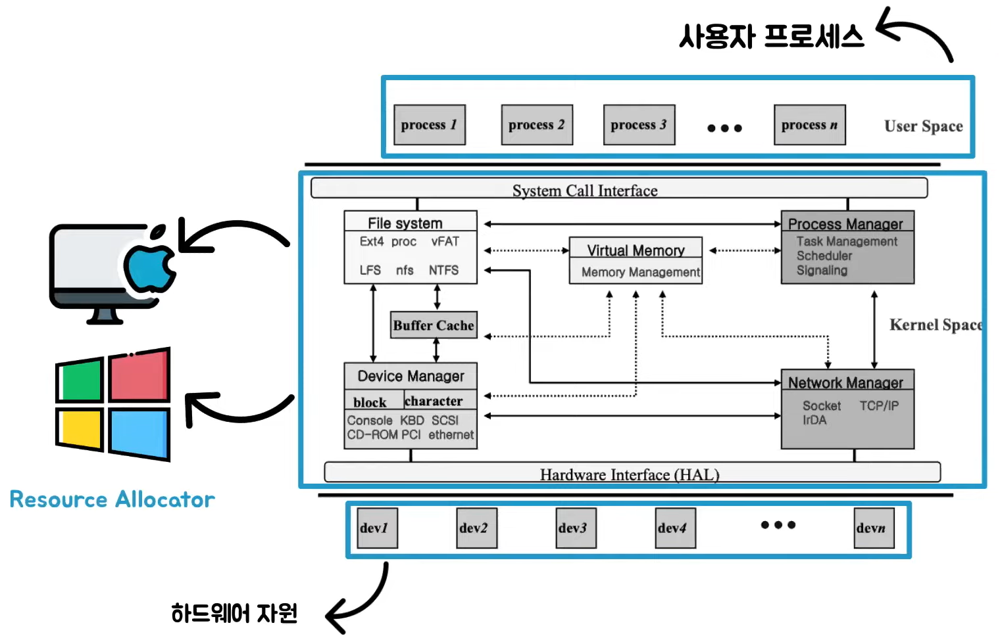
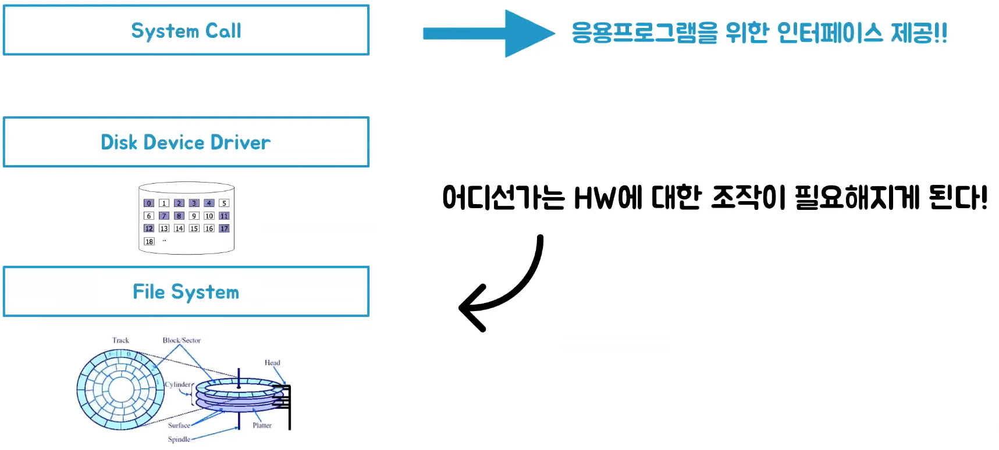
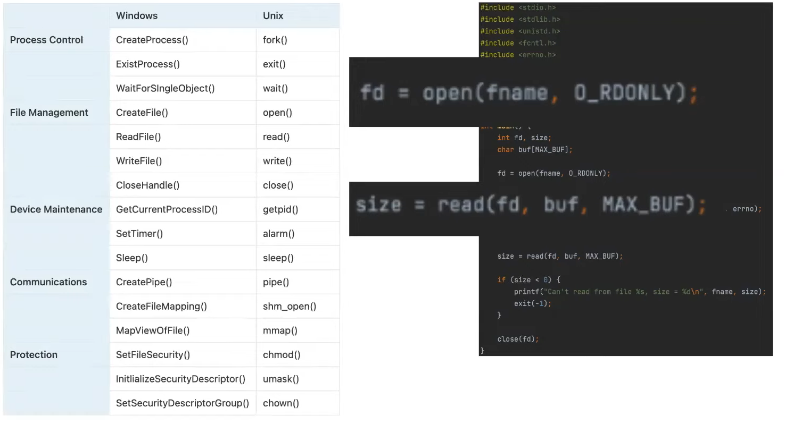
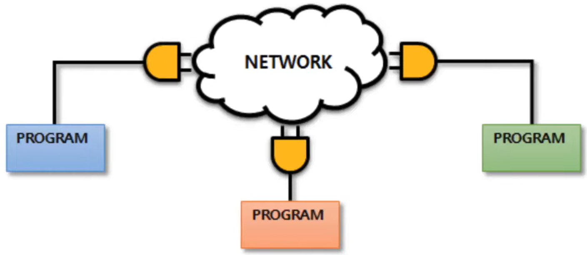
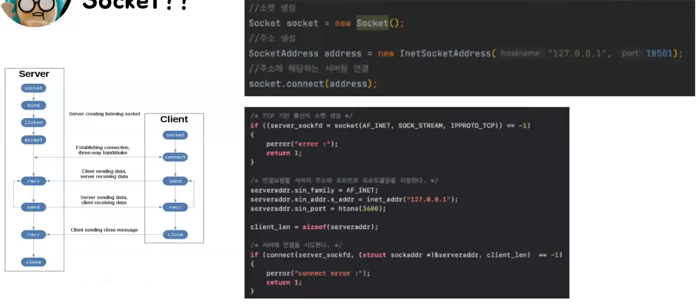

# 아리, 디우의 프레임워크 vs 라이브러리 vs API
[https://youtu.be/G9Dl5FiaOQ4](https://youtu.be/G9Dl5FiaOQ4)

# 아리, 디우의 프레임워크 vs 라이브러리 vs API
* toc
{:toc}

## API (Application Programming Interface)
+ Application(응용)
  + 운영체제 위에서 실행되는 모든 소프트웨어
+ Programming(프로그래밍)
  + 메모리에 올라가서 실행될 수 있는 명령어들의 집합인 프로그램을 작성하는 행위 
+ Interface(인터페이스)
  + 서로 다른 두 개가 서로 정보를 주고 받기 위해 약속된 규약(규격)
+ OS 살짝
  + 
  + 하드웨어를 직접 제어하려고 하면 어떤 하드웨어 부품을 사용하는지를 일일이 다 알고 있는 상태여야 할 것이다.  
  + 하지만 우리는 컴퓨터 사용자와 컴퓨터 하드웨어 사이의 중간 역할을 하는 프로그램인 OS를 통해서 이런한 부분을 추상화할 수 있다. 
  + 즉, 하드웨어를 포함한 CPU 타임 등 자원에 대한 할당 단위 OS가 하드웨어 제어 등 복잡한 일을 대신해주는 것이다.
  
### System call API 
+ 
+ 하드웨어 뿐 아니라 컴퓨터 리소스에 대한 부분을 추상화하게 되었고 결국 어느 한 계층에서는 추상화된 하드웨어에 대한 조작이 필요해지게 됐는데 OS는 이 때 응용프로그램을 위한 인터페이스를 제공하는데
이것을 System call API라고 부르게 된다. 
+ 예시 
  + 
  + Windows에서 제공하는 시스템 콜과 Unix 계열의 OS에서 제공하는 시스템 콜의 차이가 있다. 
  + 이렇게 Process Control, File, Management와 같이 동일한 인터페이스에 대한 구현은 각 OS마다 다르다는 것을 알 수 있다. 
+ 결론
  + 시스템 콜이란 HW를 간접제어하고, OS가 관리하는 정보에 접근하도록 요청하는 규약을 정의한 것 
  
### Socket
+ 
+ 네트워크에서도 우리는 API라는 말을 들어볼 수 있다. 
+ 프로세스와 컴퓨터 네트워크 사이의 인터페이스를 소켓이라는 것을 통해서 구현하게 된다. 
+ 대부분의 애플리케이션은 두 프로세스가 메세지를 서로에게 보내는 통신 프로세스 쌍으로 구성된다. 
+ 이때 프로세스는 소켓을 통해 네트워크로 메세지를 보내고 받는다. 
+ TCP/IP 4계층에서 전송 계층 위에 놓이며 프로토콜을 이용하여 데이터 통신을 제공하는 인터페이스를 소켓이라고 한다. 
+ TCP에 대한 소켓 API 호출 및 데이터 흐름
  + 
  + 코드의 구현 내용은 서로 다르지만 소켓을 생성하고 서보 주소를 연결한 후 연결을 시도하는 부분이 동일하다는 것을 알 수 있다. 
+ 소켓이란 응용계층과 통신 계층 사잉의 인터페이스 네트워크에서 동작하는 프로세스간 통신 End Point
+ 애플리케이션 프로세스와 트랜스포트 프로토콜 간의 인터페이스
### REST API
+ REST는 Representational State Transfer의 약자 
+ 2000년도 로이 필딩 논문에서 최초로 소개된 소프트웨어 아키텍처의 한 형식을 말한다 
+ REST 아키텍처를 따라서 JSON 형식의 데이터를 HTTP 메서드를 통해서 주고받겠다고 정의한 명세 이를 REST API라고 부른다
+ 또한 다른 시스템에서 제공하는 명세에 따라서 클라이언트 입장이 되어 다른 시스템에서 제공하는 API를 이용해 기능의 가져다씀으로써 내가 만든 애플리케이션을 완성할 수도 있다. 
+ 이렇게 REST API는 어떤 서버의 데이터와 서비스를 이용할 수 있게 해주는 소프트웨어 도구 혹은 명세 

### 예시들 정리
+ System call
  + 응용 프로그램과 하드웨어 사이에서 OS에 동작을 요청하는 함수 또는 동작들에 대한 인터페이스
+ Socket
  + 서로 다른 컴퓨터의 프로그램과 프로그램이 네트워크 상에서 통신할 수 있도록 통신 선로를 제공 
+ REST API
  + 서로 다른 애플리케이션 간에 정보를 JSON 형식으로 HTTP Method를 통해서 주고 받는다.
  
### API란 결국 무엇인가
+ 구현과는 독립적으로 어떤 HW 혹은 서로 다른 컴퓨터 프로그램간에 정보를 주고 받을 때 사용하는 규약 혹은 사양을 정의한 것
+ 어플리케이션(응용)을 만들기 위한 하위 함수, 프로토콜, 도구 등 다양한 컴포넌트 간의 통신 규약(인터페이스)

## Library 
+ 컴퓨터 프로그램이 상용하는 비휘발성 자원의 모임 
+ 수많은 코드들 중에서 원하는 기능을 찾아서 이용한다
+ 우리가 원하는 시점에 원하는 기능을 가져다가 쓴다는 것이다 
+ 라이브러리를 능동적으로 이용 
+ 라이브러리를 호출함으로써 응용 프로그램의 제어권을 우리가 가지고 있는 것이다.

### Jackson
+ 일정한 형태의 데이터를 분해하고 원하는 형태로 조립하는 것을 파싱이라고 한다 
+ JSON, XML 등 다양한 형식의 데이터를 파싱하는 기능을 제공한다 
+ 해당 라이브러리를 이용하면 데이터의 종류가 많아지더라도 매 번 파싱하는 코드를 작성해줄 필요 없이 데이터와 클래스만 넘겨주면 된다 

## API, Library 어떻게 다른가?
+ 라이브러리는 재사용이 필요한 기능으로 반복적인 코드 작성을 업새기 위한, 어디서든 호출 가능한 코드의 집합
+ API는 응용 프로그램을 만드는데 필요한 연결 장치나 매개체 (컴포넌트간 규약)
+ 즉, 사용 목적에서 차이가 있다 

## Framework
+ 어떤한 목적을 달성하기 위해 복잡하게 얽혀있는 문제를 해결하기 위한 구조, 소프트웨어 개발에 있어 하나의 뼈대 역활
+ 프레임워크를 이용하면 일정형태의 틀을 가지고 원하는 결과물을 만들어낼 수 있다.  

### Spring Framework
+ 수동적이다 
+ 비지니스 로직이 스프링 프레임워크에 의해 수동적으로 실행된다
+ 응용 프로그램의 제어권을 프레임워크가 가지고 있다 

## Library VS Framework
+ 응용 프로그램 흐름을 제어하는 제어권이 누구에게 있는가, 라이브러리와 프레임워크의 가장 큰 차이점이다 
+ Library 
  + 응용프로그램이 능동적으로 라이브러리를 사용 
  + 즉, 제어권이 개발자에게 있다
+ Framework
  + 응용프로그램이 수동적으로 프레임워크에 의해 사용 
  + 즉, 제어권이 프레임워크에게 있다
  
## API, Library, Framework
+ API - 구현과는 독립적으로 다양한 컴포넌트 간에 정보를 주고 받기 위한 규약 
+ Library - 컴퓨터 프로그램이 사용하는 비휘발성 자원의 모임, 개발자가 응용프로그램 흐름의 제어권을 가진다.
+ Framework - 소프트웨어 개발에 있어 하나의 뼈대 역할, 프레임워크가 응용프로그램 흐름의 제어권을 가진다.
