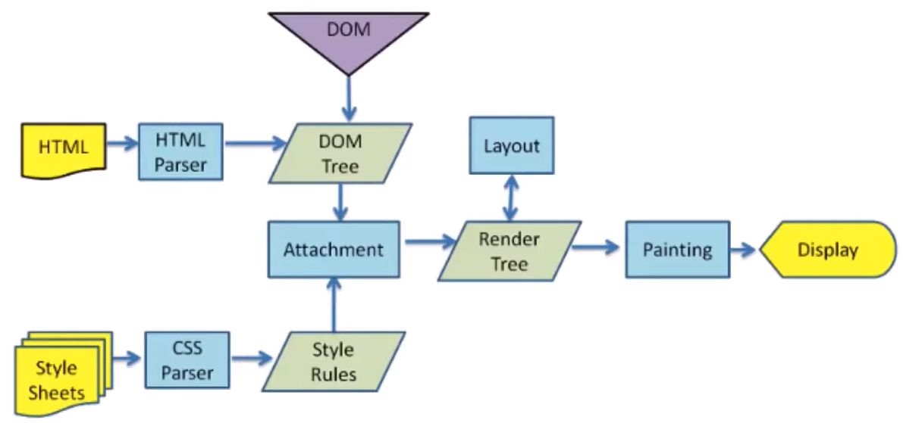
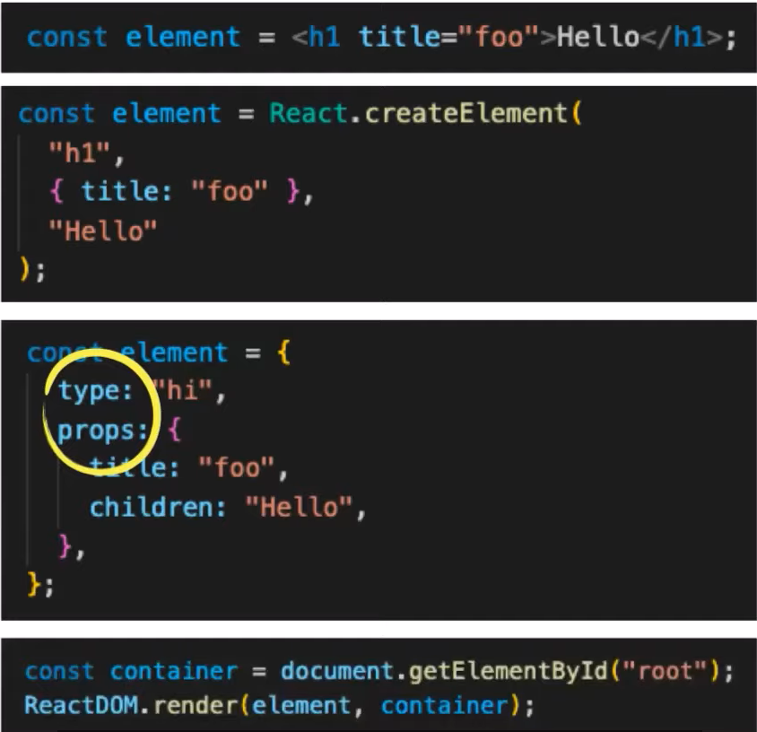
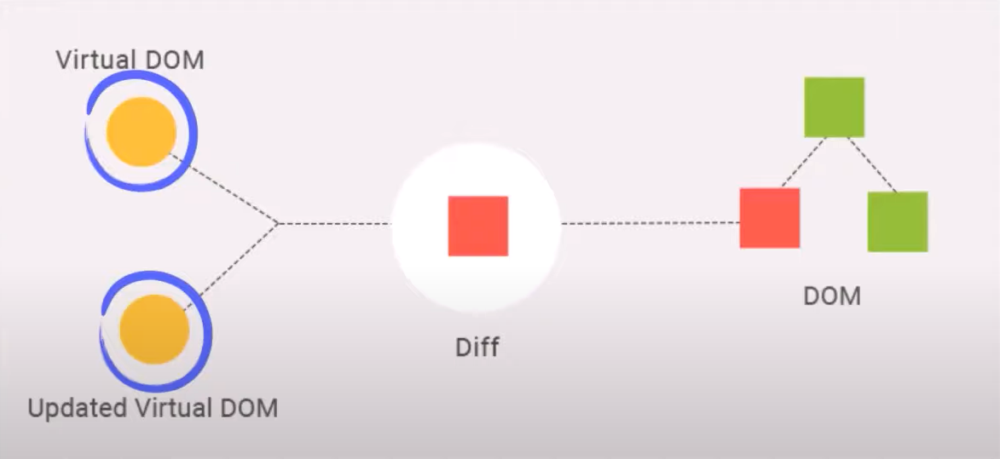

# 돔하디의 Virtual DOM
[https://youtu.be/6rDBqVHSbgM](https://youtu.be/6rDBqVHSbgM)

# 돔하디의 Virtual DOM
* toc
{:toc}

## 브라우저 레더링 과정
+ 
  + webkit 엔지에서 사용하는 브라우저 렌더링 다이어그램
  
1. 개발자가 작성한 HTML을 브라우저가 전달 받으면, 브라우저의 렌더 엔진이 이를 파싱하고 DOM node로 이루어진 트리를 생성한다. 
2. CSS 파일과 각 엘리먼트의 Inline 스타일을 파싱하고 스타일 정보를 추가하여 렌더트리를 생성한다. 
3. 렌더트리가 만들어지고 나면 레이아웃 과정을 거친다. 이 과정에서 각 노드들은 스크린의 좌표가 주어지고 정확히 어디에 위치해야 할 지가 정해진다 
4. 마지막으로 Painting 과정이 실행된다. 앞선 과정에서 얻을 수 있는 정보들로 모든 요소들에 색을 입히는 과정이다. 이 과정을 거치고 나면 화면에 UI가 렌더된다.

### DOM 조작의 비효율성
+ DOM을 직접 조작하여 화면을 업데이트하려면 앞서 설명했던 HTML, CSS 파싱부터 화면에 Painting하는 과정까지 전부 진행하게 된다. 
+ DOM을 조작할 때마다 이런 과정이 반복되는 것은 실제로 많은 연산을 수반하고 비용이 많이 드는 작업이기 때문에 프로그램의 성능을 저하시킨다. 
+ 예전에는 서버에서 데이터와 함께 완전한 페이지를 렌더해주는 서버사이드 렌더링 방식을 많이 사용했다. 
+ 원래 DOM은 정적인 페이지를 보여주는데 많이 사용됐기 때문에 DOM에 동적인 변화가 그렇게 큰 문제가 되지 않았다 
+ SPA 등장과 함께 CSR(Client Side Rendering) 방식이 많이 사용되면서 현재는 DOM 업데이트가 상당히 많이 복잡하게 발생하는 애플리케이션들이 많아졌다 이런 맥락에서 DOM 조작을 통해 화며을 렌더링하는 과정의 비효율성을 해결하고 
최적화를 할 필요성이 대두됬었고 이러한 과정에서 등장한 것이 Virtual DOM 이다 

## Virtual DOM
+ 실제 DOM의 가벼운 버전
  + class, style 등 속성들을 갖고 있다
  + DOM api 메서드 갖고 있지 않다
+ DOM 노드 트리를 복제한 자바스크립트 객체 

### Virtual DOM의 동작
+ 최초에 브라우저가 실제 DOM 트리를 생성하고 브라우저 화면에 우리 애플리케이션 UI가 렌더된다. 이때 Virtual DOM은 DOM 트리를 가벼운 버전으로 복사를 한다.
+ 그리고 DOM 노드에 변화가 생기면 Virtual DOM은 다시 새로운 가상의 DOM 트리를 처음부터 다시 만들게 된다. 
  + 이 과정에서 변화가 생길 때마다 새로운 DOM트리를 만드는 것이 비효율적이라고 생각할 수 있다. 
  + 하지만 DOM 노드를 조작하는 것의 비효율성은 DOM 트리를 업데이트 하는 과정에서 발생하는 것이 아니라 렌더링하는 과정에서 비싼 비용이 드는 것이다. 
  + Virtual DOM은 렌더링을 하지 않고 메모리 상에서 트리를 변경하는 일이기 때문에 상당히 빠르게 작업이 진행될 수 있다. 
+ Virtual DOM의 내부 구현체를 살펴보면 diff 함수에서 매개변수로 이전 상태의 DOM트리와 새롭게 만들어진 DOM트리를 각각 previous, current 라는 이름으로 받아오는 것을 볼 수 있다. 
이 함수를 통해서 변경 전의 DOM트리와 변경 후의 DOM트리의 변화된 부분만을 확인하게 된다.
  + diff(previous:VTree, current:VTree) -> PatchObject 
+ 이렇게 변경된 부분을 확인한 이후에는 실제 DOM에 변경된 부분을 적용한다 patch 함수를 보면 rootNode와 이전 단계에서 diff 함수를 통해 얻을 수 있었던 변경된 부분만 담겨있는 patches를 인자로 받는 것을 볼 수 있다. 
이 함수는 변경된 사항만을 실제 DOM 노드에 적용하여 렌더링 과정을 수행하게 한다
  + patch(rootNode:DOMNode, patches:PatchObject) -> DOMNode newRootNode
+ 이 일렬의 과정을 봤을때 Virtual DOM은 사실상 버퍼링 또는 캐싱의 역할을 한다고 볼 수 있다. 
+ DOM 조작을 할 때마다 브라우저 렌더링 과정을 계속해서 반복하는 것이 아니라 변화들을 전부 Virtual DOM에 반영한 후에 변경된 부분만을 모아서 실제 DOM에 적용하여 한 번만 렌더링 하도록 함으로써 성능을 최적화한다.

## React의 Virtual DOM
+ 리액트의 컴포넌트를 정의할 때 JSX 문법을 많이 사용한다. 
+ JSX 는 자바스크립트를 확장한 문법이기 때문에 자바스크립트 문법이 아니다. 
+ 이런한 JSX 는 바벨과 같은 툴에 의해 자바스크립트로 변환되는데 이때 createElement 함수를 호출하게 된다. 
+ 함수를 통해 JSX는 객체로 변환된다. 이 객체는 type 과 props 라는 키가 존재하는데 
  + type은 DOM 노드의 태그 이름
  + props는 JSX에 포함된 모든 속성들을 포함한다.
  + props는 children에는 하위 노드들이 포함된다. 
+ 이렇게 생성된 자바스크립트 객체를 활용하여 Virtual DOM 트리를 구성하게 되는 것이다.
+ 이러한 객체를 이용하여 render 함수를 호출하면 비로소 실제 DOM 요소가 된다. 
+ 

### 재조정
+ 리액트에서 상태가 변화했을 때 화면에 Virtual DOM 을 활용하여 DOM을 업데이트하는 과정
+ "Virtual DOM 은 UI의 이상적인 또는 가상적인 표현을 메모리에 저장하고 ReactDOM과 같은 라이브러리에 의해 실제 DOM과 동기화하는 프로그래밍 개념이다"
  + Virtual DOM과 실제 DOM을 비교하고 일치시키는 과정
+ 
  + 리액트는 변경전의 Virtual DOM 과 변경 이후의 Virtual DOM 두 가지 트리를 모두 유지하고 있다.
  + 이 두 트리의 스냅샷을 비교하여 변화된 부분만을 감지한 후에 변경된 부분만을 실제 DOM에 적용한다.
  + 이 비교하는 과정에서 Diffing 알고리즘이 사용된다.
+ Diffing 알고리즘
  + JSX가 자바스크립트 객체로 변화된 결과에서 type라는 키값을 같은데 변경 전 리액트 엘리먼트의 타입과 변경 후 리액트 엘리먼트 타입을 비교하여 두 가지 다른 유형의 행동을 하게 된다. 
  + type === type ? 속성만 변경
    + 엘리먼트의 타입이 같은 경우에는 변경 전의 엘리먼트의 속성과 변경 후 엘리먼트의 속성을 비교하여 동일한 내역은 유지하고 변경된 속성들만 갱신한다
  + type !== type ? 트리 재생성
    + <a>태그에서 태그로 또는 A 컴포넌트에서 B 컴포넌트로의 경우처럼 타입이 달라진 경우 React는 이전 트리를 삭제하고 완전히 새로운 트리를 만든다
  + 리액트가 kep prop을 사용하는 이유가 재조정과 깊은 연관이 있다. 
  + 리액트 엘리먼트가 변화할 때 재조정 과정에서 이전의 Virtual DOM과 새로 생성된 Virtual DOM을 비교할때 자식 노드들이 kep prop을 갖고 있으면 리액트는 key값으로 이전 트리와 변경 이후 트리를 비교한다
    + key 값은 변경되지 않는 유일한 값을 넣어줘야 한다

## 더 알아보기
+ Virtual DOM -> React, Vue
+ Incremental DOM -> Angular
  + 실제 DOM을 사용하여 변경 사항을 찾는 Incremental DOM
+ 컴파일러 -> Svlete
  + 라이브러리가 아닌 컴파일러
  + React처럼 런타임에 Virtual DOM을 만들어서 비교하고 화면을 렌더하는 방식이 아니라 컴파일시에 이 모든 과정들을 미리 처리하기 때문에 브라우저에 어떠한 추가 코드를 제공하지 않아도 된다. 
