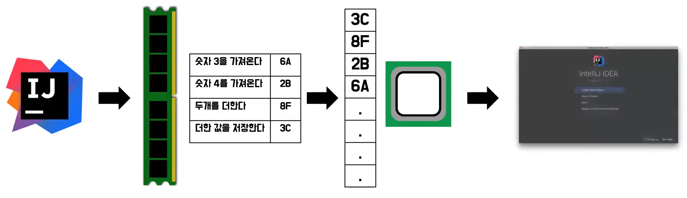
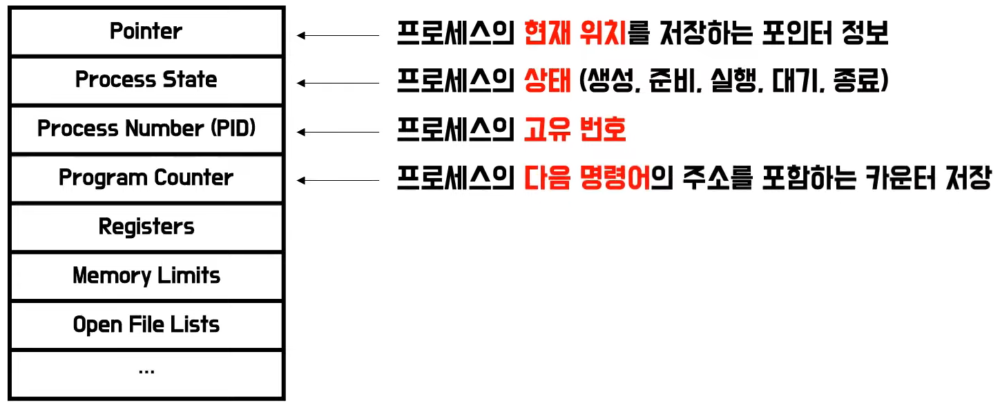
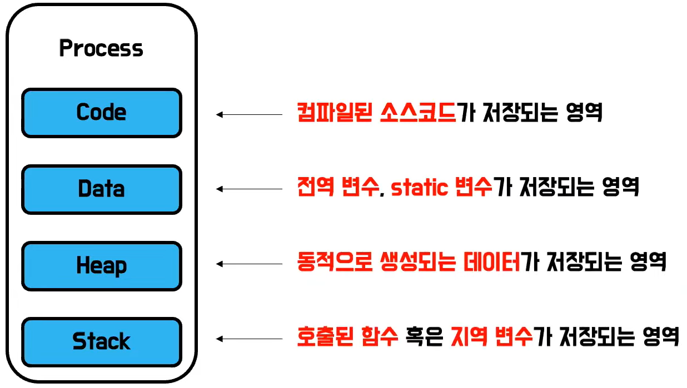
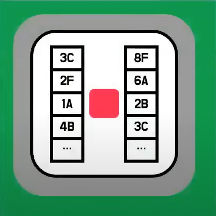
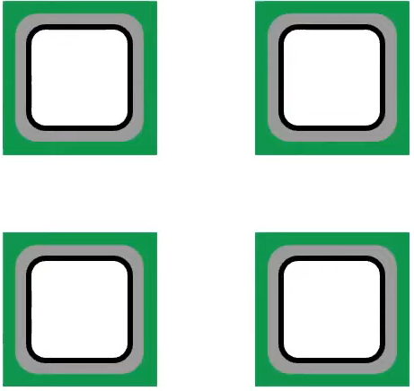

# 쿼리치의 Process vs Threads
[https://youtu.be/C_P0wHFp1o4](https://youtu.be/C_P0wHFp1o4)

# 쿼리치의 Process vs Thread
* toc
{:toc}

## 멀티 프로세스

### 프로세스 
+ 자원 할당 단위
+ 프로세스란 프로세서에 의해 실행되는 프로그램 
+ 프로세서는 간단하게 CPU라고 생각해 볼 수 있다.
+ 프로그램은 우리가 작성한 코드 볼 수 있다.
+ 

### 멀티 태스킹
+ CPU는 한번에 하나의 프로세스만 실행한다
+ CPU는 여러 프로세스를 번갈아가면서 실행한다 다만 굉장히 짧은 시간을 쪼개서 하나하나 조금씩 진행시키기 때문에 우리 입장에서는 모든 프로세스가 동시에 진행되는 것처럼 보인다 
+ 여러 프로세스를 번갈아 가면서 실행하는 과정을 Context Switching 이라고 한다 
+ CPU가 짧은 시간을 주기로 번갈아 가면서 여로 프로세스를 실행한다면 CPU가 각각 프로세스가 얼마나 진행되었고 다음에 실행해야할 명령이 무엇인지 알아야한다 이는 Process Control Block 이라는 곳에 저장된다. 각 프로세스가 가지고 있다. 

### Process Control Block
+ Process Control Block에는 여러가지 정보가 저장되어 있다. 
+ 

### 프로세스 구조 
+ 

#### 멀티 프로세스의 단점 
+ 한 작업을 여러 프로세스가 나누어 작업한다고 가정
+ 각 프로세스는 서로 같은 Code, Data, Heap을 가지고 있다. 
+ 프로세스는 작업을 수행하기 위해 프로세스의 Code, Data, Heap이 메모리에 적재된다. 
+ CPU가 해당 작업을 수행하기 위해서 Context Switching을 진행하게 된다면 서로 동일한 Code, Data, Heap을 가지고 있음에도 불구하고 메모리를 올리고 내리는 작업으 반복한다. (비효율적)
+ 각 프로세스가 가지고 있는 정보를 서로 사용해야 할 경우에 IPC 통신도 요구된다 
+ 같은 작업을 나누어 할 뿐인데 중복도 많아지고 불필요한 통신도 한다

## 멀티 스레드 

### 스레드 
+ 작업 단위
+ 작업의 주체는 스레드이다 프로세스 자원들이 메모리에 적재됨과 동시에 CPU는 스레드라는 작업을 주어진 자원을 통해서 수행한다 

### 멀티 프로세스 VS 멀티 스레드
+ 스레드는 한 프로세스 내부의 실행 단위이기 때문에 프로세스 내부에서 Code, Data, Heap 영역을 서로 다른 스레드가 공유할 수 있다.
+ CPU 에서는 스레드 간 Context Switching 을 위해 PCB 내부에 있는 Register Block을 통해 스레드를 구분한다. 
+ 멀티 스레드로 분할 작업을 수행하게 된다면 Code, Data, Heap 을 모두 메모리에 올리고 내리는 무거운 작업을 수행할 필요가 없다 
+ 스레드를 구분할 Register Block만 교체하면 된다 
+ 모든 스레드가 같은 프로세스 내부에 존재하기 때문에 통신 비용 역시 월등히 낮다

### 멀티 스레드의 단점 
+ Code, Data, Heap 을 공유하기 때문에 스레드가 동시에 같은 데이터에 접근할 경우 문제가 발생할 수 있다. 
+ 동기화에 신경을 많이 써줘야 한다 
+ 스레드는 한 프로세스 내부의 여러 작업 갈래이기 때문에 한 스레드가 영향을 받는다면 전체 프로세스가 영향을 받을 수 있다 

## 멀티 코어 
+ 멀티 코덩는 좀 더 물리적인 측면에 가깝다 
+ 코어는 CPU에서 작업을 수행하는 주체이다 파이프라인에 들어오는 명령어들을 수행해주는 존재다 
+ CPU가 발열 등 물리적 제약으로 동시성 처리의 발전이 더뎌지자 그 대안으로 물리적인 코어 갯수를 늘려서 동시에 병렬적으로 명령들을 수행할 수 있게 만든 것이 멀티 코어이다 

### 병렬 처리의 종류
+ 하이퍼 스레딩 
  + 
  + 코어 하나에 파이프라인을 두개로 쪼개어 한 코어 내부에서 병렬적으로 명령들을 수행하는 방법이다, 다만 같은 프로세서를 사용한다 
+ 멀티 코어
  + 
  + 파이프라인마다 독립적인 프로세서가 존재해서 하이퍼 스레딩처럼 같은 프로세서를 사용할 필요가 없어진다
  + 물리적으로 코어 갯수를 늘리기 시작하는 것
+ 멀티 CPU
  + 
  + CPU 여러대를 병렬로 연결하여 작업을 수행하는 방법이다.
  + 가장 성능이 좋지만 가장 비싸기 때문에 서버 규모에서 주로 사용한다 

## 요약 
+ 프로세스 
  + 자원 할당 단위
  + 각 프로세스는 독립적
  + IPC 통신
  + Context Switching 비용 크다
+ 스레드
  + 작업 단위
  + 스레드 간 자원 공유
  + 통신 및 Context Switching 비용 적다
  + 동기화 작업에 신경을 많이 써야 한다.
+ 코어
  + 스레드의 작업을 수행하는 프로세서 
  + 여러 작업을 번갈아 가면서 동시 처리 
  + 물리적으로 여러 코어가 함께 병렬 처리 
