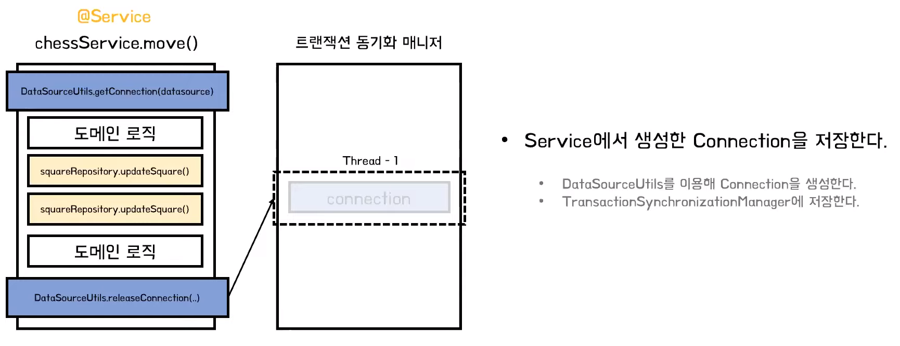
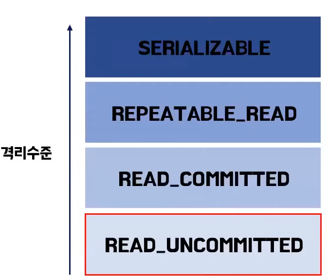

# 후니의 스프링 트랜잭션 
[https://youtu.be/cc4M-GS9DoY](https://youtu.be/cc4M-GS9DoY)

# 후니의 스프링 트랜잭션
* toc
{:toc}

## JDBC api에서의 트랜젝션
+ 문제점
  + 깔끔하던 Service 코드가 복잡해진다
  + 데이터 액세스 기술에 의존적인 코드를 작성한다
  + 비즈니스 로직과는 다른 관심사의 일을 수행한다

## 스프링 트랜잭션 기술
+ 트랜잭션 동기화
  + 데이터 접근기술과 트랜잭션 서비스 사이에 종속성(dependency)을 제거
  + 
  + Spring JDBC에서 제공하는 DataSourceUtils 클래스의 getConnection 메서드를 사용해서 트랜젝션을 생성
  + 이 트랜잭션은 thread-safe한 트랜잭션 동기화 매니저에 저장 
  + 트랜잭션 동기화 매니저에 저장된 커넥션이 존재한다면 JDBC Template이 query를 날릴 때 트랜잭션 동기화 매니저에 저장된 커넥션을 가져온다
  + 트랜잭션이 종료되는 지점에 커넥션을 release(닫아) 주면서 트랜잭션 동기화 매니저에 존재하는 커넥션을 함께 제거해준다. 
  + 결론적으로 Jdbc Template이 DataSourceUtils를 사용하여 connection을 가져오거나 생성한다. 아직 Data access 기술에 의존적인 것이다. 하지만 스프링은 더 도와준다
+ 트랜잭션 추상화
  + 트랜잭션 기능을 쉽게 활용
  + 스프링은 PlatformTransactionManager라는 인터페이스를 만들어서 각 구현체들이 트랜잭션을 가져오는 방식을 명세로 추상화해 두었다
+ 선언적 트랜잭션
  + 비지니스 로직과 트랜잭션 관련 로직을 완전히 분리 
  + @Transaction 어노테이션 바탕
    + 스프링 AOP를 통해 구현
    + AOP 프록시를 통해 활성화되고 트랜잭션 관련 메타데이터를 참조하여 생성
  + AOP(Aspect Oriented Programming)로 구현된 @Transaction 어노테이션을 통해서 타겟 메서드를 가진 클래스를 상속받아 트랜잭션 경계로 감싼 프록시로 만든다
  + @Transaction 애노테이션이 있다면 경계설정을 하는 다른 관심사의 코드를 완벽하게 분리할 수 있게된다. 
  + 선언적 트랜잭션은 타겟 오브젝트 메서드부터 탐색
  + Service를 상속받은 모든 클래스, 메서드에 동일한 트랜잭션 속성을 부여할 수 있다.
  + 최종석으로는 부가 기능을 분리하여 순수한 비즈니스 로직만 코드에 담을 수 있다. 

## 트랜잭션 속성
+ 스프링은 트랜잭션 경계설정 뒤 전파(propagation), 고립(isolation), 읽기동작(read-only), 타임아웃(timeout) 이라는 속성을 지정할 수 있다
+ 선언적 트랜잭션의 경우 추가적으로 rollback-for, no-rollback-for 이라는 추가 속성을 지정할 수 있다
+ propagation
  + 트랜잭션을 시작하거나 기존 트랜잭션에 참여하는 방법을 결정하는 속성 
  + REQUIRED
    + 전파의 기본 속성
    + 트랜잭션이 있으면 참여하고, 없으면 새로 시작 
  + REQUIRED_NEW
    + 항상 새로운 트랜잭션을 시작
    + 진행 중인 트랜잭션이 있다면 트랜잭션 잠시 보류 
  + SUPPORTS
    + 이미 트랜잭션이 있으면 참여 그렇지 않으면 트랜잭션 없이 진행 
    + 커넥션이나 Hibernate 세션(session)은 공유 할 수 있다
  + NESTED
    + 이미 진행 중인 트랜젝션이 있으면 충첩 트랜잭션 시작
    + 부모 트랜잭션 커밋, 롤백엔 영향을 받음
    + 자신의 커밋, 롤백은 부모 트랜잭션에 영향 못 줌 
  + NEVER
    + 트랜잭션을 사용하지 않게 한다.
    + 트랜잭션이 존재하면 예외를 발생.
  + NOT_SUPPOERTED
    + 트랜잭션을 사용하지 않게 한다.
    + 트랜잭션이 있다면 보류 
+ isolation
  + 여러 트랜잭션이 진행될 때에 트랜잭션의 작업 결과를 타 트랜잭션에게 어떻게 노출할지 결정
  + DEFAULT
    + 사용하는 데이터 접근 기술, DB 드라이버의 기본 설정
    + Oracle은 READ_COMMITTED, Mysql은 REPEATABLE_READ를 기본 격리 수준으로 가진다
    + 
    + READ_UNCOMMITTED 
      + 트랜잭션 1이 A를 2로 업데이트 하고 커밋을 하지 않아도 트랜잭션 2가 변경된 A(2)를 읽어 온다
      + 커밋되지 않은 데이터가 노출
      + 데이터의 정확성은 떨어지지만 성능이 좋기 때문에 성능을 극대화할 때 이 옵션을 주로 사용한다
    + READ_COMMITTED
      + 다른 트랜잭션이 커밋되지 않은 정보는 읽을 수 없다는 것이 가장 큰 특징
      + 읽는 시점에 따라 데이터가 변경될 수 있다
    + REPEATABLE_READ
      + 다른 트랜잭션이 읽는 정보를 수정 반영할 수 없다는 것이 특징
      + 트랜잭션 시작 시점에 snapshot을 생성해서 그때 읽어온 정보들을 snapshot으로 만들어 둔다 해당 트랜잭션 내에서는 snapshot 정보를 읽어오기 때문에 데이터가 커밋되기 전에는 동일하다
    + SERIALIZABLE
      + 트래잭션 1이 커밋하기 전에는 트랜잭션 2가 진행되지 않는다
      + 격리정이 굉장히 높다 극단적으로 안전한 작업이 필요한 경우에만 가끔 사용한다 
+ timeout
  + 트랜잭션을 수행하는 제한 시간을 성정할 수 있다.
  + 기본 옵션에는 제한시간이 없다 
  + 이 속정은 REQUIRED나 REQUIRED_NEW 같이 새로운 트랜잭션을 시작하는 전파(propagation)옵션과 함께 사용할 수 있도록 고안한 옵션이다
+ readOnly
  + 트랜잭션 내에서 데이터를 조작하려는 시도를 막음
  + 데이터 접근 기술, 사용 DB에 따라 적용 차이가 있다
  + 트랜잭션 읽기 관련 설정의 오버헤드를 줄여서 실제 읽기 행동시 참조하는 데이터를 감소시키기 때문에 성능이 개선된다
+ rollback-for, no-rollback-for
  + rollback-for
    + 기본적으로 RuntimeException시 롤백
    + 체크 예외지만 롤백 대상으로 삼고 싶다면 사용
  + no-rollback-for
    + 롤백 대상인 RuntimeException을 컴밋 대상으로 지정