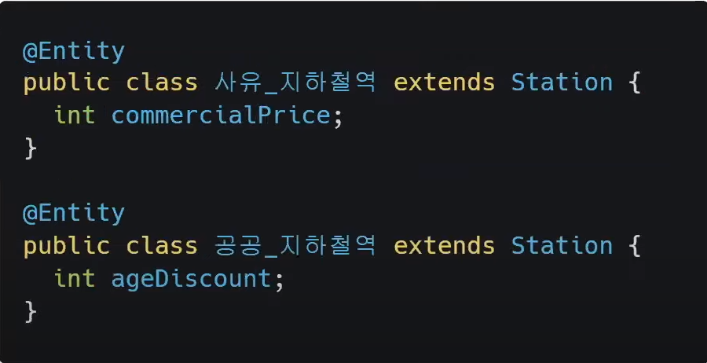

# 범고래, 소주캉의 JDBC, SQL Mapper, ORM
[https://youtu.be/NFK9qLWpujY](https://youtu.be/NFK9qLWpujY)

# 범고래, 소주캉의 JDBC, SQL Mapper, ORM
* toc
{:toc}

## 데이터 접근 기술
+ 데이터 접근기술은 프로그래밍 패러다임에서 데이터 저장기술 접근을 가능하게 하는 기술
+ 데이터 저장 기술은 프로그래밍 패러다임과는 별개로 데이트를 효과적으로 저장하기 위해 독립적으로 발전한 기술 패러다임
+ 따라서 자바에서 관계형 DB를 사용하기 위해서는 서로다른 기술 패러다임간의 인터페이스가 필요하게 되는데 그 인터페이스가 바로 데이터 접근기술이다 
+ 프로그래밍 패러다임
  + 절차 지향
  + 객체 지향
  + 함수형 프로그래밍
  + 등등
+ 데이터 저장 기술
  + 파일 시스템
  + 관계현 데이터 베이스(RDB)
  + NoSQL DB
  + 등등

## DB에 접근하려면?
+ DB Connection 얻기
  + 커넥션을 연결 한다
+ SQL 전달 및 실행
  + 서버는 DB에게 원하는 동작을 SQL로 표현하여 연결된 커넥션을 통해 DB에 전달한다
+ DB Connection 닫기
  + DB는 전달된 SQL을 수행하고 그결과를 응답한다
  + 서버는 응답 결과를 활용하고 커넥션을 닫는다

### 데이터 접근 기술의 어려움
+ 각 DB마다 Connection 연결 방법, SQL 전달 방법, 응답 방법이 모두 다르다  
+ DB를 다른 DB로 변경하면 서버에 개발된 DB 코드도 함께 변경해야한다 
+ 개발자가 각각의 DB마다 커넥션 연결, SQL 전달, 결과 응답 방법을 새로 작성 해야 한다 

## JDBC
+ 
+ JDBC는 데이터 저장 기술을 데이터 소스라는 추상화된 인터페이스를 통해 접근한다 
+ 데이터 소스가 파일 시스템인지, 어떤 DB인지, 커넥션 풀 라이브러리 인지를 고려하지 않고 일괄된 접근이 가능하게 한다
+ Java Database Connectivity
+ 자바를 이용해 다양한 데이터 저장 기술에 일관적으로 접근할 수 있는 데이터 접근 기술 

### JDBC 동작 
1. 처음으로 DataSource에서 DB Connection 을 얻으면 
2. Connection 객체로 Statement 객체를 생성하고 Statement를 통해 SQL을 전달한다
3. 전달된 Statement에 의해 SQL이 실행되고
4. 결과를 ResultSet에 담아 받는다 
5. 사용한 자원인 Statement와 Connection을 닫고 로직 종료
6. 과정 중에 발생한 예외는 SQLException으로 전환되어 일괄되게 예외 처리 된다 

### JDBC 한계
1. 반복되는 데이터 접근 관련 코드
2. 핵심 관심사 미분리
3. Java Code 내 SQL 직접 전달 문제
   + JDBC 가 사용하는 SQL은 단순 문자열 컴파일 체크 불가, 문법 오류 오타 발생 확률 높다
   + 자바 어플리케이션 내 다른 언어인 SQL을 포함 SQL이 핵심 로직을 담당하는 주객 전도

### JDBC 정리
+ 장점
  + 여러 데이터 저장 기술을 일관적인 방식으로 접근 가능
  + Transaction, 예외처리 등 세부 조정 가능
  + 일관적 데이터 접근
+ 단점
  + Connection, SQLException 처리 Transaction 등 직접 처리 필요
  + 반복적인 데이터 바인딩
  + 반복된는 SQL 쿼리문
  + 중복코드, 관심사 미분리 

## SQL Mapper
+ SQL문과 객체의 필드를 매핑하여 데이터를 객체화한다
+ SQL Mapper 에는 크게 스프링 JDBC, MyBatis 등이 있다 

### Spring JDBC
+ 기존의 Statement를 직접 바인딩 해주던 방식을 JDBC Template의 내부 메서드에서 처리해 준다 
  + 파라미터에 바인딩할 인자를 넘겨주기만 하면 내부에서 알아서 바인딩할 수 있게 된다 
  + 기존에 반복적으로 파라미터값을 바인딩해주던 부분을 JDBC Template이 대신 해주게 된다 
+ 기존에 ResultSet의 값을 꺼내와서 사용할 객체로 만드는 작업을 JDBC Template에서는 RowMapper을 통해 해당 객체로 변화하는 작업을 매번 작성하는 것이 아니라 RowMapper를 넘겨주면 JDBC Template 내부에서 알아서  
바인딩해서 결과값을 반환해준다
+ JDBC에서는 커넥션을 개발자가 직접 관리해주어야 해서 커넥션을 열고 닫는 등 작업을 직접 반복적으로 해줘야 했다 이 부분 또한 스프링 JDBC 내부에서 대신 해주기 때문에 불필요한 코드를 제거할 수 있다 이렇게 매번
JDBC를 사용할 때마다 자원을 생성하고 닫아주는 작업을 내부에서 실행해 주면서 불필요한 코드를 줄일 수 있게 되었다 
+ 기존의 JDBC는 SQLException을 던지기 때문에 JDBC를 사용할 때 한상 try catch를 작성해 줘야 했다 이로 인해 코드 가독성이 떨어진다는 문제점이 있었다 
  + SQL Exception
    + JDBC 관련 로직을 실해하는 동안 발생하는 기본 예외 클래스 SQLException
    + CheckedException에 속한다 CheckedException은 try-catch를 강제하기 때문에 항상 처리를 해줘야했다 - 코드의 가독성이 떨어졌다
    + 기본적으로 CheckedException이 발생하면 개발자가 try-catch 문을 강제하여 코드 내부에서 예외를 처리하게 된다 
    + 사용자 입력으로 발생하는 예외일 때가 많기 때문에 예외상황이 발생해도 사용자입력을 다시 받지 않는 이상 해줄 수 있는 행위가 없어서 예외를 try-catch로 잡아도 할 수 있는 게 아무것도 없다 
      + 즉 다소 무의미한 코드가 된다
  + 스프링 JDBC에서 쿼리를 실행하는 내부에서 SQLException이 발생하는 경우 UnCheckedException인 DataAccessException 타입 또는 그 하위 타입을 던져주면서 이전과 달리 스프링 JDBC 에서는 불필요한 코드를 줄일 수 있게 되었다 
+ 남은 문제점
  + 반복적인 데이터 바인딩
    + 결과값을 매핑하는 코드를 RowMapper를 통해 재사용하는 것은 좋았지만 RowMapper 메서드가 더 다양하고 많아지면 이것 또한 관리하기가 귀찮아질 것이다 
  + 자바 코드와 쿼리문 분기
    + SQL 쿼리문은 자바와는 다른 언어로 같이 있으면 가독성이 떨어진다는 단점과 단순히 SQL 쿼리문을 수정해야 하는 상황에서 자바 메소드 코드에 수정일 일어나면서 관심사의 경계가 모호해진다 
  + 반복적인 SQL 쿼리문 

### MyBatis
+ 마이바티스는 XML 서술자나 애너테이션을 사용하여 자바 오브젝트와 SQL사이의 자동 매핑 기능을 지원하는 자바 퍼시스턴스 프레임워크이다
+ 자바 코드와 SQL 분리
  + MyBatis는 XML 코드와 인터페이스를 정의하여 사용한다 이를 통해 XML 코드와 자바 코드를 분리하게 됐다 
+ 반복적인 데이터 바인딩
  + MyBatis의 내부에서 동적으로 바인딩하여 직접 바인딩하는 작업을 해주지 않아도 된다 
+ 남은 문제점
  + 객체지향 패러다임 불일치
  + 반복적인 SQL 쿼리문  

## ORM
+ 객체와 RDB 사이의 패러다임 불일치에서 오는 불편함을 해결하기 위해 객체와 RDB 를 변환시켜주는 데이터 접근 기술 
+ ORM을 사용하면 더 이상 반복적인 SQL을 직접 작성할 필요가 없다, 객체에 집중한 설계를 할 수 있다 
+ JPA
  + Java Persistence API
  + Java 진영 표준 ORM 기술 명세 

### Granularity(세분성)
+ 테이블 
  + 변경이 어렵다
  + 모이는 경향(집합적)
+ 객체
  + 변경이 쉽다
  + 분리되는 경향(분해적)
+ 객체 수는 테이블의 수보다 빠르게 증가한다 
+ 어플리케이션은 커질수록 객체와 테이블의 대응관계의 괴리가 커져서 둘의 관계를 파악하기 점점 힘들어질 것이다 이것이 바로 세분성 문제이다
+ 이런 어려움 때문에 개발자는 객체지향을 포기하고 단순히 테이블에 맞춘 설계를 하게 된다 결국 데이터 중심적인 객체들이 등장한다 
+ DB는 데이터 중심 구조의 사고를 하기 때문에 데이터 그 자체를 바라본다 
+ DB를 따라 설계하면 객체지향과는 점점 멀어지게 된다 

#### Granularity(세분성)-JPA
+ 
  + 객체지향스럽게 추가 요금인 extraFare와 거리에 따른 과금인 distanceUnitFare를 모아 단순 데이터가 아닌 객체로 만들고 싶다 이 둘을 하나의 객체로 만들어 자신의 요금을 스스로 계산하는 행동을 할 수 있게 하고싶다 
  + DB 테이블 구조로 객체를 설계하면 이런 동작을 할 수 없게 된다 
+ 
  + JPA에서는 이와 같이 해결해 준다 
  + Fare 타입의 객체로 필드를 지정할 수 있다 
  + 이렇게 되면 Fare가 단순한 데이터가 아닌 자신의 추가 요금 상태를 스스로 계산하는 등 Fare가 능동적인 객체로 좀 더 다양한 역할을 할 수 있게 된다  
  + JPA는 손쉽게 객체를 분류할 수 있게 해서 객체지향 설계를 도와준다

### Inheritance(상속)
+ 
  + 저장할 때 두 테이블 모두 파악해야 되고 두 테이블 모두에 SQL을 실행해야 한다
  + 상속을 억지로 DB에 구현하기 위해서 비효율적인 구조가 된 것이다 
  + 상속은 객체지향의 개념이고 DB에는 존재하지 않는 개념이기 때문이다

#### Inheritance(상속)-JPA
+ 
  + 복잡한 테이블과 쿼리에 관한 고려를 하지 않아도 JPA에서 상속관련 기능을 사용한 다음 
+ 
  + Station을 상속하는 각 객체를 만들어 주면 JPA가 각 객체에 맞춰 테이블을 나눈 후에 여러 개의 INSERT를 대신 처리해 준다
+ 여러개의 테이블을 파악하고 SQL을 작성하는 어려움에서 벗어나 객체 설계에 집중할 수 있다 

### Identity(동일성)
+ 
  + 객체 ID로 auto increment 등 DB에서 제공하는 ID 정책을 이용해서 사용하는 경우가 많다 
  + 이 경우에 테이블에 저장된 후에야 객체가 ID를 가지게 되는 문제가 있다 
+ 데이터 접근과정에 의해서 객체의 연속성이 깨지는 문제를 동일성 문제라고 한다

#### Identity(동일성)-JPA
+ JPA에서는 트랙잭션 내에서 엔티티를 동일하게 본다 
+ DB에 저장할 때 동일한 객체 주소에 ID 값을 추가하여 객체를 수정하기 때문에 해당 트랜잭션 메서드 내에서 다시 조회할 필요가 없이 단일한 객체를 계속 사용할 수 있다 
+ ID를 얻기 위해 저장한 후에 다시 조회할 필요 없이 이전에 생성한 객체를 사용할 수 있다
+ 객체의 동일성이 유지되어 불필요하게 객체를 새로 생성 하지 않아도 된다 

### Associations(관계)
+ 관계형 DB에서는 외래키로 관계를 맺는다
+ 반면에 객체는 다른 객체 참조를 가진다 
+ 이말은 단순히 객체가 외래키만 가지고는 관계를 형성할 수 없으며 외래키를 토대로 객체 참조를 얻었을 때 비로소 관계를 맺을 수 있다는 말이다 
+ 따라서 테이블을 그대로 모델링한 객체는 객체 지향의 특징인 참조성을 잃게 된다 결국에는 개발자가 중간에서 이를 변환을 수행해줘야 된다 
+ 
  + 테이블로부터 설계된 객체는 외래키만으로는 객체 수준에서 관계를 형성할 수 없다, 참조가 없기 때문에 
  + 이것이 바로 관계형 DB에서 외래키를 중심으로 맺는 테이블과 참조를 중심으로 맺는 객체 사이에서 오는 불일치이다 

#### Associations(관계)-JPA
+ JPA는 연관관계와 관련된 패러다임 불일치 문제를 해결해준다 
+ 
  + JPA는 참조를 외래키로 변환해서 적절한 INSERT SQL을 DB에 전달한다
  + 또한 객체를 조회할 때 외래키를 참조로 변환한느 일도 JPA가 처리해준다 
+ 정리하자면 JPA가 참조와 외래키 사이의 매핑을 자동으로 해준다 따라서 개발자는 객체와 테이블에 매핑 관련한 코드를 작성하지 않아도 된다 
+ 이렇게 테이블 중심의 설계가 아닌 객체를 객체지향적으로 사용하는데 필요한 부가적인 일들을 JPA가 대신해주면서 코드를 작성하는 부담을 덜을 수 있다

### Data navigation(객체 탐색)
+ 데이터 중심 설계에서는 처음 실행하는 SQL에 따라 객체를 어디까지 탐색할 수 있는지 정해진다 
+ 객체 탐색이 가능한 지는 전적으로 사용하는 SQL에 달려 있다, 계층분할이 이루어지지 않는 것이다 객체는 SQL에 따라 참조 가능 여부가 결정되기 때문에 온전히 그 객체 만으로 동작을 파악할 수 없어서 신뢰할 수 없다
+ SQL에 의존한 개발을 피할 수 없다 

#### Data navigation(객체 탐색)-JPA
+ JPA에서는 지연로딩으로 해결해 준다 
+ 지연로딩이란 객체가 참조를 가지고 있는 연관객체가 있을 때 해당 객체의 조회를 미루고 있다가 사용할 때 조회하는 것을 말한다 
