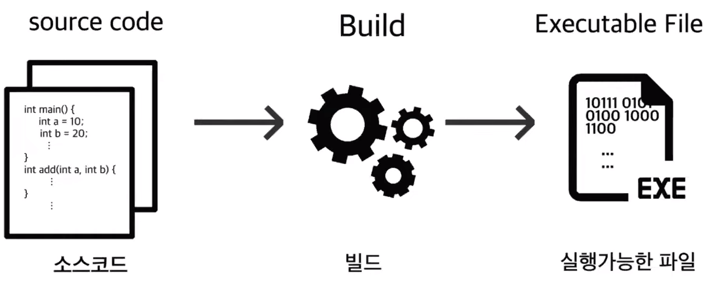
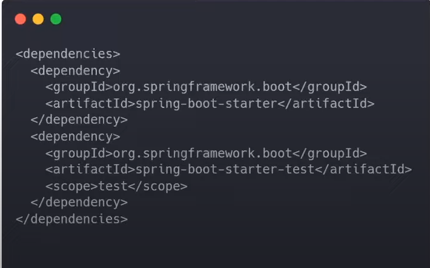
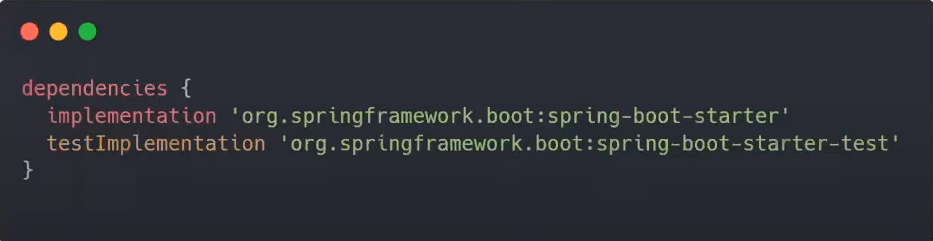
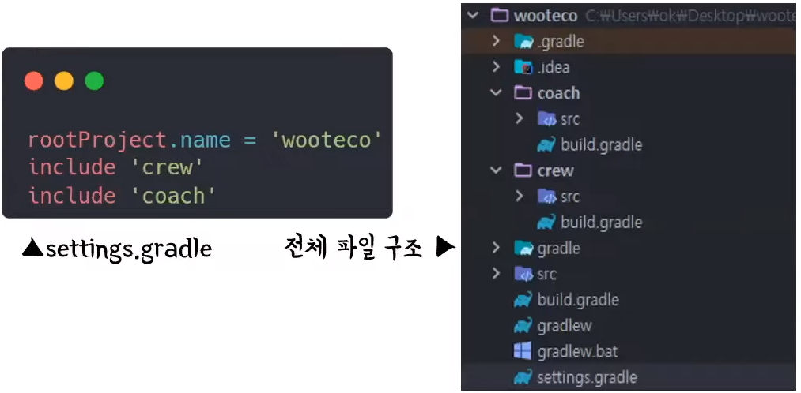
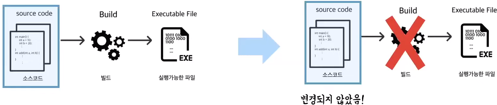
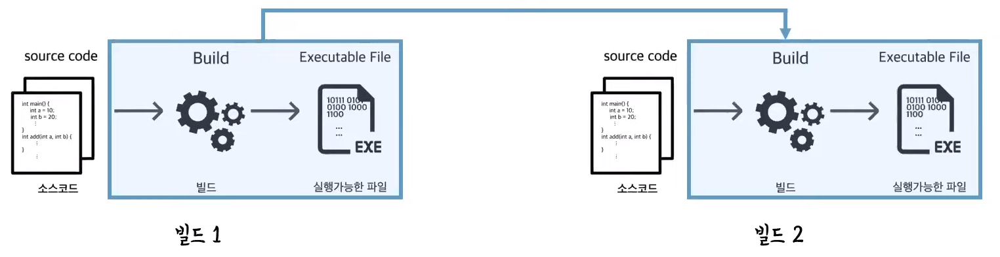
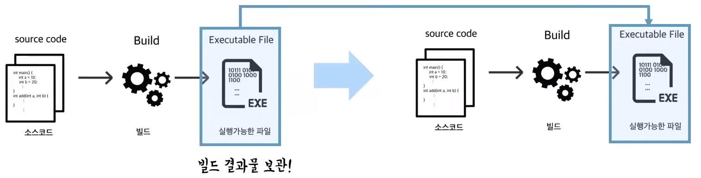
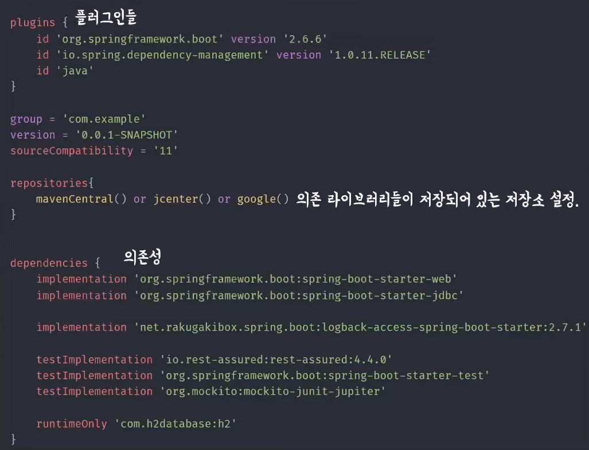
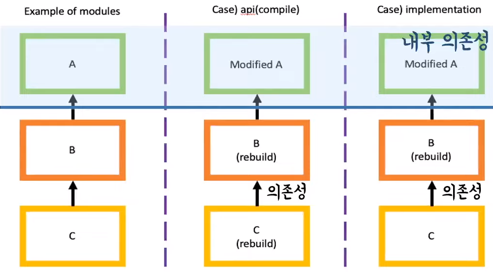

# 루나의 Gradle
[https://youtu.be/ntOH2bWLWQs](https://youtu.be/ntOH2bWLWQs)

# 루나의 Gradle
* toc
{:toc}

## Gradle 이란?
+ 2012년에 출시된 Groovy를 기반으로 한 오픈소스 빌드 도구로, 거의 모든 타입의 소프트웨어를 빌드할 수 있는 빌드 자동화 시스템
+ 빌드 : 소스 코드를 컴파일, 테스트, 정적분석 등을 실해하여 실행 가능한 애플리케이션으로 만들어주는 과정 
  + 
+ 다양한 라이브러리의 등장 
  + 문제점
    + 라이브러리를 다운로드 및 추가하는 번거로움
    + 개발자들간의 버전관리 어려움
    + 다운받은 jar 파일의 보안위함 
  + 빌드 도구
    + 계속해서 늘어나는 라이브러리를 자동 추가 및 관리
    + 프로젝트를 진행하며 라이브러리의 버전을 쉽게 동기화
+ Groovy
  + JVM 상에서 실행되는 스키립트 언어
  + Java와 유사한 문법 구조를 가지며, 호환성이 아주 좋다 

## Gradle은 왜 쓸까?
+ 프로젝트 설정 주입(Configuration Injection) 방식으로 정의
  + Maven의 상속 구조보다 재사용 용이
  + 프로젝트의 조건을 체크할 수 있어서 프로젝트 별로 주입되는 설정을 다르게 할 수 있다
  + Maven
    + 
  + Gradle
    + 
+ 멀티 프로젝트 빌드
  + 하나의 repository내에 여러개의 하위 프로젝트를 구성할 수 있다
  + ex) 관리자 서버와 사용자 서버를 분리해서 진행해야 될 경우
    + 하나의 모듈로 하면 많은 코드를 북붙해서 구현해야하지만 gradle을 사용하면 다음과 같은 중복을 피할 수 있다 
  + 
+ 빌드 속도가 빠르다 
  + 점진적 빌드 (Incremental Builds)
    + Gradle은 빌드 실행 중 마지막 빌드 호출 이후에 task의 입력, 출력 혹은 구현이 변경됐는지 확인한다
    + 최신 상태로 간주하지 않는다면 빌드는 실행되지 않는다 
    + 
  + 빌드 캐시 (Build Cache)
    + 두 개 이상의 빌드가 돌아가고, 하나의 빌드에서 사용되는 파일들이 다른 빌드에 사용된다면 Gradle은 빌드 캐시를 이용해 이전 빌드의 결과물을 다른 빌드에서 사용할 수 있다
    + 다시 빌드하지 않아도 되므로 빌드 시간이 줄어들게 된다
    + 
  + 데몬 프로세스
    + 데몬 프로세스: 서비스의 요청에 응답하기 위해 오래 동안 살아있는 프로세스 
    + Gradle의 데몬 프로세스는 메모리 상에 빌드 결과물을 보관 
    + 이로 인해 한 번 빌드된 프로젝트는 다음 빌드에서 매우 적은 시간만 소요된다
    + 
  + Maven보다 두 배 이상, 최대 100배 빠르다 

## Gradle은 어떻게 쓸까?
+ 
+ Spring 관련 의존성은 컴파일과 런타임 모두에 사용된다
  + implementation
+ Lombok은 컴파일시에만 사용된다
  + compileOnly
+ h2database는 런타임시에만 사용된다
  + runtimeOnly
+ Spring-boot-start-test는 테스트에서만 사용된다
  + testImplementation
+ 
  + api - 내부 의존성을 컴파일과 런타임 모두에 보이는 API 의존성
  + implementation - 내부 의존성을 런타임에서만 보이는 구현 의존성
  + compileOnly - 컴파일에만 사용되는 의존성 정의
  + runtimeOnly - 런타임에만 사용되는 의존성 정의
  + test - Implementation, CompileOnly, RuntimeOnly
    + 해당 의존성을 테스트 시 에만 사용하도록 정의