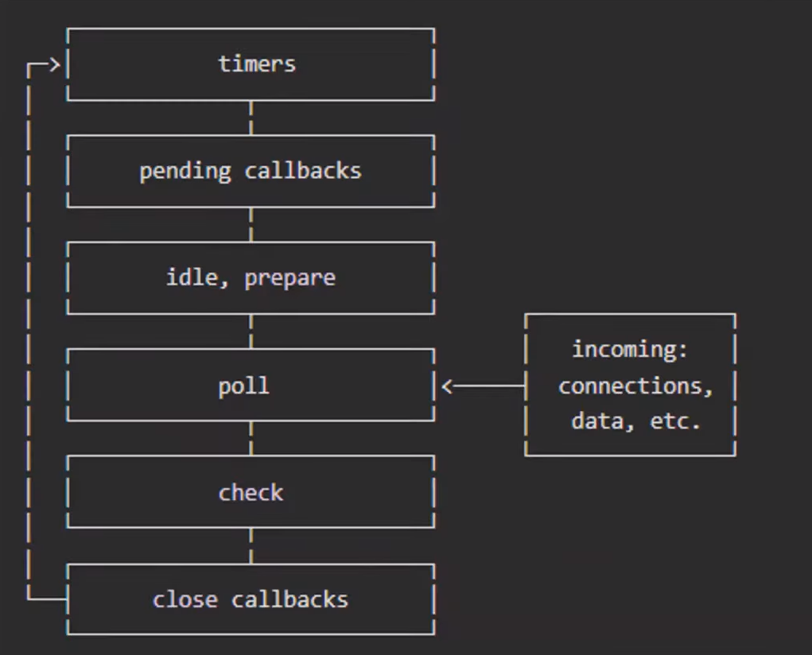
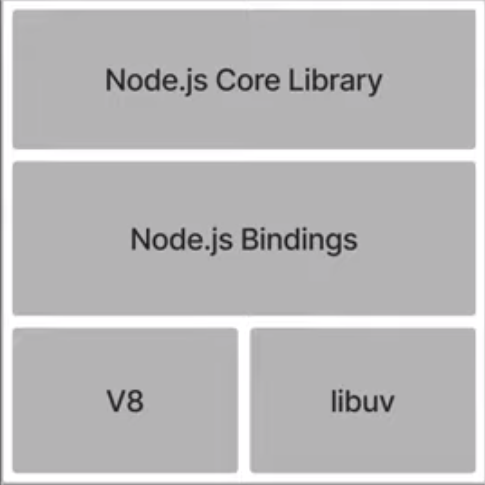
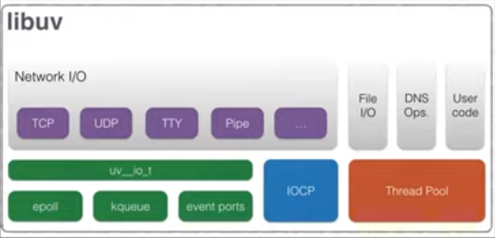

# 유세지의 Node.js
[https://youtu.be/A04zlpL1Uw4](https://youtu.be/A04zlpL1Uw4)

# 유세지의 Node.js
* toc
{:toc}

## Node.js 란?
+ 자바스크립트를 실행시키는 런타임 환경
+ 1995년 자바스키립트가 처음 등장했을 때는 철저하게 브라우저에 종속적인 언어였다, 오직 브라우저만이 자바스크립트의 유일한 사용처이자 런타임이 였다
+ 자바스크립트를 브라우저 외부에서 사용하려 했던 몇가지 시도가 있었는데 이렇게 실해오딘 자바스크립트의 속도가 너무나도 느려가지고 크게 사용되지는 못했다
+ 그러던 중에 구글에서 새로운 자바스크립트 엔진인 V8 엔진을 탑재한 크롬 브라우저를 출시하면서 분위기가 달라졌다
+ 크롬 브라우저는 전보다 훨씬 빠른 속도로 자바스크립트를 처리할 수 있게 됐고 그 주역이 되는 V8 엔진 코드도 때맞춰서 오픈소스로 공개됐다
+ 이때부터 미국의 개발자인 Ryan Dahl은 V8 엔진을 기반으로 하는 런타임인 Node 프로젝트를 시작하게 됐다

## Node.js 특성  
+ 비동기 이벤트 주도 JavaScript 런타임으로써 Node.js는 확장성 있는 네트워크 애플리케이션을 만들 수 있도록 설계되었다 
+ 이벤트 주도 방식이란, 이벤트가 발생을 하게 되면 우리가 지정한 어떤 작업이 수행되는 방식을 말한다
+ 이벤트 주도 방식 과 대조적인 방법 중 하나고 운영체제가 동작하는 방식과 비교
  + 일반적으로 운영체제는 쓰레드 기반의 동시성 모델을 사용한다 
  + 하나의 작업을 수행할 수 있는 주체를 쓰레드라고 부르는데 동시성 모델의 경우 작업에 수만큼 쓰레드를 할당하고 이를 빠른 속도로 전환하며 다수의 작업이 마치 동시에 진행되는 것처럼 동작하는 특징이 있다 
  + 이런한 방식은 이벤트 주도 방식에 비해서 자원의 낭비가 발생하고 그래서 상대적으로 비효율적이고 개발자가 사용하기 어렵고 무엇보다 데드락이라고 부르는 교착 상태를 발생시킨다는 문제가 있다 
  + Node.js는 멀티스레드 기반 동시성 모델 대신에 싱글 쓰레드를 효율적으로 사용할 수 있는 Event Loop를 선택했다 
+ Event Loop
  + 
  + 위에서부터 한 단계씩 실행이 진행 
  + 각 단계는 실행할 콜백들을 가진 큐와 비슷한 구조로 이루어져 있다 
  + Node.js의 이벤트 루프는 이런 각 단계들 마다 특정 시간을 할당해서 그 시간만큼 작업을 처리하는 라운드 로빈 방식으로 순환을 하며 지속적으로 요청을 처리할 수 있도록 동작하게 된다
  + 항상 각 단계에서 특정 시간을 모두 보낼 필요는 없다 
  + 만약에 각 단계가 갖고 있던 콜백을 모두 실행해서 목록이 비게 되는 경우에 다은 단계로 넘어가게 되고 이렇게 단계가 바뀌는 것을 Tick 이라고 부른다
  + Timers - 타이머 콜백 담당
  + pending - 이전 루프의 콜백 담당 
  + 각 단계는 이제 서로 다른 종류의 콜백들을 담당하기 때문에 어떤 동작을 가진 콜백을 이벤트 루프에 넣었는지에 따라서 콜백이 어느 큐로 들어갈지가 정해지고 이를 이용해서 콜백의 실행 시점을 조절할 수 있게 된다 
  + Timers
    + setTimeout(), setInterval()
    + 타이머 함수로 스케줄링 한 콜백들이 들어간다
  + Pending
    + 이전 루프에서 마무리 되지 못한 I/O 콜백 
    + EX) 연결이 실패한 작업이 이에 대한 오류를 알려주기 위해서 이 단계에서 실행되는 경우가 있다 
  + Idle, prepare
    + 내부의 작업 수행, I/O 폴링 사전 준비
    + Node.js 내부의 libuv 라는 공간에서 작업을 수행하고 내부에서 사용되는 I/O를 폴링하기 전에 수행하는 사전 준비들이 이 단계에서 일어난다
    + 내부적인 작업을 위해서만 이용이 되고 외부에 노출되지 않기 때문에 개발자가 이 단계의 작업을 지정해주는 경우는 거의 없다고 봐도 무방하다 
    + 조작이 불가능하지는 않지만 굳이 할 이유가 없다 
  + poll
    + 새로운 I/O 이벤트를 가져와서 실행
    + 파일을 읽고 쓰거나 네트워크와 통신하는 등 이런 위 단계에 올라간 콜백들을 제외한 대부분의 콜백들이 poll 단계에서 처리된다 
  + check
    + setImmediate()
    + check는 이제 Node API 중 하나인 setImmediate()로 스케줄링된 콜백들을 호출한다 
    + 요청을 기다리면서 poll 단계에 머무르는 경우가 많은데 만약에 poll 단계의 큐가 비어있고 유휴 상태 Idle이 되었을 때 setImmediate()로 스케줄링된 콜백이 존재한다면 바로 check 단계로 넘어오게 된다 
  + close
    + close 콜백 실행 (소켓 종료)
    + 다시 타이머 단계로 넘어가서 이 이벤트 루프를 반복하게 된다 
+ Node의 이벤트 루프는 브라우저의 이벤트 루프와 개념적으로는 같고 세부적인 단계가 약간 다르다 
  + setImmediate() Node만의 api로 브라우저 api는 존재하지 않는다  
  + IE와 Edge의 초반 버전에는 존재한다 
  + Node에만 존재하는 Process.nextTick이라는 API가 있다
    + 루프의 특정 단계가 아니라 단계와 단계 사이에서 실행이 된다 
    + 따라서 시스템이 각 단계에 적용한 최대 시간에 구애받지 않아서 무한히 실행되는 불상사가 발생할 수 있다 
+ 논 블로킹 I/O 모델 
  + Node.js 에서 I/O를 직접 수행하는 함수는 거의 없으므로 프로세스는 블로킹 되지 않는다. 그러므로 Node.js 에서는 확정성 있는 시스템을 개발하는 게 아주 자연스럽다 
  + 자바 스크립트는 싱글스레드 언어이다 한번에 하나의 작업만 가능하다 
  + 작업들이 비동기로 수행된 덕분에 앞에 작업이 수행된다고 해서 이후에 진행이 막히는 불상사를 방지하고 가진 자원을 보다 효율적으로 사용할 수 있게 된다 
  + 싱글 쓰레드 언어인 자바스크립트의 특성을 고려하고 확장성 있는 네트워크 애플리케이션을 만들 수 있도록 이벤트 주도 방식과 논 블로킹 방식을 선택  
  + 노드의 내부 구조 
    + 
    + libuv
      + libuv는 각종 비동기 작업들을 포함해서 다양한 작업을 수행하는 C 기반의 라이브러리이다 이벤트 루프도 이 라이브러리 내부에 구현되어 있다 
      + 
        + 내부는 네트워크 I/O와 파일 I/O 등 기본적인 I/O에 대한 API와 기타 작업을 위한 자체 쓰레드 풀을 담고 있다, 기본적으로는 네 개의 쓰레드를 쓰레드 풀에 할당한다 
      + 이벤트 루프에 던져진 비동기 작업들은 일반적으로 libuv 내부가 아닌 시스템 커널에서 수행된다 
      + 시스템 커널의 api는 운영체제마다 이름이 다른데 커널에서는 이미 수많은 비동기 api를 지원하고 있기 때문에 libuv는 시스템과 일종의 인터페이스 역할을 하고 있다 
      + 시스템이 처리할 수 있는 작업은 모두 이 시스템에 위임해서 처리를 하게 된다 
      + 그 외에는 이제 쓰레드 풀에 할당되어 있는 쓰레드에서 작업을 하게 된다 
      + 대표적으로 네트워크와 소켓 관련 작업은 시스템이하고 파일 입출력 같은 거는 libuv가 직접 처리하고 있다 

## 정리
+ node.js 는 V8 엔진의 등장과 함께 갭라된 자바스크립트 런타임 환경
+ 비동기 이벤트는 주도, 논-블로킹으로 효율적이고, 확장성 있는 네트워크 앱을 만들 수 있도록 설계
+ libuv를 이용해 비동기 작업을 시스템 커널에 위임하며 동작 
