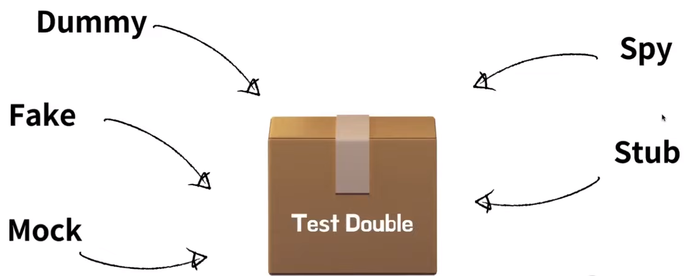

# 더즈, 티키의 Classic TDD VS Mockist TDD
[https://youtu.be/n01foM9tsRo](https://youtu.be/n01foM9tsRo)

# 더즈, 티키의 Classic TDD VS Mockist TDD
* toc
{:toc}

## Test Double
+ 
+ 영화에서 스턴트 더블 개념에서 비롯되어서 테스트를 진행하는 것이다 
+ 실제 객체를 활용하기에 어렵거나 비용이 많이 들 때 사용하는 가짜 객체를 의미하게 된다 
+ Dummy, Fake, Mock, Spy, Stub 이 있다
+ Mock은 호출될 것으로 예상되는 메서드에 대해서 반환하는 값의 사양과 기대값을 미리 프로그래밍하는 객체를 의미한다 

## 단위란?
+ 단위 테스트의 공통적 특징
  + Low-Level
  + 일반적인 도구 사용
  + 빠르다 

## Classicist, Mockist 
+ 각각의 진영은 모두 흔히 XP(Extreme Programming)라고 불리우는 익스트림 프로그램에서 TDD에 대한 구체적인 방법을 제시하면서 나눠지기 시작했다 
+ XP란 캔트 백이 제안한 소프트웨어 개발 방법이며 에자일 개발 프로세스라고 불리우는 개발 방법의 대표로 손꼽히고 있다 
+ TDD는 90년대 후반 디트로이트에서 크라이슬러 종합 보상 시스템에서 시작되었다 
+ 단어정리
  + SUT(system Under Test) - 테스트 대상 클래스
  + 협력객체(Collaborators) - SUT가 의존하는 클래스 

|           | Classicist                    | Mockist                                    |
|-----------|-------------------------------|--------------------------------------------|
| 테스트 단위    | Sociable Test                 | Solitary Test                              |
| 테스트 검증    | 상태 검증                         | 행위 검증                                      |
| 협력 객체 준비  | Fixture 구성 및 재사용              | 메서드마다 Mock 생성 및 기대값 설정                     |
| 간단한 협력 객체 | 실제 객체 사용                      | 더블 적극 사용                                   |
| 어려운 협력 객체 | 더블 사용 고려                      | 더블 적극 사용                                   |
| 테스트 유지 보수 | Fixture의 변경이 있을 때 많은 테스트가 깨진다 | 구현 테스트로 이어지기 때문에 테스트를 수정하는데 많은 시간이 들 수도 있다 |
| 테스트 격리    | X(디버그가 힘들다)                   | O(통합테스트 필요)                                |
| 디자인 스타일   | Inside-Out                    | Outside-In                                 |

### 상태 검증, 행위 검증
+ 상태 검증이란 Classicist가 주로 사용하는 검증 방법이다  
+ 상태 검증을 사용하면 테스트를 위해서 상태를 드러내야 하는 메서드가 생길 수도 있지만 행위가 끝난 후에 상태를 직접적으로 검증하기 때문에 테스트에 대한 안정감이 더 높아질 수도 있다 
+ 행위 검증이란 Mockist가 주로 사용하는 검증 방법이다
+ 특정 행동이 이루어졌나를 확인하는 검증을 행위 검증이라고 표현한다
+ 행위 검증을 하게 되면 상태를 드러내는 메서드를 만들지 않아도 되지만 SUT에 대한 구현 방식이 드러나게 된다 
+ 행위 검증을 끝냈지만 상태를 확인한 것이 아니기 때문에 비교적 테스트에 대한 안정감은 낮아질 수도 있다 

### Fixture, Mock
+ Fixture는 사전 준비가 길다 
+ Fixture를 사용하는 테스트가 많아진다면 이 객체들을 따로 관리해서 재사용할 수 있다나는 장점이 있다 
+ Mock 사전 준비가 짧다
+ Mock을 사용하면 SUT와 직접적인 협력을 맺고 있는 객체에 대해서만 사전 준비를 하면 되기 때문이다 
+ 매번 Mock 객체를 만드는것이 Fixture 보다 비용이 더 크다고 말하기도 한다  

## Test Isolation (테스트 격리)
+ Sociable Unit Test로 인해 격리가 되어 있지 않을 때 발생한 버그가 어떤 클래스에서 발생했는지 찾기 어려울 수도 있다
+ 한지만 Sociable Unit에 포함되는 모든 클래스에 대한 테스트가 꼼꼼하게 작성되어 있다면 버그는 찾기 쉬울 것이다
+ 다만 클래식 TDD에선 테스트 세분화를 놓치기 쉬운 환경이다
+ Mockist TDD에선 테스트 세분화를 하기 쉬운 환경이다 

## Inside-Out, Outside-In
+ Classicist는 Inside-Out을 사용해서 개발을 진행해 나간다
+ Mockist는 Outside-In 사용해서 개발을 진행해 나간다
+ Classic TDD에서는 일반적으로 도메인에서부터 출발하여 레드 그린 리팩터링의 과정을 거치면서 개발을 이어나가게 된다
+ Inside-Out
  + Inside-Out은 도메인, 클래스 수준에서 시작하여 요구 사항에 맞춰 테스트를 작성하게 되고 해당 테스트를 성공시키기 위해서 내구 구현을 하게 되고 리팩터링을 진행하게 된다  
  이 단계에서 협력 객체가 도출이 되거나 다른 객체와의 협력이 형성되는 경향이 있다 기능이 완성되면 사용자와 맞닿아 있는 영역을 구현하게 된다 이것이 개발이 내부에서 시작하여 
  바깥으로 향한다는 의미로 Inside-Out이라고 불린다
  + 특징
    + 리팩토링 단계에서 디자인이 도출된다
    + TDD에서 빠른 피드백이 가능하다
    + 오버 엔지니어링을 피하기 쉽다 
    + 시스템 전반에 대한 완전한 이해 없이 시작이 가능하다
    + 초보자가 선택하기 좋다
    + 객체간의 협력이 어색하거나 public api가 잘못 설계될 수 있다 
+ Outside-In
  + UI와 가장 가꾸운 계층에서 부터 시작하여 도메인 계층까지 내려가는 방식이다 
  + 일반적으로 이를 사용자 시나리오 기반인 인수 테스트로 시작하게 된다 
  + 협력 객체가 구현이 되어 있지 않은 상태에서 시작하기에 구현보다는 객체들 간의 상호작용에 더 신경을 쓰게 된다
  + 특징
    + Test Red 단계에서 디자인이 도출된다
    + 협력 객체의 public api가 자연스레 도출된다
    + 객체들 간의 구현보다는 행위에 집중할 수 있다 
    + 객체지향적인 코드 작성이 가능하다
    + 설계에 대한 기초적인 지식이 필요해서 숙련도가 필요하다
    + 오버 엔지니어링으로 이어질수 있다 

