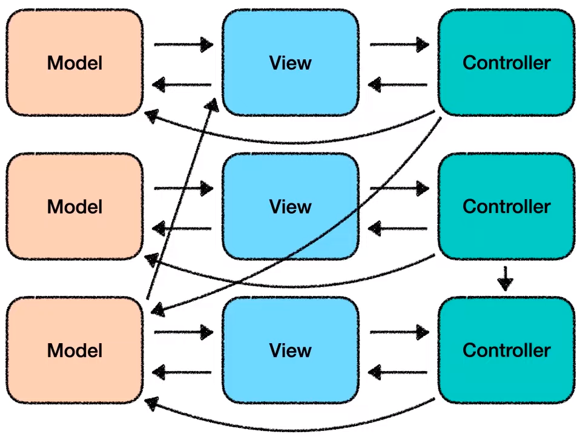
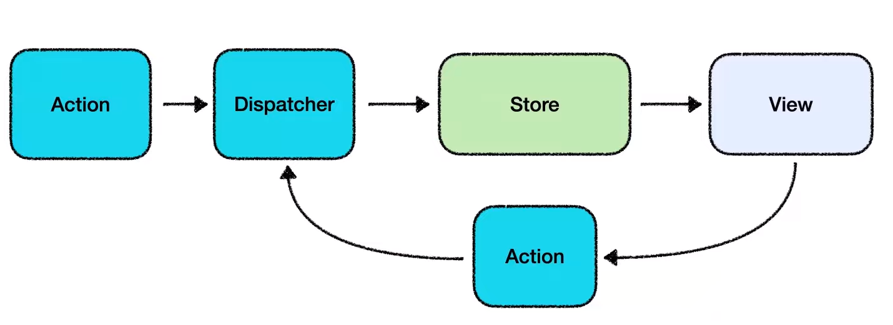
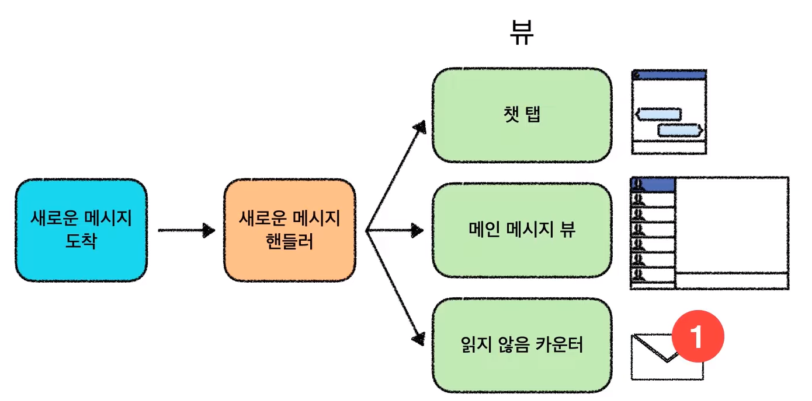
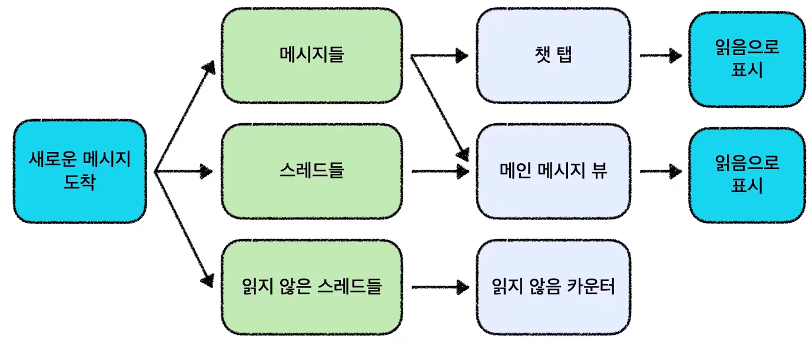
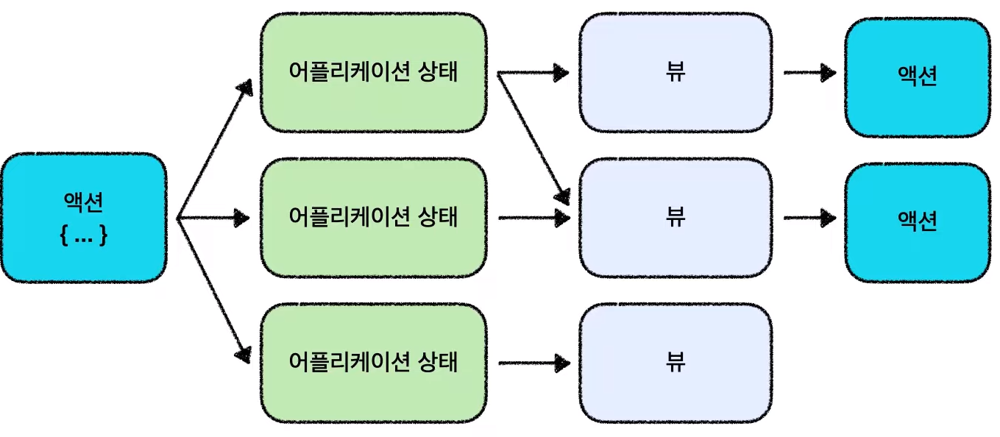
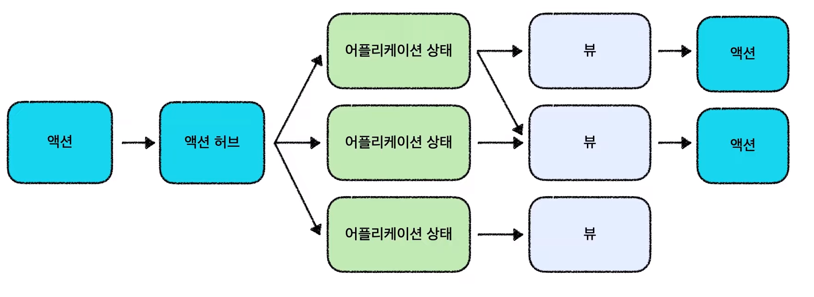
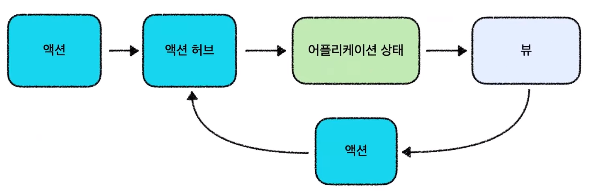
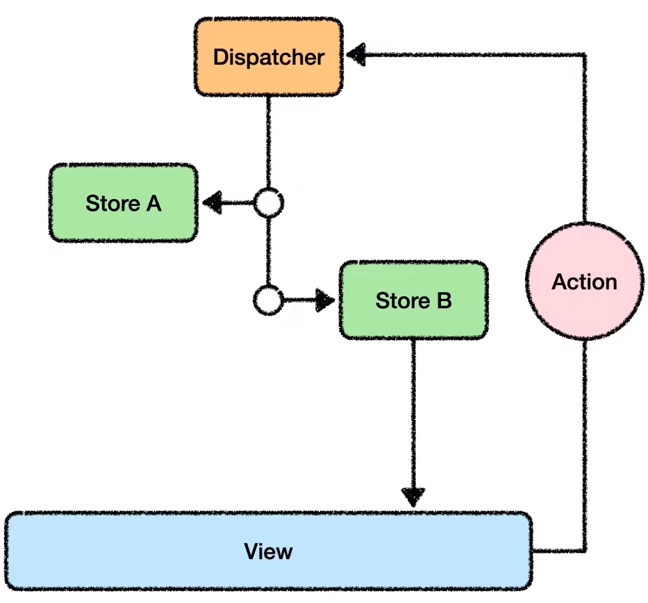

# 우디의 Flux Architecture
[https://youtu.be/wQFBgKl1PYw](https://youtu.be/wQFBgKl1PYw)

# 우디의 Flux Architecture
* toc
{:toc}

## Flux, 왜 필요할까?
+ Flux는 페이스북에서 2014년에 제안한 웹 어플리케이션을 위한 아키텍쳐 패턴이다
+ 단반향 데이터 흐름을 통해 보다 예측가능하게 상태를 관리할 수 있는 클라이언트 사이드 웹 어플리케이션 아키텍쳐 
+ 시스템을 보다 쉽고 유연하게 관리할 수 있도록 하는 디자인 패턴과 프레임워크들이 등장했다 Flux도 그중 하나이다 

## MVC의 한계 
+ 2014년도 페이스북의 어플리케이션은 MVC 패턴을 사용하고 있었다 
+ MVC 패턴이 유연성과 재사용성을 높인 디자인 패턴이다
+ 근런데 페이스북은 MVC는 확장가능하지 않다라는 결론을 내린다 
+ 정확히 말하면 MVC 패턴의 양방향 데이터 바인딩이 어플레케이션의 복잡도를 높이고 확장을 어렵게 만든다고 판단한 것이다 
+ 

## MVC에서 Flux로
+ MVC의 양방향 데이터 바인딩은 확장할수록 어플리케이션이 복잡해지는 단점이 있다
+ 이를 해결하기위해 페이스북이 제안한 해결책은 데이터가 한 방향으로만 흐르는 아키텍처이다, 그것이 바로 Flux 아키텍처이다 
+ 
+ 화살표가 항상 Dispatcher를 거쳐 한 방향으로 사이클을 이루며 흐른다 
+ MVC
  + 
+ Flux
  + 
  + 
    + 좀더 추상화
  + 
    + 새로운 메세지 도착이라는 액션 이름과 도착한 메시지에 내용을 담고 있는 단순한 자바스크립트 객체이다 때문에 액션은 자신을 직접 어플리케이션 상태 저장소에게 전달할 수 없다 
    + 때문에 이런 액션들을 저장소에게 전달해주는 역할을 하는 객체가 필요하다 따라서 액션 허브를 하나 추가했다 
    + 액션허브는 일종에 교통정리 시스템이다, 액션을 전달받으면 각 저장소들에게 순서대로 전달하는 역할을 한다 
  + 
    + 그림을 단순화 
    + 모든 액션을 액션 허브를 거치도록 하여 액션흐름에 교통정리를 하면 이전 Flux의 다이어르램과 같은 형태가 되었다 
      + 
    + 액션은 Ajax나 뷰에서 발생한 상태변경 요청 
    + Dispatcher는 액션을 모든 스토어에게 전달하는 전달자이자 교통정리 시스템
    + 스토어는 어플리케이션 상태가 저장되어있는 전역 저장소 
    + 뷰는 관심 있는 어플리케이션 상태가 변경 될 때마다 다시 그려지는 컴포넌트로 정리할 수 있다 

## Action
Dispatcher에 전달되는 상태 변경 요청(데이터)을 담은 자바스크립트 객체
+ 액션 이름 (type)
+ 데이터 (payload)
+ Action 생성자
  + Action을 쉽게 만들어주는 도우미 함수
+ Flux에서 어플리케이션은 이러한 액션을 통해서만 상태변경을 요청할 수 있다

## Dispatcher
모든 데이터 변경 요청이 경유하는 중앙 허브
+ View로부터 Action을 받아 모든 Store들에게 전송
+ 내부에 상태 변경 로직이 존재하지 않는다 
+ Store간 의존성 관리
  + Store A의 상태 변경 순서를 Store B 다음으로 미룰 수 있다 

## Store
어플리케이션 상태 및 로직 컨테이너
+ Dispatcher에서 전달된 Action을 통해서만 상태 변경
+ 상태가 변경되면 View에게 통지 

## View
상태에 따라 화면을 출력하는 로봇
+ Controller-View (React)
  + Store가 통지하는 상태 변경을 수신, 받은 상태에 따라 View를 새로 렌더링 
+ Dispatcher에게 Action 전달 

## 정리 

+ 뷰에서 액션이 발생하면 디스패처가 이를 수신해 각 스토어들에게 순서대로 전달
+ 액션을 전달받은 스토어는 관심 있는 액션에 대해 상태를 변경하고 변경된 상태를 뷰에게 알려준다 
+ 뷰는 변경된 상태에 따라 화면을 새로 그린다 
+ 만약 뷰에서 다른 액션이 발생한다면 이 사이클이 반복된다
+ 이런한 엄격한 단뱡향 데이터 흐름을 통해 Flux는 어플리케이션을 단순하게 유지하고 항상 최신 버전의 상태를 뷰를 통해 보여줄 수 있다 

## 장점과 한계점
+ Flux를 사용하면
  + 데이터 흐름의 구조화 쉬운 유닛 테스트 
    + 코스에 흐름을 파악하기 쉬워지고 코드를 더 유지 보수하기 쉽게 만들고 새로운 기능 확장에 열려있는 어플리케이션을 만들어 준다 
    + 디스패치는 액션을 받아 상태를 변경하는 순수함수이다 외부의 상태의 영향을 받지 않기 때문에 격리된 환경에서 쉽게 테스트할 수 있다 
    + 대규모 웹 어플리케이션에서도 상태관리를 쉽게 할 수 있다 
+ Flux를 사용하려면
  + 높은 학습 곡선 장황한 문법 
    + 초기에 작은 기능을 정리하기 위해 상대적으로 많은 코드가 필요하다 
    + 이는 학습 곡선을 높이고 개발시 불필요한 프로그래밍 오버헤드를 발생시킬 수 있다 
    + 이런 문제점을 해결하기 위해 Redux나 Mobx와 같이 Flux를 발전시킨 다양한 구현 라이브러리들이 등장했다 
