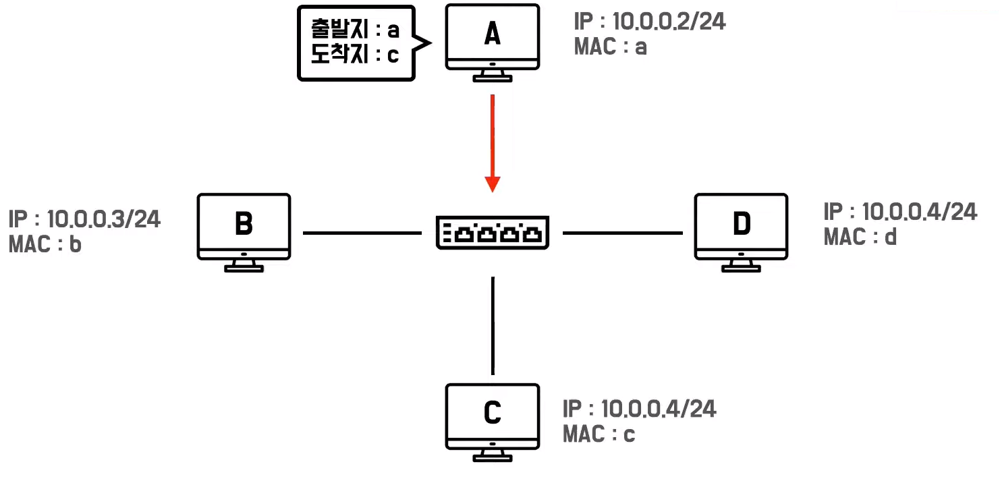
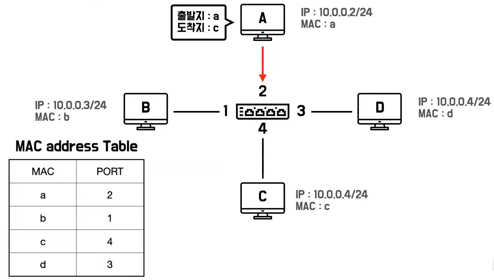
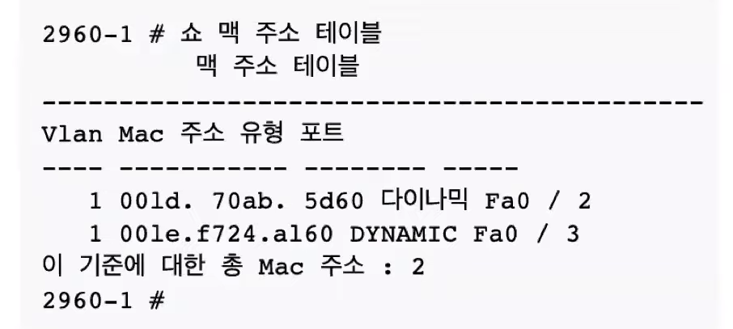
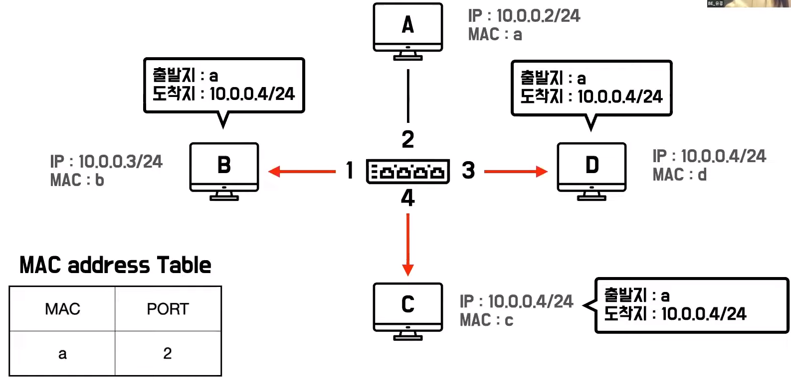
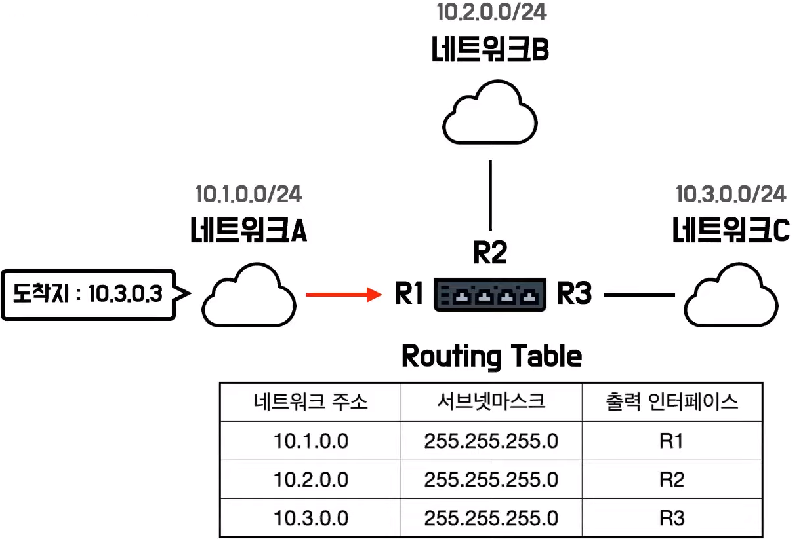
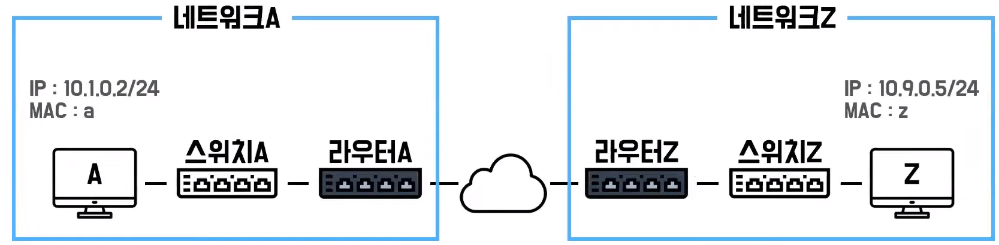

# 유콩의 데이터 통신
[https://youtu.be/EkNk8YeqZyM](https://youtu.be/EkNk8YeqZyM)

# 유콩의 데이터 통신
* toc
{:toc}

## 네트워크
+ 네트워크란?
  + 두 개 이상의 컴퓨터가 데이터를 주고 받을 수 있는 환경
  + 네트워크가 등장하기 전에는 다른 두 개의 컴퓨터에서 데이터를 주고받기 어려웠다
    + 각자의 컴퓨터에서 가지고 있는 정보를 공유하기 위해서 플로피 디스크나 시디 같은 저장 매체를 이용하였다
    + 하지만 정보를 전달할 상대 컴퓨터가 먼 거리에 있는 경우 정보를 전달하기 어려웠다
    + 그래서 그 컴퓨터 사이에 전선케이블을 직접 연결하여 정보를 주고 받는 방식이 등장한다 
    + 이렇게 두 개의 컴퓨터가 데이터를 주고 받을 수 있는 형태를 네트워크라고 불른다 
+ 인터넷 
  + 전선 케이블을 이용하여 데이터를 공유하는 것이 가능하자 점차 여러 대의 컴퓨터가 정보를 공유할 수 있도록 수많은 컴퓨터가 연결되었다  
  + 여러 컴퓨터가 연결되어 그물망처럼 하나로 연결된 것을 인터넷이라고 부른다 
+ 네트워크 구성요소 
  + 네트워크를 구성하던 요소는 크게 세 가지 있다 
  + 데이터를 주고 받는 기기인 단말 장치, 단말 장치는 다른 단말 장치에게 데이터를 송신할 수도 있고 수신할 수도 있다 
    + 스마트폰, 노트북, 데스크탑, 테블릿 PC 등이 있다 
  + 단말 장치들 사이를 연결해주는 전송 매체가 있다, 전송 매체는 단말 장치가 다른 단말 장치에게 데이터를 공유할 수 있도록 데이터를 전달 해주는 역할을 한다
    + 전송 매체는 흔히 랜선이라고 부르는 LAN 케이블이 있다
  + 데이터가 최종 도착지까지 전달될 수 있도록 경로를 준비하는 네트워크 장비가 있다, 네트워크 장비는 단말 장치로부터 받은 메세지를 어느 위치에 있는 단말 장치에게 전달해 주어야 하는지 판단하는 역할을 한다
    + 네트워크 장비에는 허브, 스위치, 라우터 등이 있다  
 
## 허브 
+ 허브는 하나의 네트워크에 여러 개의 단말 장치가 연결될 수 있도록 단말 수만큼 포트 수를 늘려 분배하는 역할을 한다 
+ LAN 포트에 케이블을 연결해 여러 대의 컴퓨터를 하나의 네트워크로 연결할 수 있다 
+ 허브는 단순하게 네트워크를 분배하는 역할만 수행한다
+ 허브가 받은 메시지를 보고 어디에 메세지를 보내야 하는지 판단해야 하는 과정이 없다 

### 허브의 통신 
+ 
+ 다른 단말 장치에게 데이터를 공유하고 싶은 A는 출발지 MAC 주소와 도착지 MAC 주소를 적은 요청 메세지를 허브에게 전송한다 
+ 그럼 허브는 출발지로 적힌 단말 장치 이외의 모든 포트에 연결되는 모든 단말 장치에게 받았던 메시지를 전송한다 
+ 메시지를 받은 단말 장치 쪽에서 도착지 정보를 확인하고 나의 MAC 주소와 일치하지 않으면 무시하고 일치하면 수신한다 
+ 원하는 도착지 단말 장치에게만 메시지를 보내는 것이 아닌 모든 단말 장치에게 전송하고 메시지를 받은 단말 장치 쪽에서 나에게 온 메시지가 맞는지 판단하는 과정이 필요하다 
+ 허브는 네트워크를 분배하는 역할만 수행할 뿐 데이터의 수신을 구분해서 도착지에 전달하는 기능은 없기 때문이다 

## 스위치 
+ 스위치는 허브의 단점을 해결했다 
+ 허브는 출발지 이외에 모든 단말 장치에게 메시지를 보냈지만 스위치는 도착지 한 곳에만 메시지를 전달한다 
+ 도착지의 위치, 즉 포트를 알기 위해서 스위치 각 단말 장치의 위치를 적어둔 것을 MAC 주소 테이블이라고 부른다
+ MAC 주소 테이블에는 MAC 주소를 기준으로 단말 장치가 스위치 어느 포트에 연결되는지를 나타낸다 
+ 스위치가 메시지를 주고 받으려면 MAC 주소 테이블을 확인하고 메시지를 전달해야 하는 단말 장치의 위치를 파악한 후 도착지에 메시지를 전송한다 

### 스위치의 통신
+ 
+ 단말 장치 A는 전송하고 싶은 데이터와 출발지 MAC 주소 및 도착지 주소 MAC 주소를 적어 메시지를 생성한다 
+ 생성한 메시지를 스위치에게 전달하면 스위치는 어느 포트에 메시지를 전달해야 하는지 확인한다 
+ 도착지에 적힌 MAC 주소와 일치하는 포트 정보를 찾고 해당 포트에 메시지를 전송한다 
+ 스위치는 허브처럼 포트에 연결되어 있는 모든 포트에 메시지를 전송하는 것이 아닌 도착지 단말 장치 한 곳에만 전달하므로 충돌이 일어날 가능성이 줄어든다 

### MAC 주소 테이블
+ 
+ 스위치의 통신은 MAC 주소 테이블 덕분에 도착지 단말 장치 자체에게 데이터를 전송할 수 있었다 
+ 그런 MAC 주소 테이블은 네트워크 관리자가 직접 터미널에서 접속하여 수동으로 설정 할 수도있다 
  + 하지만 대규모 네트워크의 경우 스위치가 여러 대일 수도 있기 때문에 관리하기 어렵고 사람이 관여한다면 잘못되는 주소 정보가 저장될 가능성이 있다 
+ 사람이 아닌 스위치가 직접 자신을 통해 오가는 메시지를 활용하여 MAC 주소 테이블을 업데이트 하는 방법이 있다 
  + 이과정에서 MAC 주소를 알아내기 위해 활용되는 것이 ARP이다 

### ARP
+ Address Resolution Protocol
  + 주소 결정 프로토콜
+ ARP는 네트워크에서 IP 주소에 대응되는 MAC 주소를 결정하는 규약이다 
+ 쉽게 말하자면 도착지의 MAC 주소 정보를 모르는 상황에서 IP 주소를 이용하여 MAC 주소를 찾는 방법이다 
+ 도착지에 MAC 주소를 찾기 위한 과정
  + 
  + 단말 장치 A는 스위치에게 ARP 요청 메시지를 보낸다 
  + 그럼 스위치는 2번 포트에서 단말 장치 A에게 메시지를 받았으므로 포트 2번에 단말 장치 A가 연결되어 있다라는 것을 알게 된다 
  + MAC 주소 테이블에 단말 장치 A에 주소와 포트 정보를 저장해둔다 
  + ARP 요청 메시지를 받은 스위치는 단말장치 A르 제외한 모든 단말 장치에게 받은 메시지를 복사하여 전달한다 
  + 이처럼 데이터를 수신한 단말 장치 이외에 나머지 모든 단말 장치로 데이터를 단순 복사하여 전송하는 과정을 플러딩(Flooding) 이라고 부른다 
  + ARP 요청 메시지를 받은 다른 단말 장치들은 자신의 IP 정보와 비교하여 IP 정보가 다르면 무시하고 일치하면 ARP 응답 메시지를 스위치에게 전송한다 
  + ARP 응답 메시지는 ARP 요청 메시지에 있었던 출발지 MAC 주소와 자신의 MAC 주소를 사용하여 생성한다 
  + 스위치는 ARP 응답 메시지를 확인하여 포트 4번에 단말 장치 C가 연결되어 있다는 것을 알게 되어 MAC 주소 테이블에 해당 정보를 추가한다 
  + ARP 과정을 통해 단말 장치 A는 단말장치 C의 MAC 주소를 알게 된다 
  + 단말 장치 A는 ARP 주소 테이블에 단말 장치 C의 정보를 갱신하여 다음에 데이트를 전송할 때 활용한다 
  + 이렇게 ARP를 이용하여 단말 장치 A가 단말 장치 C에게 데이트를 전송할 준비 과정을 마치게 된다 

## 허브와 스위치 
+ 허브는 받은 메시지를 연결된 모든 단말 장치에게 전송하여 단말 장치가 직접 자신에게 온 메시지인지를 판단한다
+ 스위치는 MAC 주소 테이블을 이용하여 도착지 단말 장치에게만 메시지를 전송한다 
+ 공통점
  + 허브와 스위치를 이용하여 하나의 네트워크로 연결
+ 동일한 네트워크 상에서의 메시지 전송에 대해서 알아보았다, 서로 다른 네트워크 사이에 메시지를 전송할 수 있게 도와주는 장치는 라우터가 있다

## 라우터 
+ 서로 다른 네트워크 사이에 메시지를 전송할 수 있게 도와주는 장치가 라우터이다.
+ 라우터는 서로 다른 네트워크 사이를 중계하는 역할을 한다 
+ 단말 장치들은 ARP 주소 테이블을 이용하여 데이터를 전달하고 싶은 컴퓨터 MAC 주소를 확인하고 스위치는 MAC 주소 테이블을 이용하여 스위치에 연결되어 있는 단말 장치들이 연결된 포트 정보를 확인할 수 있었다 
+ 라우터도 이와 같이 테이블로 정보를 관리한다
+ 라우터가 관리하는 테이블을 '라우팅 테이블(Routing Table)'이라고 부르며 네트워크 주소와 서브텟 마스크, 출력 인터페이스를 정보로 가진다 
+ 출력 인터페이슨느 포트 정보를 의미한다 

### 라우터 통신 
+ 
+ 네트워크 A에 속해있는 어떤 단말 장치가 어떤 라우터로 메시지를 전달했다고 가정해보자 
+ 라우터는 여러 네트워크에 연결되어 있을 때 적절한 네트워크를 찾아 전달해야 하므로 메시에 담긴 도착지 IP를 이용한다 
+ 메시지를 받은 라우터는 라우팅 테이블에 있는 모든 서브넷마스크와 메시지에 담긴 도착지 IP를 비교한다 
+ 서브넷마스크와 도착지 IP를 비교하여 메시지를 전달해야 하는 네트워크 주소가 10.3.0.0임을 할 수 있다 
+ 그럼 라우터는 네트워크 C가 연결되어 있는 R3 포트로 메시지를 전달한다

## 정리 
+ 
+ 네트워크 A에 있는 단말 장치 A가 네트워크 Z에게 데이터를 전송하려 한다 
+ 먼저 단말 장치 A는 출발지와 도착지 정보가 담긴 메시지를 생성하고 스위치 A에게 전송한다 
+ 스위치 A는 MAC 주소 테이블을 활용하여 네트워크 A에 단말 장치 Z가 있는지 확인한다 
+ 단말 장치 Z가 없다는 것을 확인하고 다른 네트워크로 메시지를 보내기 위해서 라우터 A에게 메세지를 전송한다 
+ 라우터 A는 라우팅 테이블에 있는 정보와 받은 메시지 정보를 비교하여 메시지의 도착지가 속해있는 네트워크 Z를 찾는다 
+ 네트워크 Z가 연결되어 있는 라우터 Z로 데이터를 전송한다 
+ 라우터 Z는 동일한 네트워크 내에 있는 스위치 Z로 메시지를 보내고 
+ 스위치 Z는 MAC 주소 테이블을 이용하여 단말 장치 Z를 찾아 전달한다 
+ 이렇게 여러 네트워크 장비를 거쳐가면서 서로 다른 네트워크 있는 단말 장치 사이의 데이터 통신이 가능하게 된다 
