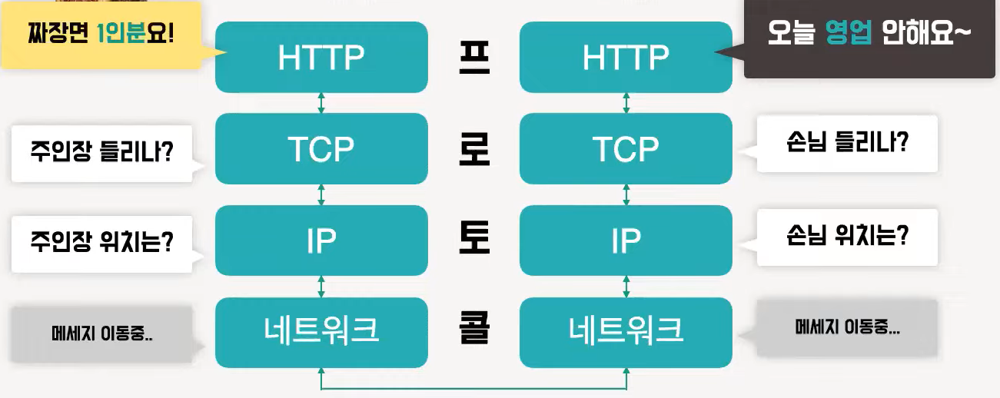
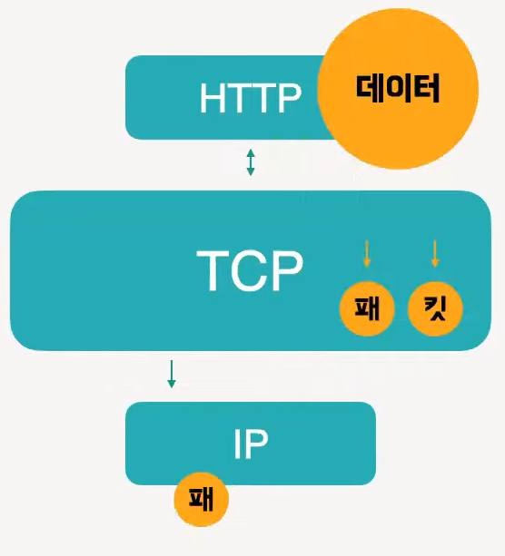
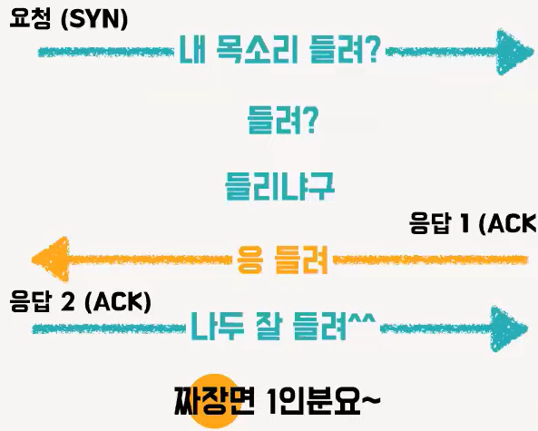
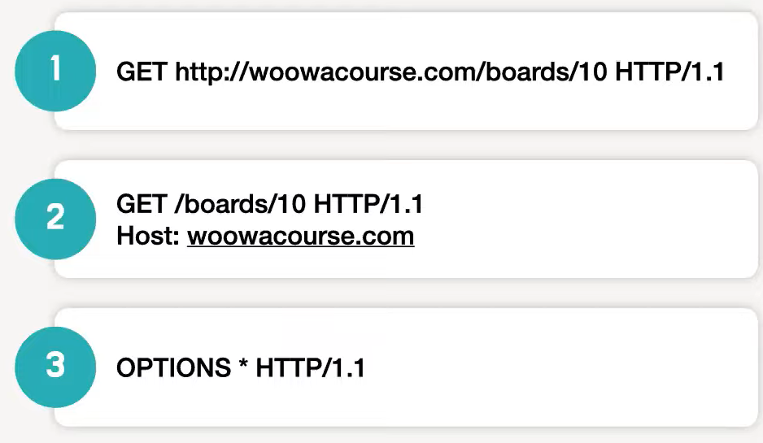
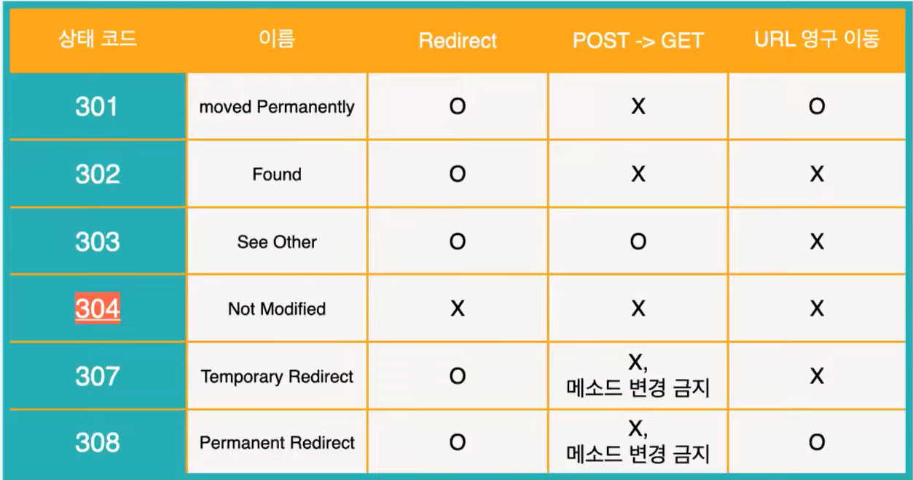
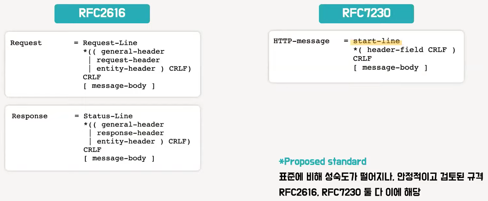

# 헌치, 써머의 HTTP
[https://youtu.be/IjxkKQvn8Bc](https://youtu.be/IjxkKQvn8Bc)

# 헌치, 써머의 HTTP
* toc
{:toc}

그럼 상태 유지가 필요할 때는 어떡하죠?
예를 들어서 장바구니에 담은 물건을 나중에 결제할 때 같이요
그래서 세션과 쿠키 같은 기술이 함께 쓰이고 있어요
또 다른 특성으로는 리퀘스트에서 URI로 리소스를 식별한다는 것이 있는데요
URI는 저희가 앞에서 얘기했죠
네. 리소스 식별자였죠.
이 때 다음과 같이 여러 방법으로 URI를 지정할 수 있어요
첫 번째 리퀘스트 URI에 포함하기
두 번째 HOST 헤더 필드에 네트워크 로케이션을 포함하기
세 번째 자신에게 송신하는 경우에는 와일드카드 지정하기가 있습니다.
마지막 특성으로 지속 연결이 있는데요
초기 HTTP는 비지속 연결을 사용했습니다.
요청을 주고 받을 때 마다 새로운 TCP 커넥션을 연결하고 종료하는 것이죠.
좀 번거롭네요.
그쵸
데이터가 작을 때는 문제가 없었는데요
주고받을 데이터가 많아지면서 매번 TCP 연결과 종료를 하니
자원 낭비가 있었어요. 속도도 느려지고요.
그래서 지속 연결을 통해서 서버의 부하를 줄이고
통신을 좀 더 빠르게 하게 되었습니다.
여기서 나아가서 리스폰스 응답을 기다리지 않고
바로 다음 리퀘스트를 보내는
파이프라이닝도 가능해졌어요.
오 편리하네요
그런데 성능 향상이 미미하고 프록시 버그가 많아서
모던 브라우저에서는 기본적으로 활성화 되어있지 않다고 하네요
아쉽네요
특성을 다 살펴 봤으니 HTTP에서 지원하는 메소드들을 알아볼게요
그런데 저기 “멱등성"은 뭔가요?
“멱등성”은 수학에서 연산을 여러번 적용해도
결과가 달라지지 않는 성질을 뜻하는 것인데요.
HTTP에서는 여러번 요청한 결과 서버의 상태가 항상 동일할 때를 뜻합니다.
메서드 별로 멱등성 성립 여부가 다르니 유의해서 봐주세요
먼저 특정한 리소스를 가져오도록 요청하는 GET 입니다
데이터를 가져올 때만 사용해야 하는데요
사실 본문을 담는 게 금지되어 있지는 않아요
그러면 담아도 되는 거 아닌가요?
아 그게 그렇게 보내면 구현 된 서비스에서
요청을 거부할 수 있기 때문에 담지 않는 게 바람직하겠죠?
GET은 여러번 실행해도 특정 리소스를
보내주기만 하는 것이라 당연히 멱등성이 보장되겠죠?
다음으로 POST는 대상 리소스에게
리퀘스트 본문을 해당 리소스의 시맨틱에 따라
처리하도록 요청하는 메서드에요.
게시판, 블로그 같은 글 모음에 글 보내기
서버에 새로운 리소스 생성하기 등에 사용할 수 있어요.
새로운 리소스가 생기면 멱등성이 보장되지 않겠네요?
어 그렇죠. 게시글을 계속 보내면 글이 쌓이겠죠?
서버의 상태가 변하니까 멱등하지 않아요.
그리고 리소스를 수정하는 데 사용하는 PUT과 PATCH가 있습니다.
PUT은 대상 리소스가 없다면 생성하고
있다면 리퀘스트의 본문대로 교체하는데 사용됩니다.
PATCH는 리소스의 일부를 수정하는 데 사용되는데요.
PUT은 멱등하지만 PATCH는 그럴 수도 있고 아닐 수도 있어요.
그럴 수도 있고 아닐 수도 있다는 건 무슨 뜻이죠?
이게 의도에 따라 다르게 사용할 수 있는데요
PATCH는 rfc2616 스팩 상으로는 멱등성을 보장하지 않았어요
그런데 복수의 PATCH 요청이 부작용을 일으키지 않도록
막는 목적으로 멱등하게 처리해도 된다고 rfc5789에 추가 기술되어 있습니다.
마지막으로 지정한 리소스를 삭제하는 DELETE 입니다
DELETE도 멱등성을 보장해야 하는데요
그러니까 게시판의 마지막 글 제거를 구현하면서
DELETE를 사용하면 안되겠죠?
실행 결과가 계속 달라지니까요
그 외에도 GET으로 요청했을 때의 응답 헤더만 가져오는 HEAD
해당 리소스의 통신 옵션을 알려 주는 OPTIONS 등이 있습니다.
필요에 따라 골라쓰되 규약을 꼭 지키도록 해요
그게 통신 약속이니까요
이제 다시 제가 설명할 차례네요
다음은 상태코드에 대해 알아보고자 합니다
써머는 상태 코드가 뭔지 아시나요?
혹시 요청에 따라 어떤 응답이 나타났는지 상태를 나타내는 코드일까요?
맞습니다. 모든 HTTP 응답 코드는 3자리 숫자로 구성됩니다.
100번 대부터 500번 대까지
첫번째 자리의 숫자를 기준으로 5개의 클래스로 나뉩니다.
이후의 두자리는 해당 클래스의 구체적 상태들에 할당된 코드입니다.
우선 200번대부터 알아볼게요
잠깐만요, 왜 100번대 상태 코드는 얘기 안하고 넘어가시나요?
100번대 코드는 요청을 받았고, 해당 요청에 대한 프로세스를 진행중이라는 뜻입니다.
그런데 쓰이는 일이 많지 않아요.
애초에 요청 처리를 끝나지 않았는데
해당 상태를 응답으로 보낼 일이 많지 않겠죠?
그러니 200번대 상태 코드부터 설명해 드릴게요.
200번대는 성공 상태를 나타내요.
요청이 성공적으로 처리 되었다는 응답을 할때 200번대 상태코드를 씁니다.
200번 ok는 서버가 요청을 제대로 처리했다는 뜻입니다
201번 create는 서버가 요청을 제대로 처리했고
또한 요청에 따른 새로운 리소스가 서버에 저장되었다는 뜻입니다.
반면 204번 no content는 서버가 요청을 제대로 처리 했는데
요청에 따른 콘텐츠를 제공하지는 않을 때 사용해요.
다음으로 300번대 상태 코드에 대해 설명 드릴게요
300번대는 요청에 대한 추가적인
처리, 동작이 필요하다는 응답이 돌아올 때 쓰여요.
추가 처리가 필요할 때엔
해당 처리를 할 수 있는 위치를 함께 알려줄 필요가 있어요.
마치 상담원이 자기 소관이 아니니 다른 부서로 연락을 돌릴 때처럼요?
네 맞아요
이러한 300번대는 각각 세부 번호끼리 헷갈리는 지점이 있어서
몇 가지 기준에 따라 표를 만들어 보았습니다
여기서 리다이렉트는 뭘까요?
다시 향하다니까 받은 데이터 패킷을
다른 URL로 중계하는 것을 뜻할 것 같아요
아 맞아요
요청된 페이지로 URL이 영구적으로 변했는지에 따라
POST로 보내진 요청이 위치 이동 시 GET으로 치환되는 지에
300번 상태 코드들이 다르게 쓰입니다.
어 근데 304번은 왜 혼자 새빨간가요?
304번 Not Modified는 여기서 소개된 다른 상태 코드들과 달리
리다이렉트되지 않아요.
마지막 요청 이후 요청한 페이지는 변경되지 않았다는 뜻의 상태 코드입니다.
다음으로 400번대 상태 코드에 대해 설명 드릴게요.
400번대는 오류 코드입니다
클라이언트의 요청이 잘못됐을 때
어? 혹시 오류가 요청을 잘못 보낸 클라이언트 책임이라는 건가요?
예리하네요
400번 Bad Request는 서버가 요청의 구문을
인식하지 못했다는 뜻의 상태 코드 입니다.
브라우저는 해당 코드와 200 OK를 동일하게 취급한다고 해요.
401번 Unauthorized는 해당 요청을 들어주려면
인증이 필요하다는 뜻의 상태 코드 입니다
주로 로그인이 필요할 때 해당 코드를 보여줍니다.
인증 정보를 보낸 후에도 계속 401이 뜨면 뭘까요?
혹시 아이디나 비밀번호 같은 걸 잘못 입력한 거 아니에요?
맞아요
잘못된 인증 정보로 요청한겁니다.
403번 Forbidden은 클라이언트가 리소스에 대한 필요 권한을
갖고 있지 않다는 뜻입니다.
직전의 401과 다른 게 뭔가요?
401은 인증 자체가 실패했다는 뜻이었죠?
403은 인증은 됐지만 해당 사용자의 권한은 없다는 뜻입니다.
예를 들어서 요청 받은 정보가 민감한 정보라
관리자만이 해당 리소스에 접근할 수 있고
일반 유저는 접근할 수 없을 수도 있겠죠.
404 Not Found 이 코드는 익숙하시죠?
질리도록 봤죠. 해당 페이지를 찾을 수 없을 때 뜨는 거 아니에요?
맞아요
근데 요청을 거부하고 싶지만 이유가 비밀일 때도 씁니다
아 그래서 많이 봤던 거네요.
마지막으로 500번대 상태 코드를 다뤄볼게요
400번대가 클라이언트가 잘못된 요청을 보냈을 때 보내는 상태 코드였는데요.
500번대는 그 반대입니다
그럼 서버 때문에 오류가 터졌을 때 쓰겠네요
정확합니다. 우선 500번 Interner Server Error는
서버에 오류가 발생하여 요청을 수행할 수 없을 때 사용되고요
501번 Not Implemented는 서버에
요청을 수행할 수 있는 기능이 없을 때 사용됩니다.
예를 들어 서버가 GET, POST 등
요청 메소드를 인식하지 못할 때 이 코드를 표시하죠
마지막으로 503 Service Unavailable 상태 코드는 무슨 뜻일까요?
서버를 사용할 수 없다는 뜻이니까
서버가 다운되었을 때 쓰일 것 같은데요
어 맞아요
일반적으로는 서버의 유지보수로 작동이 중단되거나
과부하가 걸렸을 때 해당 코드를 보내게 됩니다.
끝으로 HTTP 메시지를 살펴 볼게요
1999년도에 발표된 rfc2616에 정의된
HTTP 1.1 메시지 포맷은 rfc7230에서 바뀌었는데요
현재 proposed standard인
rfc7230을 기준으로 설명하겠습니다.
리퀘스트/리스폰스 메시지 포맷을 따로 지정했다가 합쳐졌는데요
start-line에서 차이를 찾을 수 있어요
리퀘스트의 start-line은 request-line으로 칭하며
메서드 / 요청 대상 / 프로토콜 버전 으로 구성됩니다
반면 리스폰스의 start-line은 resonse-line으로 불리는데요
프로토콜 버전 / 세 자리 숫자 응답 코드 / 응답 코드에 대한 부연 설명이고요.
앞서 배웠으니까 어떤 요청이 오고 간 건지 이제 다들 이해하실 수 있겠죠?
start-line과 메시지 본문을 제외하면 모두 헤더 필드입니다
대소문자 구분 없는 필드 이름과
콜론으로 이어진 필드 값이 한 쌍으로 쓰여요
성격에 따라 분류가 가능한데요
다음 필드는 리퀘스트 헤더에 속합니다.
이름대로 요청에 대한 정보를 나타내죠
현재 Accept와 Accept-Language로
클라이언트가 이해 가능한 컨텐츠 타입과 언어를 알려주고 있네요
또한 Cache-control로 캐시를 무효화하고 있습니다.
그러면 응답, 리스폰스 헤더도 있겠네요?
어 맞아요. 응답에 대한 정보도 필요하니 당연히 있어요.
이 리스폰스는 2022년 5월 16일 월요일
그리니치 표준시로 9시에 생성되었고,
요청을 처리한 서버는 github이라고 나와 있네요
그리고 표현 헤더는 바디에 대한 정보를 담고 있어요
지금 온 응답은 utf-8로 인코딩 된 html이고요, gzip으로 압축됐네요.
설명하지 않은 헤더는 무슨 헤더인가요?
아 이건 커스텀 헤더에요
헤더는 사용자가 얼마든지 임의로 지정해서 사용할 수 있는데요
여기서 소개해드린 헤더는 공식 헤더 필드의 극히 일부분입니다.
통신에 대한 올바른 정보를 제공하기 위해
필요에 따라 맞는 필드를 찾아보고 적용하도록 해요.
오늘 발표할 내용은 여기까지고요
이 발표는 다음 참고 문헌들을 토대로 준비되었습니다.
설명한 개념들에 대해 더 자세히 알고싶다면
해당 책과 문서를 참고해주세요
전 처음에 HTTP를 제대로 이해하지 못한 상태로 웹 기술들을 공부했었어요.
그래서 깊이 있게 이해보다 단순히 기능 사용법 위주로 학습하게 되더라고요
하지만 정해진 HTTP 규약을 알고
제대로 지키면 더 효율적인 통신을 할 수 있습니다.
이번 발표가 HTTP에 대한 감을 잡는 데 도움이 되었으면 좋겠네요.
도움이 되었으면 좋겠네요.
이상으로 발표 마칠게요. 들어주셔서 감사합니다

## HTTP?
+ Hypertext Protocol
  + 서버-클라이언트 메시지 교환 프로토콜 
+ 프로토콜 (Protocol)
  + 서러 다른 하드웨어 기기 간 데이터 통신 규약 
+ 기기 간 통신 광정
  + 클라이언트가 리소스를 HTTP를 통해 요청하면 TCP, IP 프로토콜을 걸쳐 서버 쪽의 HTTP까지 요청이 도달한다 이에 대한 응답을 다시 서버에서 HTTP로 보내면 TCP, IP 프로토콜을 통과해 반대편의 클라이언트까지 응답이 도달하게 된다
  + 
  + TCP/IP는 수많은 네트워크 기기들이 인터넷으로 통신하는 데 있어서 가장 기반이 되는 프로토콜이다

## TCP (Transmission Control Protocol)
+ 트랜스포트 계층에서는 서버와 클라이언트 사이 통신 연결을 담당한다 TCP는 이러한 트랜스포트 계층 속의 프로토콜이다
+ TCP에서는 바이트 스트림 서비스를 제공한다
+ 바이트 스트림 (Byte Stream)
  + 
  + 바이트 스트림은 큰 데이트를 잘게 쪼갠 뒤 전송하는 서비스이다 
+ 쓰리웨이 핸드쉐이킹 (3way handshaking)
  + 

## IP (Internet Protocol)
+ IP에서는 분할된 데이터 패킷들을 보낸다
+ IP 주소 / MAC 주소
  + IP는 언제든 변경될 수 있다 반면에 mac은 믿을 수 있다 이곳의 위도, 경도가 100년이 지나도 변하지 않듯이 
  + mac 주소만 쓰지 왜 IP를 같이 쓰는 이유
  + IP가 계층형 주소이기 때문에 가고자 하는 주소의 “방향”을 알 수 있기 때문이다
+ ARP (Address Resolution Protocol)
  + 주소를 찾아가는 프로토콜 
  + 수신자의 IP 주소로 수소문하고 도착한 곳 기기의 MAC 주소를 조사하고 이를 통해 배송지의 루트를 찾아낸다 
  + 이때 중간에 경유하는 네트워크 기기들이 있다 이 기기들은 전체 배송지 루트를 알 수 없다 

## DNS (Domain Name System)
+ 도메인 이름 및 IP 주소를 확인하는 기능을 제공한다 
+ 도메인 이름을 IP 주소로 변환하고 도메인 이름을 웹 브라우저에 입력할 때 최종 사용자를 어떤 서버에 연결할 것인지 제어한다 
+ URI (Uniform Resource Identifier) / URL (Uniform Resource Locator)
  + URL은 웹페이지 상의 표시 주소 
  + URI는 URL을 포괄한 개념으로 리소스를 식별하는 식별자를 뜻한다 

## HTTP 프로토콜

### 구성
+ Request / Response
  + Request 메시지는 메서드, URI 프로토콜 버전, 헤더, 바디로 구성
  + Response 메시지는 프로토콜 버전, 상태 코드,상태 코드에 대한 설명, 헤더, 바디로 구성
  
### 특성
+ Stateless
  + HTTP 프로토콜에서는 과거 정보를 남기지 않고 새로운 리퀘스트를 보낼 때 마다 새로운 리스폰스를 보낸다 상태와 무관하니 확장이 쉽다
  + 그럼 상태 유지가 필요할 때는 세션과 쿠키 같은 기술이 함께 쓰이고 있다
+ URI로 리소스 식별
  + 이 때 다음과 같이 여러 방법으로 URI를 지정할 수 있다
  + 
  + 첫 번째 리퀘스트 URI에 포함하기
  + 두 번째 HOST 헤더 필드에 네트워크 로케이션을 포함하기
  + 세 번째 자신에게 송신하는 경우에는 와일드카드 지정하기
+ 지속 연결
  + 초기 HTTP는 비지속 연결을 사용했다. 요청을 주고 받을 때 마다 새로운 TCP 커넥션을 연결하고 종료하는 것이다.
    + 데이터가 작을 때는 문제가 없었다
    + 주고받을 데이터가 많아지면서 매번 TCP 연결과 종료를 하니 자원 낭비가 있었다. 속도도 느려졌다.
  + 그래서 지속 연결을 통해서 서버의 부하를 줄이고 통신을 좀 더 빠르게 하게 되었다.
  + 여기서 나아가서 리스폰스 응답을 기다리지 않고 바로 다음 리퀘스트를 보내는 파이프라이닝도 가능해졌다.
    + 그런데 성능 향상이 미미하고 프록시 버그가 많아서 모던 브라우저에서는 기본적으로 활성화 되어있지 않다고 한다
    
### HTTP 메서드 
+ “멱등성”은 수학에서 연산을 여러번 적용해도 결과가 달라지지 않는 성질을 뜻하는 것이다.
+ HTTP에서는 여러번 요청한 결과 서버의 상태가 항상 동일할 때를 뜻한다. 메서드 별로 멱등성 성립 여부가 다르니 유의해야 한다
+ GET
  + 데이터를 가져올 때만 사용해야 한다 사실 본문을 담는 게 금지되어 있지는 않다
    + 구현 된 서비스에서 요청을 거부할 수 있기 때문에 담지 않는 게 바람직하다
  + GET은 여러번 실행해도 특정 리소스를 보내주기만 하는 것이라 당연히 멱등성이 보장된다
+ POST
  + 대상 리소스에게 리퀘스트 본문을 해당 리소스의 시맨틱에 따라 처리하도록 요청하는 메서드.
  + 게시판, 블로그 같은 글 모음에 글 보내기 서버에 새로운 리소스 생성하기 등에 사용할 수 있다
  + 서버의 상태가 변하니까 멱등하지 않다
+ PUT과 PATCH
  + 리소스를 수정하는 데 사용하는 PUT과 PATCH가 있다.
  + PUT은 대상 리소스가 없다면 생성하고 있다면 리퀘스트의 본문대로 교체하는데 사용된다.
  + PATCH는 리소스의 일부를 수정하는 데 사용된다.
  + PUT은 멱등하지만 PATCH는 그럴 수도 있고 아닐 수도 있다.
    + PATCH는 rfc2616 스팩 상으로는 멱등성을 보장하지 않았다
    + 그런데 복수의 PATCH 요청이 부작용을 일으키지 않도록 막는 목적으로 멱등하게 처리해도 된다고 rfc5789에 추가 기술되어 있다.
+ DELETE
  + 지정한 리소스를 삭제하는 DELETE 이다
  + DELETE 멱등성을 보장
  + 게시판의 마지막 글 제거를 구현하면서 DELETE를 사용하면 안된다
+ 그 외에도 GET으로 요청했을 때의 응답 헤더만 가져오는 HEAD 
+ 해당 리소스의 통신 옵션을 알려 주는 OPTIONS 등이 있다.

### HTTP 상태 코드
+ 모든 HTTP 응답 코드는 3자리 숫자로 구성된다
+ 100번 대부터 500번 대까지 첫번째 자리의 숫자를 기준으로 5개의 클래스로 나뉜다.
+ 이후의 두자리는 해당 클래스의 구체적 상태들에 할당된 코드이다.
+ 100번대 코드는 요청을 받았고, 해당 요청에 대한 프로세스를 진행중이라는 뜻이다.
+ 그런데 쓰이는 일이 많지 않다. 애초에 요청 처리를 끝나지 않았는데 해당 상태를 응답으로 보낼 일이 많지 않다?
+ 상태코드 : 2XX
  + 200번대는 성공 상태를 나타낸다.
  + 요청이 성공적으로 처리 되었다는 응답을 할때 200번대 상태코드를 쓴다.
  + 200번 ok는 서버가 요청을 제대로 처리했다는 뜻
  + 201번 create는 서버가 요청을 제대로 처리했고 또한 요청에 따른 새로운 리소스가 서버에 저장되었다는 뜻
  + 반면 204번 no content는 서버가 요청을 제대로 처리 했는데 요청에 따른 콘텐츠를 제공하지는 않을 때 사용
+ 상태코드 : 3XX
  + 300번대는 요청에 대한 추가적인 처리, 동작이 필요하다는 응답이 돌아올 때 쓰인다.
  + 추가 처리가 필요할 때엔 해당 처리를 할 수 있는 위치를 함께 알려줄 필요가 있다.
  + 
  + 리다이렉트는 받은 데이터 패킷을 다른 URL로 중계하는 것을 뜻한다
  + 요청된 페이지로 URL이 영구적으로 변했는지에 따라 POST로 보내진 요청이 위치 이동 시 GET으로 치환되는 지에 300번 상태 코드들이 다르게 쓰인다.
  + 304번 Not Modified는 다른 상태 코드들과 달리 리다이렉트되지 않는다.
+ 상태코드 : 4XX
  + 400번대는 오류 코드이다
  + 400번 Bad Request는 서버가 요청의 구문을 인식하지 못했다는 뜻의 상태 코드 이다.
  + 브라우저는 해당 코드와 200 OK를 동일하게 취급한다고 한다
  + 401번 Unauthorized는 해당 요청을 들어주려면 인증이 필요하다는 뜻의 상태 코드 이다
    + 주로 로그인이 필요할 때 해당 코드를 보여준다
  + 인증 정보를 보낸 후에도 계속 401이 뜨면 아이디나 비밀번호 같은 걸 잘못 입력한 것이다, 잘못된 인증 정보로 요청한겁니다.
  + 403번 Forbidden은 클라이언트가 리소스에 대한 필요 권한을 갖고 있지 않다는 뜻이다.
  + 401은 인증 자체가 실패했다는 뜻, 403은 인증은 됐지만 해당 사용자의 권한은 없다는 뜻
  + 404 Not Found 이 코드는 해당 페이지를 찾을 수 없을 때 
    + 요청을 거부하고 싶지만 이유가 비밀일 때도 쓴다
+ 상태코드 : 5XX
  + 500번 Interner Server Error는 서버에 오류가 발생하여 요청을 수행할 수 없을 때 사용
  + 501번 Not Implemented는 서버에 요청을 수행할 수 있는 기능이 없을 때 사용
    + 예를 들어 서버가 GET, POST 등 요청 메소드를 인식하지 못할 때 이 코드를 표시
  + 503 Service Unavailable 상태 코드는 서버가 다운되었을 때 쓰인다
    + 일반적으로는 서버의 유지보수로 작동이 중단되거나 과부하가 걸렸을 때 해당 코드를 보내게 된다.

### HTTP 매시지
+ RFC2616 -> RFC7230
  + 
  + 1999년도에 발표된 rfc2616에 정의된 HTTP 1.1 메시지 포맷은 rfc7230에서 바뀌었다
  + 리퀘스트/리스폰스 메시지 포맷을 따로 지정했다가 합쳐졌는데 start-line에서 차이를 찾을 수 있어다
  + 리퀘스트의 start-line은 request-line으로 칭하며 메서드 / 요청 대상 / 프로토콜 버전 으로 구성된다
  + 리스폰스의 start-line은 resonse-line으로 불리는데 프로토콜 버전 / 세 자리 숫자 응답 코드 / 응답 코드에 대한 부연 설명이다
  + start-line과 메시지 본문을 제외하면 모두 헤더 필드이다 대소문자 구분 없는 필드 이름과 콜론으로 이어진 필드 값이 한 쌍으로 쓰인다
