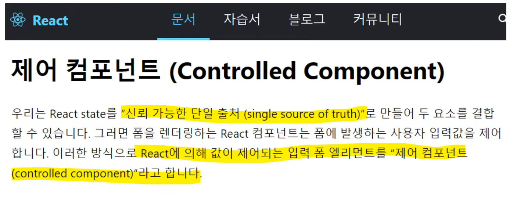
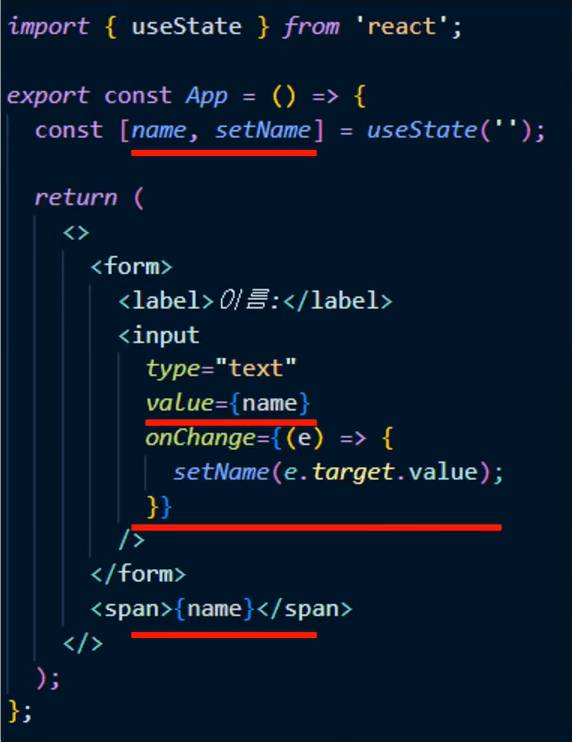
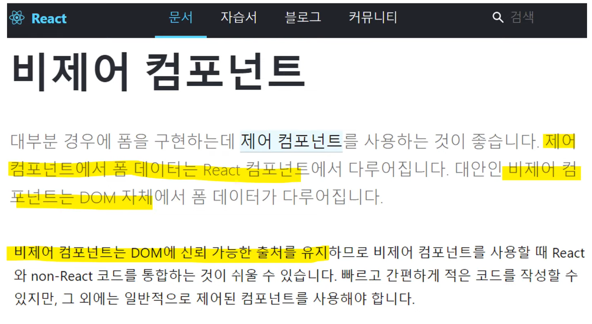
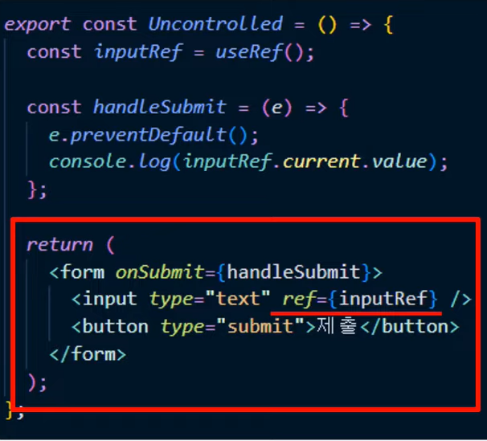
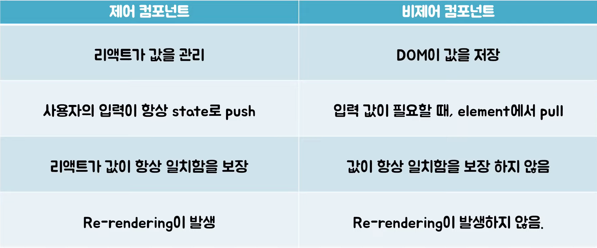

# 후이의 제어 컴포넌트 vs 비제어 컴포넌트
[https://youtu.be/LD1LyvCCbCg](https://youtu.be/LD1LyvCCbCg)

# 후이의 제어 컴포넌트 vs 비제어 컴포넌트
* toc
{:toc}

## Form tab elements
+ <input type = 'text' />
  + value attribute를 통해서 자체적인 데이터를 갖는다
  + input을 통한 사용자 입력 데이터는 DOM에 저장된다

## 제어 컴포넌트?
+ 
  + React에 의해 값이 제어되는 입력 Form 엘리먼트를 제어 컴포넌트라고 한다
  + 전통적인 input 태그는 사용자가 직접 input의 값을 조작하고 그걸 DOM이 그것을 저장했는데 React는 그거를 본인이 직접 제어를 해준다

### 신뢰 가능한 단일 출처 Single Source of Truth
+ 하나의 상태를 나타내는 state는 한 곳에만 존재해야 한다는 뜻이다
+ 어떤 state가 있는데 그것을 여러 component에서 사용된다면 props로 내려주거나 context api 혹은 redux 같은 전역 상태 관리 툴을 사용해 가지고 해당 state에 접근할 수 있도록 한다
  + 이러한 모든 노력들이 하나의 상태는 한 곳에만 존재하고 그걸 사용하고 싶은 사람들은 거기에 접근해서 하도록 하는 것이다
+ 리액트가 제어 컴포넌트를 통해 값들을 항상 일치함을 보장해줘서 데이터가 불 일치할 열며 없이 사용할 수 있게 해준다 

### 제어 컴포넌트 코드 
+ 
  + name이라는 React state가 있고 state는 input의 value prop을 통해 넘겨진다
  + 그리고 input의 값이 바뀔 때마다 즉 사용자가 값을 입력할 때마다 입력된 값이 name에 set 된다 
  + 그리고 set 된 네임은 span tag에 렌더링되게 된다 
  + 변경 된 input value가 매번 state로 push 되니까 input의 value와 react의 value는 항상 최신의 값으로 일치함이 보장된다
  + 또 특징적인 것은 매 입력마다 state가 변경 되기 때문에 매 입력마다 re-rendering이 발생하게 된다

## 비제어 컴포넌트 
+ 
  + 비제어 컴포넌트는 전통적인 HTML 홈 태그이다

### 비제어 컴포넌트 코드 
+ 
  + ref
    + ref는 비제어 컴포넌트를 사용할 때 굉장히 중요한 녀석이다
    + ref란 리스트에서 값을 담는 상자 같은 느낌으로 생각하면 좋다
    + 컴포넌트 마운트 시점에 ref에 current property에 엘리먼트가 대입이 되고 컴포넌트가 re-rendering 되더라도 ref는 값을 유지하고 있다
    + 그래서 약간 컴포넌트에 해당 컴포넌트 전역 변수 같은 느낌으로 사용하면 된다
  + 사용자가 값에 input과 input사이의 값을 입력하고 submit을 하게 되면 handleSubmit이 표출된다
  + handleSubmit은 input ref에 current에 담긴 value를 console.log 하고 있다
  + React가 여기서 값에 관여하는 바가 전혀 없다
  + 사용자 입력으로 DOM이 직접 조작되고 해당 값이 필요할 때 ref를 통해 input의 value를 pull 하고 있다
  + 비제어 컴포넌트로 input의 value를 사용하게 되면 React가 데이터가 항상 일치함을 보장하지 못한다
  + 또 state 로 관리하지 않기 때문에 re-rendering이 발생하지 않는다는 특징이 있다

## 정리
+ 

## 사용 예) 제어 컴포넌트 
+ 매 입력마다 re-rendering이 발생
+ 매 입력마다 입력 박스로 어떤 동작을 해야 하는 경우
+ 그런 예시로 입력 값을 다른 곳에 입력하자마자 렌더링해야 되는 경우
+ 그리고 사용자 입력에 대해서 즉각적인 validation에서 피드백을 해야 되는 경우
+ 특히 좀 디테일한 피드백을 해야 되는 경우에 제어 컴포넌트를 사용하였다

## 사용 예) 비제어 컴포넌트
+ 비제어 컴포넌트는 원하는 시점에 값을 가져온다는 특징이 있다
+ 매 입력마다 re-rendering이 발생하지 않는다는 특징도 있다
+ 따라서 매 입력마다 최신의 값이 굳이 필요하지 않은 경우 그런 경우와 만약에 렌더링마다 복잡한 현상이 발생하는 경우에는 비제어 컴포넌트를 사용하는 것을 고려해보면 좋다

## 최종 정리
+ form tag elements는 DOM에 사용자 입력을 저장한다
+ input의 value를 다른 곳에 저장을 사용하면 값이 일치함을 신뢰하기 어려워진다
+ 제어 컴포넌트는 value와 state를 동기화 함으로써 항상 최신의 값을 보장한다
+ 제어 컴포넌트와 비제어 컴포넌트는 각각 장단점이 있으니 사용처에 맞게 선택하면 된다

