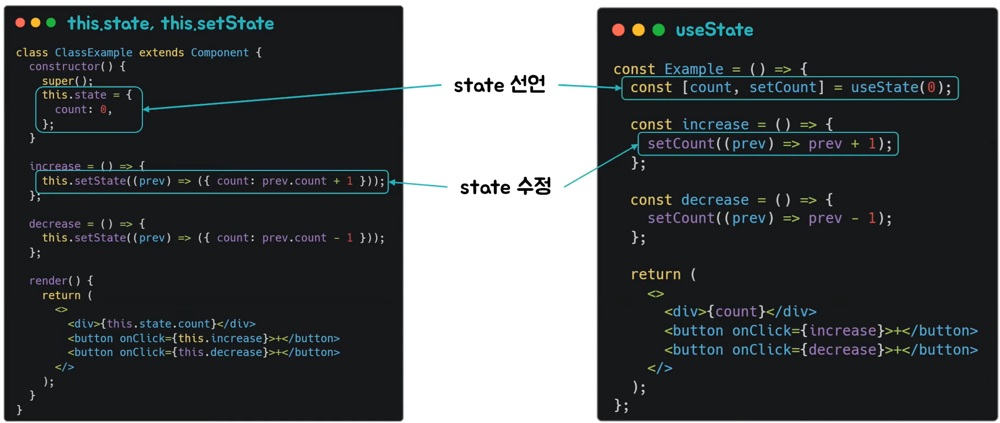
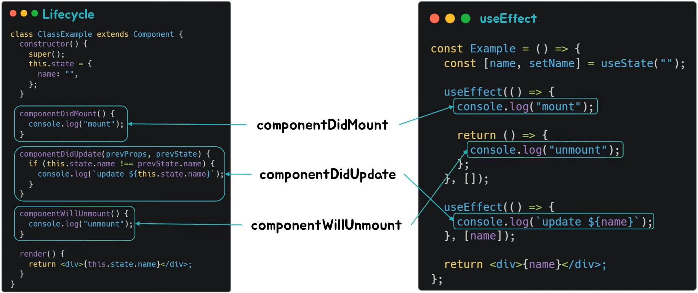
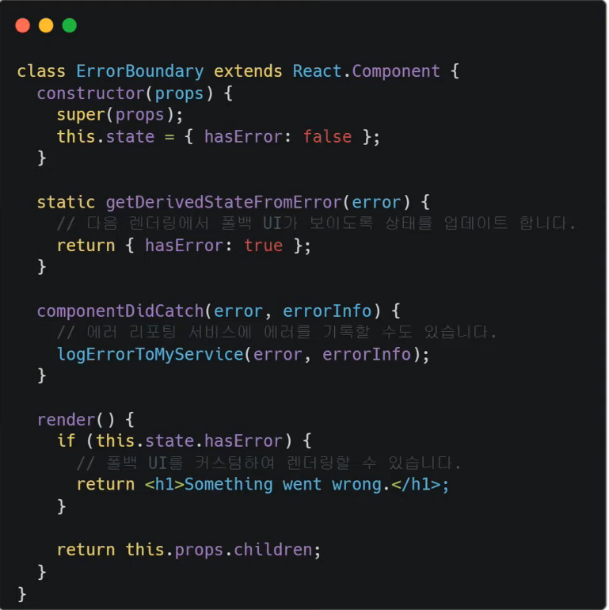
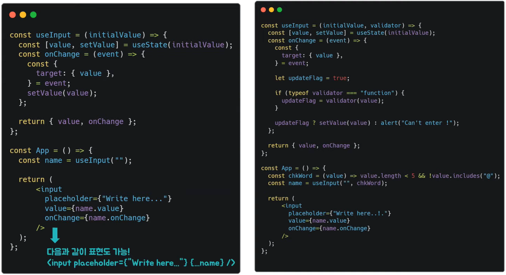
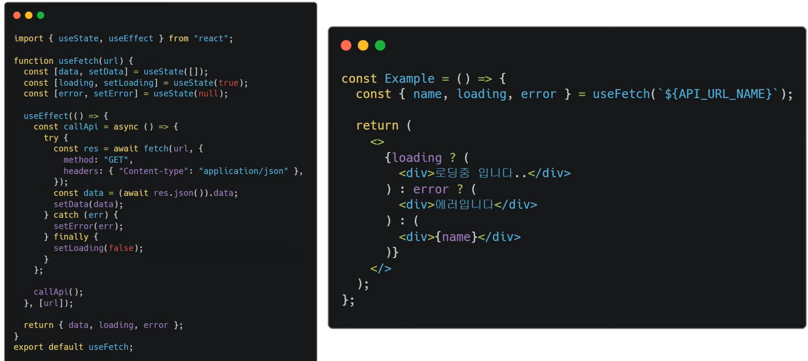

# 우연의 Hooks
[https://youtu.be/evJ_O-H-EJI](https://youtu.be/evJ_O-H-EJI)

# 우연의 Hooks
* toc
{:toc}

## Hooks란?
+ Hooks는 React 16.8 버전에서 클래스형 컴포넌트만을 사용할 때 부딪히는 수많은 문제들을 해결하기 위해서 나온 것이다
+ 클래스형 컴포넌트 문제점?
  + 첫 번째로 컴포넌트의 상태 로직 재활용이 어렵다
    + Hooks가 존재하지 않았을 때 클래스 컴포넌트만이 state를 저장할 수 있다 보니 클래스를 주로 사용하였다
    + 이로 인해 관심사 분리가 제대로 되지 않고 컴포넌트간 중복이 많아져 규모가 큰 컴포넌트가 만들어졌다
    + 그래서 유지보수가 상당히 어려워졌고 테스팅 또한 어려웠다
    + 이를 해결하고자 Higher Order Component 즉 HOC를 사용하게 되었다
    + High Order Component에서 반복되면 Wrapper Hell을 만들며 이것은 코드의 추적을 어렵게 만들었다
  + 두 번째 문제점으로 클래스는 혼란을 줄 수 있다
    + 클래스 컴포넌트의 방식이 너무 복잡하고 클래스의 this는 동작 방식이 다양하다보니 예상치 못한 오류를 발생시킬 수도 있었다
    + 이런 문제점들 때문에 클래스 컴포넌트 대신 함수를 이용하고 싶지만 함수는 상태을 가지지 못한다는 문제점 때문에 클래스를 이용하고 있었다
    + 함수가 상태를 가지지 못하는 이유는 함수형 컴포넌트들은 기본적으로 리렌더링이 될때 함수안에 작성된 코드가 모두 다시 실행된다
    + 이는 함수형 컴포넌트들이 기존에 가지고 있던 상태를 전혀 관리할 수 없게 만든다
    + 이 문제를 해결하기 위해 나온 것이 Hooks이다
+ Hooks를 사용하면 함수가 상태를 가질 수 있는 이유 
  + 리액트는 useState를 통해 생성한 상태에 접근하고 유지하기 위해 Closure을 이용하여 함수형 컴포넌트 바깥에 state를 저장한다
  + 그래서 상태가 업데이트 되었을 때 이 상태들은 리액트 컴포넌트 바깥에 선언되어 있는 변수들이기 때문에 업데이트 한 후에도 이 변수들에 접근할 수 있게 된다

## Hooks 종류 - useState
+ useState
  + 함수 컴포넌트 안에서 state를 사용할 수 있다
  + Class의 this.state, this.setState와 동일한 기능
+ 
  + 클래스에서는 상태를 this.state내에 넣은 후 this.setState로 바꾸고 싶은 객체의 속성을 전달
  + Hooks에서는 useState를 이용하고 useState의 인자에 initialState를 준다 
  + useState가 반환한 것을 배열 구조 분해 할당을 이용하여 원하는 이름으로 설정할 수 있다
  + 첫 번째는 상태, 두 번째는 상태를 변경하는 함수가 들어가게 된다
  + 현재 예시에서는 class에서는 this.setState, 함수형에서는 setCount을 이용해서 각각의 state를 변경할 수 있습니다

## Hooks 종류 - useEffect
+ useEffect
  + 함수 컴포넌트 안에서 side effect를 수행할 수 있게한다
  + side effect
    + 함수가 실행 되면서 함수 외부에 존재하는 값이나 상태를 변경시키는 등의 행위 
  + Class의 Lifecycle과 유사한 기능 
+ 
  + 클래스에서는 
    + 컴포넌트가 가장 처음에 불러올 때 실행되는 componentDidMount
    + 어떤 상태가 업데이트 될 때마다 실행되는 componentDidUpdate
    + 컴포넌트가 없어질때 실행되는 componentWillUnmount
  + useEffect에서는 이 하나의 hook으로 3개의 라이프사이클을 대체할 수 있다
  + useEffect는 첫 번째 인자로 callback 두 번째 인자로 dependency array를 받게 된다
  + componentDidMount의 기능은 useEffect의 dependency array에 빈 배열을 넣었을 때와 동일하다
  + compnentDidUpdate는 useEffect의 dependency array에 상태들을 넣으면 그 상태들이 변경 될 때마다 실행되어 동일한 동작을 한다
    + 예를 들어 이 코드 같은 경우 name이 변할 때마다 console.log가 찍히게 된다
  + componentWillUnmount의 기능은 useEffect내의 return에 콜백함수 형식으로 넣으면 컴포넌트가 없어질때 이 콜백을 실행하며 동일한 동작을 하게 된다
+ useEffect 안에서 사용되는 상태나, props가 있다면 규칙적으로 useEffect의 dependency array에 넣어 주어야 한다
+ 만약 useEffect 안에서 사용되는 상태나 props를 dependency array에 넣지 않게 된다면 useEffect에 등록한 함수가 실행될 때 최신 props, 상태를 가리키지 않게 된다
+ dependency array의 파라미터를 생략한다면 컴포넌트가 리렌더링 될 때마다 호출된다
+ 그렇다면 useEffect는 클래스형 컴포넌트에 있는 모든 생명주기를 표현하는 것이 가능할까?
  + 
    + 리액트에서 사용되는 ErrorBoundary 코드이다
    + 하위 컴포넌트에서 발생한 에러를 ErrorBoundary에서 캐치해서 에러가 있다면 에러 UI를 보여 주고 에러가 없다면 하위 컴포넌트들을 그대로 보여주는 것이다
    + 여기서 getDerivedStateFromError와 componentDidCatch가 사용되는데 이것은 에러가 발생할 때 캐치하는 생명주기이다
    + 이런 생명주기는 아직 hooks로 구현되어 있지 않다
    + 그래서 ErrorBoundary 코드는 class형으로 밖에 구현할 수 없다
    + 그래서 class형 컴포넌트들의 모든 것을 hooks로 대체할 수 있는 것이 아니라 class형 컴포넌트를 써야 할 때도 있다

## Hooks 규칙 
+ 최상위에서만 Hook을 호출
  + React 함수(컴포넌트)의 최상위에서만 Hook을 호출 할 것
  + 이 규칙을 따라야 컴포넌트가 렌더링 될 때마다 항상 동일한 순서로 Hook이 호출되는 것이 보장된다
+ React 함수에서만 Hook을 호출
  + Custom Hook에서는 호출 가능 
  + 일반적인 Javascript 함수에서는 호출 X
  + 이 규칙을 지키면 컴포넌트의 모든 상태 관련 로직을 소스코드에서 명확하게 보이도록 할 수 있다
+ Hook을 만들 때 앞에 use 붙이기
  + 한눈에 보아도 Hook 규칙이 적용되는지를 파악할 수 있기 때문이다
  + 이를 따르지 않으면 특정한 함수가 그 안에서 Hook을 호출하는지를 알 수 없기 때문에 Hook 규칙의 위반 여부를 체크할 수 없다  

## Custom Hook
+ Custom Hook은 React의 특별한 기능이라기보다 기본적으로 Hook의 디자인을 따르는 관습이다
+ 이 custom hook을 쓰는 이유는 중복되는 로직을 재활용하기 위해서 이다
+ 복잡한 로직을 단순한 인터페이스 쪽에 숨길 수 있도록 하거나 복잡하게 뒤엉킨 컴포넌트를 풀어내도록 도울 때 custom hook을 사용하는 것을 권장한다고 한다
+ 가장 범용적으로 사용되는 useInput, useFetch
  + useInput
    + 
      + React에서는 제어 컴포넌트를 이용하기 위해서 input의 value에 state를 주고 onChange를 이용하여 setState를 해주어야 한다
      + 그래서 input이 여러 개라면 이 로직을 계속 반복해서 사용하게 된다
      + 이때 useInput을 이용하면 하나의 hook으로 모든 input을 제어 할 수 있습니다
  + useFetch
    + 
    + 비동기적으로 데이터를 받아올 때 fetch를 이용하는데 이때 로딩중인 상태와 에러 상태 그리고 데이터를 상태로 가지게 된다
    + 예시 코드를 보시면 먼저 loading을 true로 초기화한 후 fetch가 성공하든 실패하든 로딩은 끝나기에 finally에 setLoading(false)를 한다
    + try에서 성공을 한다면 setData로 데이터를 넣어주고 에러가 나온다면 catch해서 setError를 사용하면 이 하나의 hook으로 fetch에서 일어나는 데이터, 로딩, 에러를 관리할 수 있다
