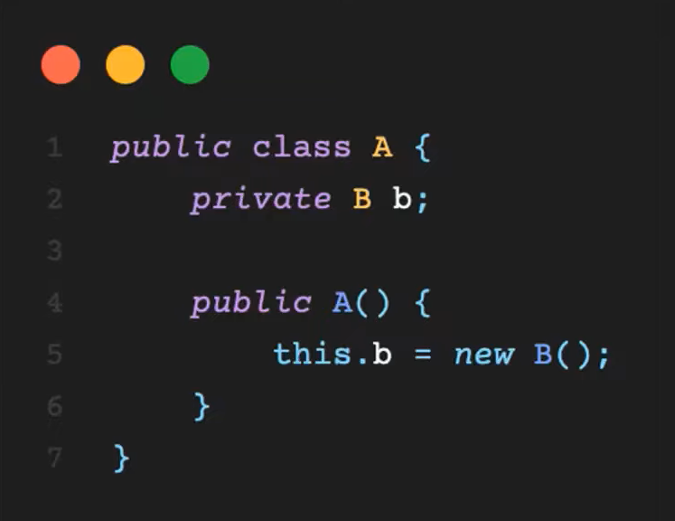
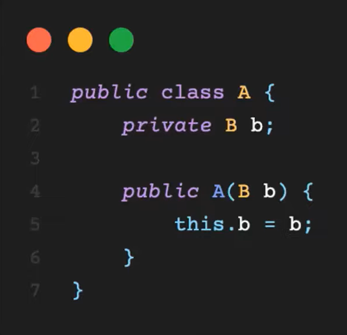

# 오찌, 야호의 DI와 IoC
[https://youtu.be/8lp_nHicYd4](https://youtu.be/8lp_nHicYd4)

# 오찌, 야호의 DI와 IoC
* toc
{:toc}

## IoC 란? - 제어의 역전 
+ IoC 란 Inversion of Control의 약자로 번역을 하면 제어의 역전이라는 뜻을 가지고 있다
+ 직접 객체를 생성하여 코드를 제어 
  + 
  + 제어란, 관리라는 말로도 대신할 수 있다
+ 프로그램의 제어 흐름을 직접 제어하는 것이 아니라 외부에서 관리하는 것
  + 
  + 외부로부터 B를 인자로 받아 초기화하고 있다
  + 이렇게 프로그램의 제어 흐름을 직접 제어하는 것이 아니라 외부에서 관리하는 것을 제어를 역전시켰다고 말할 수 있다
+ 왜 필요할까?
  + 객체지향 원칙을 잘 지키기 위해서
  + 역할과 관심을 분리해 응집도를 높이고 결합도를 낮추며, 이에 따라 변경에 유연한 코드를 작성 할 수 있는 주고가 될 수 있기 때문
  + IoC 설명을 찾아보면 할리우드 법칙을 본 적이 있다
  + 할리우드 법칙은 Don't call us, we'll call you
  + 즉, "우리에게 연락하지 마쇼. 알아서 불러줄테니" 라는 말이다.
  + 우리가 어떤 것을 주도하여 호출하는 것이 아니라 주도권은 빼앗기고 호출 당하기를 기다리는 모습이 IoC와 비슷해서 GoF 디자인 패턴에서는 Hollywood Principle이라고 불리기도 한다
+ DIP 란?
  + DIP란 Dependency Inversion Principle의 약자로서 번역을 하면 의존 역전 원칙이라는 뜻을 가지고 있다
  + DIP란 상위 레벨 모듈은 절대 하위 레벨 모듈에 의존하지 않고 둘 다 추상화에 의존해야 한다
+ IoC와 DIP의 목적
  + 이 둘은 클래스 간 결합을 느슨히 하고자 하는 같은 목적을 가졌다
  + 두 원칙은 하나의 클래스의 변경이 다른 클래스들에게 전이되는 것을 최소화함으로써 애플리케이션을 지속 가능하고 확장성 있게 만들고자 한다
  + 그래서 시너지가 높은 DIP와 IoC를 함께 사용하도록 강력하게 권장하고 있다
+ 중간 정리
  + IoC와 DIP는 모두 원칙에 포함된다
  + 같은 목적을 가졌지만 IoC는 제어의 역전, DIP는 의존 방향의 역전이다

## DI란?
+ DI란 Dependency Injection의 약자로 번역을 하면 의존성 주입이라는 의미를 갖고 있다
+ 클래스 간에 의존 관계가 있다는 것
  + 한 클래스가 바뀔 때 다른 클래스가 영향을 받는다는 것 
+ 토비의 스프링에서는 의존성을 다음과 같이 정의한다
  + 의존 대상 B가 변하면 그것이 A에 영향을 미친다
  + 즉, 의존은 변경에 의해 영향을 받는 관계를 의미한다
+ 의존성 주입이란 말 그대로 의존성을 외부에서 주입해 준다는 것이다
+ 패턴
  + 마틴 파울러는 다음과 같은 세 가지의 의존성 주입 패턴을 제시했다
  + 생성자 주입
  + Setter 주입
  + Interface 주입
+ 의존성 분리
  + DIP를 이용해 의존 관계를 분리시킨다
  + 상위계층이 하위계층에 의존하는 상황을 Interface를 이용해 반전시켜 하위계층의 구현으로부터 독립시킨다 
+ 중간정리
  + IoC는 원칙 중 하나고 DI는 IoC를 달성하는 디자인 패턴 중 하나이다

## Spring DI
+ 스프링은 Bean으로 등록된 객체에 대해 자동으로 인스턴스를 생성해주고 필요한 의존성이 있으면 자동으로 주입해 준다
+ @Autowired 어노테이션을 활용한 방법이 있다 
  + "여기에 의존성을 주입해줘"라는 뜻
  + @Autowired를 붙이게 되면 스프링이 자동으로 적절한 의존성을 주입해주게 된다
+ @Autowired를 통해 의존성을 주입받는 방법에는 필드 주입, setter 주입, 생성자 주입 세 가지가 있다
+ 필드 주입을 사용하게 되면 테스트 등의 이유로 자동이 아닌 수동 의존성 주입을 하고 싶어도 생성자도 setter도 없으므로 우리가 직접 의존성을 넣어 줄 수가 없다
+ 때문에 필드 주입을 사용하게 되면 의존성이 프레임워크에 강하게 종속된다는 문제점이 있다
+ setter 메서드에 @Autowired 어노테이션을 붙이면 스프링이 setter를 사용해서 자동으로 의존성을 주입해준다
+ 이때 빈 객체를 만들고 setter로 의존성을 주입해주기 때문에 빈 생성자 또는 빈 정적 팩토리 메서드가 필하다
+ 때문에 파이널 필드를 만들 수 없고 의존성의 불변을 보장할 수 없다는 특징이 있다
+ setter 주입은 왜 존재할까?
  + 런타임에 setter를 다시 호출하면 주입해주었던 의존성을 변경해줄 수가 있다
  + 그래서 주로 런타임에 의존성을 수정해줘야 하거나 의존성을 선택적으로 주입할 때 사용한다
+ 생성자 주입을 사용하면 객체의 최초 생성 시점에 스프링이 의존성을 주입해준다
+ 이 방법은 스프링에서 공식적으로 추천하는 방법
+ 그래서 그런지 스프링 4.3 이후부터는 생성자가 한 개 밖에 없을 경우 해당 생성자에 스프링이 자동으로 @Autowired를 붙여주어 생략할 수 있다
+ 공식문서를 보면 생성자 주입과 setter 주입은 혼용할 수 있지만 스프링은 생성자 주입을 추천한다고 나와있고 setter 주입은 선택적 의존성을 사용해야 한다고 말한다
+ 그 이유로 생성자 주입된 컴포넌트들이 완전히 초기화된 상태로 클라이언트에 반환되기 때문이라고 한다
+ 생성자 주입을 사용하게 되면 필드를 final로 만들어줄 수 있고 의존성 주입이 생성자 호출 시 최초 1회만 이루어집니다 때문에 의존관계를 불변으로 만들어 줄 수가 있다
+ final이 가능하기 때문에 NullPointerException을 방지할 수 있다
+ 순환참조 문제를 방지할 수 있습니다 필드 주입이나 setter 주입을 통해 의존성을 주입하게 되면 A 객체가 B 객체를 의존하는데 B 객체 또한 A 객체를 의존할 때 생기는 순환참조가 발생할 수 있습니다
+ 그러나 생성자 주입을 사용하는 객체들끼리 의존성이 순환되면 스프링은 에러 메시지와 함께 프로그램을 종료한다
+ 생성자가 여러 개라면?
  + 우선 의존성을 자동으로 주입하는데 사용할 생성자에 @Autowired
  + @Autowired가 여러 개 있을 경우 스프링은 가장 많은 의존성을 주입해 줄 수 있는 생성자를 사용해서 의존성을 주입한다
  + @Autowired가 붙어 있는 모든 생성자가 사용 불가능하거나 @Autowired가 없는 경우라면 기본 생성자를 호출한다
  + 기본 생성자 조차 없다면 컴파일 에러가 발생
+ 의존성 주입 방법들을 모두 사용한다면 우선순위는 생성자, 필드, setter의 순이다
+ 주입하고자 하는 의존성이 여러 개 있을 때
  + 스프링은 의존성 주입 대상을 찾을 때 우선 정의되어있는 타입을 기준으로 찾는다
  + 타입을 기준으로 여러 Bean이 검색되었다면 스프링은 그 다음으로 Bean의 이름을 기준으로 의존성을 주입한다
    + 이 때 주입하는 데 사용하는 메서드의 매개변수명과 등록된 Bean의 이름이 일치하는지 체크한다
  + 스프링은 @Qualifier라는 어노테이션을 제공한다
    + @Qualifier 어노테이션 안에 해당 Bean의 구분자를 지정해줄 수 있다
  + @Qualifier 외에 @Primary라는 어노테이션도 제공한다 
    + @Primary 어노테이션이 붙은 Bean은 해당 타입으로 의존성 검색을 할 때 우선적으로 주입된다 일종의 기본 Bean이 되는 것이다
  + Qualifier와 @Primary가 모두 사용되면 @Qualifier는 @Primary보다 우선권을 가진다
  + @Qualifier는 "내가 지정한 대로 주입해"라는 뜻이고 @Primary는 "넌 이제부터 기본값이야" 라는 뜻이다
  + 정리하자면 스프링의 의존성 주입은 타입, @Qualifier, @Primary, 변수명의 순서로 의존성을 검색하게 된다

## 최종 정리 
+ IoC와 DIP는 원칙
+ DI는 IoC를 지키기 위한 디자인 패턴이라고 볼 수 있다
+ DI를 자동으로 해줌으로써 프로그램의 제어권을 가져가는 역할을 해주는 것이 스프링
