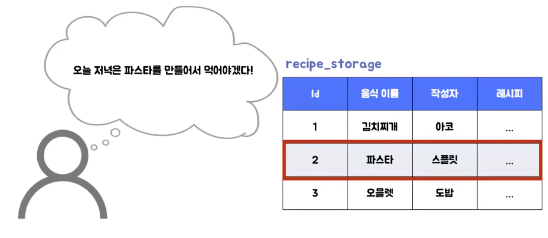
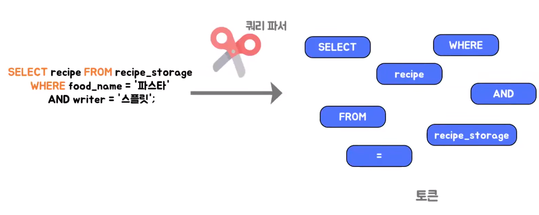

# 베루스의 MVC
[https://youtu.be/86NxhHptx7s](https://youtu.be/86NxhHptx7s)

# 베루스의 MVC
* toc
{:toc}

## Model
+ 데이터와 비즈니스 로직을 관리
+ 뷰, 컨트롤러에 대한 의존이 없다 

## View
+ 모델의 데이트를 사용해 시각적인 화면을 구성하는 역할
+ MVC 정의에 따라 모델과 의존성을 가질 수도, 없을 수도 있다 
+ 
  + Cocoa 버전의 MVC에서는 뷰하고 모델을 완전히 격리 시켜서 컨트롤러가 중간의 매개체 역할을 해서 모델의 정보를 가지고 뷰를 갱신하는 역할
  + Smalltalk 버전에선 뷰가 모델의 존재를 알고 있어서 모델로부터 데이터를 가져와서 사용자에게 시각적인 화면을 구성
  + 컨트롤러의 역할도 조금씩 다른 거 같다
    + Cocoa 버전에서 MVC는 모델과 뷰를 연결하는 매개체 역할을 하는 반면 Smaltalk의 MVC에서는 모델의 상태를 변경 시키는 역할을 중점적으로 했던 거라서
      MVC를 정의하기 나름의 따라 이런 단계도 구성 흐름이 좀 많이 바뀌는 것 같다.

## Controller
+ 사용자의 입력을 받아 처리하는 역할
+ 모델을 변경하고 뷰를 갱신 

## GUI 환경에서 MVC 구성
+ 
+ 뷰에서 사용자가 입력이 발생하면 컨트롤러에서 요청을 받아서 모델의 상태를 변화시키는데 모델의 상태 변화 된 걸 뷰에게 전달할 때 델과 뷰가 옵저버 패턴을 끼워줘서 모델의 상태 변화가 일어났을 때 본인의 상태가 변화되면
  뷰에다가 알림을 줘서 뷰가 알아서 그 모델의 상태를 가져오도록 해서 뷰를 갱신하는 방법도 있다
+ 모델과 뷰가 그런 관계가 아니라 모델과 컨트롤러가 그런 관계를 가져서 모델의 상태가 변화되면 컨트롤러가 그 변화된 값을 가져와서 뷰에게 전달
+ 컨트롤러가 뷰를 업데이트한다고 하는데 모델의 상태를 가져와서 업데이트하는 경우도 있다
+ 그게 전혀 아니고 그냥 단순히 뷰의 어떤 요청이 왔을 때 모델의 정보를 가지고 변화 시키는 게 아니라 단순 버튼을 활성화 비활성화 시킨다든지 이런 뷰적인 갱신만 하는 업데이트만 하는 컨트롤러도 있었다

## JSP 0.92 Specification Model2
+ 
+ HTTP 요청이 오면 컨트롤러가 요청을 받아서 이제 모델의 상태를 변화시키는데 모델은 저희가 보통 서비스나 서비스 안에서 도메인 객체를 이용하는데 또 DB와 서로 상호 작용을 하면서 모델이 변경 되게 된다
  그래서 이렇게 변경된 결과를 컨트롤러 에게 다시 전달을 해주고 컨트롤러는 그 모델 쪽에서 받은 그런 데이터를 보면 여기 모델의 addAttribute() 메서드를 통해서 DTO를 넣어 준다
  이렇게 넣어주면 뷰에서 전달된 모델을 통해 필요한 데이터를 보면 JSP도 가능하고 또 그 외에 다른 것들도 가능하다 모델에 있는 데이터를 이용해서 사용자에게 보여 줄 페이지를 구성을 해서 HTTP 응답을 보내는 이런 구조로 되어 있다

## 정리
+ MODEL
  + 데이터와 비즈니스 로직을 관리
+ VIEW 
  + 모델의 데이터를 사용해 사용자에게 표현
+ CONTROLLER
  + 사용자의 입력/요청을 받아 처리 

## MVC를 그럼 왜 쓰는가
+ 마틴 파울러
  + MVC의 핵심 개념은 뷰를 모델에서 분리하고 컨트롤러를 뷰에서 분리하는 두 가지 분리다 
+ 뷰를 모델에서 분리하는 것이 중요한 이유
  + 뷰와 모델은 기본적으로 서로 다른 관심사
    + 뷰: 사용자 인터페이스를 주로 고려
    + 모델 : 비즈니스 정책이나 데이터 베이스 상호 작용 등을 고려
  + 모델의 재사용
    + 동일한 모델로 다양한 뷰(콘솔, 웹 등)에 적용 가능
  + 테스트 용의성
    + 시각적인 요소를 배제하고 도메인 로직에 대한 테스트만 작성 
