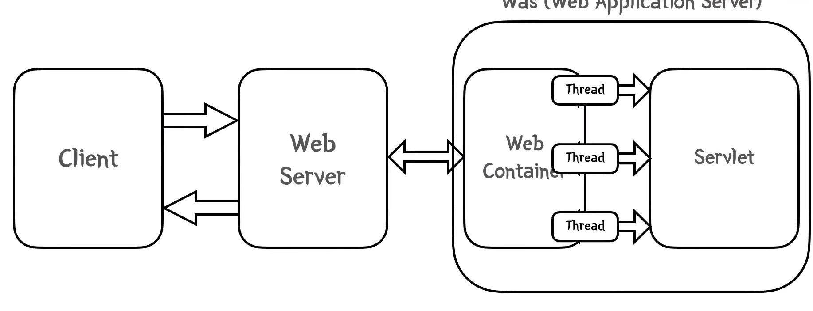
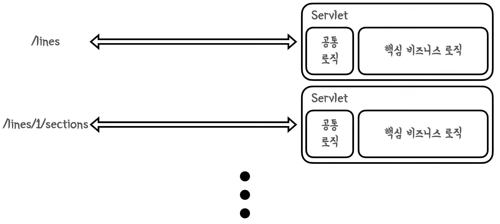
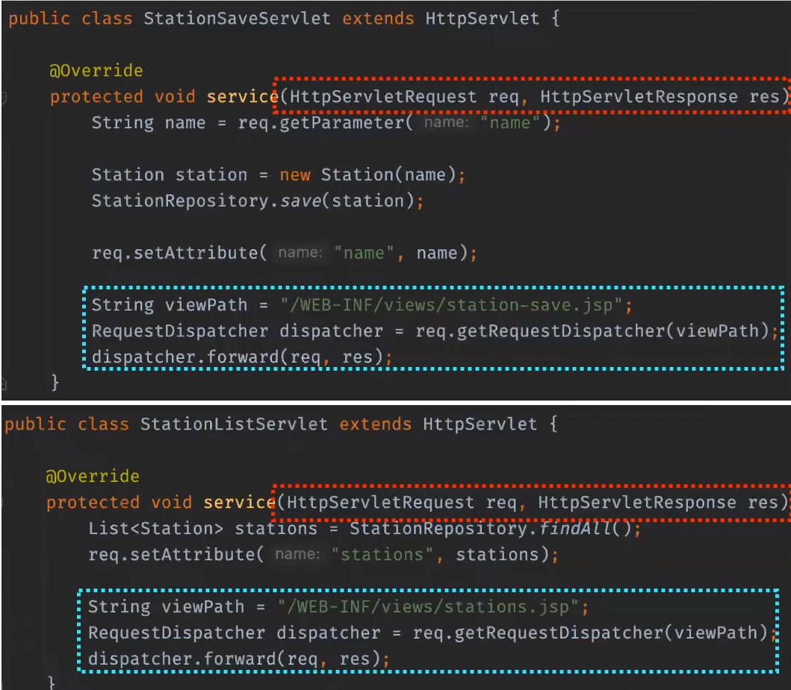
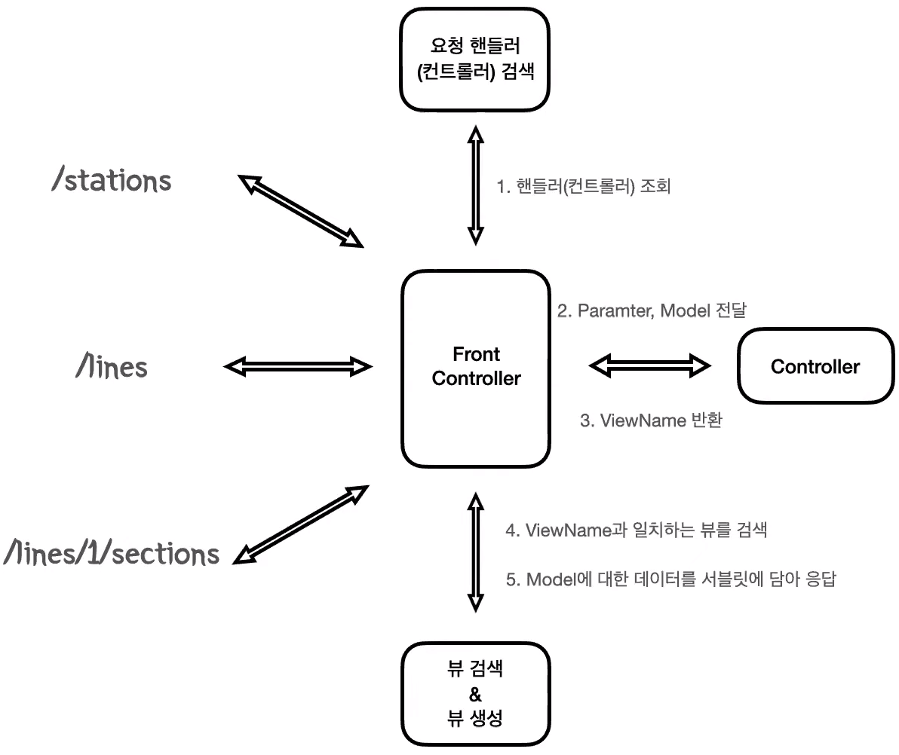
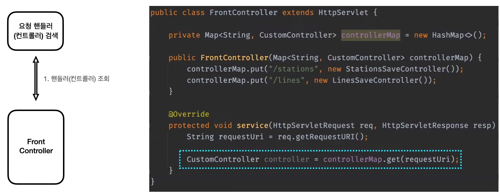
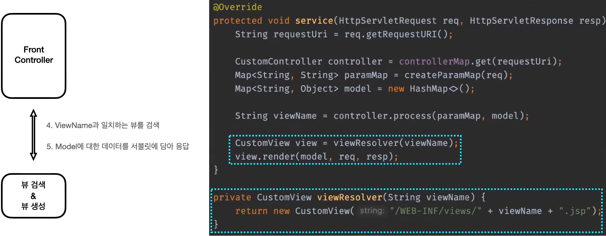

# 루키의 Servlet & Spring Web MVC
[https://youtu.be/h0rX720VWCg](https://youtu.be/h0rX720VWCg)

# 루키의 Servlet & Spring Web MVC
* toc
{:toc}

## 초창기 웹 어플리케이션 
+ 초기의 웹 어플리케이션은 클라이언트에서 요청하면 단순히 html 파일과 같은 정적인 데이터만 제공할 수 있었다
+ 즉, 사용자마다 다른 화면이 아닌 동일한 화면만 제공을 받을 수 있었다
+ 정적 컨텐츠만 제공하는 웹 서버는 사용자들에게 다양한 화면 전달하기 힘들었고 이 때문에 동적 컨텐츠 제공의 필요성을 느끼게 된다
+ 이러한 문제 해결을 위해 CGI라는 것이 나오게 된다

## CGI
+ CGI는 Common Gate Interface의 약자로 동적인 데이터를 제공하기 위한 규약
+ 클라이언트로 부터 요청이오면 서버는 CGI를 구현한 구현체에게 동적인 데이터를 제공해달라고 요청한다
+ 그리고 CGI 구현체는 이를 수행해 결과를 전달함으로써 클라이언트는 동적인 데이터를 제공받을 수 있게 되었다
+ 이렇게 동적인 데이터를 제공할 수 있게 되었지만 아쉽게도 CGI는 몇가지 문제점이 있었다.
+ 문제점
  + 모든 사용자 요청마다 Process를 사용해서 요청을 처리하는 문제가 있었다.
    + Process는 각자의 공간을 지니기 때문에 무겁고 생성되는 시간이 오래 걸려 서버가 더 많은 리소스를 부담해야하는 구조적인 문제를 가지고 있었다
  + 같은 요청이라도 동일한 CGI 구현체를 생성한다는 문제가 있었다.
    + 매번 객체를 생성하고 종료하는 작업은 필요없는 서버 리소스를 불필요하게 낭비하는 구조를 가지고 있었다
  + 
  + 이러한 문제를 해결하기 위해서 Servlet이 등장

## Servlet
+ Servlet은 자바 진영에서 동적 데이터를 제공하기 위해 CGI를 기반으로 제작된 프로그램이다
+ Servlet은 앞서서 말한 두 가지 문제를 다음과 같이 해결
+ 
+ 먼저, 각 요청에서 Process를 매번 생성해서 요청하던 부분을 Thread로 변경해서 서버에서 더 많은 리소스를 소모하는 문제를 해결
+ 또한 동일 요청 이라도 매번 구현체를 생성하던 문제를 싱글톤 패턴을 이용해서 하나의 구현체를 재사용하도록 구조를 변경하여 문제를 해결
+ 이로 인해, 우리는 서버가 부담해야 할 리소스를 줄이면서 보다 효율적으로 동적 데이터를 클라이언트에게 제공

## Servlet을 사용함으로써 개발자가 얻는 이점
+ 기본적으로 웹 어플리케이션 요청을 보내기 위해서 우리는 HTTP 규약에 따른 요청을 해야하고 이를 기반으로 한 HTTP 메시지로 통신을 하게 된다
+ HTTP 메시지를 통해서 요청을 하게 되는데 보낸 메시지를 서버에서 응답 받으면 각 의미에 맞게 파싱을 하여 응답을 처리한 후, 결과를 바탕으로 응답 HTTP 메시지를 만들어서 클라이언트에게 전달하게 되는 방법으로 요청이 처리되게 된다
  + 매번 개발자가 일일히 요청 값을 파싱해서 분석하고  응답 메시지를 만들어주는 작업은 번거롭고 반복되는 작업이라고 할 수 있다.
  + Servlet은 개발자가 이러한 파싱 작업을 API를 통해서 제공받을 수 있도록 많은 기능들을 제공하고 있다
+ HTTP Method에 대한 분기처리도 각 요청별로 대신 처리해주고 있다.
  + 요청을 처리하기 위해 호출되는 메서드인 service() 메서드를 보면 각 Method별 분기처리가 모두 되어 있는 것을 확인할 수 있다.
  + 즉, 개발자는 이러한 요청들을 처리해주는 메서드를 재정의 하고 API를 사용한 뒤 요청받을 URL만 매핑을 해주게 되면 우리가 원하는 비즈니스 로직을 작성하고 수행할 환경을 제공받을 수 있게 된다

## Servlet Container
+ Servlet은 Servlet Container 가 생성 
+ Servlet은 생성 시 init(), 제거 시 destroy() 메서드를 통해서 생성 및 제거가 이루어진다.
  + Servlet Container는 이러한 Servlet의 생성, 호출, 제거의 모든 작업들을 관리하면서 Servlet의 생명주기를 담당
+ 시나리오
  + 클라이언트의 요청이 오게 되면, 서블릿 컨테이너는 해당 요청과 매핑된 서블릿을 찾는 작업을 수행 
  + 만약 서블릿이 현재 생성되어 있지 않다면 서블릿 컨테이너는 서블릿을 생성하고 이를 동작시키는 작업을 수행
  + 그리고 작업이 종료된 서블릿은 소멸되지 않고 다시 서블릿 컨테이너에서 관리되게 된다
  + 만약 클라이언트의 요청과 매핑되어 있는 서블릿이 이미 존재한다면 서블릿 컨테이너는 해당 서블릿을 다시 호출해서 이를 재사용해 작업을 수행

## Servlet의 문제점
+ 
+ Servlet은 각 요청마다 하나의 Servlet이 1:1로 매핑되는 구조를 가지고 있다
+ 10개의 요청이 있으면 10개의 Servlet이 존재한다고 할 수 있다
+ 그렇게 될 경우 서블릿마다 공통되어서 실행되는 로직이 매번 반복되서 생성되고 실행되게 된다
+ 
  + 각 Servlet의 service() 메서드에서 중복되는 부분이 많다
  + Servlet에 종속적인 구조를 가진다
  + 이후, 각 컨트롤러에서 공통으로 처리해야하는 로직이 생기면 중복이 발생한다
+ 해결 방법
  + 
  + 클라이언트 요청을 받는 서버의 최앞단에 모든 요청을 받을 수 있도록 컨트롤러를 하나 만들고 이곳에서 각 요청별로 처리하는 로직을 찾아 이를 전달해 요청을 수행하도록 하는 방법을 생각하게 된다
  + 이런 방법을 Front Controller Pattern 이라고 정의한다

## Front Controller Pattern
+ 
+ 프론트 컨트롤러 패턴을 활용한 구조를 통해서 매 요청마다 각각의 서블릿을 사용하는 것이 아닌 하나의 서블릿을 통해 요청을 수행할 수 있게 되었고 이로 인해 요청의 진입점이 같게 되어 관리가 훨씬 수월하게 됬다
+ 또한 각 서블릿마다 가지고 있는 중복되는 공통 요청들을 프론트 컨트롤러 단 한 곳에서만 사용하기 때문에 중복 로직을 제거하게 된다는 장점을 가지면서 문제에 대해서 해결을 할 수 있게 되었다
+ Front Controller가 하는일 
  + 
  + 클라이언트와 서버의 연결을 수행
  + 각 요청과 매핑된 비즈니스 로직의 정보를 보관
  + 요청이 들어오면 일치하는 매핑 정보를 찾아 로직을 호출
  + 호출받은 결과를 전달할 객체를 생성
  + 결과를 사용자에게 반환
+ 역할을 분리
  + 
  + 
    + 클라이언트의 요청을 Front Controller가 받는다.
    + 이후 요쳥벌로 각각의 역할을 수행하는 핸들러를 찾기 위해 핸들러 검색 역할을 분리하여 기존과 같은 핸들러 검색 요청을 수행한다
  + 
    + 그리고 프론트 컨트롤러는 객체를 만들어 요청의 정보를 넘기고 전달을 받을 모델까지 함께 넘기게 된다
    + 서블릿 객체가 컨트롤러에 매개변수로 전달되는 것이 아닌 자바 객체가 전달된다
      + 이를 통해서 컨트롤러가 서블릿에 종속적인 문제를 해결할 수 있게 되었다
  + 
    + 마지막으로, 프론트 컨트롤러로 넘어온 전달한 뷰의 이름에 대해서 viewReslover를 객체를 통해, 원본 View의 URI를 알아낸 후, CustomView라는 객체에 렌더링 역할을 맡기도록 역할을 분리하면 하나의 웹 요청이 끝나게 된다
+ 이렇게 프론트 컨트롤러의 역할을 분리하면서 수행하는 책임을 분리할 수 있게 되었고 Controller가 Servlet에 종속적이지 않도록 변경하여 보다 객체지향적인 개발이 가능하도록 설계가 된것을 확인할 수 있게 되었다
+ 이러한 일련의 과정들을 바탕으로 하여서 만들어진 프레임워크가 바로  Spring Web MVC 이다

## Spring Web MVC
+ 
+ 이전과 다른 점 
  + Front Controller가 Dispatcher Servlet 라는 이름으로 변경되었다
  + 컨트롤로 또는 핸들러를 호출하기 전에 중간에 어뎁터 역할을 해주는 Handler Adapter라는 기능을 통해서 다양한 종류의 핸들러를 호출할 수 있는 기능을 추가하여 보다 확장성이 있는 개발이 확장성 있는 기능을 개발되도록 변경
+ 이점
  + 
  + Servlet WebApplicationContext에는 기존과 같이 웹 요청을 담당하는 객체들이 들어가서 관리된다
  + Root WebApplicationContext에는 서비스 계층이나 Repository등 웹 환경에 독립적인 빈이라는 것들이 들어가서 관리된다
  + 그리고 웹 요청시 필요한 부분들을 DispatcherServlet이 알아서 주입하는 구조로 웹 요청이 동작된다
  + 즉, 우리는 설정만 잘 작성하고 이를 등록해주면 그 설정대로 생성된 객체가 스프링 컨테이너 내부에서 관리되고 필요한 부분에 주입을 받아서 Dispatcher Servlet이 스스로 사용될 수 있게 된다
  + 즉, DispatcherServlet의 요청처리뿐만 아니라 컨트롤러를 포함한 어플리케이션 단에서도 Spring Web MVC를 활용하여 필요한 부분에 적용할 수 있게 된다고 할 수 있다.
+ 정리하자면, 개발자는 이러한 스프링 MVC에서 제공되는 DispatcherServlet 웹 요청 처리 관련 구현체들을 사용하면서 개발자들이 실제로 작성해야 하는 핸들러
  즉, 비즈니스 로직에만 집중할 수 있도록 하는 환경을 만들어 준다고 할 수 있다
  
