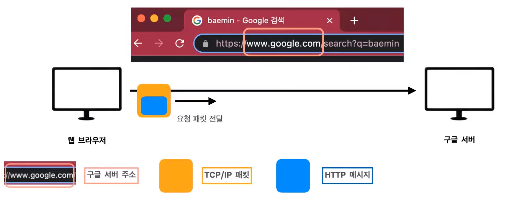
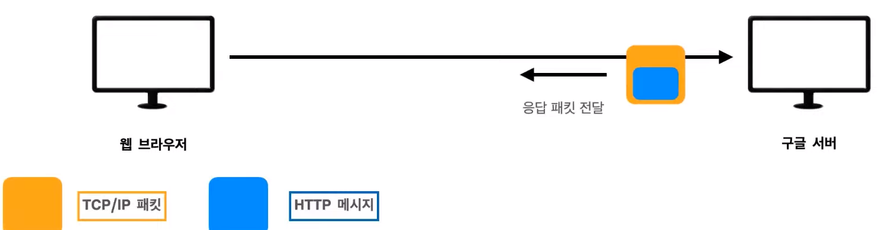
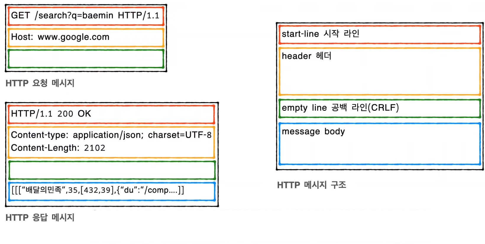

# 코카콜라의 HTTP 메서드와 상태코드
[https://youtu.be/QcKEJFvPryI](https://youtu.be/QcKEJFvPryI)

# 코카콜라의 HTTP 메서드와 상태코드
* toc
{:toc}

## 리소스?
+ URL를 검색해서 받아온 결과물
+ TEXT, HTML, JSON, XML
+ IMAGE, 음성, 영상, 파일
+ 서버에서 전달 받은 데이터 

## 웹 브라우저 요청 흐름
+ 
  + 구글 서버 주소를 찾아 HTTP 요청 메시지를 패킷 안에 담아 구글 서버에게 전달  
+ 
  + 구글 서버는 전달받은 메시지를 분석해서 HTTP 응답 메시지를 패킷에 담아 웹 브라우저에 전달
+ 웹브라우저는 전달 받은 데이터로 화면을 보여준다 

## HTTP 메시지
+ 
+ 요청 메시지 같은 경우는 서버에 보낼 데이터의 유무에 따라 메시지 바디 포함 유무를 결정
+ start-line 시작라인
  + 요청 메시지는 HTTP Method, 쿼리, HTTP version으로 스타트 라인이 구성 
  + 응답 메시지는 HTTP version, 상태코드, 상태를 나타내는 문구로 스타트 라인이 구성 
+ header 헤더
  + 전송에 필요한 모든 부가 정보를 담고 있다

## HTTP 메소드
+ 주요 메서드
  + GET: 리소스 조회
  + POST: 요청 데이터 처리, 주로 등록에 사용
  + PUT: 리소스를 완전히 대체, 해당 리소스가 없으면 생성
  + PATCH: 리소스 부분 변경
  + DELETE: 리소스 삭제 
+ 기타 메서드
  + HEAD: GET과 동일하지만 메시지 부분을 제외하고, 상태 줄과 헤더만 반환
  + OPTIONS: 대상 리소스에 대한 통신 가능 옵션을 설명(주로 CORS에 사용)
  + CONNECT: 대상 자원으로 식별되는 서버에 대한 터널을 설정
  + TRACE: 대상 리소스에 대한 경로를 따라 메시지 루프백 테스트 수행 
+ POST
  + 서버에서 응답 메시즈를 클라이언트에 보내줄때 header 필드에 Location 값이 추가된다
    + Location은 신규 리소스 주소를 가르킨다 
  + 신규 리소스 생성에 대한 상태코드인 201이 포함 된다

## HTTP 상태 코드
+ 1xx(정보): 요청을 받았으며 프로세스를 계속 처리중(거의 사용하지 않는다)
  + 100 Continue
  + 101 Switching Protocol
  + 102 Procession
+ 2xx(성공): 요청을 성공적으로 처리
  + 200 OK
    + 요청 성공
  + 201 Create
    + 요청을 성공해서 새로운 리소스가 생성됨, 주로 POST 요청, 일부 PUT 요청 이후에 온다
  + 202 Accepted
    + 요청을 수신했지만 아직 처리가 완료되지 않았다
    + 예) 요청 접수 후, 서버에서 1시간 뒤에 배치 프로세스가 요청을 처리한다
  + 204 No Content
    + 요청을 성공했지만, 응답 페이로드 본문에 보낼 데이터가 없다 
+ 3xx(리다이렉션): 요청 완료를 위해 웹 브라우저에서 추가 작업 조치가 필요
  + 301 Moved Permanently
  + 302 Found
  + 303 See Other
  + 304 Not Modified
  + 307 Temporary Redirect
  + 308 Permanent Redirect
  + 리다이렉션?
    + 웹 브라우저는 3xx 응답 결과에 Location 헤더가 있으면 Location 위치로 자동 이동 
  + 종류
    + 영구적인 리다이렉션 - 특정 리소스의 URL가 영구적으로 이동
      + 301 Moved Permanently, 308 Permanent Redirect
    + 일시적 리다이렉션 - 일시적인 변경 
      + 302 Found, 303 See Other, 307 Temporary Redirect
    + 특수한 리다이렉션 - 결과 대신 캐시를 사용
      + 304 Not Modified
+ 4xx(클라이언트 오류): 요청 문법이 잘못되었거나 요청을 처리할 수 없다
  + 404 Bad Request
    + 잘못된 문법이나 메시지를 요청해서 서버가 이해할 수 없다
  + 401 Unauthorized
    + 클라이언트가 해당 리소스에 대한 인증이 필요하다(로그인)
  + 403 Forbidden
    + 서버가 요청을 이해했지만 승인을 거부
    + 인증은 되었지만(로그인) 접근 권한이 불충한 경우(인가)
  + 404 Not Found
    + 요청 리소스를 찾을 수 없다 
+ 5xx(서버 오류): 서버가 정상 요청을 처리하지 못한다
  + 500 Internal Server Error
    + 서버 내부 문제로 오류 발생
  + 502 Bad Gateway
    + 서버간의 유효하지 않은 응답을 받은 경우
  + 503 Service Unavailable
    + 서버가 일시적으로 요청을 처리할 준비가 되지 않음
    + 유지보수를 위한 작동이 중단되거나 과부하가 걸린 서버 
