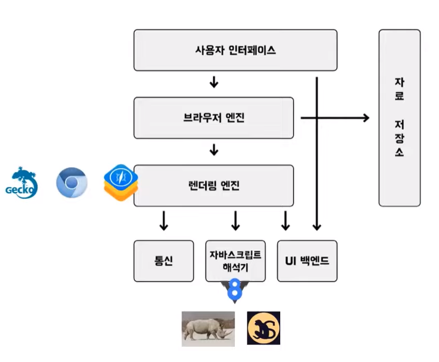
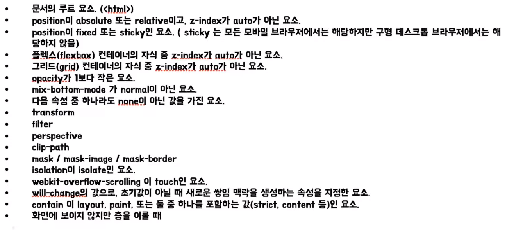

# 결의 브라우저 렌더링
[https://youtu.be/v8H5ujL4Tt8](https://youtu.be/v8H5ujL4Tt8)

# 결의 브라우저 렌더링
* toc
{:toc}

## 브라우저란?
+ 브라우저란 html 문서, 이미지, 폰트 등의 사용자가 선택한 자원을 전송 및 표현하는 소프트웨어이다
+ 우리가 인터넷에 접속하기 위해 쓰는 크롬, 파이어폭스 IE, 사파리 등이 브라우저이다
+ 브라우저는 HTML과 CSS 명세에 따라 HTML을 표시하는데 HTML과 CSS는 웹 표준에 따라 명세가 정해진다
+ 웹 표준은 팀 버너스리를 중심으로 월드 와이드 웹을 위한 표준을 개발하고 장려하는 조직, W3C에 의해 개발되었다
+ 웹 표준 도입전, 웹 초장기에는 웹브라우저의 파편화 현상이 심했다
+ 웹 브라우저의 파편화 현상 때문에 웹페이지를 렌더링할 때 브라우저 별로 뷰가 달라지거나 웹 API 활용 값이 상이한 문제가 발생했다
+ 2019년이 되어서야 W3C와 WHATWG가 합의해서 HTML을 하나의 버전으로 통합하다

## 브라우저 기본 구조
+ 
+ 사용자 인터페이스는 주소 표시줄, 앞/뒤로 가기 버튼 북마크 등이 있다.
+ 사용자가 요청한 페이지를 제외한 모든 부분을 지칭한다
+ 브라우저 엔진은 사용자 인터페이스와 렌더링 엔진 사이에서 동작을 제어하는 엔진입니다.
+ 브라우저 엔진 외에 레이아웃 엔진과 렌더링 엔진으로 구분할 수 있다
+ 렌더링 엔진은 요청 받은 내용을 브라우저에 나타내는 일을 한다
+ 렌더링 엔진을 흰 도화지에 그림을 그리는 화가라고 생각하면 좋다
+ 컴퓨터는 자바스크립트 코드를 이해할 수 없다
+ 그래서 자바스크립트 해석기를 통해 컴퓨터 이해할 수 있는 코드인 기계 코드로 변환하는 컴파일러 또는 인터프리터가 필요하다

## 브라우저 렌더링 흐름
1. 사용자가 주소 표시줄에 주소를 입력하면 UI 스레드는 입력되는 내용이 검색어인지 url 인지 확인
2. 입력된 내용을 파싱해서 검색 결과로 이동할지 요청한 사이트로 이동해 결정
3. 사용자가 enter를 누르면 UI 스레드가 네트워크 호출을 시작
4. 네트워크 스레드는 요청을 처리
5. 응답이 HTML 파일이라면 응답 결과를 렌더러 프로세스에 전달
6. HTML 데이터를 수신하기 시작하면 렌더러 프로세스의 메인 스레드는 HTML을 파싱해서 DOM 트리로 변환
7. CSS 파일이 정의되어 있거나 html 태그에 정의한 style 요소, 스타일이 따로 지정하지 않은 엘리먼트는 브라우저 상에서 기본적으로 가지고 있는 스타일로 모든 정보들을 합쳐서 CSSOM 트리를 구축
8. 그 후 DOM 트리와 CSSOM 트리를 결합하여 렌더 트리를 형성

+ 렌더 트리는 최종적으로 화면에 표시되는 모든 노드와 노드의 스타일 정보를 포함
+ 렌더 트리가 형성되었으면 레이아웃 단계로 넘어간다

+ Layout
  + 레이아웃에서는 페이지에 출력될 노드들의 크기와 위치 레이어간의 순서 정보를 계산한다
  + 레이어 개념이 브라우저 렌더링 시 도입되는 이유는 z축을 활용하는 3차원 개념을 렌더링 과정에 삽입하기 위함이다
  + 레이어
    + stacking context, 쌓임 맥락이라고 한다. 쌓임 맥락은 가상의 z축을 사용한 HTML 요소의 3차원 개념이다
    + 엘리먼트의 z-index 속성을 지정하지 않더라도 최상위 엘리먼트를 가장 이래 두고 하위 엘리먼트들은 위로 쌓인다.
    + 이 과정은 HTML 문서의 최상위 요소에서 시작하고 재귀적으로 실행된다
    + 레이아웃 과정에서 노드가 많아지만 속도는 당연히 느려질 수 밖에 없다
    + 따라서 브라우저는 자체적으로 최적화 로직을 탑재하고 있다
    + 그 중 하나가 더티 비트 시스템이다. 특정 엘리먼트가 변경이나 추가 때문에 다시 배치가 필요하다면 해당 엘리먼트를 더티라고 표시한다
      그러면 레이아웃이 재귀적으로 실행될 때 더티 엘리먼트 부분만 다시 계산하여 리소스의 낭비를 줄일 수 있다
    + 이 계산은 즉시 수행하는 것이 아니라 비동기로 일괄 작업하기에 연산의 횟수를 줄일 수 있다
    + 복잡한 변경이나 많은 추가가 있는 경우 브라우저의 최적화만으로 충분하지 않기 때문에 이런 연산을 최소화 해야 한다.
+ Paint
  + 페인트는 레이아웃 단계를 통해 배치된 엘리먼트들에게 색을 입히고 레이어의 위치를 결정
  + 이 단계 역시 HTML 문서의 최상위 요소부터 재귀적으로 실행된다
  + 페인팅 순서는 가장 아래의 레이어 z-index가 낮은 순서대로 먼저 페인팅 된다
+ 브라우저 렌더링 결과에 따라 사용자 경험에 막대한 영향을 끼친다
+ 브라우저 렌더링 최적화는 필수로 고려해야 한다

## reflow, repaint 
+ reflow는 layout, paint 를 모두 재실행하는 것
+ repaint는 paint 재실행하는 것
+ display 키워드를 사용하면 repaint가 발생
+ opacity라는 스타일 변경은 reflow부터 발생하기도 하지만 어느 때는 repaint부터 발생하기도 하고 또 어느 때는 reflow, repaint 없이 composite 단계에서 GPU의 도움 받기도 한다
+ composite은 레이어들을 최종적으로 합성하는 단계를 말한다
+  “때”에 주목해야 한다, 어느 때, 조건이 있다는 것이다, 여기서 조건은 위에서 설명했던 쌓임 맥락, 이 쌓임 맥락이 쌓이는 특별한 속성과 같다
+ 쌓임 맥락을 생성하는 특별한 속성
  + 
