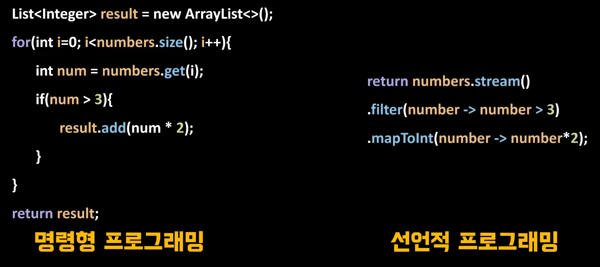
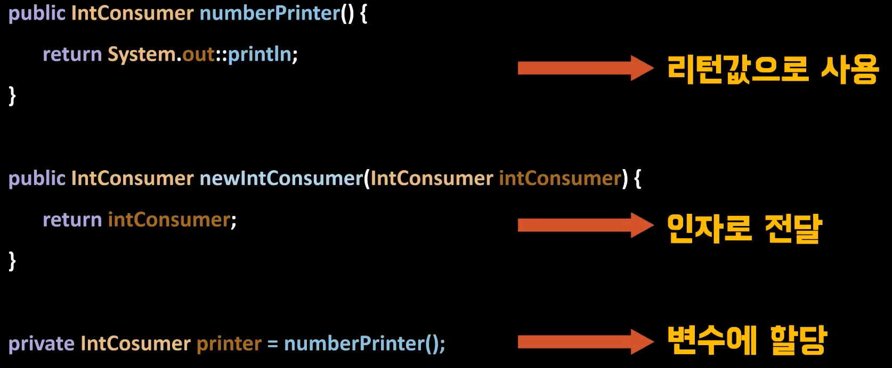
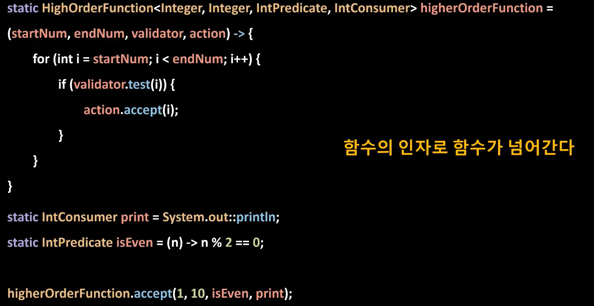

# 필즈, 판다의 OOP vs FP
[https://youtu.be/4rl6uMqVX2I](https://youtu.be/4rl6uMqVX2I)

# 필즈, 판다의 OOP vs FP
* toc
{:toc}

## 객체지향의 특성
+ 다형성
  + 한가지 역할이 상황에 따라 각기 다른 행동을 한다 
+ 추상황
  + 공통된 기능을 뽑아낸다 
  + 복잡한 현상을 문제를 해결할 정도의 간단한 형태로 생각하는 것이 있다
+ 캐슐화
  + 구현내용을 내부에 숨겨서 응집도를 높이는 것
  + 응집도 
    + 객체가 자신과 관련되 것을 중심적으로 행동한다 
    + 객체와 연관된 기능, 상태들이 얼마나 잘 뭉쳐져 있는지에 대한 것을 말한다
  + 결합도 
    + 두 객체가 서로 관련되거나 의존하는 정도 
    + 예를 들어서 이게 높으면 객체를 떼어내거나 변경하기가 힘들다
+ 상속
  + 부모의 기존 기능을 물려받을 수 있다 

## SOLID
+ SRP (Single Responsibility Principle)
  + 객체는 오로지 하나의 책임을 갖는다
  + 코딩할 때는 중복된 코드를 최대한 제거한다 에 집중을 하면 될 것 같다
+ OCP (Open Closed Principle)
  + 변경에는 닫혀있고 확장에는 열려 있다
  + 코딩할 때는 클라이언트 코드가 안 바뀌게 하면 된다 이러면 OCP를 지킨거다
+ LSP
  + 상위 타입을 하위 타입으로 교체하더라도 정상 작동해야만 한다
+ ISP
  + 클라이언트입장에서 필요한 기능 중심으로 인터페이스를 분리한다
+ DIP
  + 저수준 모듈이 고수준 모듈에서 정의한 추상 타입에 의존해야 한다
  + 코딩할 때는 클라이언트 입장에서 필요한 인터페이스를 추출한다
  + 장점 중 하나가 독립 배포가 가능하다

## Functional Programming (함수형 프로그래밍) 
+ 순수 함수, 그 다음에 공유 상태와 데이터 변경 그 다음에 부수 효과 즉, 사이드 이펙트를 피하는 방식으로 소프트웨어를 구축을 하는 어떤 프로그래밍 프로세스라고 정의
+ 순수 함수 (Pure Function)
  + 같은 입력값에는 값은 결과값을 반환하고 그러면서 사이드 이펙트가 없는 것 
    + 사이드 이펙트란, 함수의 기능 이외에 모든 다른 외부 효과를 말한다
+ 불변성 (Immutability)
  + 이미 저장된 값의 상태를 변경하지 않는다
  + 함수형 프로그래밍은 가장 큰 특징 중의 하나가 어플리케이션의 흐름이 순수함수들만을 타고 흐르는데 사실 이 과정에서 이 불변성이 보장되지 않으면 이 데이터 흐름이 깨질 수 있고 결과적으로는 프로그래머들이 가장 싫어하는 버그의 발생으로 이어지게 된다
    + 이 부분이 OOP와 FP가 가장 크게 갈리는 부분 중 하나라고 할 수 있다
  + OOP에서는 내부 필드들의 접근을 통제하는 방식이 여러 가지 접근 제어자를 통해서 통제를 하게 되지만 FP에서는 기본적으로 애초에 아무런 내부 상태도 변화시킬 수 없다
    일단 메모리에 한번 저장해 둔 값은 변화를 시키지 않는다 특히 이 부분을 자바 코딩 에서 적용을 시키려고 하면 주의 해야 되는 부분이 그냥 단순히 final 로만 선언을 하면 다 불변이 되는 거 아니냐 라고 생각을 할 수 있는데
    사실 그렇지 않고 특히 List나 Map 같은 어떤 참조형 객체들을 선언을 할 때는 이게 내부 원소들이 리스트 자체는 달라지지 않더라도 리스트에 들어있는 원소들의 값은 달라질 수 있기 때문에
    이러한 불변성을 좀 더 잘 보장할 수 있는 걸 찾아야 한다 어떤 언어들에서는 좀 더 이런 불변성이 잘 보장되는 특수객체를 제공하기도 하는데 자바에서는 그러지는 않은 것 같다
+ 선언적 패턴 (Declarative Pattern)
  + HOW 보다는 WHAT에 집중한다
  + 
    + 왼쪽에 명령형 코드는 리스트의 사이즈 만큼 반복문을 돌면서 각각의 원소를 가져오고 3보다 큰지 판단을 하고 그게 크다고 확인이 되면 2를 곱해서 리스트에 넣어라 하는 식으로
      이 기능을 어떻게 수행할 지를 아주 자세하게 순서대로 나열을 하고 있다
    + 반면에 오른쪽에서 선언적 프로그래밍 코드는 필터링해라 Int로 매핑해라 라는 식으로 뭘 할지에만 집중을 하는 차이점을 볼 수 있는다 
    + 오른쪽이 더 직관적이고 깔끔하다
+ 일급 함수 (First Class Function)
  + 함수 스스로 객체로 취급한다
  + 일급 함수라는 말은 처음 들어볼 수 있겠지만 일급 객체라는 말을 한번쯤은 들어본 적이 있을 것 이다
  + 일급 객체
    + 일급 객체는 어떤 객체를 다른 한 어떤 함수에다가 인자로 넘기거나 리턴값으로 변화를 받을 수 있거나 변수에도 객체를 대입을 할 수 있거나 그런 일반적인 객체가 할 수 있는 연산들을 다 할 수 있으면
      그걸 일급객체, First Class Citizen 라고 부른다
  + 일급 함수는 함수를 일급 객체로 처리할 수 있으면 그것을 일급 함수라고 부른다
  + 자바에서는 함수 자체를 객체로 취급을 하지는 않다
  + 
    + 자바에서 함수형 인터페이스라는 개념을 통해서 함수를 마치 객체로 취급하는 것처럼 하는 FP 패러다임을 도입하기 위해서 흉내를 낸 것에 가깝다
    + 함수형 인터페이스라는 추상 메소드가 딱 하나 정의된 인터페이스를 사용해서 FP 패러다임을 자바에서도 이렇게 구현해볼 수 있다
+ 고차 함수 (Higher Order Function)
  + 함수를 함수의 인자로 받는다
  + 일급 함수 개념과 엮여있다
  + 고차함수는 어떤 함수가 있을 때 함수의 재사용성을 높이고 그 다음에 다룰 수 있는 데이터 타입의 다양성을 늘리는데 많이 사용된다
  + 
  + 
    + Currying 이라는 체이닝 기법을 사용해서, 정리를 해서 가독성을 높인 것이다
    + BiConsumer라는 함수가 그 다음 Function이라는 함수의 인자로 들어가고 그렇게 선언된 Function 이라는 중간 함수와 또 더 큰 Function이라는 함수에 또 다른 인자로 들어가는 것을 볼 수 있다

### 함수형 프로그램은
+ 함수형 프로그래밍은 프로그래밍 패러다임중에 하나
+ 어플리케이션의 상태가 순수 함수를 통해서만 흐르다
+ 그러다 보니까 병렬처리의 장점을 가진다
+ 간결하고 재사용성이 높다 라는 이런 장점들을 갖고 있다
+ FP가 아직도 좀 생소하게 다가오는 이유는 어떤 단점이 있기 때문이다
  + 가독성이 높고 간결하다고 하는데 막상 사람 입장에서 볼 때는 읽기가 좀 어려울 수도 있다
  + 이 프로그램 코드를 짤 때 순수함수를 아주 극한까지 적용하게 되면 모든 함수를 딱 한줄의 리턴문만을 사용해서 모든 함수를 정의해야한다 그러니까 함수를 극한속에서 사용할 수도 있는데
    그러다 보면 당연히 사람이 읽기에는 '이게 과연 가독성이 좋은 코드 인가?' 하는 의문은 생길 수 있다 그렇게 사람이 읽기 어려운 것에 비해서
    기존에는 사실 그렇게 큰 장점이 부각되지는 않았다 그런데 FP의 가장 큰 특성 중의 하나가 공유 상태가 없고 상태 변화를 금지한다고 했는데
    그런 특성 때문에 멀티스레드 환경에서 병렬처리에 있어서는 되게 좋은 특성을 갖고 있다 그러다 보니까 최근에 어떻게 보면 멀티코어 컴퓨팅, 멀티스레드 처리가 거의 기본이나 다름없이 되다 보니까
    이 함수형 프로그래밍 패러다임이 다시 조망을 받는 것 같다
    
