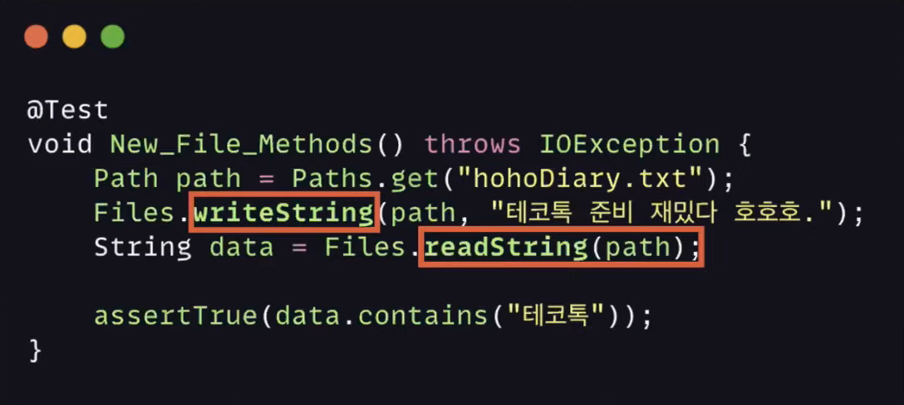
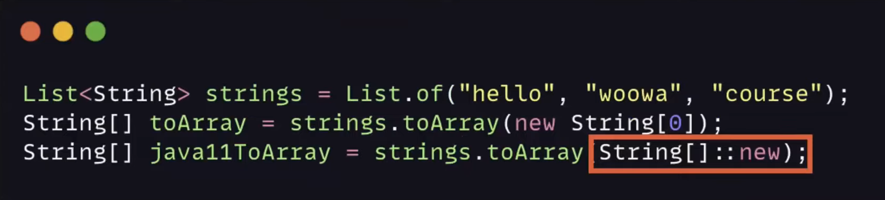

# 호호의 Java 11
[https://youtu.be/LcIyHlE2NlA](https://youtu.be/LcIyHlE2NlA)

# 호호의 Java 11
* toc
{:toc}

## Java Version
+ 95년 자바가 처음으로 릴리즈
+ 1, 2년 간격으로 안정적인 버전을 출시
+ 하지만 자바 6 버전에서 이러한 흐름이 끊기게 되었다
+ 자바 7 버전이 나오기까지 Sun Microsystems가 오라클에 인수되고 OpenJdk를 구성하는 등 여러 가지 일들이 있었다
+ 기대했던 기능들을 모두 반영하지 못한 채로 7 버전을 출시하게 된다
+ 한 인터뷰 때 7이 나오는 기간이 너무 길었던 것이 자바 역사상에서 가장 실망스러웠던 일이었다고 밝히기도 했다
+ 자바 8에서는 가장 큰 변화가 생겼다 프로그래밍 생태계의 변화와도 연관이 있는데 빅데이터가 떠오르면서 병렬 처리에 대한 관심이 높아진다
+ 자바는 병렬 환경을 쉽게 관리할 수 있는 방향으로 가고자 자바 8에서 Stream API가 추가되었다
+ 버전이 올라가면서 JDK의 규모가 커지게 되고 일부 패키지만 필요로 하는 작은 환경에서도 사용하지 않는 패키지들도 런타임에 함께 실행되어야 했다
+ 개발자가 라이브러리와 대규모 응용 프로그램에 쉽게 구성하고 관리할 수 있도록 자바 9에서는 모듈화를 지원하게 된다
+ 자바 10이 출시되고 나서는 주기적으로 이제 버전을 출시한다고 했다 6개월마다 메이저 버전을 출시하기로 하고 3년을 주기로 Long Term Support 버전을 출시하기로 했다.
+ LTS는 기존 버전과 다르게 새로운 버전이 나와도 지속적으로 지원을 해주는 버전을 의미한다
+ 따라서 18년도에 자바 11이 LTS 버전으로 출시가 되었으니 3년이 지난 21년도에 자바 17 버전이 LTS 버전으로 출시가 되었고 이 이후로는 2년을 간격으로 LTS 버전을 출시한다고 한다
+ Oracle JDK 지원 기간
  + LTS 버전은 약 8년간 보안 업데이트와 수정이 지원된다 
  + 원래대로라면 자바 8 버전은 25년도에 지원이 종료되어야 했다 하지만 사용자가 워낙 많고 인기가 많다 보니 30년까지 연장을 하게 된다 11 버전과 17 버전보다 더 긴 기간 동안 유료 지원을 받을 수 있게 되었다
    + JetBrains의 설문조사에 의하면 아직 자바 8의 사용률이 압도적으로 높지만 매년 자바 11의 사용률이 증가하고 있다
    + 22년도 자료를 보면은 자바 8 버전과 11에 차이가 크게 나지 않고 있다

## Java 9 (Modules, private methods in interfaces)
+ 자바 9 버전에서 추가된 기능으로 아마 List.of()가 떠오를 것 같은데 하지만 자바 9 버전에서 가장 큰 변화는 모듈이다
+ Modules
  + 모듈 시스템은 책 한 권으로 다룰 수 있을 만큼 큰 주제
  + 모듈이 무엇이냐면 저희가 사용하는 패키지가 클래스들의 묶음이라면 모듈은 패키지의 묶음이라고 생각하시면 된다
    + 기존 패키지 방식의 문제는 여러 패키지에서 공용으로 사용되는 클래스를 외부에 숨길 수가 없었다
    + 이렇게 되면 라이브러리 내부 뿐만 아니라 외부에서도 클래스 접근이 가능하게 된다
  + 런타임 시 사용하지 않는 클래스들도 모두 포함해야 했다
    + 모듈화를 통해 패키지를 캡슐화하고 앞서 언급한 문제들을 해결할 수 있게 되었다
+ 인터페이스에도 이제 private 메서드를 사용할 수 있게 되었다
  + private 메서드를 사용을 해서 메서드를 분리할 수 있고 중복되는 코드를 재사용할 수 있게 되었다
  + private static도 사용할 수 있게 되었다
+ 불변 컬렉션 생성
  + 불변 컬렉션을 만들기 위해서 자바 9 버전 이전에는 약간의 노력이 필요했다
  + 하지만 자바 9 버전에서는 of() 메서드를 지원하게 되었고 불변 컬렉션을 보다 편리하게 생성할 수 있게 되었다
+ Compact String
  + 자바는 내부적으로 UTF16을 사용하기 때문에 모든 문자가 2byte로 구성되고 1byte로 표현할 수 있는 영어도 빈 공간을 사용해야 했다
  + 자바 6 버전에서 VM 옵션을 활성화해서 문자열을 char 배열 대신에 byte 배열로 저장할 수 있었다 그러나 성능 문제로 7 버전에서 삭제가 되었다
  + 다시 9 버전에 Compact String이라는 이름으로 돌아오게 된다
  + 자바 9 버전 이상의 String 클래스를 보면은 인스턴스 변수가 byte 배열로 되어 있는 것을 확인할 수 있다 따라서 1byte로도 저장이 가능해졌다
+ Try-with-resource 향상
  + 자바 7에 추가된 try-with-resource도 충분히 편리한 기능이었다
    + 하지만 자원을 try 문 밖에서 할당 하게 된다면 그 변수를 try문 안에서 바로 사용할 수가 없었다
    + 따라서 try 안에서 다시 초기화를 했어야 됐다
  + 자바 9 버전에서는 밖에서 할당한 변수도 try문 안에서 사용이 바로 가능해졌다
+ Optional API 추가
  + or() 메서드의 경우에는 orElseGet()이나 orElse()와 달리 Optional 객체를 리턴한다
    + Optional을 반환하는 코드로 연쇄적으로 사용할 수가 있겠죠
    + 값이 없을 경우 Optional 객체를 리턴
  + ifPresentOrElse() 메서드는 Optional 객체가 비어있을 경우 처리할 내용까지 정의할 수가 있다
  + Optional을 Stream으로 확장할 수가 있다
    + Stream API를 통해 Optional을 조금 더 유연하게 사용할 수 있게 되었다

## Java 10 (Local variable type inference)
+ Local variable type inference (로컬변수 타입 추론)
  + var는 IntelliJ에서 보면은 색깔이 바뀌어서 키워드로 보일 수 있으나 키워드는 아니다
    + 하위 호환성을 중요시하는 자바는 기존의 변수명을 바로 사용했을 것을 염두하여 키워드로 만들지 않았다
  + 따라서 var를 변수나 메서드명으로 사용할 수가 있다
  + var는 인스턴스 변수로 사용이 불가능하고 반드시 초기화를 해야 한다
  + 이제 var를 사용하는 많은 언어들은 불변 변수에 대한 키워드를 제공을 하는데 자바는 final var를 사용해야 한다
  + var 형식의 지역 변수에 익명 클래스를 할당하면 부모가 아닌 익명 클래스 형식을 유추한다 즉 익명 클래스에 선언된 필드를 참조 할 수 있다
+ Optional.orElseThrow()
  + 자바 10 버전 이전에서는 반드시 예외를 명시해야 했다
  + 하지만 10 버전 이후로는 인자 없이 사용이 가능해졌다
  + 인자 없이 사용해서 객체가 비어 있을 경우에는 NoSuchElementException을 발생하게 된다.
+ Unmodifiable Collections
  + copyOf()
    + List.copyOf();
    + Set.copyOf();
    + Map.copyOf();
  + toUnmodifiable
    + toUnUnmodifiableList()
    + toUnmodifiableMap
    + toUnmodifiableSet
  + 컬렉션을 복사하거나 수정 불가능한 컬렉션을 반환하는 기능들이 추가되었다

## Java 11 (Local-Variable Syntax for Lambda)
+ Local-Variable Syntax for Lambda
  + 자바 11 버전에서는 var를 람다 표현식의 매개변수로 사용할 수 있게 확장되었다
  + var가 없는 코드가 더 간결한데 왜 이런 기능이 추가되었을까?
    + var를 매개변수로 사용하게 된다면 어노테이션을 사용할 수 있게 된다
+ String API Additions
  + repeat(int) : 문자열 반복
    + repeat() 메서드는 반복 횟수를 입력 받아서 문자열을 반복해 주는 메서드이다.
  + lines(): 라인 단위로 분할하여 스트림으로 반환
  + 공백 관련
    + strip(): 문자열 앞 뒤 공백 제거
      + trim() 과 차이점은 유니코드 공백 문자를 인식
    + stripLeading(): 문자열 앞 공백 제거
    + stripTrailing(): 문자열 뒤 공백 제거
    + isBlank(): 문자열이 비어 있거나 공백만 있는 경우 true 반환
+ New File Methods
  + Files의 정적 메서드를 사용해서 파일에서 String을 읽고 쓰는 것이 더 쉬워졌다.
  + writeString()
  + readString()
  + 
+ toArray
  + List를 Array로 변환할 때 배열의 사이즈를 지정해서 배열로 변환했었는데 자바 11 버전에서는 이제 인자로 IntFunction을 받아서 보다 편리하게 사용할 수 있도록 변경되었다.
  + 
    
