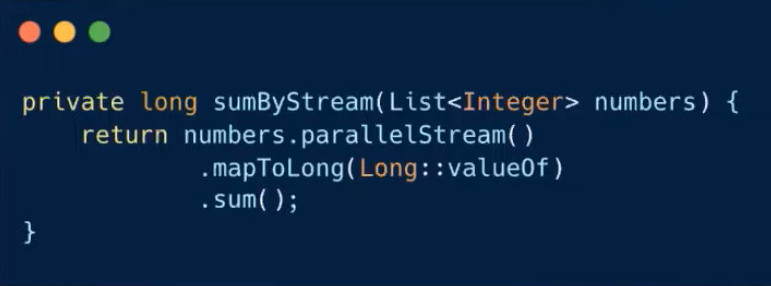

# 크리스, 로마의 stream vs for
[https://youtu.be/by8hb75i9X4](https://youtu.be/by8hb75i9X4)

# 크리스, 로마의 stream vs for
* toc
{:toc}

## stream vs for
+ 다량의 데이터를 처리한다는 공통점이 있다
+ 하지만 가독성이나 성능 등 여러 측면에서 차이가 존재하기 때문에 주로 논쟁거리가 된다

## 함수 객체 vs 코드 블록
+ 표현방식의 차이가 있다
  + for문은 코드블록으로 표현
  + 반면 Stream 파이프라인은 함수 객체로 표현
    + 여기서 함수 객체는 우리가 주로 사용하는 람다식이나 메서드 참조가 될 수 있다
    + 람다식과 메서드 참조는 표현을 간결하게 할 수 있는 장점이 있다
    + 하지만 Stream의 이러한 표현 방식은 몇 가지 제약을 가져오게 된다
+ Stream의 경우에는 람다식으로 표현을 하기 때문에 람다식에는 final이 붙거나 사실상 final인 변수만 읽을 수 있게 된다
  + 따라서 외부 변수를 수정할 수가 없다
+ 코드블록에서는 return문을 이용해서 메소드를 빠져나갈 수도 있고 break나 continue를 통해 반복문을 제어할 수 있다 하지만 람다로 표현하는 Stream은 이와 같은 작업들이 불가능하다

## 외부 반복 (how) vs 내부 반복
+ for문을 이용한 코드는 구체적인 구현 로직이 외부에 노출되는 외부 반복 형식
+ Stream의 경우에는 for문을 이용한 방식과는 달리 구체적인 구현 로직이 외부에 노출되지 않는 내부 반복의 형태
+ 외부 반복을 하는 for는 로직이 노출되어 있기 때문에 How 중심의 코드라고 볼 수 있다
+ 반면 내부 반복형식의 Stream은 로직이 추상화되어 있어 보다 What 중심의 코드라고 볼 수 있다

## 가독성 
+ for문으로 짤 경우 if문의 중첩으로 인해 Indent Depth가 깊어져 가독성이 떨어질 수 있다
+ Stream의 경우 조건들을 filter의 체이닝 형식을 통해 표현할 수 있기 때문에 보다 간결한 표현이 가능하다
+ for문으로 요소를 순회하면서 return을 하는 경우에는 메소드 추출을 통해 Indent Depth를 줄이는 것이 어렵다 Stream을 이용하면 Depth를 줄여서 가독성을 높일 수 있다
+ 그렇다고 Stream이 가독성 측면에서 절대적으로 좋은 것은 아니다

## 디버깅 
+ Stream을 통해 구현한 코드에서 예외가 발생하면  Stream은 내부적으로 수행되는 작업이 많기 때문에 굉장히 복잡하게 출력
+ Stream이 지연 연산으로 작업을 수행하기 때문에 실제 라인과는 다른 순서로 Stack Trace가 출력 따라서 Stream은 많은 내부 수행 작업과 지연 연산으로 인해 디버깅이 다소 어려울 수 있다
+ for문을 이용한 코드에서는 Stack Trace가 간결하게 출력되어 디버깅에 유리할 수 있다

## 병렬 처리
+ 
  + Runnable을 구현하여 숫자들의 합을 구하는 SumThread 클래스를 작성했다
  + 왼쪽 코드는 SumThread를 이용하여 숫자들의 합을 병렬방식으로 구하는 작업을 수행
  + 표시된 블록에서는 전체 숫자리스트를 여러 서브 리스트로 나눈다
  + 서브 리스트들의 합을 구하는 일을 각 스레드들이 병렬로 처리하게 하고 처리한 값들을 마지막에 더해서 반환
  + 이런 식으로 Stream을 사용하지 않으면 병렬처리를 위한 코드를 일일이 작성해 줘야 된다
  + 비교적 간단한 로직이라 병렬처리에 복잡함이 적어보인다 하지만 더 복잡한 로직들을 병렬로 처리하려면 직접 구현하기도 까다롭고 신경 쓸 것도 더 많아진다
    + 데이터들을 몇 개로 어떻게 나눌 것인지
    + 발생할 수 있는 동시성 문제가 있는지를 고려해야 된다
+ 
  + 병렬 Stream을 이용하면 이들을 Stream이 내부적으로 처리해 주기 때문에보다 쉽게 병렬처리를 표현할 수 있다

## 성능 (5000개 기준)
+ 배열 덧셈의 경우에는 for가 Stream에 비해 약 7배 정도 빠른 성능을 보여준다
+ 배열의 최대값을 구하는 연산에 대한 성능, for가 Stream에 비해 약 2.6배 정도 빠른 성능을 보였다
+ 리스트의 덧셈의 성능을 비교 배열에 비해 그렇게 큰 성능 차이가 나지 않는다 
+ 리스트 최대값 구하기의 연산에서도 그렇게 큰 성능 차이가 나지 않는다
+ 성능 측정 결과
  + 
+ int 배열에서는 for문이 Stream 보다 빠른 이유
  + 먼저 for문은 자바 1부터 등장했기 때문에 그만큼 JVM에서의 최적화가 충분히 진행되었다
  + Stream은 자바 8부터 등장했기 때문에 상대적으로는 최적화가 덜 되어 있다
  + 따라서 for문이 Stream보다 성능상의 이점을 보인다
  + 또한 Stream을 사용하려면 Stream 객체를 생성해야 한다 이 생성 과정에서 여러 작업들이 이루어지고 Stream에서 필요한 다른 객체를 생성하는데 오버헤드가 발생한다
  + for의 경우에는 추가적인 객체 생성 없이 Index를 통해서 메모리에 직접 접근을 하기 때문에 Stream에 비해서 오버헤드가 발생하지 않는다
+ 추가적으로 향상된 for문에서는 원시타입 배열에 어떻게 접근할까
  + 원시타입 배열이 들어온 경우에는 Iterator가 아닌 전통 for 형식으로 바꾸어서 순회 따라서 int 배열에 대한 작업에서는 전통 for문과 향상된 for문이 비슷한 성능
+ List에서 성능 차이가 미미한 이유
  + int 배열은 요소들이 원시타입인 반면에 컬렉션은 Wrapper 타입이 들어오게 된다 그래서 박싱 및 언박싱 에 대한 오버헤드가 발생이 된다
    이 오버헤드는 충분히 크기 때문에 컬렉션에 대한 성능 측정은 앞서 설명한 이 오버헤드에 지배되면서 큰 성능차이를 보이지 못하게 된다 하지만 int 배열에 대한 성능 측정에서는
    이와 같은 오버헤드의 영향이 적어 분명한 성능 차이를 보이게 된다
  + 그렇다면 성능을 고려한다면 for문과 원시타입 배열을 사용하는 것이 좋아 보인다
    + 하지만 오늘날의 하드웨어는 충분히 빠르기 때문에 소프트웨어에서는 성능보다는 다른 점들을 더욱 신경 쓰는 추세이다
    + 성능이 정말 중요한 프로그램이라면 고려해볼 만하지만 그렇지 않다면 성능보다는 유지보수, 가독성 등을 고려하는 것이 더욱 좋을 수 있다

## 결론
+ 가독성
  + Stream이 추상화된 API를 제공하고, 보다 What 중심의 코드를 작성할 수 있어 가독성에는 이점이 있다고 생각
  + 하지만 그렇다고 Stream을 남용한다면 오히려 가독성을 해칠 수도 있다
+ 디버깅
  + for문이 Stream에 비해 Stack Trace가 간단하고 명확하기 때문에 보다 디버깅에 이점이 있다
+ 병렬처리
  + 개발자들이 직접 신경 써야 할 부분들을 Stream이 내부적으로 처리를 해주기 때문에 Stream을 통한 병렬처리가 보다 간단
+ 성능
  + 원시타입을 다룬 경우엔 for문이 성능이 더 좋다
  + 컬렉션에서는 성능 차이가 미미
  + 오늘날에는 성능보다는 가독성, 유지보수성 등 다른 점들을 더욱 고려해야 한다
+ 스트림을 적용하기 좋은 조건
  + 원소들의 시퀀스를 일괄되게 변환한다
  + 원소들의 시퀀스를 필터링한다
  + 원소들의 시퀀스를 하나의 연산을 사용해 결합한다
  + 원소들의 시퀀스를 컬렉션에 모은다
  + 원소들의 시퀀스에서 특정 조건을 만족하는 원소를 찾는다
