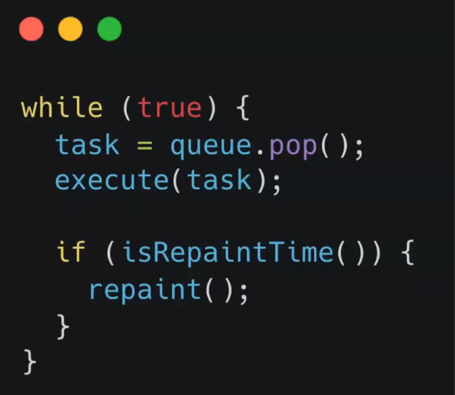
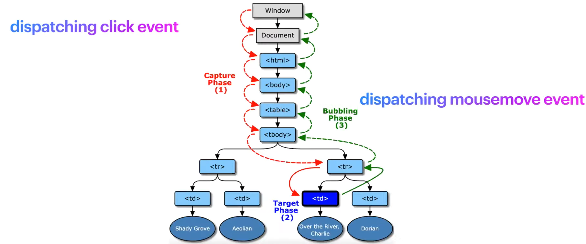
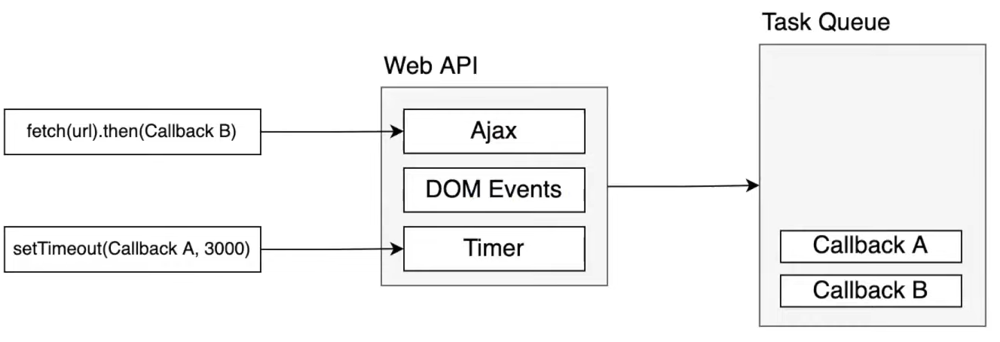
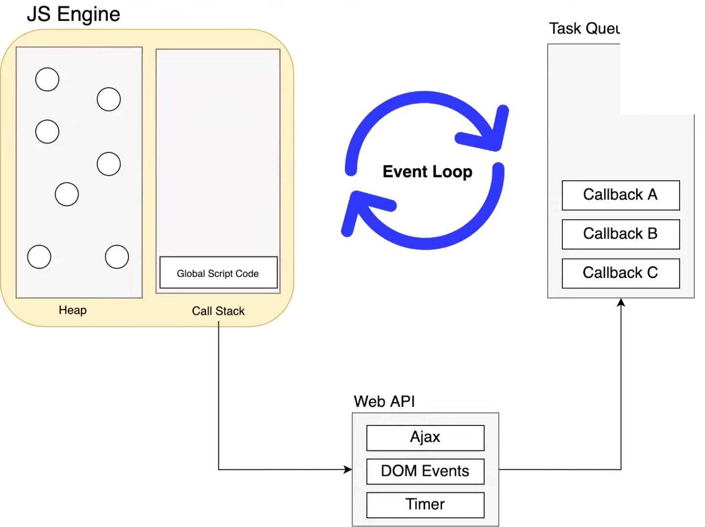
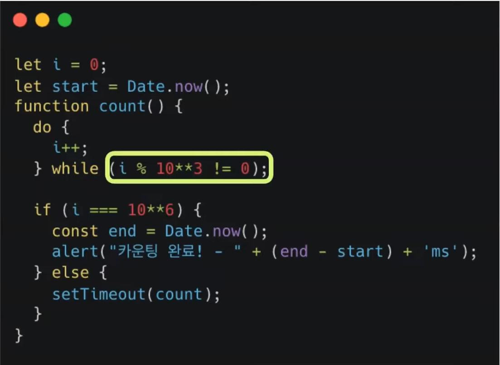
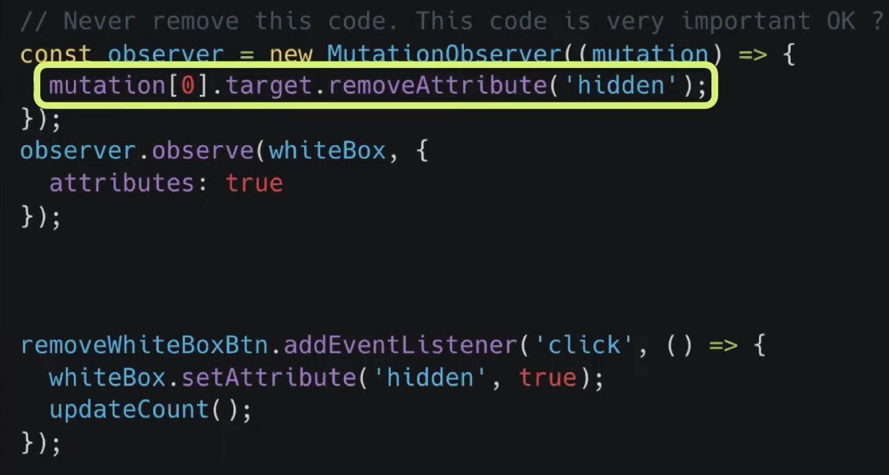
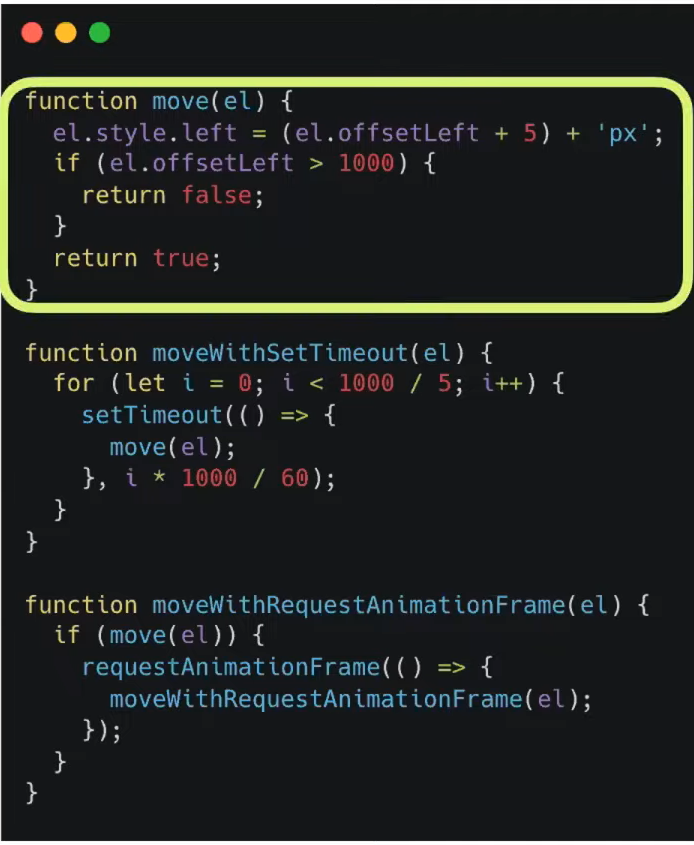

# 병민의 브라우저의 Event Loop
[https://youtu.be/YpQTeIqjC4o](https://youtu.be/YpQTeIqjC4o)

# 병민의 브라우저의 Event Loop
* toc
{:toc}

## 브라우저의 Event Loop
+ 브라우저는 HTML 코드를 읽고 일련의 과정을 거쳐서 화면에 그림을 그려준다
+ 브라우저가 HTML 태그를 바탕으로 DOM을 생성 하다가 script 태그를 만나면 자바스크립트 코드를 실행 한다
+ 작성한 코드는 마지막 줄까지 다 읽혔지만 브라우저는 사용자의 제스처 입력을 기다리기도 하고 일반적으로 주사율 60Hz 기준 매 16.7ms마다 DOM을 다시 그리는 것을 목표로 한다
+ 그래서 스크롤을 내렸을 때 그에 맞게 뷰가 변하는 것이다
+ 브라우저는 이 외에도 다양한 일들을 하고 그 작업들은 브라우저 안에 있는 이러한 프로세스를 위해서 실행된다
+ 주목해야 되는 부분은 이 Renderer Process 안에 있는 메인 스레드 입니다
  + 자바스크립트는 싱글 스레드라고 말할 때 그 스레드가 바로 저 친구이다

## Main Thread
+ 메인 스레드는 열심히 일하는 일꾼과 같다
+ 랜더링을 하고 작성한 자바스크립트 코드를 실행한다 이 두 가지 일은 순서대로 일어나기 때문에 하나가 오래 걸리면 다른 하나가 늦어진다
+ 메인스레드에서 화면도 그리고 자바스크립트 코드도 실행을 하는데 타이머를 돌려도 네트워크 통신 해도 화면이 열리지 않는다 뭐가 어떻게 된 거지 -> EVENT LOOP

## EVENT LOOP
+ 
+ 크롬에서 탭을 하나 추가하면 이런 코드가 실행된다
+ 매인 스레드는 무한 루프에 들어가고 queue에서 가장 먼저 들어온 태스크를 하나 뺀 다음에 실행 그리고 때때로 다시 그릴 타이밍이 되면 화면을 다시 그린다
+ 여기서 이 태스크는 콜백함수를 실행하는 일을 지칭한다
+ 태스크 자체가 콜백함수는 아니지만 안에서 함수를 호출하라는 내용이 있다 그래서 콜백함수를 테스크로 생각해도 괜찮다

### Task
+ 
  + 메인스레드에서 파서가 이 스크립트 태그를 만난다 그러면 이 코드를 불러와서 실행을 하게 되는데 이것도 하나의 테스크이다
  + 다시 말해서 우리가 작성한 자바 스크립트 코드는 맨 처음 하나의 테스크로서 처리된다 
+ Task - Dispatching Events
  +  
  + 모든 이벤트에 대해 해당되는 것은 아니지만 이벤트 객체를 특정 이벤트 타깃에 디스패칭한 일도 테스크로서 실행된다
  + 디스패치되면 Capture phase와 Target Phase 마지막으로 Bubbling Phase를 거치면서 addEventListener로 걸어놓은 핸들러 들이 호출된다
  + 그래서 Task는 넓게 보면 다양한 것들을 포함하고 있다
  + 브라우저가 우리의 자바스크립트를 코드를 실행하는 것 외에도 정말 많은 일들을 하고 있다는 의미이다

### Queue
+ 
+ 웹 api를 사용해서 타이머나 네트워크 통신을 한 뒤 그 콜백함수 가 Task Queue에 들어간다  
+ 핵심은 타이머나 네트워크 통신이 이 메인 스레드에 대해서 이루어지는 것이 아니라 브라우저안에 있는 다른 프로세스나 스레드에 대해서 실행이 되고 다 끝나면 Task Queue에 콜백함수를 넣어준다는 것이다
+ 그래서 화면이 얼지 않고 이런 다양한 일들이 함께 처리가 되는 것이다
+ setTimeout 이나 fetch가 끝나고 queue안에 쌓인 태스크들 즉 이 콜백함수들은 이벤트 루프안에서 하나 씩 꺼내져서 자바스크립트 엔진 위에서 실행이 된다
+ 
+ queue는 한 개가 아니라 세 개이다
  + MacroTaskQueue, MicroTaskQueue, AnimationFrameQueue
+ MacroTaskQueue
  + MacroTaskQueue안에는 setTimeout setInterval에 넣은 콜백함수와 이벤트를 디스패치한 태스크등이 들어있다
  + 이벤트 루프는 MacroTaskQueue에 있는 테스크를 하나만 빼서 실행하고 다음 루프로 넘어간다
+ MicroTaskQueue
  + 이 queue는 어떤 일이 끝나고 처리돼야 될 일들이 그 다음 루프로 미뤄지는게 아니라 한번에 처리하기 위해서 탄생했다
  + 그래서 이 queue에 있는 MicroTask를 처리할 때는 중간에 다른 코드들이 끼지 않는다
  + Promise, MutationObserver 핸들러가 이 큐에 들어간다
  + 이벤트 루프는 MicroTaskQueue가 빌 때까지 태스크를 처리한다
  + 태스크 처리중에 queue에 또 MicroTask가 들어와도 다음 루프로 미루지 않고 끝까지 처리한다
  + 그래서 우리는 무한 루프에 빠지는 걸 조심해야 된다
  + 그리고 자바 스크립트 엔진의 call stack이 비자 마자 MicroTaskQueue가 제일 먼저 처리된다
    + 즉 우선순위가 높다
+ AnimationFrameQueue
  + requestAnimationFrame으로 등록한 콜백함수들이 이 queue에 들어간다
  + repaint 직전에 queue에 있는 테스크들 전부 처리한다
  + 그래서 애니메이션에 사용하면 frame drop 을 최소화할 수 있다
  + MicroQueue와는 달리 처리 중에 콜백을 쌓으면 다음 번에 처리

#### MacroTaskQueue
+ 
+ 이 코드는 0부터 백만 까지 카운팅을 하는데 천 단위가 되면 루프를 멈추고 그 이후에 카운팅은 setTimeout을 통해 그 카운트함수를 제귀적으로 호출해서 MacroTaskQueue에 넣는다
  + 즉 1000씩 쪼개서 카운팅을 하는 것이다
+ 그리고 이런 식으로 카운팅을 하다가 백만이되면 alert을 띄운다
+ 이런식으로 일을 쪼개는 게 왜 좋을까
  + 먼저 이를 쪼개지 않고 한번에 자바 스크립트 엔진 에서 백만 까지 카운팅하는 경우 메인 스레드가 자바 스크립트 엔진에 붙잡혀 있기 때문에 repaint가 되지 않아 얼어 있는 상태이다
  + 메인 스레드는 자바 스크립트 엔진 에서 백만 까지 카운트를 열심히 하고 있지만 브라우저는 사용자로부터 클릭이벤트를 받아서 MacroTaskQueue에 넣어준다 그럼 이제 메인 스레드가 백만 까지 다 카운팅을 하고  MacroTaskQueue에 다시 방문을 할 때
    거기 있는 테스크를 하나하나 꺼내서 처리를 해줬기 때문에 로그가 나중에라도 찍힌다
  + MacroTaskQueue를 사용해서 일을 쪼개는 경우 애니메이션도 잘 그려지고 클릭했을 때 바로바로 반응도 한다 이벤트 루프가 MacroTaskQueue에 있는 천 씩 카운팅하는 태스크를 처리하고 화면을 갱신하고 또 처리하고 화면을 갱신하고 이런 식으로 일을 하기 때문에
    가능한 것이다 카운팅한 속도는 비교적 느리지만 화면이 얼어 버리는 문제는 방지할 수 있다
  + MicroTaskQueue에 넣어서 실행하면 queue는 queue가 빌 때까지 계속 처리하고 처리되는 와중에 또 그 천 씩 카운팅하는 테스크가 들어와도 다음 루프로 미루지 않기 때문에
    화면을 갱신할 여유가 없다 그래서 반응을 안 한다

#### MicroTaskQueue
+ 
+ 이 MutationObserver는 whiteBox 엘리먼트에 attribute에 어떤 변동 사항이 생기면 저 콜백함수를 MicroTaskQueue에 넣어준다 그래서 아무리 클릭을 해도 랜더링이 일어나기 전에 이 hidden 속성을 삭제하는 콜백함수 가 
 실행되기 때문에 렌더링될 때는 흰색 박스 hidden속성이 이미 제거가 된 상태이다 
+ 만약에 이 함수가 MicroTaskQueue에 들어가지 않고 MacroTaskQueue에 들어가면 hidden 속성을 삭제하는 콜백함수가 렌더링 후에 호출될 수 있기 때문에 열 번 중에 한 두 번은 hidden 속성을 삭제한다
+ 이렇듯 MicroTaskQueue는 어떤 일이 지체되지 않고 바로바로 처리되어야 하는 일들이 들어가기에 적합하다

### AnimationFrameQueue
+ 
+ move함수는 엘리먼트를 오른쪽으로 5픽셀 씩 움직인다 그리고 이 함수는 setTimeOut을 사용해 매 16ms마다 move함수를 호출하도록 스케쥴링 한다 
+ 그리고 이 함수는 requestAnimationFrame을 사용해 move 함수를 재귀적으로 호출한다 

