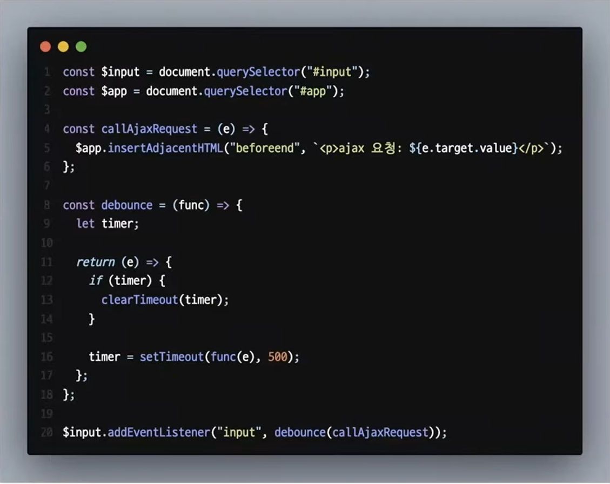
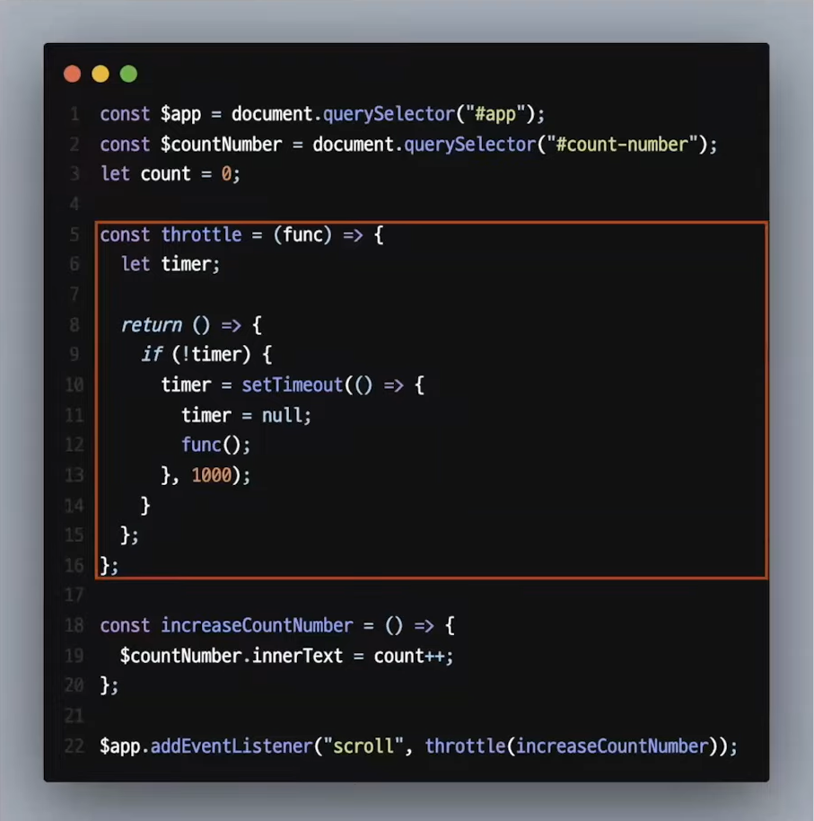
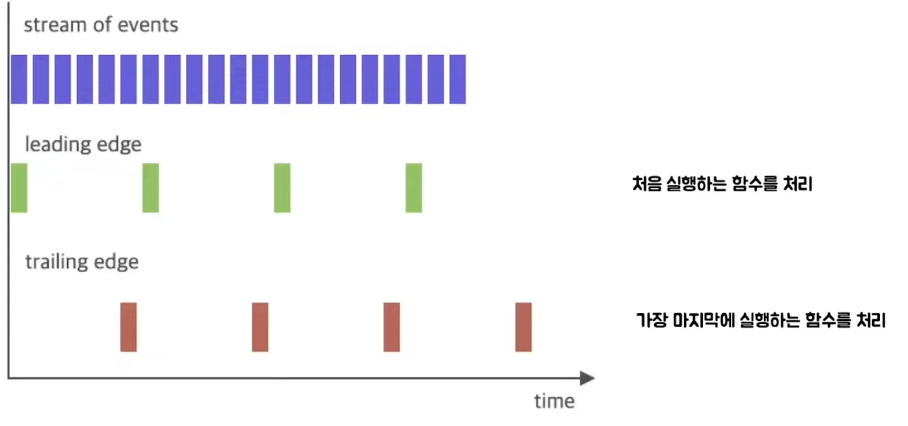

# 자스민의 디바운싱과 쓰로틀링
[https://youtu.be/By49qqkzmzA](https://youtu.be/By49qqkzmzA)

# 자스민의 디바운싱과 쓰로틀링
* toc
{:toc}

## 디바운스란?
+ 전자에서는 기계적인 접점을 가진 스위치는 접점이 붙거나 떨어지는 순간에 바운싱 현상이 있다
+ 이 바운싱 현상은 접점이 붙거나 떨어지는 그 짧은 순간에 접점이 고속으로 여러번 on/off 되는 현상을 말한다
+ 그리고 이런 바운싱 현상을 방지하기 위해 나온 것이 디바운싱 기법이다
+ 프로그래밍에서 디바운싱
  + 연이어 발생한 이벤트를 하나의 그룹으로 묶어서 처리하는 방식으로 주로 그룹에서 처음 이나 마지막으로 실행된 함수를 처리하는 방식으로 사용된다

### 디바운싱 사용예시
+ resize 이벤트를 걸어서  창 크기가 멈추는 순간에 특정 이벤트를 작동시키고 싶을 때 디바운싱을 적용하면 리사이즈가 끝나고 커서를 뗄 때 이벤트가 한번 발생
+ 키보드 입력을 통하여 ajax 요청을 할 때 디바운싱을 적용하면  타자 입력이 끝난 후에 마지막 요청을 한번 보낸다

### 디바운싱 코드 
+ 

## 쓰노틀링 이란?
+ 쓰로틀링은 출력을 조절한다 라는 의미를 가지고 있다
+ 프로그래밍에서 쓰로틀링은 이벤트를 일정 주기마다 발생하도록 하는 기술이다
+ Throttle의 설정 시간으로 100ms를 주게 된다면 해당 이벤트는 100ms 동안 최대 한 번만 발생하게 된다
+ 즉 마지막 함수가 호출된 후 일정 시간이 지나기 전에 다시 호출되지 않도록 한다
+ 일정 시간 동안 이벤트를 한 번만 발생하도록 하는 것이 쓰로틀링의 원리

### 쓰노틀링 사용예시
+ 쓰로틀링이 적용하면 제한된 양의 이벤트가 발생한다

### 쓰노틀링 코드
+ 

## 디바운싱과 쓰노틀링의 차이 
+ 디바운싱이 적용된 것은 스크롤을 내리다가 스크롤을 멈추고 특정 시간 후에 이벤트가 발생한다
+ 쓰로틀링은 이벤트가 하나 발생한 뒤 특정 시간 동안 이벤트가 발생하지 않지만 그 시간이 지나면 다시 이벤트가 동작
+ 프로그래밍에서 디바운싱은 그룹에서 처음이나 마지막으로 실행한 함수를 처리하는 방식으로 사용된다고 했는데 지금까지 알아본 디바운싱은
  마지막으로 실행된 함수만 처리하도록 하는 것이었다

### Leading edge VS Trailing edge
+ 
+ 실제 디바운싱은 이벤트를 처리하는 시점으로 leading edge와 trailing edge로 나눌 수 있다
+ Leading edge는 처음에 실행하는 함수를 처리를 하고 그 뒤에 입력을 무시하는 것이고 trailing edge는 마지막으로 실행한 함수를 처리하는 것이다
+ debouncing leading edge를 자세히 보면 쓰로트링과 굉장히 유사하게 작동하는 것을 볼 수 있다
+ 실제로 첫 요청이 들어오고 그 후 일정 시간 동안  모든 요청을 무시한다는 것에서 유사함을 느낄 수 있다
+ 그렇다면 두 개는 정확히 어떤 차이가 있을까
  + debouncing leading edge는 설정한 타이머시간 안에 요청이 지속적으로 들어올 경우 모든 요청을 무시하게 된다
  + 만약에 입력을 한번 한 뒤 계속 타이머 시간 안에 요청을 보내면 무한적으로 요청이 무시되는 것을 볼 수 있다
  + 하지만 쓰로틀링은 지속적인 요청이 들어올 경우 정해진 타이머 시간이 지나면 요청을 허용을 한다

### debouncing leading edge 코드
+ 

## 정리 
+ 디바운싱은 웹에서 주로 ajax 검색에 자주 쓰이고 그룹에서 처음이나 마지막으로 실행된 함수를 처리하는 방식으로 사용된다
+ 디바운싱에는 leading edge, trailing edge로 나눌 수 있고 leading edge는 처음에 실행한 함수를 실행하고 그 뒤의 이벤트들을 모두 무시한다'
+ trailing edge는 마지막에 실행한 함수를 실행하고 그 전의 이벤트들을 모두 무시한다
+ 쓰로틀링은 주로 성능 개선을 위해서 사용되고 무한 스크롤 같은 데서 많이 이용이 된다 그리고 이벤트를 일정 주기마다 발생하도록 하는 기술이다
